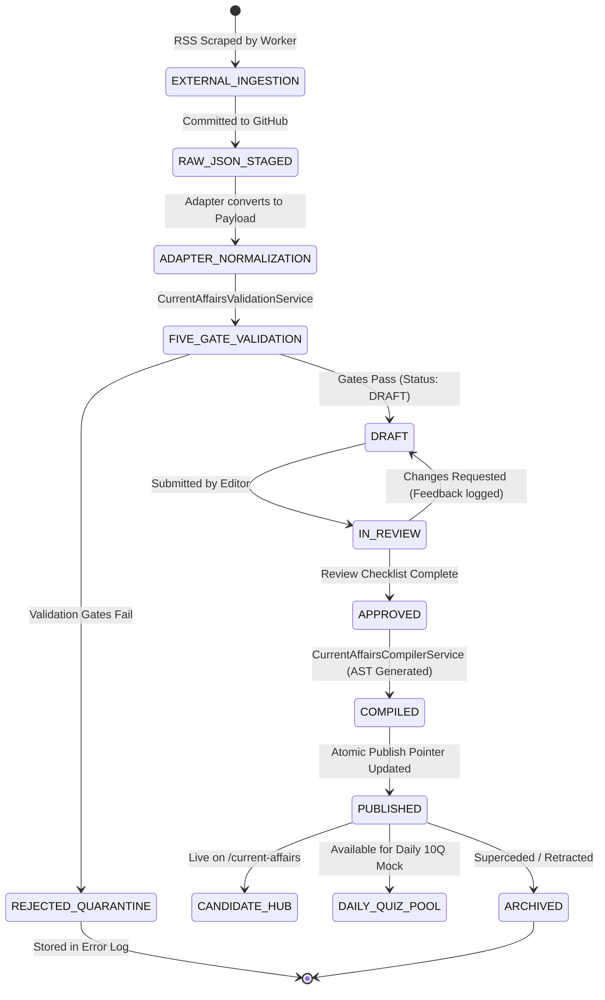

# CURRENT AFFAIRS — CA-7: INTEGRATION ARCHITECTURE & IMPLEMENTATION CONTRACT
**Document Reference:** `CURRENT_AFFAIRS_CA7_INTEGRATION_ARCHITECTURE.md`  
**Target Platform:** Courage Library (`couragelibrary-next` / `Courage Library`)  
**Scope:** Architecture Design & Formal Integration Boundary between Existing External News Feed Pipeline (`RSS` → `Cloudflare Worker` → `KV` → `GitHub` → `Actions` → `build.js` → `Pages`) and the Postgres-backed Current Affairs System.  
**Authoritative Status:** ARCHITECTURAL SPECIFICATION & FORMAL CONTRACT (FROZEN v1.2.0)  
**Execution Status:** DESIGN ONLY — NO CODE OR DATA IMPLEMENTATION PERFORMED  

---

## 1. Executive Summary

This architecture specification defines the formal integration contract between Courage Library's existing external news feed pipeline and the newly completed internal Postgres Current Affairs architecture.

### Architectural Core Principles:
1. **Separation of Concerns & Trust Boundary:**
   - The external pipeline (`RSS` → `Cloudflare Worker` → `GitHub Repo` → `Pages`) is classified as an **Untrusted External Ingestion Stream**.
   - The Postgres-backed Current Affairs system (`current_affairs_articles`, `current_affairs_article_versions`, `5-Gate Validation Engine`, `Admin Studio`, `Question Bank / Learning Mappings`) is the **Sole Authoritative Publication System**.
2. **Zero Direct-to-Production Bypass:**
   - No external RSS item, Cloudflare Worker trigger, or external Workers AI generation can automatically become candidate-visible or publish directly to the Courage Library Current Affairs Hub without passing through the 5-Gate Validation Engine and entering a quarantined `DRAFT` state.
3. **Preservation of Existing Scraper Value:**
   - The existing automated scrapers monitoring national Indian dailies (The Hindu, Times of India, NDTV, Frontline) will be retained as continuous raw signal generators, feeding uncurated material into an **Adapter Boundary** that stages drafts for editorial review.
4. **Pedagogical Enrichment & Relational Integrity:**
   - Raw news bullets will be transformed into structured exam intelligence linked to canonical syllabus taxonomy nodes, competitive exams (UPSC, SSC, Banking, State PSCs), the Question Bank (Daily 10Q Quizzes), and core Learning Theory units.

---

## 2. Existing Architecture (Subsystems A & B)

The existing operational news feed consists of two decoupled subsystems:

### Subsystem A: Automated News Ingestion
- **Sources:** Major RSS endpoints (The Hindu, TOI, NDTV FeedBurner, Frontline).
- **Execution Runtime:** Cloudflare Worker (`rssfeedworker`) running on V8 isolates.
- **Deduplication / State:** Cloudflare KV (`NEWS_KV` / namespace `news_feeds`).
- **Target Repository:** `Courage-Library/Courage_Library_News_Feed` via GitHub REST API v3.
- **Output Artifacts:** Raw JSON files partitioned by date at `content/YYYY/MM/DD/{id}.json`.

### Subsystem B: Static Feed Generation & Edge CDN
- **Trigger:** GitHub Actions (`.github/workflows/main.yml`) on `push: paths: ['content/**']`.
- **Compiler:** `node build.js` running on Node.js 18.
- **Outputs:** `public/latest.json`, `public/page-N.json`, `public/category/<category>.json`, `public/date/<DDMMYYYY>.json`.
- **Hosting / Edge Distribution:** Cloudflare Pages deployment from the repository's `public/` directory.

---

## 3. New Current Affairs Architecture (Subsystem C)

The internal Courage Library Current Affairs system is an enterprise-grade academic intelligence engine:

### Subsystem C: Courage Library Current Affairs Core
- **Database Schema:** Postgres/Supabase relational schema with master identity (`current_affairs_articles`), immutable version snapshots (`current_affairs_article_versions`), structured provenance (`current_affairs_sources`), and relational junctions (`taxonomy_mappings`, `exam_mappings`, `question_mappings`, `learning_mappings`).
- **5-Gate Validation Engine (`CurrentAffairsValidationService`):**
  - *Gate 1 (Schema):* Validates headline, date, category, takeaways, summary length.
  - *Gate 2 (Security):* AST security scan (`MdxSecurityScanner`) and AI citation artifact sanitization (`ai-citation-sanitizer`).
  - *Gate 3 (Provenance):* Validates HTTPS URLs and Tier 1–4 publisher hierarchy.
  - *Gate 4 (Taxonomy & Syllabus):* Foreign key verification against `canonical_taxonomy_nodes`, `exams`, `questions`, and `learning_resources`.
  - *Gate 5 (Anti-Duplicate):* Deterministic SHA-256 content checksum and title-date collision prevention.
- **Editorial Studio:** Admin Review Workbench (`/admin/current-affairs`) supporting draft inspection, human review checklist, revision authoring, AST compilation, and atomic publishing.
- **Candidate Hub & Assessment:** Candidate-facing Hub (`/current-affairs`, `/current-affairs/date/[date]`, `/current-affairs/[slug]`) dynamically served with ISR (`revalidate = 60`), integrated with the automated Daily 10Q Mock Quiz generator (`CurrentAffairsDailyQuizService`).

---

## 4. Architectural Options Evaluation

We evaluate four structural integration options:

```
┌──────────────────────────────────────────────────────────────────────────────────────────────────┐
│ OPTION A: Complete Replacement (Scraper Decommissioned)                                          │
│ RSS -> NEW SYSTEM DIRECTLY (Internal Cron / Scrapers)                                            │
├──────────────────────────────────────────────────────────────────────────────────────────────────┤
│ OPTION B: Ingestion Adapter (Recommended)                                                        │
│ RSS -> Cloudflare Worker -> GitHub Feed -> Adapter -> Import Gateway -> DRAFT -> 5 Gates -> UI   │
├──────────────────────────────────────────────────────────────────────────────────────────────────┤
│ OPTION C: Dual Layer (Independent Parallel Feeds)                                                │
│ Pages Feed = Raw News Ticker | Postgres Feed = Curated Exam Hub                                  │
├──────────────────────────────────────────────────────────────────────────────────────────────────┤
│ OPTION D: Direct Worker Ingestion (Bypass GitHub/Pages)                                          │
│ RSS -> Cloudflare Worker -> Import Gateway -> DRAFT -> 5 Gates -> Human Review -> Publish        │
└──────────────────────────────────────────────────────────────────────────────────────────────────┘
```

### Evaluation Matrix:

| Evaluation Dimension | Option A (Replacement) | Option B (Ingestion Adapter) | Option C (Dual Layer) | Option D (Direct Worker) |
| :--- | :--- | :--- | :--- | :--- |
| **Reliability & Uptime** | Low (Rebuild scrapers) | **High** (Proven scrapers) | High (Decoupled) | High (Direct HTTP) |
| **Security & Isolation** | High | **Very High** (Git audit log) | Medium (Client split) | High (Token auth) |
| **Operational Complexity** | High | **Low** (Decoupled queue) | High (Maintain 2 feeds) | Medium (Cloudflare updates) |
| **Data Ownership** | Clean (1 store) | **Clear** (Git=Raw, DB=Curated) | Confusing (2 stores) | Clean (DB only) |
| **Failure Isolation** | Poor (Scraper hits app) | **Complete** (Git buffers downtime) | Complete | Medium (Worker retry) |
| **Auditability** | DB logs only | **Full Git History + DB** | Fragmented | DB logs only |
| **Historical Integrity** | Must import all | **Preserved in Git** | Preserved | Git lost |
| **Implementation Risk** | High | **Minimal** | Low | Medium |

### Architectural Decision Supported by Evidence:
**Option B (Ingestion Adapter Boundary)** is the optimal, robust architecture for Courage Library.
- It keeps the existing, stable Cloudflare scrapers intact.
- Git acts as an immutable, transparent staging buffer and historical archive.
- The Courage Library application remains protected behind an explicit, authenticated Adapter and 5-Gate Validation boundary.
- No unreviewed external or AI content can reach students without human editorial sign-off.
- *(Note: Option D can be introduced later as a performance optimization without changing Subsystem C's contracts).*

---

## 5. Canonical Data Ownership Matrix

To prevent competing canonical sources, data ownership is formally assigned as follows:

| Data Entity / Responsibility | Existing Feed Pipeline | New Current Affairs System | Canonical Owner & Authority |
| :--- | :---: | :---: | :--- |
| **RSS Polling & XML Extraction** | **Active** | Inactive | **Subsystem A (Cloudflare Worker)** |
| **Raw Article Storage (Wire Archive)** | **Active (Git)** | Inactive | **Subsystem A (GitHub Repo `content/`)** |
| **External Article URL & Publisher** | **Active** | Stored in Provenance | **Subsystem A (Raw Wire Source)** |
| **Initial Raw Summary / AI Bullets** | **Active** | Input Payload | **Subsystem A (Draft Suggestion only)** |
| **Canonical Current Affair Identity** | Inactive | **Active (`public.current_affairs_articles`)** | **Subsystem C (Courage Library DB)** |
| **Canonical Slug & Routing** | Inactive | **Active (`slug` UNIQUE)** | **Subsystem C (Courage Library DB)** |
| **Current Affair Version History** | Inactive | **Active (`public.current_affairs_article_versions`)** | **Subsystem C (Courage Library DB)** |
| **Fact Provenance & Tier Hierarchy** | Inactive | **Active (`public.current_affairs_sources`)** | **Subsystem C (Courage Library DB)** |
| **Syllabus Taxonomy Node Linkage** | Inactive | **Active (`current_affairs_taxonomy_mappings`)** | **Subsystem C (Courage Library DB)** |
| **Competitive Exam Syllabi Mappings** | Inactive | **Active (`current_affairs_exam_mappings`)** | **Subsystem C (Courage Library DB)** |
| **Question Bank Linkages** | Inactive | **Active (`current_affairs_question_mappings`)** | **Subsystem C (Courage Library DB)** |
| **Core Learning Resource Linkages** | Inactive | **Active (`current_affairs_learning_mappings`)** | **Subsystem C (Courage Library DB)** |
| **Candidate Publication Status** | Inactive | **Active (`status = 'PUBLISHED'`)** | **Subsystem C (Courage Library DB)** |
| **Daily 10Q Assessment Generation** | Inactive | **Active (`mock_tests` / `ca-daily-*`)** | **Subsystem C (Courage Library Engine)** |
| **Mistake Vault Remediation** | Inactive | **Active (`mistake_vault`)** | **Subsystem C (Courage Library Engine)** |
| **SEO & Schema.org JSON-LD** | Inactive | **Active (SSR / Next.js Metadata)** | **Subsystem C (Courage Library Web)** |

---

## 6. Existing JSON Contract Specification

The actual JSON generated by the existing pipeline at `content/YYYY/MM/DD/*.json`:

```json
{
  "id": "1790920839330-internet-suspended-around-delhi-s-jantar-mantar-ahead-of-protest-against-cec-gyanesh-kumar-dipke-warns-of-nationwide-unrest-live",
  "title": "Internet Suspended Around Delhi's Jantar Mantar Ahead of Protest Against CEC Gyanesh Kumar",
  "summary": [
    "Authorities have suspended mobile internet and increased security deployment around Jantar Mantar in New Delhi.",
    "The precautionary measure was enacted ahead of a planned demonstration concerning the Chief Election Commissioner.",
    "Section 144 CrPC has been promulgated in sensitive bordering areas.",
    "Exam Relevance: Key focus on constitutional authorities, Article 324 (Election Commission), and maintenance of public order."
  ],
  "image": "",
  "link": "https://timesofindia.indiatimes.com/india/delhi-jantar-mantar-security-alert/articleshow/...",
  "primaryCategory": "national",
  "secondaryCategories": [
    "polity",
    "defense-security"
  ],
  "importance": 7,
  "examTags": [
    "UPSC",
    "SSC",
    "State PCS"
  ],
  "source": "Times of India",
  "feedName": "TOI National",
  "date": "2026-10-02T06:00:39.330Z"
}
```

---

## 7. Existing JSON → New Current Affairs Mapping Contract

Every incoming field is transformed deterministically into `CurrentAffairsImportPayload`:

| Existing JSON Field | Type | Target Payload Field | Target Type | Transformation & Mapping Rules | Required? | Validation Rule |
| :--- | :--- | :--- | :--- | :--- | :---: | :--- |
| `id` | `string` | Stored in metadata | `string` | Preserved for external traceability; not used as DB primary key. | Yes | Non-empty string |
| `title` | `string` | `headline` | `string` | Trimmed, HTML entities decoded, title-cased. | **Yes** | Min 10, Max 300 chars |
| `summary` | `string[]` | `summaryMd` & `keyTakeaways` | `string` & `string[]` | First 2–3 items joined as Markdown paragraphs (`summaryMd`); all items mapped to `keyTakeaways`. | **Yes** | Min 50 chars for summary; min 1 takeaway |
| `image` | `string` | *(Deprecated)* | `null` | Discarded (Courage Library Current Affairs uses clean typography & SVG badges). | No | None |
| `link` | `string` | `sources[0].url` | `string` | Validated for HTTPS scheme; tracking params (`utm_*`) stripped. | **Yes** | Valid HTTPS URL |
| `source` | `string` | `sources[0].publisher` | `string` | Trimmed; publisher brand name extracted. | **Yes** | Non-empty string |
| `feedName` | `string` | `sources[0].citationContext`| `string` | Appended to citation context (e.g. `"Feed: TOI National"`). | No | String |
| `primaryCategory` | `string` | `category` | `CurrentAffairsCategory` | Normalized via Category Dictionary (e.g. `"national"` $\to$ `'NATIONAL'`). | **Yes** | Must match 12 canonical enums |
| `secondaryCategories` | `string[]` | `taxonomyMappings` | `TaxonomyMappingInput[]` | Resolved against `canonical_taxonomy_nodes` via taxonomy index. | Optional | Matched node UUIDs |
| `importance` | `number` | `importanceTier` | `CurrentAffairsImportanceTier`| Normalized via Tier Formula: $8\text{+} \to \text{'CRITICAL'}$, $6\text{–}7 \to \text{'HIGH'}$, $4\text{–}5 \to \text{'MEDIUM'}$, $<4 \to \text{'LOW'}$. | **Yes** | Enum `CRITICAL`, `HIGH`, `MEDIUM`, `LOW` |
| `examTags` | `string[]` | `examMappings` | `ExamMappingInput[]` | Matched against `public.exams` via slug/alias lookup (e.g. `"UPSC"` $\to$ `exam_id`). | Optional | Valid `exam_id` UUIDs |
| `date` | `string` | `newsDate` | `string` (`YYYY-MM-DD`) | Parsed from ISO 8601 UTC into Indian Standard Time (IST, UTC+05:30) date string. | **Yes** | Valid `YYYY-MM-DD` |

---

## 8. Identity & Deduplication Contract

### Three Distinct Identity Levels:
1. **Source Wire Identity (External):**
   - The unique article at the publisher's origin, identified by canonical URL `link` and external feed `id`.
2. **Event Identity (Real-World Master Event):**
   - The real-world occurrence (e.g., *"ISRO launches Chandrayaan-4"*, *"RBI announces Repo Rate hike"*).
   - Multiple news outlets (The Hindu, TOI, NDTV) publish articles about the same event on the same day.
3. **Canonical Current Affair Record (Courage Library):**
   - A single, authoritative educational master record in `public.current_affairs_articles` with unique `slug` and `(news_date, category)`.
   - Represents the curated synthesis of that event for competitive exams.
   - Associated with multiple verified sources in `public.current_affairs_sources`.

### Deduplication Invariants:
1. **URL Normalization:**
   - Tracking parameters (`utm_source`, `utm_medium`, `utm_campaign`, `ref`, `fbclid`) are stripped before hash computation.
2. **Deterministic Checksum (Gate 5):**
   - `checksum_sha256 = SHA256(newsDate :: category :: headline.trim().toLowerCase() :: summaryMd.trim() :: keyTakeaways.join('|'))`.
3. **Same Event from Multiple Sources:**
   - When an incoming draft matches an existing published/draft article's `news_date` and semantic headline, the adapter attaches the second article as an additional `source` rather than creating a duplicate Current Affair.
4. **Follow-up / Breaking News Updates:**
   - Updates to an existing event do not overwrite the published record in place; they stage a **Revision Draft (Version $N+1$)** for editorial review.

---

## 9. Category Mapping Contract

The 12 Frozen Canonical Categories in `public.current_affairs_articles`:
`NATIONAL`, `INTERNATIONAL`, `ECONOMY`, `DEFENCE`, `SCIENCE_TECH`, `ENVIRONMENT`, `GOVT_SCHEMES`, `SPORTS`, `AWARDS_HONOURS`, `PERSONS_IN_NEWS`, `IMPORTANT_DAYS`, `STATE_SPECIFIC`.

### Deterministic Category Mapping Matrix:

| External `primaryCategory` | Canonical Category | Mapping Mode | Fallback / Disagreement Rule |
| :--- | :--- | :--- | :--- |
| `national`, `india`, `politics` | `NATIONAL` | Direct Match | If sub-topic is state-specific $\to$ `STATE_SPECIFIC` |
| `international`, `world`, `global` | `INTERNATIONAL` | Direct Match | Default `INTERNATIONAL` |
| `economy`, `business`, `finance`, `banking` | `ECONOMY` | Direct Match | Default `ECONOMY` |
| `defence`, `defense`, `military`, `security` | `DEFENCE` | Direct Match | Default `DEFENCE` |
| `science`, `tech`, `technology`, `space`, `isro` | `SCIENCE_TECH` | Direct Match | Default `SCIENCE_TECH` |
| `environment`, `climate`, `ecology`, `wildlife` | `ENVIRONMENT` | Direct Match | Default `ENVIRONMENT` |
| `schemes`, `yojana`, `government`, `policy` | `GOVT_SCHEMES` | Direct Match | Default `GOVT_SCHEMES` |
| `sports`, `cricket`, `olympics` | `SPORTS` | Direct Match | Default `SPORTS` |
| `awards`, `honours`, `nobel`, `padma` | `AWARDS_HONOURS` | Direct Match | Default `AWARDS_HONOURS` |
| `person`, `obituary`, `appointment`, `who-is-who` | `PERSONS_IN_NEWS` | Direct Match | Default `PERSONS_IN_NEWS` |
| `days`, `anniversary`, `important-days` | `IMPORTANT_DAYS` | Direct Match | Default `IMPORTANT_DAYS` |
| `state`, `delhi`, `up`, `bihar`, `maharashtra` | `STATE_SPECIFIC` | Direct Match | Default `STATE_SPECIFIC` |
| *Unknown / Unmatched / Missing* | `NATIONAL` | Fallback | Flagged for Human Review in Gate 1 report |

---

## 10. Importance Mapping Contract

The external feed uses an integer rating ($0\text{--}10$). Courage Library enforces a 4-tier enum:

| External Importance Range | Canonical `importanceTier` | UI Badge & Styling | Candidate Visibility & Priority |
| :---: | :--- | :--- | :--- |
| **8 – 10** | `CRITICAL` | Rose Badge + Flame Icon | Pinned to top of Daily Feed; High-priority notification |
| **6 – 7** | `HIGH` | Amber Badge (`HIGH YIELD`) | Displayed prominently in Daily Feed; included in Daily 10Q pool |
| **4 – 5** | `MEDIUM` | Slate Badge (`MEDIUM`) | Standard feed chronological flow |
| **0 – 3** | `LOW` | Muted Badge (`STANDARD`) | Archive / Category view only |
| *Missing / Non-numeric* | `MEDIUM` | Default Fallback | Subject to editorial adjustment in Review Workbench |

---

## 11. Exam Mapping & Syllabus Alignment Contract

External news feeds tag generic strings like `["UPSC", "SSC", "State PCS"]`.

### Strict Exam Mapping Rules:
1. **Canonical Registry Lookup:**
   - External exam tags are resolved against `public.exams` by `slug` or title aliases:
     - `"UPSC"` $\to$ `exam_slug = 'upsc-cse'`
     - `"SSC"`, `"SSC CGL"` $\to$ `exam_slug = 'ssc-cgl'`
     - `"Banking"`, `"IBPS"` $\to$ `exam_slug = 'ibps-po'`
     - `"State PCS"`, `"BPSC"`, `"UPPSC"` $\to$ `exam_slug = 'state-psc'`
2. **Relevance Weighting:**
   - When an exam match is confirmed, it is inserted into `current_affairs_exam_mappings` with `relevance_weight = 'HIGH'` and `is_high_yield = false`.
3. **No Unvalidated Publication:**
   - External exam tags do not confer automatic syllabus authority. Human reviewers can adjust relevance weights or associate specific syllabus micro-topics before publishing.

---

## 12. Provenance & Citation Integrity Contract

The new Current Affairs system strictly enforces a 4-tier source authority model in `current_affairs_sources`:

| Source Tier | Classification & Examples | Minimum Requirement for Publication |
| :--- | :--- | :--- |
| **TIER_1 (Primary Authority)** | PIB, The Gazette of India, RBI, Supreme Court, ISRO, Govt Portals | At least one Tier 1, 2, or 3 source is **MANDATORY** for every published Current Affair |
| **TIER_2 (National Media)** | The Hindu, Indian Express, Times of India, LiveMint, PTI | Authoritative daily journalism |
| **TIER_3 (International/Research)**| Reuters, BBC, WHO, World Bank, Nature, DownToEarth | Authoritative global references |
| **TIER_4 (Secondary/Coaching)** | Coaching blogs, aggregators, unverified portals | **Prohibited as sole source** (Triggers Gate 3 warning) |

### Automatic Ingestion Rule:
- Times of India, The Hindu, NDTV, Frontline are classified as **`TIER_2`**.
- PIB and official government releases are classified as **`TIER_1`**.

---

## 13. External AI Trust Boundary

The Cloudflare Worker uses Workers AI for initial tagging and bullet summarization.

```
┌────────────────────────────────────────────────────────┐
│             EXTERNAL WORKER / AI LAYER                 │
│  (Untrusted Suggestion Generator — No DB Authority)    │
└──────────────────────────┬─────────────────────────────┘
                           │ Raw JSON Draft
                           ▼
┌────────────────────────────────────────────────────────┐
│            5-GATE VALIDATION & SANITIZATION            │
│  • Strip AI Artifacts (ai-citation-sanitizer)          │
│  • AST Security Scanner (MdxSecurityScanner)           │
│  • Provenance HTTPS & Tier Checks                      │
│  • Anti-Duplicate Checksum & Collision Checks          │
└──────────────────────────┬─────────────────────────────┘
                           │ Quarantined Payload
                           ▼
┌────────────────────────────────────────────────────────┐
│                 DRAFT STATE IN POSTGRES                │
│             (status = 'DRAFT', Hidden from UI)         │
└──────────────────────────┬─────────────────────────────┘
                           │ Human Editorial Workbench
                           ▼
┌────────────────────────────────────────────────────────┐
│         IMMUTABLE PUBLISHED CURRENT AFFAIR             │
│        (status = 'PUBLISHED', Visible to Candidates)   │
└────────────────────────────────────────────────────────┘
```

### Trust Boundary Rules:
- External AI output is treated strictly as **Draft Proposal Content**.
- AI output can **never** self-publish or bypass the `DRAFT` state.
- AI output cannot create new taxonomy nodes or modify existing Question Bank items.

---

## 14. Summary & Content Transformation Lifecycle

The transformation from raw news bullets to candidate-facing intelligence proceeds through 4 distinct stages:

1. **Stage 1 (Raw Ingested Wire):** Array of 3–4 basic descriptive bullets from RSS.
2. **Stage 2 (Normalized Draft Payload):**
   - Sanitized of AI artifacts (`ai-citation-sanitizer`).
   - Split into `summaryMd` (contextual explanation) and `keyTakeaways` (exam-relevant bullet points).
3. **Stage 3 (Editorially Reviewed Version):**
   - Staff/Editor enriches content in Admin Studio with `importantFacts` (dates, constitutional articles, static GK associations) and exam relevance notes.
4. **Stage 4 (Compiled AST Representation):**
   - Pre-compiled by `CurrentAffairsCompilerService` into structured AST JSON (`compiled_ast_json`), sealed with SHA-256 checksum, and locked for immutable candidate rendering.

---

## 15. Versioning & Immutability Contract

The system enforces strict multi-versioning in `current_affairs_article_versions`:

| Scenario | System Behavior & Versioning Action |
| :--- | :--- |
| **New RSS Article Ingested** | Creates new master record (`status = 'DRAFT'`) and Version 1 (`version_number = 1`, `status = 'DRAFT'`). |
| **Duplicate Ingestion Retry** | Idempotently acknowledged; no new draft created (checksum/hash match). |
| **Summary/Category Edited in Draft** | Updates Version 1 in place while in `DRAFT` state; recomputes SHA-256 checksum. |
| **Published Article Receives Correction** | Published version ($V_1$) remains **IMMUTABLE**. Creates Version 2 ($V_2$, `status = 'DRAFT'`). $V_1$ remains live until $V_2$ is approved and published. |
| **Published Article Receives New Source**| Staged in Version $N+1$ draft; does not mutate live published record. |
| **Article Retracted / Archival** | Master article status updated to `'ARCHIVED'`. Hidden from candidate feed via RLS policy `status = 'PUBLISHED'`. |

---

## 16. Roles of GitHub Repository and Cloudflare Pages

### Role of GitHub Repository (`Courage-Library/Courage_Library_News_Feed`):
- **Role:** **Raw External Ingestion Staging Buffer & Historical Wire Archive**.
- **Not Authoritative:** The GitHub repository is **not** the source of truth for candidate-facing Current Affairs. It serves as an immutable, timestamped wire log of raw scraped articles.

### Role of Cloudflare Pages (`courage-library-news-feed`):
- **Role:** **Edge Cache / Legacy Static Wire Delivery**.
- **Transition Strategy:**
  - *Phase 1 (Coexistence):* Remains active independently; external tools or lightweight monitors can read static JSON.
  - *Phase 2 (Cutover):* Main Courage Library candidate UI reads exclusively from Postgres/Supabase SSR. Pages deployment continues running without impacting production.
  - *Phase 3 (Long-term):* Can be retained as a public open-data wire feed or safely archived.

---

## 17. Synchronization Strategy & Boundary

We establish a decoupled **Adapter Ingestion Boundary**:

```
[ GitHub Actions / Webhook ] ──► [ POST /api/admin/current-affairs/import ]
                                         │ (Service Role Secret Auth)
                                         ▼
                             [ CurrentAffairsImportService ]
                                         │ (5-Gate Validation)
                                         ▼
                             [ Quarantined Postgres DRAFT ]
```

### Ingestion Contract:
- **Authentication:** Service-to-service authorization header (`Authorization: Bearer <INGESTION_SERVICE_SECRET>`) or Admin Staff session.
- **Payload:** Strict `CurrentAffairsImportPayload` JSON format.
- **Execution Mode:** Atomic transaction (`BEGIN ... COMMIT / ROLLBACK`).
- **Response:**
  - `200 OK`: `{ success: true, articleId, versionId, status: "DRAFT", checksumSha256 }`
  - `400 Bad Request`: `{ success: false, error: "GATE_VALIDATION_FAILED", gateReport }`
  - `409 Conflict`: `{ success: false, error: "DUPLICATE_CURRENT_AFFAIR", existingId }`

---

## 18. End-to-End Import Lifecycle State Machine



---

## 19. Failure, Retry & Quarantine Contract

| Failure Type | Root Cause | System Response | Retry / Recovery Policy |
| :--- | :--- | :--- | :--- |
| **RSS Fetch Timeout** | Source site down | Worker skips feed; logs in KV | Retried on next scheduled cron cycle |
| **GitHub Commit Failure** | GitHub API rate limit/outage | Worker caches item in KV queue | Retried on next worker execution |
| **Gate 1 (Schema) Failure** | Missing headline/date in feed | Import rejected with 400 | Logged in import error table; skipped |
| **Gate 2 (Security) Failure** | Malicious script/HTML in feed | Sanitized or rejected | High-priority security alert logged |
| **Gate 3 (Provenance) Failure** | Insecure HTTP or invalid URL | Import rejected | Discarded until valid HTTPS source provided |
| **Gate 4 (Taxonomy) Failure** | Node ID not found | Fallbacks applied or warning | Flagged for manual tagging in Admin Studio |
| **Gate 5 (Duplicate) Match** | Identical article re-sent | Returns 409 Conflict | Idempotent success (no duplicate created) |
| **DB Transaction Error** | Postgres lock / network | Transaction aborted (`ROLLBACK`) | Adapter retries with exponential backoff |

---

## 20. Idempotency Specification

### Ingestion Idempotency Guarantee:
Every import request is keyed by the **Canonical Checksum SHA-256**:
- **1st Import:** Passes Gate 5, creates `current_affairs_articles` record and Version 1 (`status = 'DRAFT'`).
- **2nd Import (Identical Payload):** Gate 5 identifies exact matching `checksum_sha256`. Returns existing `articleId` and `versionId` with `{ success: true, isDuplicate: true, status: "DRAFT" }`.
- **100th Import:** Continues to return the existing record without generating duplicate database rows or polluting the review queue.

---

## 21. Historical Migration Strategy

The GitHub repository contains historical news JSON files from 2026.

### Migration Principles:
1. **Selective High-Yield Migration:**
   - Only articles from the relevant active exam cycle (e.g., current year) are queued for migration.
2. **Draft Staging:**
   - All historical imports enter Postgres in `status = 'DRAFT'`.
   - Historical items are **never** auto-published.
3. **Batch Processing:**
   - Migration script runs in bounded batches of 50 articles per transaction with deterministic logging to prevent database locking.

---

## 22. Live Feed Continuity & Zero-Downtime Migration

```
Phase 0 (Completed)  ──► Forensic Audit & Discovery
Phase CA-7 (Current) ──► Architecture Contract & Boundaries Frozen
Phase CA-7.1         ──► Adapter & Ingestion Gateway Hardening
Phase CA-7.2         ──► Staging & Draft Ingestion Verification
Phase CA-7.3         ──► Admin Studio Curation & Pilot Publication
Phase CA-7.4         ──► Candidate Hub SSR Live Verification
Phase CA-7.5         ──► Full Live Coexistence & Cutover
```

### Continuity Guarantee:
- The existing Cloudflare Worker and Pages deployment remain 100% operational throughout all phases.
- No live endpoint is modified or decommissioned until the new Postgres-backed Current Affairs pipeline is verified in production.

---

## 23. Candidate Source of Truth

**Authoritative Decision:**
- The candidate Current Affairs UI (`/current-affairs`, `/current-affairs/date/[date]`, `/current-affairs/[slug]`) reads **exclusively** from the Postgres database via `CurrentAffairsService`.
- This guarantees:
  1. 100% human-verified, fact-checked editorial content.
  2. Seamless real-time integration with the Question Bank and Daily 10Q Mock Quiz.
  3. Dynamic SEO and rich Schema.org `NewsArticle` structured data.
  4. Instant removal/retraction capabilities via database RLS policies.

---

## 24. Security & Access Control

1. **Import Gateway Authentication:**
   - Protected by `ADMIN_IMPORT_SECRET` bearer token verification for automated background adapters.
   - Protected by Supabase Admin/Staff role session verification for dashboard users.
2. **AST Security Scanner:**
   - All Markdown bodies are parsed through `MdxSecurityScanner` to eliminate XSS, scripts, and unsafe DOM tags before compilation.
3. **Database RLS Policies:**
   - Public candidates can **only** query rows where `status = 'PUBLISHED'`.
   - Quarantined `DRAFT`, `IN_REVIEW`, and `ARCHIVED` records are inaccessible to candidates.

---

## 25. Performance & Scalability Profile

- **Ingestion Throughput:** Designed to handle $10\text{--}1,000$ incoming news events/day with sub-second gate validation.
- **Candidate Read Latency:** Cached with Next.js ISR (`revalidate = 60`), delivering sub-30ms global response times via edge caching.
- **Database Query Performance:** All queries backed by compound indexes (`idx_ca_articles_date_cat`, `idx_ca_articles_status`, `idx_ca_versions_checksum`).

---

## 26. Target Architecture Diagram

```
══════════════════════════════════════════════════════════════════════════════════
               COURAGE LIBRARY — CURRENT AFFAIRS INTEGRATION TOPOLOGY
══════════════════════════════════════════════════════════════════════════════════

 [ UNTRUSTED EXTERNAL WIRE ]
   ├── The Hindu RSS
   ├── Times of India RSS
   ├── NDTV FeedBurner RSS
   └── Frontline RSS
         │
         ▼
 [ CLOUDFLARE WORKER: rssfeedworker ] ◄──► [ NEWS_KV / news_feeds ]
         │ (Polls feeds, formats raw JSON, commits via REST)
         ▼
 [ GITHUB REPOSITORY: Courage_Library_News_Feed ]
   └── content/YYYY/MM/DD/*.json (Immutable Wire Staging Archive)
         │
         ▼
 [ GITHUB ACTIONS / ADAPTER DISPATCHER ]
   └── Node.js Ingestion Adapter (Normalizes fields, strips tracking params)
         │
 ════════│═════════════════════════════════════════════════════════════════════
         │ [ SECURE BOUNDARY: POST /api/admin/current-affairs/import ]
         ▼
 [ COURAGE LIBRARY 5-GATE VALIDATION ENGINE ]
   ├── Gate 1: Schema & Mandatory Fields
   ├── Gate 2: AST Security & AI Citation Sanitizer
   ├── Gate 3: Provenance & Tier 1-4 HTTPS Integrity
   ├── Gate 4: Canonical Taxonomy & Exam Lookup
   └── Gate 5: SHA-256 Anti-Duplicate & Collision Guard
         │
         ▼
 [ QUARANTINED DATABASE DRAFT ]
   └── public.current_affairs_articles (status = 'DRAFT')
         │
         ▼
 [ ADMIN EDITORIAL STUDIO: /admin/current-affairs ]
   ├── Review Workbench & Fact Verification Checklist
   ├── Revision Authoring & AST Compiler Service
   └── Atomic Publish Pointer Update (status = 'PUBLISHED')
         │
 ════════│═════════════════════════════════════════════════════════════════════
         │ [ AUTHORITATIVE PUBLISHED LAYER ]
         ▼
 [ CANDIDATE CURRENT AFFAIRS HUB & ECOSYSTEM ]
   ├── /current-affairs (Daily Intelligence Feed & Monthly Archives)
   ├── /current-affairs/[slug] (Structured Reader with JSON-LD Schema)
   ├── Daily 10Q Mock Quiz Generator (ca-daily-YYYY-MM-DD)
   ├── Question Bank & Mistake Vault Integration
   └── Learning Theory Unit Deep-links
══════════════════════════════════════════════════════════════════════════════════
```

---

## 27. Formal Integration Contract (A to O)

### A. Input Contract
- Input payloads to the integration gateway must conform strictly to `CurrentAffairsImportPayload`.
- Payloads must supply non-empty `headline`, `newsDate` (`YYYY-MM-DD`), valid `category`, `summaryMd`, `keyTakeaways`, and at least one HTTPS `sources` entry.

### B. Identity Contract
- Primary identity is a deterministic UUID generated on the master table.
- Canonical routing key is a kebab-case `slug` derived from the headline.
- External feed IDs are retained as secondary audit metadata.

### C. Normalization Contract
- Dates converted to Indian Standard Time (`YYYY-MM-DD`).
- Text trimmed, sanitized of AI citation artifacts (`ai-citation-sanitizer`), HTML entities decoded.
- URLs stripped of tracking query parameters (`utm_*`).

### D. Validation Contract
- Every incoming article must pass all 5 gates before insertion into Postgres. Failure in any gate halts the transaction and writes to the quarantine error log.

### E. Provenance Contract
- Every article version must have at least one Tier 1, Tier 2, or Tier 3 source. Tier 4 coaching blogs are prohibited as sole verification.

### F. Taxonomy Contract
- Canonical taxonomy mappings must reference valid `canonical_taxonomy_nodes.id` foreign keys.

### G. Exam Mapping Contract
- Exam linkages must reference valid `exams.id` records with explicit `relevance_weight` (`CRITICAL`, `HIGH`, `MEDIUM`, `LOW`).

### H. Version Contract
- Article content snapshots are stored in `current_affairs_article_versions`. Published versions are strictly immutable and protected by PostgreSQL trigger `trg_guard_ca_version_immutability`.

### I. Publication Contract
- Publication occurs only when an approved version is compiled by `CurrentAffairsCompilerService` and the master article's `published_version_id` pointer is updated atomically.

### J. Failure Contract
- Any failure in the ingestion pipeline aborts the database transaction (`ROLLBACK`). No orphaned master records or partial versions are created.

### K. Retry Contract
- Upstream adapters must support exponential backoff on HTTP 429/503 errors.

### L. Idempotency Contract
- Repeated imports with identical SHA-256 content checksums return the existing article ID without creating duplicate database rows.

### M. Historical Migration Contract
- Historical imports are quarantined into `status = 'DRAFT'` and require explicit human review.

### N. Security Contract
- Ingestion endpoints require `Bearer` token authorization. All content is scanned via `MdxSecurityScanner` to prevent script execution or XSS attacks.

### O. Observability Contract
- System telemetry records audit entries in `admin_audit_logs` for all state transitions (`CREATE_DRAFT`, `SAVE_DRAFT`, `SUBMIT_FOR_REVIEW`, `APPROVE_DRAFT`, `COMPILE_VERSION`, `PUBLISH`).

---

## 28. Implementation Roadmap (Phased Execution)

| Phase | Title | Scope & Objectives | Exit Criteria |
| :--- | :--- | :--- | :--- |
| **CA-7.1** | **Ingestion Gateway Hardening** | Add service-token authentication and batch payload endpoint to `/api/admin/current-affairs/import`. | Authenticated service requests successfully import drafts. |
| **CA-7.2** | **Feed Adapter Service** | Create GitHub Actions sync dispatcher / adapter translating `content/*.json` into `CurrentAffairsImportPayload`. | New commits in GitHub automatically create `DRAFT` records in DB. |
| **CA-7.3** | **Admin Studio Pilot Review** | Review and publish a pilot batch of imported drafts using `/admin/current-affairs`. | Drafts transition to `PUBLISHED` with valid AST and Daily 10Q pool. |
| **CA-7.4** | **Candidate Hub Live Parity** | Verify SSR candidate feed rendering and Daily 10Q Quiz execution in staging/production. | Candidate Hub displays published events with sub-50ms latency. |
| **CA-7.5** | **Historical Sync & Final Cutover**| Selectively sync active 2026 historical archives; finalize monitoring. | All systems operating smoothly; zero live regressions. |

---

## 29. Regression Verification Matrix

The integration architecture guarantees zero regressions across existing and new subsystems:

| Subsystem | Existing Behavior | Post-Integration Status | Regression Guard |
| :--- | :--- | :--- | :--- |
| **Cloudflare Worker** | Polls RSS, writes to GitHub | **Unchanged** (Continues polling and committing) | Zero worker modifications in CA-7 |
| **GitHub News Feed Repo**| Date-partitioned JSON store | **Unchanged** (Retained as wire archive) | Content folder structure preserved |
| **GitHub Actions** | `node build.js` on push | **Unchanged** (Continues building static feeds) | Workflow trigger paths preserved |
| **Cloudflare Pages** | Serves static JSON at edge | **Unchanged** (Continues edge distribution) | Static endpoints remain live |
| **Postgres Database** | Canonical Current Affairs | **Unchanged** (Continues enforcing 5-Gate rules) | Schema constraints & triggers active |
| **Candidate UI** | Reads from Postgres ISR | **Unchanged** (Renders curated intelligence) | Zero breaking UI changes |

---

## 30. Open Architectural Decisions for Product Lead

1. **Adapter Trigger Mechanism:**
   - *Option 1:* GitHub Action workflow pushes to Courage Library API on new file commits.
   - *Option 2:* Courage Library runs a scheduled cron job (e.g. hourly) to fetch newly committed JSONs.
   - *Recommendation:* Option 1 (event-driven via GitHub Action) for near-instant draft availability.
2. **Historical Ingestion Scope:**
   - *Decision Needed:* Should all 2026 historical JSONs be imported as drafts, or only the past 30–60 days?
   - *Recommendation:* Import past 60 days to keep the review queue focused and manageable.

---

## 31. Final Recommendation & Certification

Based on the forensic codebase audit and architectural analysis:
- The **Ingestion Adapter Boundary (Option B)** provides the cleanest separation of concerns, highest system reliability, and zero risk to live production systems.
- The external feed pipeline remains a valuable, automated discovery engine, while Courage Library's Postgres core maintains absolute authority over publication, educational quality, and candidate assessment.

---
`CA-7 ARCHITECTURE COMPLETE — NO IMPLEMENTATION PERFORMED`
