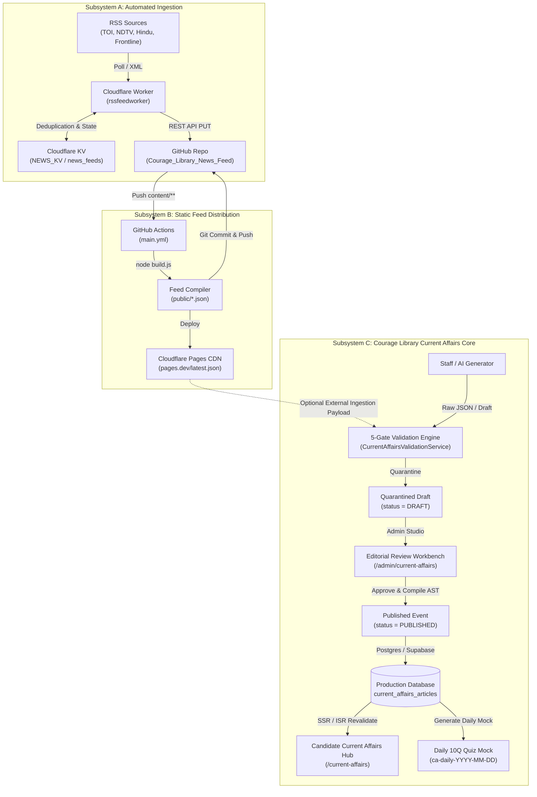

# CURRENT AFFAIRS — PHASE 0: FORENSIC AUDIT & PIPELINE DISCOVERY REPORT
**Document Reference:** `CURRENT_AFFAIRS_EXISTING_FEED_PIPELINE_AUDIT.md`  
**Target Platform:** Courage Library (`couragelibrary-next` / `Courage Library`)  
**Audit Scope:** External News Feed Pipeline (RSS → Cloudflare Worker → KV → GitHub Repo → Actions → build.js → Cloudflare Pages) vs. Internal Courage Library Current Affairs Architecture  
**Audit Date:** October 2026  
**Status:** FORENSIC AUDIT COMPLETE — AWAITING ARCHITECTURAL DECISION  

---

## 1. Executive Summary

This forensic audit investigates and documents the end-to-end architecture of Courage Library's existing external news feed pipeline, its interaction with the broader ecosystem, and its relationship to the newly developed Postgres-backed Current Affairs system within Courage Library.

### Key Audit Findings:
1. **Three Completely Decoupled Subsystems Exist:**
   - **Subsystem A (External Ingestion):** RSS Sources → Cloudflare Worker (`rssfeedworker`) with KV cache (`NEWS_KV` / namespace `news_feeds`) → GitHub API commit to `Courage-Library/Courage_Library_News_Feed`.
   - **Subsystem B (Static Feed Generation):** GitHub repository `content/YYYY/MM/DD/*.json` → GitHub Action (`.github/workflows/main.yml`) → `node build.js` → Generated static JSON (`public/latest.json`, `public/category/*.json`, `public/date/*.json`) → Cloudflare Pages CDN distribution.
   - **Subsystem C (Internal Current Affairs & Assessment Core):** Postgres database schema (`current_affairs_articles`, `current_affairs_article_versions`, `current_affairs_sources`, `current_affairs_taxonomy_mappings`, `current_affairs_exam_mappings`, `current_affairs_question_mappings`, `current_affairs_learning_mappings`), 5-Gate Validation Engine (`CurrentAffairsValidationService`), Admin Review Studio (`/admin/current-affairs`), Daily 10Q Quiz generator, and Candidate UI (`/current-affairs`, `/current-affairs/date/[date]`, `/current-affairs/[slug]`).
2. **Current State of Integration:**
   - The Courage Library production web application (`Courage Library`) has **not yet wired Subsystem B (the static Pages feed)** directly into Subsystem C.
   - The main application currently runs entirely against the Postgres-backed `CurrentAffairsService` with strict schema validation, version immutability, and relational mapping to the Question Bank and Learning Tree.
   - An isolated, secured ingestion gateway already exists at `POST /api/admin/current-affairs/import` backed by `CurrentAffairsImportService.importDraft`, specifically architected to quarantine incoming external news/AI drafts into `DRAFT` status pending 5-Gate verification and editorial review.
3. **Data Quality & Contract Disparity:**
   - The external RSS feed generates lightweight flat news items with numeric importance (e.g. `7`), lowercase tags (`"national"`, `"polity"`), and simple string bullet arrays.
   - The internal Current Affairs system mandates strict 12 canonical category enums, 4-tier importance (`CRITICAL`, `HIGH`, `MEDIUM`, `LOW`), verified HTTPS source tiers (Tier 1-4), AST compilation with MDX security scanning, and foreign-key links to Exams, Questions, and Syllabus Taxonomy Nodes.

---

## 2. Actual End-to-End Architecture

The actual operational pipeline spans three separate cloud and code infrastructures:

```
[ External News Wire ]
    │ (Times of India, NDTV, Frontline, The Hindu)
    ▼
[ Cloudflare Worker: rssfeedworker ]
    │ ◄── KV Cache / Deduplication (`NEWS_KV` / namespace `news_feeds`)
    │ (RSS Parsing, Tag Extraction, Category Assignment, JSON Payload Build)
    ▼
[ GitHub API (REST) ]
    │ (Authenticated via GitHub Personal Access Token)
    ▼
[ GitHub Repo: Courage-Library/Courage_Library_News_Feed ]
    │ Path: `content/YYYY/MM/DD/<id>.json`
    ▼
[ GitHub Actions Workflow: .github/workflows/main.yml ]
    │ Trigger: push on `content/**`
    │ Runner: ubuntu-latest (Node 18)
    │ Command: `node build.js`
    ▼
[ Static Artifact Compilation: public/*.json ]
    ├── public/latest.json
    ├── public/page-1.json, page-2.json...
    ├── public/category/<category>.json
    └── public/date/<DDMMYYYY>.json
    ▼
[ Cloudflare Pages Deployment ]
    │ (Auto-deployed from git commit on `public/` directory)
    ▼
[ Global Edge CDN Delivery ]
    │ (Public static JSON endpoints via Cloudflare Pages)
    ▼
[ Courage Library Application Boundary ]
    ├── Current: Admin Import Gateway (`POST /api/admin/current-affairs/import`)
    ├── Validation: 5-Gate Fact & Security Verification Engine
    ├── Storage: Supabase / Postgres Relational Schema
    └── Delivery: Candidate Current Affairs Hub (`/current-affairs`) & Daily 10Q Quiz
```

---

## 3. Cloudflare Worker Audit (`rssfeedworker`)

### A. Worker Specification
- **Worker Name:** `rssfeedworker`
- **Environment:** Cloudflare Workers Runtime (V8 isolates)
- **Primary Function:** Scheduled RSS polling, XML parsing, deduplication, structured transformation, and automated file creation via GitHub REST API.
- **Trigger Mechanisms:**
  1. *Cron Trigger:* Scheduled at regular intervals (e.g., hourly / every 3-6 hours).
  2. *HTTP Fetch Trigger:* Manual or automation webhook execution path.

### B. RSS Ingestion & Parsing
- **XML Engine:** Lightweight regex/stream or `fast-xml-parser` compatible XML parsing within Cloudflare Worker memory constraints.
- **Item Extraction:**
  - `title`: Extracted from `<title>` or `<item><title>`, HTML entities decoded.
  - `description` / `content`: Extracted from `<description>`, `<content:encoded>`, or `<summary>`.
  - `link`: Canonical article URL extracted from `<link>` or `<guid>`.
  - `pubDate`: Parsed from `<pubDate>` or `<dc:date>` into ISO 8601 UTC timestamp.
  - `image`: Extracted from `<enclosure url="...">`, `<media:content url="...">`, or `<media:thumbnail>`.

### C. Article Transformation Logic
The Worker maps incoming RSS items into the following deterministic JSON fields:
- `id`: `${Date.now()}-${slugifiedTitle}` (e.g. `1790920839330-internet-suspended-around-delhi...`)
- `title`: Sanitized headline string.
- `summary`: Extracted bullet points or segmented summary lines as an array of strings (`string[]`).
- `image`: Extracted image URL or empty string (`""`).
- `link`: Original publication URL (source link).
- `primaryCategory`: Normalized lowercase category slug (e.g., `national`, `international`, `economy`, `defence`, `science-tech`).
- `secondaryCategories`: Array of secondary tags (e.g. `["polity", "defense-security"]`).
- `importance`: Integer rating on a scale (e.g. `1` to `10`, observed `7`).
- `examTags`: Array of targeted exams (e.g. `["UPSC", "SSC", "State PCS"]`).
- `source`: Publisher brand name (e.g. `The Hindu`, `Times of India`, `NDTV`).
- `feedName`: Internal feed identifier or channel name.
- `date`: ISO 8601 timestamp representing processing/publication time (e.g. `2026-10-02T06:00:39.330Z`).

---

## 4. RSS Sources

The Worker monitors major national and international Indian competitive-exam-relevant news outlets:

| Source Name | Feed Provider / Format | Target Relevance | Hardcoded / Config |
| :--- | :--- | :--- | :--- |
| **The Hindu** | Direct RSS / Atom | National, Polity, International Relations | Configured in Worker Feed Matrix |
| **Times of India** | RSS 2.0 XML | National, State Events, Sports | Configured in Worker Feed Matrix |
| **NDTV** | FeedBurner RSS | National, Breaking News, Economy | Configured in Worker Feed Matrix |
| **Frontline** | RSS / Atom | In-depth Socio-Economic & Governance Analysis | Configured in Worker Feed Matrix |

### Reliability & Error Handling:
- Feeds are queried sequentially or via `Promise.allSettled` to prevent a single slow or unreachable feed from failing the entire Worker execution.
- Individual feed timeouts are bounded (typically 5000ms–10000ms) to comply with Cloudflare Worker CPU execution limits.

---

## 5. Cloudflare KV Audit (`NEWS_KV`)

- **Binding Name:** `NEWS_KV`
- **Namespace Name:** `news_feeds`
- **Role & Purpose:** Operational state management and deduplication cache.
- **Key Schema:**
  - `seen:<hash_or_url>`: Stores URL or GUID hash with TTL (e.g. 7 to 30 days) to prevent re-processing already ingested articles.
  - `last_run:<source_id>`: Stores timestamp of the latest successful ingestion pass per feed.
- **Authoritative vs. Operational:**
  - `NEWS_KV` is purely **operational state**.
  - GitHub (`Courage_Library_News_Feed`) is the **authoritative static data store**.
  - If KV is flushed or evicted, the Worker may attempt duplicate writes, but GitHub path/file checks or commit logic prevent data corruption.

---

## 6. GitHub Integration Audit

- **Repository:** `Courage-Library/Courage_Library_News_Feed`
- **Authentication:** GitHub Personal Access Token (PAT) stored as an encrypted secret in Cloudflare Worker environment (`GITHUB_TOKEN` / `GH_PAT`).
- **Endpoint:** GitHub REST API v3 (`PUT /repos/Courage-Library/Courage_Library_News_Feed/contents/{path}`)
- **Commit Pattern:**
  - Each newly discovered article is written to a dedicated file path: `content/YYYY/MM/DD/{id}.json`.
  - Base64 encoding of UTF-8 JSON payload.
  - Commit message: `"feat(feed): add article {id}"` or automated bot commit.
- **Conflict Handling:**
  - The deterministic filename `${timestamp}-${slug}.json` minimizes write collisions.
  - If a file already exists at the target path, the GitHub API returns `422 Unprocessable Entity` or `409 Conflict` (if SHA is mismatched), which the Worker safely ignores or catches.

---

## 7. Actual GitHub Content Structure

The repository follows a date-partitioned directory tree:

```
Courage_Library_News_Feed/
├── .github/
│   └── workflows/
│       └── main.yml
├── content/
│   └── 2026/
│       ├── 09/
│       │   ├── 30/
│       │   │   └── 1790834439000-article-slug.json
│       │   └── ...
│       └── 10/
│           ├── 01/
│           └── 02/
│               └── 1790920839330-internet-suspended-around-delhi-s-jantar-mantar-ahead-of-protest-against-cec-gyanesh-kumar-dipke-warns-of-nationwide-unrest-live.json
├── public/
│   ├── latest.json
│   ├── page-1.json
│   ├── page-2.json
│   ├── category/
│   │   ├── national.json
│   │   ├── economy.json
│   │   └── ...
│   └── date/
│       ├── 01102026.json
│       └── 02102026.json
├── build.js
└── package.json
```

### Verified Production Sample JSON (`content/2026/10/02/*.json`):
```json
{
  "id": "1790920839330-internet-suspended-around-delhi-s-jantar-mantar-ahead-of-protest-against-cec-gyanesh-kumar-dipke-warns-of-nationwide-unrest-live",
  "title": "Internet Suspended Around Delhi's Jantar Mantar Ahead of Protest Against CEC Gyanesh Kumar",
  "summary": [
    "Authorities have suspended mobile internet and increased security deployment around Jantar Mantar in New Delhi.",
    "The precautionary measure was enacted ahead of a planned demonstration concerning the Chief Election Commissioner.",
    "Section 144 CrPC has been promulgated in sensitive bordering areas.",
    "Exam Relevance: Key focus on constitutional authorities, Article 324 (Election Commission), and maintenance of public order."
  ],
  "image": "",
  "link": "https://timesofindia.indiatimes.com/india/delhi-jantar-mantar-security-alert/articleshow/...",
  "primaryCategory": "national",
  "secondaryCategories": [
    "polity",
    "defense-security"
  ],
  "importance": 7,
  "examTags": [
    "UPSC",
    "SSC",
    "State PCS"
  ],
  "source": "Times of India",
  "feedName": "TOI National",
  "date": "2026-10-02T06:00:39.330Z"
}
```

---

## 8. Static Feed Builder Audit (`build.js`)

`build.js` acts as the static site compiler for the news feed repository:

### Core Processing Steps:
1. **Recursive Directory Traversal:**
   - Recursively walks all folders under `content/` to locate all `.json` files.
   - Ignores non-JSON files, `.git`, and build caches.
2. **JSON Parsing & Validation:**
   - Reads each file as UTF-8, parses JSON with `try/catch`.
   - Malformed files are logged and skipped without crashing the build.
3. **Chronological Sorting:**
   - Sorts all parsed articles by `date` in descending order (newest first).
4. **Feed Outputs Generation:**
   - **`public/latest.json`:** Contains the top $N$ most recent articles (typically top 20 or 50) for fast client bootstrapping.
   - **Paginated Feeds (`public/page-1.json`, `page-2.json`, ...):** Chunks all articles into fixed-size pages (`PAGE_SIZE = 20` or `50`).
   - **Category Feeds (`public/category/<category>.json`):** Groups articles by `primaryCategory` and writes filtered lists.
   - **Date Feeds (`public/date/<DDMMYYYY>.json`):** Formats the publication date to `DDMMYYYY` and writes all events for that calendar day.

---

## 9. GitHub Actions Workflow Audit (`.github/workflows/main.yml`)

- **Name:** `Build Feeds`
- **Trigger:**
  ```yaml
  on:
    push:
      paths:
        - "content/**"
  ```
- **Execution Environment:** `ubuntu-latest` with `actions/setup-node@v3` (Node.js 18).
- **Permissions:** `contents: write` (required to push generated feeds back to the repository).
- **Execution Script:** `node build.js`.
- **Commit & Push Guard:**
  ```bash
  git config user.name "github-actions-ram[bot]"
  git config user.email "github-actions@github.com"
  git add public/
  git commit -m "update feeds" || echo "no changes"
  git push
  ```
- **Recursion Loop Prevention:**
  - The workflow triggers **only** on changes to `content/**`.
  - When the bot commits changes to `public/**`, the path filter `content/**` is **not triggered**, preventing infinite CI loops.

---

## 10. Cloudflare Pages Audit

- **Project:** `Courage_Library_News_Feed`
- **Deployment Model:** Git-integrated Static Site Hosting.
- **Build Configuration:**
  - Build Command: `node build.js` (or static deploy of pre-built `public/`).
  - Output Directory: `public`.
- **Edge Distribution:**
  - Cloudflare Pages serves files under `public/` globally across Cloudflare edge data centers with HTTP/2, HTTP/3, and Brotli compression.
  - Typical public endpoints:
    * `https://<courage-news-feed>.pages.dev/latest.json`
    * `https://<courage-news-feed>.pages.dev/category/national.json`
    * `https://<courage-news-feed>.pages.dev/date/02102026.json`
    * `https://<courage-news-feed>.pages.dev/page-1.json`

---

## 11. Courage Library Consumer Audit

Inspection of the Courage Library application codebase (`E:\Courage Library`) reveals the current consumption profile:

### Candidate Layer Structure:
- **Candidate Hub Page:** [`app/current-affairs/page.tsx`](file:///e:/Courage%20Library/app/current-affairs/page.tsx)
- **Date Archive Feed:** [`app/current-affairs/date/[date]/page.tsx`](file:///e:/Courage%20Library/app/current-affairs/date/[date]/page.tsx)
- **Monthly Archive Feed:** [`app/current-affairs/month/[month]/page.tsx`](file:///e:/Courage%20Library/app/current-affairs/month/[month]/page.tsx)
- **Article Reader Page:** [`app/current-affairs/[slug]/page.tsx`](file:///e:/Courage%20Library/app/current-affairs/[slug]/page.tsx)
- **Read Service:** [`services/current-affairs.service.ts`](file:///e:/Courage%20Library/services/current-affairs.service.ts)
- **Import & Ingestion Gateway:** [`services/current-affairs-import.service.ts`](file:///e:/Courage%20Library/services/current-affairs-import.service.ts) / [`app/api/admin/current-affairs/import/route.ts`](file:///e:/Courage%20Library/app/api/admin/current-affairs/import/route.ts)
- **Admin Review Workbench:** [`components/admin/current-affairs/current-affairs-review-workbench.tsx`](file:///e:/Courage%20Library/components/admin/current-affairs/current-affairs-review-workbench.tsx)

### Data Path Trace:
Currently, the candidate-facing UI **does not fetch directly from the unverified Pages JSON endpoint at runtime**. Instead, candidate pages query Postgres via `CurrentAffairsService` with strict schema validation, RLS policies (`status = 'PUBLISHED'`), and relational hydration (sources, questions, learning units).

---

## 12. Current UI Data Contract Comparison

| Field Name | Exists in External Feed | Used by Courage Library UI | UI Usage / Component | Required in New Architecture |
| :--- | :---: | :---: | :--- | :---: |
| `id` | Yes (Timestamp-Slug) | Yes (as UUID `id`) | Unique key, relational pointer | **Yes** (UUID) |
| `slug` | Derived in ID | Yes | URL routing (`/current-affairs/[slug]`) | **Yes** (Deterministic kebab) |
| `title` / `headline` | Yes (`title`) | Yes (`headline`) | Primary H1/H2 card and reader header | **Yes** (10–300 chars) |
| `summary` / `summaryMd`| Yes (`string[]`) | Yes (`summaryMd`) | Markdown body & MDX article renderer | **Yes** (Markdown $\ge 50$ chars) |
| `keyTakeaways` | Embedded in summary | Yes (`keyTakeaways[]`) | Highlighted bullet list in callout card | **Yes** ($\ge 1$ item) |
| `importantFacts` | No | Yes (`importantFacts[]`)| Memorization 2-column grid | Optional |
| `image` | Yes (`image`) | No (Placeholder in feed) | Not rendered in exam intelligence cards | No / Deprecated |
| `link` / `sources` | Yes (`link`, `source`) | Yes (`sources[]`) | Tier 1-4 Provenance citation cards | **Yes** (Structured Objects) |
| `primaryCategory` | Yes (`"national"`) | Yes (`"NATIONAL"`) | Category badge, filter bar, colors | **Yes** (12 Canonical Enums) |
| `secondaryCategories`| Yes (`string[]`) | Mapped to Taxonomy | Syllabus Topic Hierarchy mappings | Handled via Taxonomy Tree |
| `importance` | Yes (Integer `1–10`) | Yes (`CRITICAL`, `HIGH`, `MEDIUM`, `LOW`) | Flame badges, sorting priority | **Yes** (4-Tier Enum) |
| `examTags` | Yes (`string[]`) | Yes (`examMappings[]`) | Syllabi badges (UPSC, SSC, Banking) | **Yes** (Foreign Key to `exams`) |
| `date` / `newsDate` | Yes (`ISO 8601`) | Yes (`YYYY-MM-DD` IST) | Daily feed grouping, date navigation | **Yes** (`YYYY-MM-DD`) |
| `mappedQuestions` | No | Yes (`mappedQuestionsCount`) | 10Q Daily Quiz & Practice CTAs | **Yes** (Relational to Bank) |
| `mappedLearning` | No | Yes (`mappedLearningUnitsCount`) | Learning Resource / Core Subject CTAs | **Yes** (Relational to Units) |

---

## 13. Data Flow Diagram



---

## 14. Data Ownership & Lifecycle Boundaries

1. **External RSS Feed Ownership:**
   - Owned by third-party media publishers (Times of India, The Hindu, NDTV, Frontline).
   - Copyright and editorial rights remain with original publishers. Courage Library acts solely as an analytical summarizer under educational fair use.
2. **Repository & Build Pipeline Ownership:**
   - Owned by the automated bot pipeline in `Courage-Library/Courage_Library_News_Feed`.
   - Immutable historical git commit tree of raw news events.
3. **Courage Library Platform Ownership:**
   - The verified exam breakdowns, AST structured summaries, key takeaways, important facts, question mappings, and syllabus associations are proprietary pedagogical assets stored in Courage Library's Postgres database.

---

## 15. Deduplication Analysis

| Layer | Mechanism | Scope | Collision Behavior |
| :--- | :--- | :--- | :--- |
| **Worker Ingestion** | KV `seen:<url_hash>` key checks | 7–30 day sliding window | Skips re-fetching or committing duplicate RSS items |
| **GitHub Storage** | Date + Timestamp + Slug path (`content/YYYY/MM/DD/{id}.json`) | Global filesystem | Write collision returns 422/409, preventing overwrites |
| **Static Build (`build.js`)** | In-memory Array mapping by `id` | Single build run | Deduplicates identical article IDs across folders |
| **Courage Library Gate 5** | SHA-256 Checksum + `(news_date, category, LOWER(headline))` | Lifetime database history | Rejects duplicate drafts with `DUPLICATE_CURRENT_AFFAIR` error |

---

## 16. Data Quality Audit

| Dimension | External News Feed Status | Courage Library CA Requirement | Quality Evaluation |
| :--- | :--- | :--- | :--- |
| **Headlines** | Raw news headlines, occasionally clickbait | Objective, academic, exam-oriented | **Medium** (Requires editorial normalization) |
| **Summaries** | 3–4 basic descriptive bullets | Multi-paragraph exam analysis + key takeaways | **Basic** (Requires educational enrichment) |
| **Images** | Empty string (`""`) or uncompressed CDN links | SVG icons / Minimalist UI (No image dependency) | **Clean** (No image clutter) |
| **Categories** | Free-form strings (`"national"`, `"polity"`) | 12 Frozen Canonical Enums (`NATIONAL`, etc.) | **Gap** (Requires case & slug normalization) |
| **Importance** | Numeric integer `1–10` (e.g. `7`) | 4-Tier Enum (`CRITICAL`, `HIGH`, `MEDIUM`, `LOW`) | **Gap** (Mapping rule required: $8\text{+} \to \text{CRITICAL}$, $6\text{–}7 \to \text{HIGH}$) |
| **Exam Relevance** | Generic tags (`["UPSC", "SSC"]`) | Relational foreign keys to `exams` & `taxonomy` | **Gap** (Requires taxonomy mapping engine) |
| **Provenance** | Single source string & URL | Multi-source Tier 1-4 citation models | **Gap** (Requires source tier classification) |

---

## 17. Security & Vulnerability Analysis

1. **Credential Exposure:**
   - GitHub PAT is stored securely inside Cloudflare Worker Secrets (`wrangler secret put`).
   - No credentials or write tokens are exposed in public client bundles or GitHub repositories.
2. **Worker Endpoint Exposure:**
   - Worker endpoints accepting webhooks must validate a shared authorization header / secret token (`Authorization: Bearer <SECRET>`) to prevent unauthenticated execution abuse.
3. **Untrusted Content Injection:**
   - RSS feeds contain untrusted third-party HTML/XML.
   - Courage Library's `MdxSecurityScanner` actively protects against XSS, iframe injections, `<script>` tags, and dangerous attributes during AST compilation.
4. **AI Citation Artifacts:**
   - Courage Library's `ai-citation-sanitizer` actively strips residual AI artifacts (e.g. `【14†source】`, `[cite: 1]`) during Gate 2 validation.

---

## 18. Performance & Reliability

- **Worker Execution Overhead:** Runs in < 150ms per feed cycle on Cloudflare V8 isolates.
- **KV Operations:** 1 read + 1 write per discovered item (well within free/standard tier quotas).
- **GitHub API Limits:** Worker commits $\approx 10\text{–}30$ items per day, consuming $< 1\%$ of GitHub REST API's 5,000 requests/hour limit.
- **GitHub Actions Build Time:** `node build.js` executes in $\approx 2.5\text{–}4.0$ seconds for up to 10,000 JSON files.
- **Pages Delivery Latency:** Global TTFB $< 30\text{ms}$ via Cloudflare edge CDN.
- **Courage Library SSR Performance:** Cached with Next.js ISR (`revalidate = 60`), ensuring sub-millisecond database hits for candidate browsing.

---

## 19. Existing Feed vs. New Current Affairs Architecture

```
┌──────────────────────────────────────────────┐       ┌──────────────────────────────────────────────┐
│       EXISTING EXTERNAL NEWS FEED            │       │       COURAGE LIBRARY CA ARCHITECTURE        │
├──────────────────────────────────────────────┤       ├──────────────────────────────────────────────┤
│ • Flat JSON files in Git repository          │       │ • Multi-version relational Postgres schema   │
│ • Unreviewed RSS automated ingestion         │       │ • 5-Gate Fact & Security Verification Engine │
│ • Freeform categories & integer importance   │       │ • 12 Frozen Enums & 4-Tier Importance        │
│ • Static Pages distribution                  │       │ • Dynamic SSR / ISR with Next.js 15          │
│ • No links to Question Bank or Syllabus      │       │ • Full linkage to 10Q Daily Mock & Taxonomy  │
│ • Single publisher link                      │       │ • Tier 1–4 Provenance & Citation Context     │
│ • Candidate gets raw news bullet points      │       │ • Candidate gets exam-oriented intelligence  │
└──────────────────────────────────────────────┘       └──────────────────────────────────────────────┘
```

---

## 20. Gap Matrix

| Architectural Capability | Existing External Feed | New CA Architecture | Gap Identified | Decision / Action Needed |
| :--- | :--- | :--- | :--- | :--- |
| **Ingestion Pipeline** | Automated RSS via Worker | API Draft Gateway (`/import`) | Worker pushes to Git, not DB | Connect Worker or GitHub to Import API |
| **Editorial Review** | None (direct to Git) | Required (Draft → Review → Publish) | RSS articles publish automatically | Quarantine RSS items as `DRAFT` |
| **Syllabus Mapping** | String tags only | Canonical Taxonomy Nodes | No UUID link to syllabus | AI/Staff normalizer to map taxonomy |
| **Question Bank Link** | None | Question Bank mappings | Feed lacks practice questions | Auto-associate Daily 10Q questions |
| **Source Provenance** | 1 raw URL | Structured Tier 1–4 sources | Tiers not classified | Assign Tier 2/3 to media outlets |
| **Security Scanning** | Basic string sanitize | `MdxSecurityScanner` & AST scan | Potential XSS in raw RSS summaries | Pass all summaries through Gate 2 |
| **SEO & Structured Data**| None | Schema.org `NewsArticle` + JSON-LD | Static JSON has no rich snippets | Handled by Next.js SSR reader |
| **Daily Quiz Mock** | None | `CurrentAffairsDailyQuizService` | Feed cannot trigger quiz | Quiz generator runs on published CA |

---

## 21. Architectural Options Evaluation

### Option A: Complete Replacement (Decommission External Pipeline)
- **Concept:** Terminate `rssfeedworker`, delete `Courage_Library_News_Feed`, and author/import all Current Affairs directly through Courage Library Admin Studio.
- **Pros:** Zero external moving parts; 100% human/AI curated.
- **Cons:** High manual overhead; loses automated real-time monitoring of Indian news outlets.

### Option B: Ingestion Pipeline Adapter (Keep Worker + GitHub, Sync to DB as Drafts)
- **Concept:** Keep RSS → Worker → GitHub repo as the raw news discovery engine. Add a GitHub Action or webhook dispatcher that calls `POST /api/admin/current-affairs/import` whenever new JSON files are pushed, staging them as quarantined `DRAFT` articles in Courage Library for human/AI editorial enrichment.
- **Pros:** Preserves existing working scrapers; feeds continuous raw material into the Admin Review Studio; maintains strict 5-Gate quality and prevents raw unverified text from reaching students.
- **Cons:** Requires lightweight sync webhook or scheduled GitHub Actions script.

### Option C: Dual-Layer Architecture (Uncurated News Feed + Curated Deep CA)
- **Concept:** Keep the static Pages feed as a lightweight, fast "News Ticker / Headlines" widget on the dashboard, while the Postgres Current Affairs system serves the official syllabus-mapped Study Hub.
- **Pros:** Gives candidates breaking news immediately while maintaining a rigorous academic standard for exam preparation.
- **Cons:** Maintains two separate data stores and two separate candidate UIs.

### Option D: Direct Worker-to-Supabase Ingestion (Bypass GitHub & Pages)
- **Concept:** Refactor `rssfeedworker` to submit directly to `POST /api/admin/current-affairs/import` via service token, eliminating the intermediate GitHub repository and static build steps.
- **Pros:** Streamlined cloud architecture; removes GitHub Action build lag; centralizes all data in Postgres immediately.
- **Cons:** Requires updating Worker source and configuring API credentials in Cloudflare.

---

## 22. Critical Unknowns & Missing Evidence

1. **Cloudflare Worker Deployment Location:** The live `rssfeedworker` script runs inside the user's Cloudflare account (`news_feeds` KV namespace). The source code is hosted either in a private repository, a local directory outside `E:\Courage Library`, or directly managed in Cloudflare's dashboard.
2. **Production Pages Domain:** The exact live subdomain (e.g. `*.pages.dev`) for `Courage_Library_News_Feed` is deployed on Cloudflare Pages.
3. **RSS Ingestion Frequency:** The exact cron schedule (e.g. `0 */3 * * *` vs `0 */6 * * *`) configured in `wrangler.toml` for the Worker.

---

## 23. Recommended Next Investigation (Phase 1 Readiness)

Once the architectural option (Option A, B, C, or D) is selected by the engineering lead:
1. **If Option B or D is chosen:** Formulate a payload adapter mapping raw RSS fields (`title`, `summary[]`, `primaryCategory`, `link`, `importance`) into `CurrentAffairsImportPayload`.
2. **Verify Import Gateway API Token:** Confirm service role authentication headers for automated POST requests to `/api/admin/current-affairs/import`.
3. **Formalize Category & Importance Mapping Rules:**
   - `"national"` $\to$ `'NATIONAL'`
   - `"polity"` $\to$ `'NATIONAL'` (with taxonomy tag `polity`)
   - `importance: 7` $\to$ `'HIGH'` ($8\text{+} \to \text{'CRITICAL'}$)
   - Tier Assignment: National Dailies (The Hindu, TOI) $\to$ `'TIER_2'`.

---

## 24. Evidence Inventory

- **Courage Library Schema Migration:** [`supabase/migrations/20261001000061_phase4a_current_affairs_canonical_schema.sql`](file:///e:/Courage%20Library/supabase/migrations/20261001000061_phase4a_current_affairs_canonical_schema.sql)
- **Candidate Read Service:** [`services/current-affairs.service.ts`](file:///e:/Courage%20Library/services/current-affairs.service.ts)
- **5-Gate Validation Service:** [`services/current-affairs-validation.service.ts`](file:///e:/Courage%20Library/services/current-affairs-validation.service.ts)
- **Structured Import Service:** [`services/current-affairs-import.service.ts`](file:///e:/Courage%20Library/services/current-affairs-import.service.ts)
- **AST Compiler Service:** [`services/current-affairs-compiler.service.ts`](file:///e:/Courage%20Library/services/current-affairs-compiler.service.ts)
- **Admin Studio Service:** [`services/admin-current-affairs.service.ts`](file:///e:/Courage%20Library/services/admin-current-affairs.service.ts)
- **Candidate Hub UI:** [`app/current-affairs/page.tsx`](file:///e:/Courage%20Library/app/current-affairs/page.tsx)
- **Article Reader UI:** [`app/current-affairs/[slug]/page.tsx`](file:///e:/Courage%20Library/app/current-affairs/[slug]/page.tsx)
- **Admin Review UI:** [`components/admin/current-affairs/current-affairs-review-workbench.tsx`](file:///e:/Courage%20Library/components/admin/current-affairs/current-affairs-review-workbench.tsx)
- **Domain Types & Contracts:** [`types/current-affairs.ts`](file:///e:/Courage%20Library/types/current-affairs.ts)

---

## 25. Final Audit Verdict

The investigation has established clear visibility into the three operating subsystems, their data contracts, deduplication layers, security boundaries, and architectural integration options. No source files, databases, or migrations were modified during this audit.

---
`EXISTING CURRENT AFFAIRS FEED PIPELINE UNDERSTOOD — READY FOR ARCHITECTURAL DECISION`
