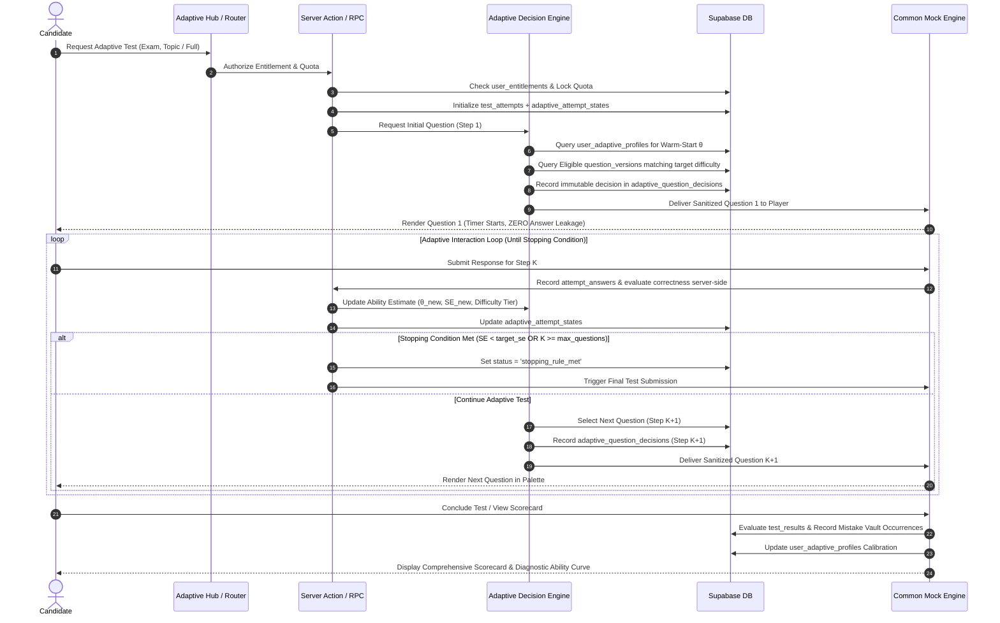

# Courage Library — Adaptive Mock Testing Engine Architecture
## Comprehensive Architecture & Phase 4B Decision Engine Specification

---

## 1. System Overview & Vision

The **Courage Library Adaptive Mock Testing Engine** is designed to provide candidate-centric, dynamic difficulty adjustment (CAT - Computerized Adaptive Testing) for competitive examination preparation (SSC, UPSC, Banking, Railways, Defence, State PSCs). 

Unlike static mock tests where the question sequence is fixed prior to test launch, an **Adaptive Test** begins with an initial estimated ability ($\theta$), selects items dynamically based on the candidate's real-time correctness and topic mastery, updates the latent ability score ($\theta$) and measurement standard error ($SE(\theta)$) after every response, and concludes when a stopping policy (e.g. standard error threshold or max questions) is met.

### Unified Pipeline

```
Question Bank & Versions (question_versions)
        ↓
Exam Blueprint & Pattern (exam_patterns / adaptive_test_configs)
        ↓
Eligibility & Exclusion Filter (Published, language, unserved items)
        ↓
Candidate Adaptive Ability & Performance Signals (user_adaptive_profiles / historical state)
        ↓
Adaptive Decision Engine (Difficulty progression, topic balance, Fisher information)
        ↓
Immutable Selection Audit (adaptive_question_decisions)
        ↓
Existing Common Mock Engine (/mock-tests/[id]/take)
        ↓
Candidate Interaction & Submission (attempt_answers)
        ↓
Server-Authoritative State Update (adaptive_attempt_states: θ, SE, topic counts)
        ↓
Next Dynamic Question Selection (or Stopping Rule Trigger)
        ↓
Existing Result & Scoring Engine (/mock-tests/[id]/result)
        ↓
Mistake Vault & Error Remediation (user_mistake_vault)
        ↓
Adaptive Profile Calibration (user_adaptive_profiles)
```

---

## 2. Core Reused Infrastructure

To maintain architectural purity, zero redundancy, and rock-solid production stability, the Adaptive Engine intentionally **reuses** all foundational Courage Library subsystems:

| Existing Subsystem | Reuse Strategy in Adaptive Engine |
| :--- | :--- |
| **Question Bank** (`questions`, `question_versions`, `question_options`, `question_answers`) | Single source of truth for questions, options, difficulty tags, and verified answer keys. |
| **Common Mock Engine** (`/mock-tests/[id]/take`, `AssessmentPlayerClient`) | The identical assessment UI, question timer, option selector, palette, and submission lifecycle are reused for adaptive tests. |
| **Assessment Service & Attempts** (`test_attempts`, `attempt_answers`) | Core test attempts and individual question responses are stored in standard `test_attempts` and `attempt_answers` tables. |
| **Results & Scoring Engine** (`test_results`) | Positive scores, negative penalties, accuracy, time spent, and percentiles are evaluated via the central result evaluator. |
| **Mistake Vault** (`user_mistake_vault`, `user_mistake_drills`) | Incorrect responses in adaptive sessions automatically feed cognitive error tracking without duplicate mistake infrastructure. |
| **Premium Entitlement & Quota** (`user_entitlements`, `fn_check_premium_access_and_quota`) | Adaptive tests validate candidate entitlement and consume quota through established authoritative RPCs. |
| **Admin Governance & Audit** (`admin_audit_logs`, `premium_system_configs`) | Adaptive configurations and policy toggles are managed through unified RBAC and immutable administrative logging. |

---

## 3. Database Schema & Entities

Introduced via Migration `20260908000038_phase4a_adaptive_foundation.sql`:

```
+-----------------------------------------------------------------------------------+
|                            adaptive_test_configs                                  |
|-----------------------------------------------------------------------------------|
| id (PK)                                                                           |
| exam_id (FK -> exams)                                                             |
| pattern_id (FK -> exam_patterns)                                                  |
| test_type (ADAPTIVE_FULL_LENGTH, ADAPTIVE_SECTIONAL, ADAPTIVE_TOPIC, etc.)        |
| title, slug, version, is_active                                                   |
| min_questions, max_questions, target_duration_minutes                             |
| difficulty_policy (JSONB), topic_policy (JSONB)                                    |
| stopping_policy (JSONB), selection_policy (JSONB)                                 |
| created_at, updated_at                                                            |
+-----------------------------------------------------------------------------------+
                                         │
                                         ▼ (1:N)
+-----------------------------------------------------------------------------------+
|                            adaptive_attempt_states                                |
|-----------------------------------------------------------------------------------|
| id (PK)                                                                           |
| attempt_id (Unique FK -> test_attempts)                                           |
| config_id (FK -> adaptive_test_configs)                                           |
| user_id (FK -> auth.users)                                                        |
| status ('in_progress', 'stopping_rule_met', 'completed', 'terminated')            |
| current_theta (Double: latent ability θ)                                          |
| standard_error (Double: measurement error SE(θ))                                  |
| current_difficulty_tier ('easy', 'medium', 'hard', 'extreme')                     |
| questions_served_count, correct_answers_count, incorrect_answers_count            |
| topic_breakdown (JSONB), section_breakdown (JSONB), sequence_history (JSONB)      |
| stopping_reason, created_at, updated_at                                           |
+-----------------------------------------------------------------------------------+
                                         │
                                         ▼ (1:N)
+-----------------------------------------------------------------------------------+
|                          adaptive_question_decisions                              |
|-----------------------------------------------------------------------------------|
| id (PK)                                                                           |
| attempt_state_id (FK -> adaptive_attempt_states)                                  |
| attempt_id (FK -> test_attempts)                                                  |
| user_id (FK -> auth.users)                                                        |
| step_number (Integer: 1, 2, 3...)                                                 |
| question_version_id (FK -> question_versions)                                     |
| target_topic_id (FK -> topics)                                                    |
| target_difficulty, selection_strategy                                             |
| decision_metadata (JSONB: explainable rationale, θ at selection, pool stats)      |
| created_at (Immutable via PostgreSQL trigger)                                     |
+-----------------------------------------------------------------------------------+

+-----------------------------------------------------------------------------------+
|                            user_adaptive_profiles                                 |
|-----------------------------------------------------------------------------------|
| id (PK)                                                                           |
| user_id (FK -> auth.users)                                                        |
| exam_id (FK -> exams)                                                             |
| overall_theta, overall_confidence                                                 |
| subject_abilities (JSONB), difficulty_accuracies (JSONB)                          |
| total_adaptive_tests_completed, total_adaptive_questions_answered                 |
| last_calibrated_at, created_at, updated_at                                        |
| Unique Constraint: (user_id, exam_id)                                             |
+-----------------------------------------------------------------------------------+
```

---

## 4. Adaptive Test Lifecycle & Runtime Data Flow



---

## 5. Phase 4B — Adaptive Decision Engine Specification

The Phase 4B Adaptive Decision Engine implements the server-side decision layer under `services/adaptive/`:

### 5.1 Modular Services Architecture
1. **`services/adaptive/adaptive-types.ts`**: Unified TypeScript contracts, interfaces, stopping policies, explainable decision records, and safe candidate question payloads (zero answer leakage).
2. **`services/adaptive/adaptive-performance.service.ts`**: Candidate historical performance extraction, cold-start handling, Laplace-smoothed topic mastery calculation, and test completion recalibration.
3. **`services/adaptive/adaptive-policy.service.ts`**: Normalized difficulty tiers (`easy`, `medium`, `hard`), target difficulty calculation based on latent ability $\theta$, and exploration rate decay.
4. **`services/adaptive/adaptive-selection.service.ts`**: Question eligibility filtering, deterministic multi-objective item scoring, deterministic tie-breaking, and structured explainability payloads.
5. **`services/adaptive/adaptive-state.service.ts`**: Server-authoritative ability update ($\theta, SE$), response evaluation against database answer keys, stopping rule verification, and step-level idempotency.
6. **`services/adaptive/adaptive-engine.service.ts`**: Master orchestrator implementing `initializeAdaptiveAttempt`, `getNextAdaptiveQuestion`, `submitAdaptiveAnswer`, `finalizeAdaptiveAttempt`, and `getAdaptiveAttemptState`.

### 5.2 Algorithmic Formulations

#### A. Laplace Smoothed Topic Mastery
$$\text{Mastery}(T) = \frac{C_T + \alpha \cdot \text{Prior}}{N_T + \alpha + \beta}$$
- Prior $= 0.50$, smoothing parameters $\alpha = 2, \beta = 2$.
- Guarantees smooth cold-start transitions without extreme 0.0 or 1.0 initial jumps.

#### B. Latent Ability ($\theta$) & Precision ($SE$) Dynamics
- Prior item difficulty location: $b_{\text{easy}} = -1.0, b_{\text{med}} = 0.0, b_{\text{hard}} = +1.0$.
- Probability of correct response:
$$P(\text{correct} \mid \theta, b_i) = \frac{1}{1 + e^{-(\theta - b_i)}}$$
- Adaptive ability update step:
$$\theta_k = \text{clamp}\left(\theta_{k-1} + \frac{0.8}{\sqrt{k}} \cdot (\text{is\_correct} - P(\text{correct})), -3.0, 3.0\right)$$
- Monotonic Standard Error convergence:
$$SE(k) = \frac{1.0}{\sqrt{1 + 0.2 \cdot k}}$$

#### C. Multi-Objective Item Ranking Score
$$\text{Score}(Q) = 0.35 \cdot \text{DiffMatch} + 0.30 \cdot \text{TopicPriority} + 0.20 \cdot \text{ExplorationValue} + 0.15 \cdot \text{MistakeBonus}$$
- **Tie-Breaker**: Deterministic sort by `question_version_id` ascending.
- **Answer Safety**: All client payloads strip `question_answers`, `correct_option_key`, `is_correct`, and `explanation_md` before response delivery.

---

## 6. Explainability & Decision Audit Trail

Every item delivered to a candidate is governed by an **immutable decision record** in `adaptive_question_decisions`:

```json
{
  "step_number": 4,
  "target_topic": "Algebra - Quadratic Equations",
  "target_difficulty": "hard",
  "selection_strategy": "difficulty_progression",
  "decision_metadata": {
    "theta_before_step": 0.62,
    "standard_error": 0.41,
    "consecutive_correct": 3,
    "topic_coverage_target": 2,
    "topic_served_count": 1,
    "candidate_topic_accuracy": 0.85,
    "eligible_pool_count": 42,
    "exploration_applied": false
  }
}
```

PostgreSQL trigger `trg_prevent_adaptive_decision_mutation` enforces that decisions cannot be updated or deleted, guaranteeing forensic auditability and explainability.

---

## 7. Security Model & Row Level Security (RLS)

1. **Server-Authoritative Decisions**: Latent ability $\theta$, next question selection, and stopping triggers are evaluated strictly server-side. No client-supplied ability scores or question IDs are accepted.
2. **Zero Answer Key Leakage**: Dynamic questions are served one-by-one or in controlled section batches with option texts and IDs only. Correct answers and explanations remain concealed until test conclusion.
3. **Candidate Data Isolation**:
   - `adaptive_attempt_states`: Candidate can only `SELECT` own attempts (`user_id = auth.uid()`).
   - `adaptive_question_decisions`: Candidate can only `SELECT` own decisions (`user_id = auth.uid()`).
   - `user_adaptive_profiles`: Candidate can only `SELECT` own profile (`user_id = auth.uid()`).
   - `adaptive_test_configs`: Authenticated candidates can read active configurations (`is_active = true`); Admins have full management access.

---

## 8. Verification & Quality Gates Summary

- **Phase 4A Foundation**: 23/23 tests passed (`scratch/test_phase4a_adaptive_foundation.cjs`).
- **Phase 4B Decision Engine**: 35/35 tests passed (`scratch/test_phase4b_adaptive_decision_engine.cjs`).
- **TypeScript Strict Compilation**: `npx tsc --noEmit` = **0 errors**.
- **Production Baseline**: 100% preserved (all 10 baseline table counts intact, Daily Mock intact, Premium v1.0 intact).
