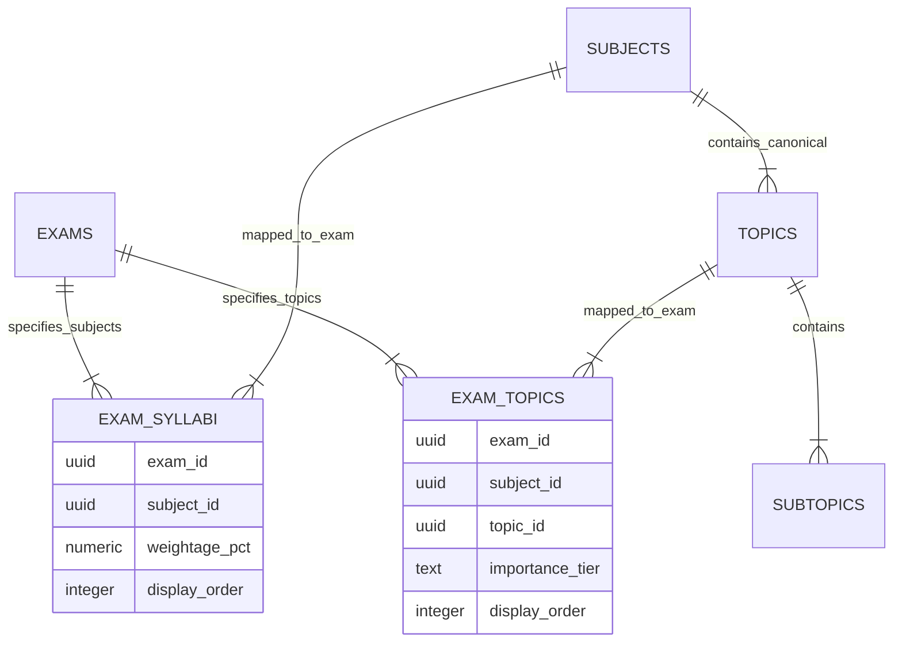
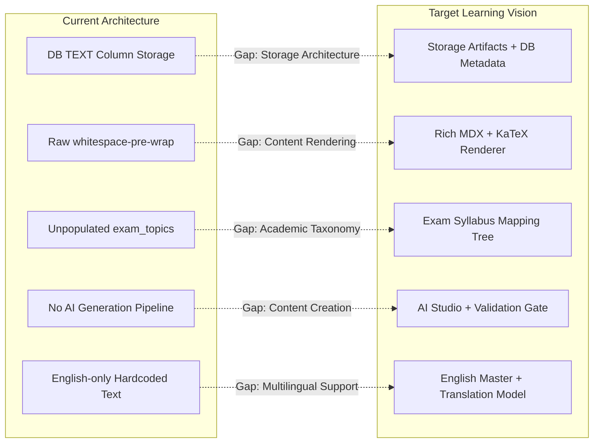

# COURAGE LIBRARY — LEARNING / COURSES SYSTEM
# PHASE 1: COMPLETE ARCHITECTURE, REPOSITORY & DATABASE AUDIT
**Document Type**: Technical Architecture Audit & Gap Analysis  
**Operating Mode**: Read-Only Audit — Zero Implementation  
**Status**: Certified Audit Baseline  

---

## 1. Executive Summary

Courage Library is an advanced, self-paced government examination learning platform designed around the closed pedagogical loop:
$$\text{LEARN} \longrightarrow \text{PRACTICE} \longrightarrow \text{TEST} \longrightarrow \text{IMPROVE}$$

This document presents a comprehensive, evidence-based architectural audit of the entire repository and database to establish the exact current state of all learning, course, content, topic, syllabus, asset, translation, and progress infrastructure before designing the new Learning/Courses subsystem.

### Key Audit Findings at a Glance:
1. **Content Storage Fragmented & Relational-Bound**: Educational content is currently stored directly as raw text strings inside PostgreSQL relational tables (`article_versions.content_body` TEXT and `articles.body_md` TEXT). There is no external content artifact layer (MDX/JSON), no streaming CDN storage, no AST-based content parser, and no KaTeX/LaTeX or Markdown rendering library installed in `package.json`.
2. **Schema Split Between Abstract Resources & Simple Courses**: Phase 3E introduced an abstract `learning_resources` polymorphism hierarchy (`articles`, `learning_resource_topics`), while Phase 3F introduced a standalone video course hierarchy (`courses`, `course_modules`, `course_lessons`). The Admin CMS (`app/admin/actions.ts:1531`) has drifted from the database schema, attempting direct column inserts on `articles` that do not exist in the table.
3. **Canonical Knowledge vs Exam Syllabus Decoupling Supported in DB, Unused in UI**: The database contains sophisticated relational structures for reusable taxonomy (`subjects`, `topics`, `subtopics`, `exam_syllabi`, `exam_topics`), but the candidate UX (`app/exams/[slug]/page.tsx`) only surfaces mock tests, completely bypassing academic syllabus navigation and lesson links.
4. **Question Bank Lineage Model is Production-Grade**: The existing Question Bank architecture (`questions`, `question_versions`, `question_options`, `question_answers`, `exam_question_mappings`) provides immutable versioning (`question_version_id`), perfect for teaching references and PYQ citations without duplicating question data.
5. **Multi-Language Support is Nascent**: The database has `language_preference` on `user_profiles` (constrained strictly to `'en'` and `'hi'`) and dual-language columns in search indexes (`title_en`, `title_hi`), but lacks a systematic English-master translation model for lesson content.
6. **Zero Live-Class Architecture (Strict Alignment)**: The codebase contains zero WebRTC, zero live video streaming rooms, zero teacher scheduling, and zero live classroom state machines, strictly complying with the platform's self-paced mandate.

---

## 2. Current Architecture Map

```mermaid
flowchart TD
    subgraph Candidate Facing Layer [Next.js 15 App Router]
        EXAM_PAGE[app/exams/[slug]/page.tsx]
        ART_PAGE[app/articles/[slug]/page.tsx]
        COURSE_PAGE[app/courses/[slug]/page.tsx]
        PLAYER_PAGE[app/courses/[slug]/learn/page.tsx]
        PRACTICE_PAGE[app/practice/page.tsx]
    end

    subgraph Service & Business Logic Layer
        CONTENT_SVC[services/content.service.ts]
        ASSESS_SVC[services/assessment.service.ts]
        ADMIN_SVC[services/admin.service.ts]
        BOOKMARK_SVC[services/bookmark.service.ts]
        PREMIUM_SVC[services/premium-entitlement.service.ts]
    end

    subgraph Relational Database [Supabase PostgreSQL]
        subgraph Academic Taxonomy
            ORGS[(conducting_orgs)]
            EXAMS[(exams)]
            SYLLABI[(exam_syllabi)]
            EXAM_TOPICS[(exam_topics)]
            SUBJECTS[(subjects)]
            TOPICS[(topics)]
            SUBTOPICS[(subtopics)]
        end

        subgraph Content & Articles
            RESOURCES[(learning_resources)]
            RES_TOPICS[(learning_resource_topics)]
            ARTICLES[(articles)]
            ART_VERSIONS[(article_versions)]
        end

        subgraph Courses & Video Runtime
            COURSES[(courses)]
            MODULES[(course_modules)]
            LESSONS[(course_lessons)]
            COURSE_PROG[(user_course_progress)]
            LESSON_COMP[(user_lesson_completions)]
            LESSON_NOTES[(user_lesson_notes)]
        end

        subgraph Question Bank & Lineage
            QUESTIONS[(questions)]
            Q_VERSIONS[(question_versions)]
            Q_OPTIONS[(question_options)]
            Q_ANSWERS[(question_answers)]
            EXAM_Q_MAP[(exam_question_mappings)]
        end
    end

    EXAM_PAGE --> ASSESS_SVC
    ART_PAGE --> CONTENT_SVC
    COURSE_PAGE --> CONTENT_SVC
    PLAYER_PAGE --> CONTENT_SVC
    PRACTICE_PAGE --> ASSESS_SVC

    CONTENT_SVC --> ARTICLES
    CONTENT_SVC --> ART_VERSIONS
    CONTENT_SVC --> COURSES
    CONTENT_SVC --> MODULES
    CONTENT_SVC --> LESSONS
    CONTENT_SVC --> COURSE_PROG

    ASSESS_SVC --> EXAMS
    ASSESS_SVC --> TOPICS
```

---

## 3. Repository Findings

### 3.1 Route Catalog (`app/`)
- **`app/articles/page.tsx`**: Catalog of published articles filtered by topic. Calls `ContentService.getArticles()`.
- **`app/articles/[slug]/page.tsx`**: Article reader page. Fetches `ArticleDetail` and renders `article.contentBody` as raw string inside `whitespace-pre-wrap` container.
- **`app/courses/page.tsx`**: Video course directory. Calls `ContentService.getCourses()`.
- **`app/courses/[slug]/page.tsx`**: Course syllabus overview displaying module/lesson hierarchy.
- **`app/courses/[slug]/learn/page.tsx`**: Two-column video course player (`CoursePlayerClient`) with sidebar lesson navigation, video placeholder/text pane, and heartbeat tracking.
- **`app/exams/page.tsx` & `app/exams/[slug]/page.tsx`**: Exam directory and exam details. Only displays mock test cards; does not surface curriculum or topic learning trees.
- **`app/admin/content/page.tsx`**: Admin CMS interface (`AdminContentManager`) with tabs for Articles and Courses, plus bulk import JSON modal.
- **`app/api/courses/complete-lesson/route.ts`**: API endpoint invoking RPC `fn_complete_course_lesson`.
- **`app/api/courses/playback-heartbeat/route.ts`**: API endpoint invoking RPC `fn_update_lesson_playback_position`.

### 3.2 Service Layer (`services/`)
- **`services/content.service.ts`** (327 lines): Encapsulates queries for articles, article detail with version resolution, course catalog, course syllabus hierarchy, and lesson completion RPCs.
- **`services/admin.service.ts`** (1831 lines): Contains `getAdminContent()` (lines 1571–1602) querying `articles` and `courses` tables.
- **`services/bookmark.service.ts`** (212 lines): Manages question bookmarks in `user_question_bookmarks`. Does not manage article or lesson bookmarks.
- **`services/premium-entitlement.service.ts`** (196 lines): Manages subscription quotas and access checks via `fn_check_premium_access_and_quota`.

### 3.3 Dependencies (`package.json`)
```json
{
  "dependencies": {
    "@supabase/ssr": "^0.5.2",
    "@supabase/supabase-js": "^2.49.1",
    "clsx": "^2.1.1",
    "lucide-react": "^1.16.0",
    "next": "^15.2.0",
    "react": "^19.0.0",
    "react-dom": "^19.0.0",
    "tailwind-merge": "^3.0.2"
  }
}
```
**Critical Observation**: The repository currently has zero Markdown/MDX parsing dependencies (no `@next/mdx`, `next-mdx-remote`, `react-markdown`, `remark`, `rehype`, `katex`, or `shiki`).

---

## 4. Database Findings

The database currently consists of 52 PostgreSQL schema migrations. The relevant tables for learning, courses, academic taxonomy, and progress are cataloged below:

| Table Name | Migration Source | Primary Key | Key Foreign Keys | Purpose | Production Usage |
|---|---|---|---|---|---|
| `conducting_orgs` | `20260824000001_phase3a_core_foundation.sql` | `id` (UUID) | None | Exam authorities (SSC, UPSC, IBPS, RRB). | Active |
| `exams` | `20260824000001_phase3a_core_foundation.sql` | `id` (UUID) | `conducting_org_id` | Specific exams (SSC CGL, IBPS PO). | Active |
| `subjects` | `20260824000001_phase3a_core_foundation.sql` | `id` (UUID) | None | Canonical subjects (Quant, Reasoning, English, GS). | Active |
| `topics` | `20260824000001_phase3a_core_foundation.sql` | `id` (UUID) | `subject_id` | Canonical topics (Percentage, Number System). | Active |
| `subtopics` | `20260824000001_phase3a_core_foundation.sql` | `id` (UUID) | `topic_id` | Granular subtopics. | Schema Defined |
| `exam_syllabi` | `20260824000001_phase3a_core_foundation.sql` | `id` (UUID) | `exam_id`, `subject_id` | Exam $\leftrightarrow$ Subject mapping with weightage. | Schema Defined |
| `exam_topics` | `20260824000001_phase3a_core_foundation.sql` | `id` (UUID) | `exam_id`, `subject_id`, `topic_id` | Exam $\leftrightarrow$ Topic importance tiers & display order. | Schema Defined |
| `learning_resources` | `20260824000007_phase3e_content_management.sql` | `id` (UUID) | `created_by` | Abstract polymorphic parent for educational resources. | Active |
| `learning_resource_topics` | `20260824000007_phase3e_content_management.sql` | `id` (UUID) | `learning_resource_id`, `topic_id` | Many-to-many topic mapping for resources. | Active |
| `articles` | `20260824000007_phase3e_content_management.sql` | `id` (UUID) | `id` $\rightarrow$ `learning_resources(id)` | Editorial study briefs, reading time, SEO fields. | Active |
| `article_versions` | `20260824000007_phase3e_content_management.sql` | `id` (UUID) | `article_id`, `editor_user_id` | Versioned content bodies (`content_body` TEXT). | Active |
| `courses` | `20260824000007_phase3e_content_management.sql` | `id` (UUID) | `author_user_id` | Video courses & standalone packages. | Active |
| `course_modules` | `20260824000007_phase3e_content_management.sql` | `id` (UUID) | `course_id` | Module / chapter groupings within a course. | Active |
| `course_lessons` | `20260824000007_phase3e_content_management.sql` | `id` (UUID) | `course_id`, `module_id`, `learning_resource_id` | Individual video/text lessons with durations. | Active |
| `user_course_progress` | `20260824000009_phase3f_course_runtime.sql` | `id` (UUID) | `user_id`, `course_id`, `last_lesson_id` | Aggregate user progress per course (progress_pct). | Active |
| `user_lesson_completions` | `20260824000009_phase3f_course_runtime.sql` | `id` (UUID) | `user_id`, `course_id`, `lesson_id` | Fine-grained lesson playback & completion tracking. | Active |
| `user_lesson_notes` | `20260824000009_phase3f_course_runtime.sql` | `id` (UUID) | `user_id`, `lesson_id` | Timestamped candidate personal notes on lessons. | Schema Defined |
| `user_entitlements` | `20260824000007_phase3e_content_management.sql` | `id` (UUID) | `user_id`, `course_id`, `exam_id` | Course purchases and PRO subscriptions. | Active |
| `search_indexes` | `20260825000023_phase3k_discovery_engine.sql` | `id` (UUID) | `exam_id`, `subject_id`, `topic_id` | Unified discovery index for articles, courses, lessons. | Active |

---

## 5. Existing Learning/Content Systems

### 5.1 The Phase 3E Abstract Resource Pattern
Phase 3E designed an abstract entity pattern:
```
learning_resources (Parent)
    ├── articles (1:1 Child via PK)
    │     └── article_versions (1:N Version History)
    ├── course_lessons (Links via learning_resource_id FK)
    └── learning_resource_topics (M:N with topics)
```
- **Strengths**: Clean relational inheritance; enables unified search and metadata tagging.
- **Weaknesses**: Creates complex multi-table joins on reads (`articles` $\bowtie$ `learning_resources` $\bowtie$ `article_versions` $\bowtie$ `learning_resource_topics` $\bowtie$ `topics`).
- **Fragmentation**: `app/admin/actions.ts:createArticleAction` bypasses this pattern entirely, creating a broken insert when admin creates an article.

---

## 6. Existing Course/Article Systems

### 6.1 Article System
- **Path**: `app/articles/[slug]/page.tsx`
- **Model**: Read from database `article_versions.content_body`.
- **Renderer**: Unparsed string rendered with CSS `whitespace-pre-wrap`.
- **Interactivity**: Static display with bottom "Closed Learning Loop" CTA cards linking to `/practice?topic=...`.

### 6.2 Course System
- **Path**: `app/courses/[slug]/page.tsx` (Syllabus) & `app/courses/[slug]/learn/page.tsx` (Player).
- **Model**: `courses` $\rightarrow$ `course_modules` $\rightarrow$ `course_lessons`.
- **Playback Tracking**: Periodically calls `/api/courses/playback-heartbeat` (updating `playback_position_seconds` via `fn_update_lesson_playback_position`).
- **Completion**: Calls `/api/courses/complete-lesson` (updating `user_lesson_completions` and recalculating `user_course_progress.progress_pct` via `fn_complete_course_lesson`).

---

## 7. Existing Subject/Topic/Syllabus Architecture

### 7.1 Reusable vs Exam-Specific Separation
The database already has the mathematical schema to separate canonical knowledge from exam-specific structures:



### 7.2 The Reality Gap
- While `exam_syllabi` and `exam_topics` exist in SQL (`20260824000001_phase3a_core_foundation.sql`), they are **not populated or queried** by any candidate-facing learning page.
- There is currently no `exam_subtopics` or granular `exam_lesson_mappings` table.
- When candidates browse an exam (`app/exams/[slug]/page.tsx`), the page queries `mock_tests` directly, completely omitting the academic syllabus tree.

---

## 8. Question Bank Integration

### 8.1 Current Lineage Architecture
The Question Bank is the most mature subsystem in Courage Library:
- `questions` $\rightarrow$ Canonical identity.
- `question_versions` $\rightarrow$ Immutable snapshot with `version_number`, `question_text`, `options_data` (JSONB), and `solution_text`.
- `exam_question_mappings` $\rightarrow$ Connects questions to specific exams with PYQ metadata (`pyq_year`, `pyq_shift`, `pyq_paper`).

### 8.2 Learning Subsystem Integration Strategy
- **Teaching Examples**: Simple conceptual step-by-step examples can be part of the lesson content body.
- **Exam PYQ References**: Lessons should reference `question_id` / `question_version_id` rather than duplicating questions into content tables.
- **Interactive Practice Embeds**: The lesson renderer can dynamically fetch live interactive question components using `question_version_id`.

---

## 9. Asset / Image Infrastructure

### 9.1 Current State
- **Storage Mechanism**: Supabase Storage.
- **Existing Buckets**: `question-images` (public) and `reward-badges` (public).
- **Upload Action**: `uploadBulkImportImageAction` in `app/admin/actions.ts:52-89`.
- **Missing Infrastructure**: There is no dedicated bucket or asset management pipeline for `learning-assets` (diagrams, concept charts, formulas, infographic slides).
- **Metadata**: No asset metadata table exists to track image dimensions, alt text, or AI prompt provenance.

---

## 10. Language / Translation Infrastructure

### 10.1 Current State
- **User Preference**: `user_profiles.language_preference` supports `'en'` and `'hi'` (CHECK constraint).
- **Discovery Dual Fields**: `search_indexes` has `title_en`, `title_hi`, `body_snippet_en`, `body_snippet_hi`.
- **Flashcards**: `flashcards` has `front_text_hi`, `back_text_hi`.
- **Articles & Lessons**: `articles` and `course_lessons` have **ZERO** multilingual columns or translation tables.

### 10.2 Architectural Finding
The current system lacks an English-master translation model for learning content. All educational content is hardcoded in English inside `article_versions.content_body`.

---

## 11. User Progress Infrastructure

### 11.1 Reusable Capabilities
The `user_course_progress` and `user_lesson_completions` tables provide robust progress tracking:
- `total_lessons`, `completed_lessons`, `progress_pct` (computed via trigger/RPC).
- `playback_position_seconds`, `verified_seconds_spent`.
- `last_lesson_id`, `last_accessed_at` (enables 1-click "Resume Learning").

### 11.2 Gaps
- Progress tracking is tied strictly to `courses` and `course_lessons`.
- There is no reading progress or completion tracking for `articles` or topic-level syllabus trees.

---

## 12. Admin Content Infrastructure

### 12.1 Current State
- `app/admin/content/page.tsx` renders a basic form for creating articles and courses.
- `app/admin/bulk-import/page.tsx` supports bulk JSON import for questions, categories, patterns, and mock tests.

### 12.2 Missing Admin Content Studio Capabilities
- No visual lesson builder or structured content editor.
- No AI prompt generator or structured AI output validator.
- No content version comparator (diff viewer).
- No syllabus mapping editor (drag-and-drop subject/topic sequencing).
- No asset/diagram uploader linked to lesson blocks.

---

## 13. SEO Infrastructure

### 13.1 Current Reusable Patterns
- `articles` table has `meta_title`, `meta_description`, `slug`, `featured_image_url`.
- `app/articles/[slug]/page.tsx` has static metadata structure.
- `redirect_routes` table exists for 301/302 URL redirects.

### 13.2 Gaps
- No JSON-LD structured data (`Course`, `Article`, `BreadcrumbList`, `FAQPage`).
- No OpenGraph image generation.
- No automated XML sitemap generation for dynamic topic/lesson routes.

---

## 14. Entitlement & Authorization Infrastructure

### 14.1 Existing Monetization & Entitlements
- `subscription_plans` and `user_entitlements` support `PRO_SUBSCRIPTION`, `COURSE_PURCHASE`, and `PROMOTIONAL_PASS`.
- `PremiumEntitlementService` (`services/premium-entitlement.service.ts`) provides server-side entitlement checks.
- `courses` has `access_tier` (`'FREE'`, `'PRO_ONLY'`, `'PAID_STANDALONE'`).
- `course_lessons` has `is_free_preview` (BOOLEAN).

### 14.2 Integration Opportunity
The Learning/Courses system can seamlessly inherit the existing `PremiumEntitlementService` to gate advanced topic lessons, full syllabus trees, or premium revision sheets.

---

## 15. Security Findings

1. **Row Level Security (RLS)**:
   - RLS is enabled on all content and progress tables (`articles`, `courses`, `user_course_progress`, `user_lesson_completions`).
   - Public read policies exist for `status = 'PUBLISHED'` and `is_published = true`.
2. **Server Action Protection**:
   - Admin actions strictly check `AdminService.checkIsAdminOrStaff()`.
3. **Draft / Unpublished Content Boundary**:
   - `ContentService.getArticleBySlug` and `getCourseBySlug` enforce `.eq("status", "PUBLISHED")` / `.eq("is_published", true)`.
4. **Secret Handling**: Zero hardcoded secrets found in client components.

---

## 16. Performance & Scalability Findings

1. **Database Bloat Risk (Critical)**:
   Storing multi-megabyte lesson bodies, LaTeX formulas, SVG diagrams, and rich text directly in `article_versions.content_body` (TEXT column) will degrade PostgreSQL buffer pool cache efficiency and slow down indexing.
2. **N+1 Query Elimination in ContentService**:
   `ContentService.getCourses()` and `getArticles()` use Supabase relational nested selects (`learning_resources!inner(...)`, `course_modules(..., course_lessons(...))`), performing efficient single-query joins.
3. **Zero-Layout Shift (CLS)**:
   Server components render the initial page structure, preventing client-side layout jumps.

---

## 17. Legacy / Duplicate Systems

| Component | Status | Recommendation |
|---|---|---|
| `articles` vs `course_lessons` | Disconnected Silos | Unify under a single canonical **Lesson / Content Block** model. |
| `current_affairs_articles` | Specialized Silo | Retain as a distinct chronological feed, but reuse the common content renderer. |
| `app/admin/actions.ts:createArticleAction` | Broken / Schema Mismatch | Deprecate and replace with the new Admin Content Studio pipeline. |

---

## 18. MDX vs JSON vs Alternative Content Formats

We evaluated 5 potential content storage and rendering formats for Courage Library:

| Evaluation Dimension | Option A: Raw MDX | Option B: Pure JSON / AST | Option C: Standard Markdown | Option D: Raw HTML | Option E: Structured JSON Spec + Compiled MDX Artifact (Recommended) |
|---|---|---|---|---|---|
| **AI Generation Reliability** | Low (Syntax errors in JSX) | **High** (Schema-validated JSON) | Moderate | Moderate | **Very High** (JSON spec $\rightarrow$ compiler) |
| **Validation & QA** | Difficult (Runtime crashes) | **Easy** (Zod / JSON Schema) | Easy | Difficult | **Rigorous** (Automated validation gate) |
| **Rich Educational Formatting** | **High** (Custom React components) | Requires custom renderer | Limited | High (Security risk) | **Highest** (Validated custom components) |
| **Formulas (LaTeX / KaTeX)** | **Native** via Remark/Rehype | Requires custom parsing | Limited | Requires MathJax | **Native** via Rehype-KaTeX |
| **Storage Scalability** | File/CDN friendly | Database or CDN | File/DB | File/DB | **Optimal** (Metadata in DB, Artifact in Storage) |
| **Translation Compatibility** | Complex (JSX interpolation) | **High** (Key-value text strings) | Moderate | Poor | **High** (Translate JSON spec, re-compile) |
| **Future Mobile App (Flutter/RN)**| Poor (Web-only MDX) | **Native** (JSON AST to native widgets) | Moderate | Poor | **Dual-Target** (JSON for app, MDX for web) |

### Format Recommendation: **Option E (Two-Tier Content Model)**
1. **Tier 1 (Authoring & AI Contract)**: **Structured JSON Specification** (`LessonDocumentSpec`). Validated with Zod schemas. AI generates structured JSON.
2. **Tier 2 (Published Web Artifact)**: **Compiled MDX Document** stored in CDN / Object Storage, rendered on Next.js web clients with rich interactive components (KaTeX formulas, interactive step quizzes, comparison tables, PYQ reference chips).

---

## 19. Current vs Target Architecture Gap Analysis



| Gap Description | Severity | Impact |
|---|---|---|
| Educational content stored directly in relational text columns. | **CRITICAL** | Database bloat, high I/O latency, poor CDN caching. |
| Zero Markdown/MDX/KaTeX parsing library in repository. | **CRITICAL** | Mathematical formulas, tables, and shortcuts cannot be rendered visually. |
| Exam syllabus tables (`exam_syllabi`, `exam_topics`) bypassed in candidate UX. | **HIGH** | Candidates cannot navigate from Exam $\rightarrow$ Subject $\rightarrow$ Topic $\rightarrow$ Lesson. |
| Admin content creation is manual and has schema mismatches. | **HIGH** | Content scaling bottleneck; cannot support 50+ exams efficiently. |
| Lack of an English-Master translation schema for lessons. | **MEDIUM** | Hindi and regional language candidates cannot consume structured lessons. |
| No dedicated Storage bucket for learning diagrams & illustrations. | **MEDIUM** | Visual diagrams cannot be systematically managed or linked to topics. |

---

## 20. Reusable Infrastructure

1. **Academic Taxonomy Tables**: `conducting_orgs`, `exams`, `subjects`, `topics`, `subtopics`, `exam_syllabi`, `exam_topics`.
2. **Question Bank & Versioning**: `questions`, `question_versions`, `question_options`, `question_answers`, `exam_question_mappings`.
3. **Monetization & Entitlement Framework**: `subscription_plans`, `user_entitlements`, `PremiumEntitlementService`.
4. **Course Runtime RPCs**: `fn_complete_course_lesson`, `fn_update_lesson_playback_position`.
5. **Universal Discovery Search**: `search_indexes`, `fn_universal_search`.

---

## 21. Infrastructure That Should Be Extended

1. **`user_profiles.language_preference`**: Expand beyond `'en'`/`'hi'` to support additional regional languages (Bengali, Tamil, Telugu, Marathi).
2. **`search_indexes`**: Add automated index synchronization when new learning documents are published.
3. **`user_question_bookmarks`**: Extend into a unified bookmarking model supporting both questions and lesson content blocks.

---

## 22. Infrastructure That Should NOT Be Reused

1. **Direct Relational Content Body Storage**: `article_versions.content_body` (TEXT column) should not be used for massive new course lessons.
2. **Legacy Admin Content Action**: `app/admin/actions.ts:createArticleAction` should be retired in favor of the structured Content Studio.
3. **Raw String Rendering (`whitespace-pre-wrap`)**: Must be replaced with a secure, compiled component renderer.

---

## 23. Architectural Risks

1. **Content Formatting Inconsistency**: If AI-generated content is not strictly validated against a typed JSON schema, lessons will produce rendering errors.
2. **Translation Desynchronization**: If regional translations are edited independently of the English master, translations will drift and contain outdated exam facts.
3. **Exam Mapping Permutations**: As Courage Library scales to 50+ exams, manually maintaining `exam_topics` becomes tedious without automated Admin Studio mapping tools.

---

## 24. Recommended Target Architecture — HIGH LEVEL ONLY

```
┌─────────────────────────────────────────────────────────────────────────────┐
│                       RECOMMENDED TARGET ARCHITECTURE                       │
├─────────────────────────────────────────────────────────────────────────────┤
│  1. CANONICAL KNOWLEDGE REPOSITORY                                          │
│     - Canonical Subject -> Topic -> Subtopic -> Canonical Lesson Document   │
│     - Pure educational truth (e.g. Percentage, Vedic Math, Indian Polity)   │
│                                                                             │
│  2. EXAM SYLLABUS MAPPING LAYER                                             │
│     - Exam -> Syllabus Subject -> Syllabus Topic -> Lesson Sequence         │
│     - Reuses canonical lessons with exam-specific ordering and depth        │
│                                                                             │
│  3. TWO-TIER CONTENT STORAGE LAYER                                          │
│     - Supabase DB: Metadata, versions, syllabus mappings, progress, access │
│     - Supabase Storage / CDN: Published compiled lesson artifacts (MDX/JSON)│
│                                                                             │
│  4. AI CONTENT STUDIO & VALIDATION PIPELINE                                 │
│     - Admin Studio -> Academic Specification -> AI Generation               │
│     - Strict Zod Schema Validation -> Human Review -> Controlled Publish    │
│                                                                             │
│  5. ENGLISH-MASTER TRANSLATION MODEL                                        │
│     - English Master Lesson -> Language Translation Engine (Hindi, etc.)    │
│     - Every translation strictly anchored to English version number         │
│                                                                             │
│  6. QUESTION BANK EMBEDDED LINEAGE                                          │
│     - Lessons embed live questions via question_version_id references       │
└─────────────────────────────────────────────────────────────────────────────┘
```

---

## 25. Recommended Next Phase

**Phase 2: Learning & Courses Subsystem Technical Architecture Specification**
- Design the canonical `LessonDocumentSpec` JSON schema.
- Design the Exam-Syllabus $\leftrightarrow$ Canonical Lesson mapping relational contracts.
- Define the CDN/Storage artifact layout and versioning protocol.
- Define the AI Generation & Validation pipeline contracts.
- Define the candidate-facing Reader UI & Syllabus Navigation components.

---

## 26. Explicit "DO NOT IMPLEMENT YET" Section

> [!IMPORTANT]
> **ABSOLUTE HARD STOP**: This phase is strictly an architecture audit.
> - **DO NOT** create database migrations.
> - **DO NOT** modify existing code or database tables.
> - **DO NOT** install new packages.
> - **DO NOT** create MDX files or storage buckets.
> - **DO NOT** begin Phase 2 until this audit is reviewed and approved.

---

## 27. Final Audit Summary & Decision Table

| Area | Current State | Reusable? | Gap | Priority |
|---|---|---|---|---|
| **Content Storage** | PostgreSQL TEXT column (`article_versions.content_body`) | ❌ No (for scale) | Needs external artifact storage (CDN/Storage) | **CRITICAL** |
| **Content Rendering** | Unparsed string with CSS `whitespace-pre-wrap` | ❌ No | Needs MDX/KaTeX/Component parser | **CRITICAL** |
| **Academic Taxonomy** | `subjects`, `topics`, `subtopics`, `exam_syllabi`, `exam_topics` in DB | ✅ Yes | Needs UX integration & syllabus mapping tools | **HIGH** |
| **Question Bank Integration**| `questions`, `question_versions`, `exam_question_mappings` | ✅ Yes | Lineage model is production-ready | **HIGH** |
| **Course Runtime & Progress** | `user_course_progress`, `user_lesson_completions`, RPCs | ✅ Yes | Reusable; needs extension to topic lessons | **HIGH** |
| **Admin Content CMS** | Manual text form with schema mismatches | ❌ No | Needs structured AI Content Studio | **HIGH** |
| **Asset & Diagram Storage** | Supabase Storage (`question-images` only) | ⚠️ Partial | Needs dedicated `learning-assets` pipeline | **MEDIUM** |
| **Multilingual Support** | `user_profiles.language_preference` (`'en'`, `'hi'`) | ⚠️ Partial | Needs English-master translation model | **MEDIUM** |
| **Monetization & Access** | `user_entitlements`, `PremiumEntitlementService` | ✅ Yes | Fully reusable for premium lessons | **MEDIUM** |
| **SEO & Routing** | Basic metadata and `redirect_routes` | ⚠️ Partial | Needs structured JSON-LD & dynamic sitemaps | **LOW** |

---

### Architectural Decisions Summary

- **CURRENT CONTENT ARCHITECTURE**: Direct PostgreSQL relational storage (`article_versions.content_body` TEXT) rendered via raw `whitespace-pre-wrap`.
- **RECOMMENDED CONTENT ARCHITECTURE**: Two-tier model: Supabase DB for relational metadata/hierarchy/progress + Supabase Storage/CDN for large educational content documents.
- **RECOMMENDED CONTENT ARTIFACT**: Compiled MDX document for web clients with KaTeX math, interactive check questions, and visual diagram embeds.
- **RECOMMENDED AI CONTRACT**: Typed Structured JSON Specification (`LessonDocumentSpec`) validated via Zod schemas before compilation into MDX artifacts.
- **RECOMMENDED METADATA LOCATION**: Supabase PostgreSQL (`learning_documents`, `exam_syllabus_nodes`, `lesson_versions`).
- **RECOMMENDED ASSET LOCATION**: Supabase Storage (`learning-assets` bucket) with CDN caching and metadata tracking in DB.
- **RECOMMENDED QUESTION INTEGRATION**: Referenced strictly via immutable `question_version_id` without duplicating question text into lesson tables.
- **RECOMMENDED LANGUAGE MODEL**: English-Master translation tree: All regional translations derive from and reference an authoritative English version.
- **RECOMMENDED NEXT PHASE**: **Phase 2 — Technical Architecture & Domain Contracts Specification**.
