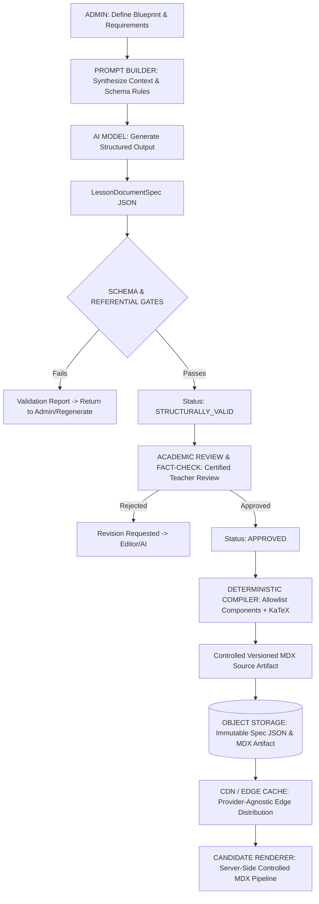
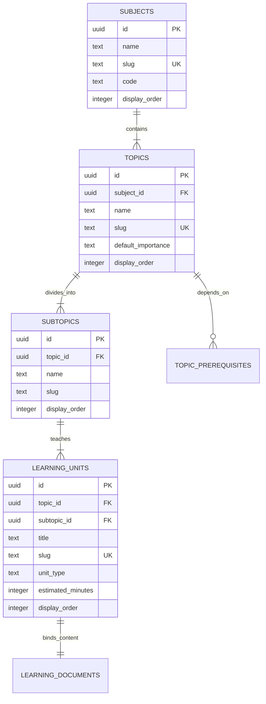
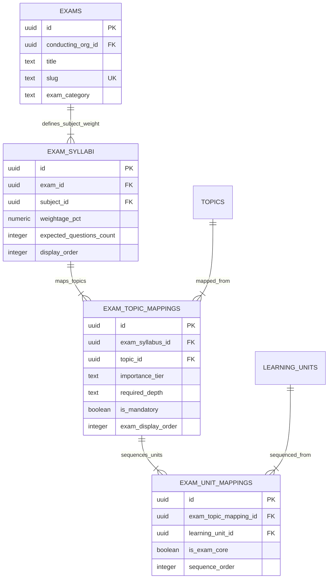
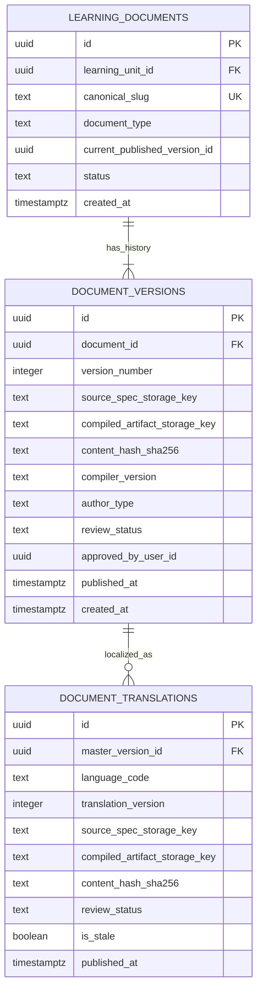
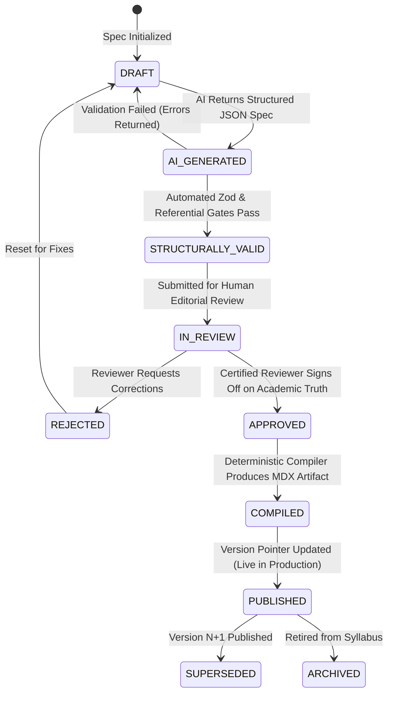
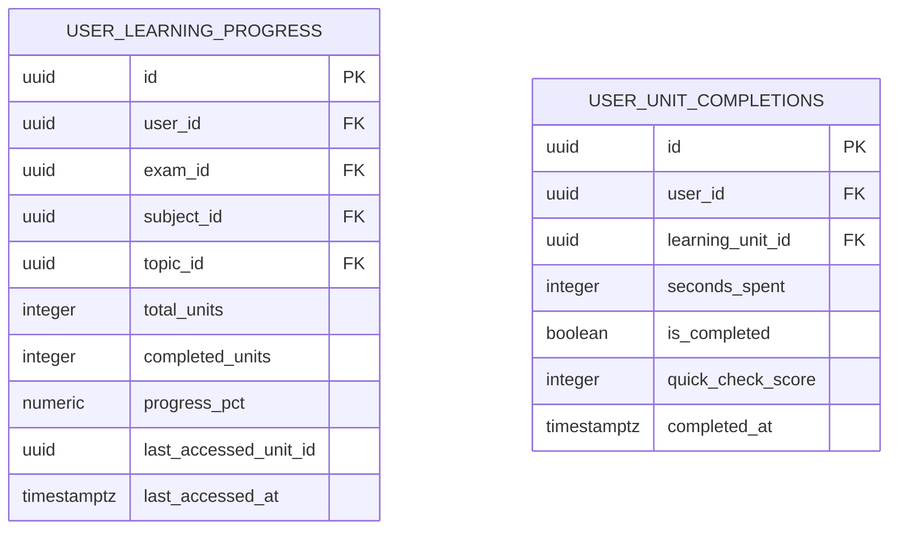

# COURAGE LIBRARY — LEARNING / COURSES SYSTEM
# PHASE 2.1: TECHNICAL ARCHITECTURE & DOMAIN CONTRACTS (HARDENED)
**Document Type**: Target Technical Architecture Specification & Domain Contracts  
**Operating Mode**: Architecture Design & Hardening Only — Zero Implementation  
**Status**: Authoritative Target Architecture Blueprint (Certified & Hardened)  

---

## 1. Architecture Executive Summary

Courage Library is an advanced, self-paced government examination learning ecosystem built around the sacred closed pedagogical loop:
$$\text{LEARN} \longrightarrow \text{PRACTICE} \longrightarrow \text{TEST} \longrightarrow \text{IMPROVE}$$

The Learning/Courses subsystem is the knowledge engine of the platform. It provides candidates with comprehensive, rigorous, and visually rich concept mastery (the **LEARN** phase) that directly feeds into the Practice Arena, Mock Test Engine, and Mistake Vault Personal Revision Engine.

### Core Architectural Pillars:
1. **Separation of Canonical Knowledge from Exam Syllabus Mappings**: Universal academic concepts (e.g. *Percentage*, *Vedic Math*, *Indian Polity*) exist once as canonical learning documents. Each government examination (SSC CGL, Banking PO, Railways, Defence, State PSCs) maps, sequences, and emphasizes these canonical topics according to its specific official syllabus without duplicating content bodies.
2. **Two-Tier Content Storage Model**:
   - **Tier 1 (Supabase PostgreSQL)**: Stores relational metadata, academic taxonomy, syllabus graphs, version pointers, publishing state, translations, user progress, and entitlements.
   - **Tier 2 (Object Storage / CDN Edge Cache)**: Stores large, immutable, compiled educational content artifacts (controlled MDX source artifacts with KaTeX math and approved interactive React components).
3. **Structured AI-First Content Authoring Contract**: AI generation produces typed, strictly validated JSON specifications (`LessonDocumentSpec`). AI is **never** the publishing authority, **never** emits arbitrary unvalidated JSX, and **never** has direct database write access.
4. **Deterministic Multi-Layer Validation Gate**: Content must pass automated schema validation, referential integrity (Question Bank & Assets), formula parsing, and **human academic review** before compilation and publication.
5. **English-Master Translation Tree**: English is the single authoritative master version. All regional language translations (Hindi, Bengali, etc.) derive directly from an immutable English version, with automated stale-state detection upon master updates.
6. **Strict Self-Paced Mandate**: Zero live-class architecture, zero streaming classroom sockets, and zero teacher scheduling systems. The platform delivers elite, self-paced mastery.

---

## 2. Design Principles & Anti-Goals

### 2.1 Core Design Principles
1. **Single Source of Academic Truth**: A mathematical concept or historical fact is authored and updated in one canonical document.
2. **Dignity & Cognitive Clarity**: Content structure progresses from intuitive foundation $\rightarrow$ step-by-step examples $\rightarrow$ formulas & shortcuts $
ightarrow$ distractor/slip warnings $
ightarrow$ authentic PYQ applications.
3. **Immutability & Historical Reproducibility**: Published content versions are immutable. Changes produce new version records with cryptographic content hashes (`SHA-256`).
4. **Zero Client-Side Security Leaks**: All authorization, compilation, and publishing decisions occur strictly on the server. Client components receive only sanitized, compiled props.
5. **Universal Closed-Loop Interoperability**: Every lesson explicitly links to Question Bank PYQs, Practice Arena drills, and Mistake Vault revision hooks.

### 2.2 Explicit Anti-Goals (What We Will NEVER Build)
- ❌ **No Live Classes / Webinars**: No WebRTC, no Zoom/Agora SDKs, no live video chat rooms.
- ❌ **No Direct AI Publishing**: No AI model may transition content directly from generation to the public live state without validation and human editorial review.
- ❌ **No Arbitrary JSX from LLMs**: AI models must never emit raw, executable JSX code.
- ❌ **No Duplicate Question Storage**: Lessons will never duplicate Question Bank text/options in content tables.
- ❌ **No Translation Chaining**: Hindi will never be translated into Bengali (English $\rightarrow$ Hindi, English $\rightarrow$ Bengali only).
- ❌ **No Relational Database Bloat**: Multi-megabyte lesson bodies will not reside in PostgreSQL text columns.

---

## 3. Formal Content Authority Matrix

To prevent architectural drift and conflicting sources of truth, system boundaries are strictly defined:

| Domain / Concept | Authoritative System | Storage Location | Guarantees / Rules |
|---|---|---|---|
| **Question Identity & Lineage** | **Question Bank** | `public.questions`, `public.question_versions` | Immutable `question_version_id` is authoritative. |
| **PYQ & Exam Metadata** | **Question Bank** | `public.exam_question_mappings` | Year, shift, tier, exam code resolved from Question Bank. |
| **Teaching / Lesson Content** | **Learning / Courses** | `learning_documents`, Object Storage (`artifacts/`) | Owned exclusively by Learning subsystem. |
| **Candidate Mistake State** | **Mistake Vault** | `public.user_mistake_vault`, `user_mistake_occurrences` | Governed by certified 2-consecutive mastery state machine. |
| **Assessment Execution** | **Mock / Practice Engine** | `public.test_attempts`, `attempt_answers` | Authoritative for timer, session state, telemetry. |
| **Assessment Scoring** | **Assessment Engine** | `public.test_results` | Authoritative for marks, accuracy, negative penalties. |
| **Candidate Entitlements** | **Monetization / Entitlements** | `public.user_entitlements`, `subscription_plans` | Evaluated server-side via `PremiumEntitlementService`. |
| **User Learning Progress** | **Learning Progress Layer** | `public.user_learning_progress`, `user_unit_completions`| Tracks lesson completions and study time. |
| **English Master Content** | **Learning / Courses** | `document_versions` (Language = 'en') | Authoritative master for all derivative translations. |
| **Translations (Hindi, etc.)** | **Learning Translation Layer** | `document_translations` | Derived directly from specific English master versions. |
| **Educational Assets** | **Learning Asset System** | `public.learning_assets`, Object Storage (`learning-assets`)| Managed catalog of diagrams, charts, and infographics. |

---

## 4. Formal AI & Publishing Authority Boundaries

### 4.1 AI Authority Boundary
```
┌─────────────────────────────────────────────────────────────────────────────┐
│                            AI AUTHORITY BOUNDARY                            │
├──────────────────────────────────────┬──────────────────────────────────────┤
│  AI MAY:                             │  AI MAY NOT:                         │
├──────────────────────────────────────┼──────────────────────────────────────┤
│  - Propose educational explanations  │  - Directly publish content to live  │
│  - Generate structured examples      │  - Write directly to production DB   │
│  - Propose formulas & shortcuts      │  - Invent fake/fabricated PYQs       │
│  - Propose distractor/trap warnings  │  - Invent fake Question Bank IDs     │
│  - Propose visual diagram specs      │  - Emit arbitrary/executable JSX     │
│  - Propose Question Bank references  │  - Create unapproved components      │
│  - Propose FAQ & quick-check items   │  - Bypass automated validation gates │
│                                      │  - Bypass human academic review      │
│                                      │  - Alter canonical taxonomy/weights  │
│                                      │  - Modify historical published docs  │
└──────────────────────────────────────┴──────────────────────────────────────┘
```

### 4.2 Publishing Authority Roles
- **AI**: *Generator* — Emits proposed `LessonDocumentSpec` JSON structures.
- **Validator**: *Structural / Deterministic Gate* — Validates Zod schemas, KaTeX syntax, and referential integrity.
- **Reviewer**: *Academic Authority* — Certified human teacher/editor verifies factual truth, pedagogy, and exam accuracy.
- **Publisher**: *Authorized System Workflow* — Server-side compiler produces immutable MDX artifacts and updates production version pointers.

---

## 5. Schema Validation vs Academic Correctness

> [!IMPORTANT]
> **CRITICAL ARCHITECTURAL DISTINCTION**:
> Passing automated JSON schema validation guarantees **structural contract compliance**, NOT **academic or factual correctness**.

```
┌─────────────────────────────────────────────────────────────────────────────┐
│                 SCHEMA VALIDATION vs ACADEMIC VALIDATION                    │
├──────────────────────────────────────┬──────────────────────────────────────┤
│  SCHEMA VALIDATION (Automated)       │  ACADEMIC VALIDATION (Human Review)  │
├──────────────────────────────────────┼──────────────────────────────────────┤
│  - Structural shape & syntax validity│  - Factual & scientific truth        │
│  - Field types (string, number, bool)│  - Mathematical correctness of steps │
│  - Enum & constraint compliance      │  - Pedagogical clarity & quality     │
│  - Required fields presence          │  - Alignment with latest exam pattern│
│  - KaTeX LaTeX parseability          │  - Authenticity of PYQ references    │
│  - Foreign key referential validity  │  - Accuracy of shortcuts & tricks    │
│  - Security sanitization (No XSS)    │  - Validity of distractor analyses   │
├──────────────────────────────────────┴──────────────────────────────────────┤
│  RULE: AI output passing schema validation is classified as                 │
│  STRUCTURALLY_VALID, NEVER as ACADEMICALLY_VERIFIED.                        │
└─────────────────────────────────────────────────────────────────────────────┘
```

---

## 6. End-to-End Architectural Data-Flow



---

## 7. Canonical Academic Taxonomy Model

The canonical taxonomy represents universal academic knowledge, independent of any specific government exam.



### 7.1 Granular Learning Unit Types
- `CONCEPT_LESSON`: Foundational theoretical principles, proofs, and visual mental models.
- `WORKED_EXAMPLES`: Graded step-by-step problem solving with alternative solutions.
- `FORMULA_SHORTCUT_SHEET`: High-speed memory aids, Vedic tricks, and algebraic shortcuts.
- `COMMON_TRAPS_AND_MISTAKES`: Distractor analysis and cognitive slip warnings.
- `PYQ_DEEP_DIVE`: Real past-year question breakdown with exam pattern insights.
- `TOPIC_SUMMARY_REVISION`: High-yield pre-exam refresher brief.

---

## 8. Exam Syllabus Mapping vs Course Projections

```
CANONICAL KNOWLEDGE (Universal Academic Ground Truth)
        │
        ▼
EXAM SYLLABUS MAPPING (Official Exam Scope, Weightage & Sequence)
        │
        ▼
COURSE PROJECTION (Candidate Packaging: Foundation, Crash, Revision)
        │
        ▼
CANDIDATE LEARNING EXPERIENCE (Interactive Reader, Practice & Vault Loop)
```



### 8.1 Reusability Example
- **Canonical Topic**: *Percentage* (Authored once in canonical document repository).
- **SSC CGL Mapping**: Quant $\rightarrow$ Percentage (Mandatory, High Weightage, Intermediate + Advanced Depth).
- **Banking PO Mapping**: Quant $\rightarrow$ Percentage (Mandatory, Extreme Speed Focus, Data Interpretation Emphasis).
- **Railway RRB Mapping**: Mathematics $\rightarrow$ Percentage (Mandatory, Foundational + Intermediate Depth).
- **Result**: Zero duplicate content bodies stored in PostgreSQL.

---

## 9. Content Document & Version Model



---

## 10. Structured JSON Content Contract (`LessonDocumentSpec`)

```typescript
export interface LessonDocumentSpec {
  schemaVersion: "1.0.0";
  documentId: string;
  unitSlug: string;
  language: "en" | "hi" | "bn" | "te" | "ta";
  metadata: {
    title: string;
    topicId: string;
    subjectId: string;
    targetExamCategories: string[];
    estimatedReadingMinutes: number;
    difficultyTier: "BEGINNER" | "INTERMEDIATE" | "ADVANCED";
    authoritativeKeywords: string[];
  };
  learningObjectives: string[];
  prerequisites: Array<{
    topicId?: string;
    unitId?: string;
    conceptSummary: string;
  }>;
  sections: Array<{
    id: string;
    title: string;
    sectionType: "THEORY" | "VISUAL_EXPLANATION" | "DERIVATION" | "APPLICATION";
    contentMarkdown: string;
    diagramAssetId?: string;
    calloutNotes?: Array<{
      variant: "TIP" | "WARNING" | "INFO" | "MEMORY_HOOK";
      title: string;
      body: string;
    }>;
  }>;
  formulaBlocks: Array<{
    id: string;
    name: string;
    latexFormula: string;
    variableDefinitions: Array<{ symbol: string; meaning: string }>;
    applicableConditions: string[];
    speedShortcutTrick?: string;
  }>;
  workedExamples: Array<{
    id: string;
    difficulty: "EASY" | "MEDIUM" | "HARD";
    problemText: string;
    stepByStepSolution: Array<{ stepNumber: number; explanation: string; mathSnippet?: string }>;
    shortcutMethod?: string;
    commonMistakeToAvoid?: string;
  }>;
  cognitiveTraps: Array<{
    trapType: "CALCULATION_SLIP" | "MISREAD_KEYWORD" | "FORMULA_CONFUSION" | "DISTRACTOR_TRAP";
    misconception: string;
    correctApproach: string;
  }>;
  authenticPyqReferences: Array<{
    questionVersionId: string; // Authoritative reference to Question Bank
    relevanceRationale: string;
  }>;
  quickChecks: Array<{
    id: string;
    prompt: string;
    options: Array<{ id: string; text: string; isCorrect: boolean; feedbackExplanation: string }>;
  }>;
  revisionSummary: {
    keyTakeaways: string[];
    coreFormulas: string[];
    speedRules: string[];
  };
  seo: {
    metaTitle: string;
    metaDescription: string;
    focusKeywords: string[];
  };
}
```

---

## 11. Controlled MDX Compilation & Approved Component Allowlist

### 11.1 Compilation Pipeline
```
LessonDocumentSpec JSON
        │
        ▼ (Deterministic Compiler)
Controlled MDX Source Artifact
        │
        ▼ (Controlled Server-Side MDX Rendering Pipeline)
Sanitized React DOM Output
```

- **Zero Executable Code**: AI cannot inject `<script>`, raw JavaScript expressions, or arbitrary component imports.
- **Deterministic Emission**: Identical `LessonDocumentSpec` input produces byte-for-byte identical MDX output.

### 11.2 Approved Component Allowlist
```
┌─────────────────────────────────────────────────────────────────────────────┐
│                        APPROVED COMPONENT ALLOWLIST                         │
├─────────────────────────────────────────────────────────────────────────────┤
│  1. <FormulaCard title="..." formula="..." variables={[...]} shortcuts="..." />
│  2. <ExampleBox difficulty="..." problem="..." steps={[...]} tip="..." />   │
│  3. <WarningBox title="..." trapType="..." misconception="..." remedy="..." />
│  4. <ExamTip variant="SPEED|MEMORY|TRAP" title="..." content="..." />       │
│  5. <QuestionReference questionVersionId="..." />                           │
│  6. <ComparisonTable headers={[...]} rows={[...]} caption="..." />          │
│  7. <QuickCheck id="..." prompt="..." options={[...]} />                     │
│  8. <SummaryCard takeaways={[...]} formulas={[...]} />                      │
│  9. <DiagramBlock assetId="..." caption="..." altText="..." />              │
│ 10. <Callout noteType="TIP|WARN|INFO" title="..." body="..." />             │
└─────────────────────────────────────────────────────────────────────────────┘
```

---

## 12. Provider-Agnostic Content Storage & CDN Architecture

```
┌─────────────────────────────────────────────────────────────────────────────┐
│                    PROVIDER-AGNOSTIC STORAGE & CDN PIPELINE                 │
├─────────────────────────────────────────────────────────────────────────────┤
│                                                                             │
│  SUPABASE POSTGRESQL (Metadata Layer)                                       │
│  └── Identifiers, versions, publishing state, progress, entitlements        │
│                                                                             │
│  OBJECT STORAGE (S3-Compatible / Supabase Storage)                          │
│  ├── /specs/{unitSlug}/v{versionNumber}_{contentHash}.json                  │
│  ├── /artifacts/{unitSlug}/v{versionNumber}_{contentHash}.mdx               │
│  └── /translations/{lang}/{unitSlug}/v{versionNumber}_{contentHash}.mdx     │
│                                                                             │
│  CDN / EDGE CACHE (Provider-Neutral Edge Distribution)                      │
│  └── Edge-cached immutable content artifacts (Max-Age: 1 Year, Immutable)   │
│                                                                             │
│  CANDIDATE RENDERER (Next.js Server Component)                              │
│  └── Authenticates session -> Fetches cached artifact -> Server MDX render  │
└─────────────────────────────────────────────────────────────────────────────┘
```

---

## 13. Question Bank & PYQ Reference Integration

1. **`question_version_id` is Authoritative**: Learning lessons reference questions strictly by their immutable `question_version_id`.
2. **Metadata Resolution**: Exam, year, shift, paper, and topic metadata are dynamically resolved from `exam_question_mappings` in the Question Bank.
3. **Prohibited Behaviors**:
   - ❌ AI must **never** invent or hallucinate PYQ citations.
   - ❌ AI must **never** copy canonical question bodies into lesson tables as a secondary source of truth.
   - ❌ Question errata changes in the Question Bank must not silently mutate historical lesson artifacts.

---

## 14. Language & Translation Versioning Model

```mermaid
flowchart TD
    ENG_V1[English Master V1] -->|Translate| HI_V1[Hindi Translation V1 (CURRENT)]
    ENG_V1 -->|Translate| BN_V1[Bengali Translation V1 (CURRENT)]

    ENG_V1 -.->|Master Edited & Published| ENG_V2[English Master V2]
    ENG_V2 -->|Flagged as STALE| HI_V1
    ENG_V2 -->|Flagged as STALE| BN_V1

    ENG_V2 -->|Re-Translate & Approve| HI_V2[Hindi Translation V2 (CURRENT)]
```

### Stale Translation Policy & Candidate Experience:
1. **English Master is Independently Publishable**: Updating the English master does not block candidate access.
2. **Stale Translation Retained with Notice**: Candidates requesting Hindi view the latest approved Hindi version ($V_1$) with a clear banner: *"Translation based on prior English revision — English master updated recently"*.
3. **English Fallback**: If no approved translation exists in the requested language, the candidate is seamlessly served the English master.
4. **Zero Translation Chaining**: Regional translations are translated strictly from the English master.

---

## 15. Content Version Immutability & Lifecycle State Machine

### 15.1 Immutability Invariant
Once a version transitions to `PUBLISHED`:
- The content body cannot be modified in place.
- The referenced `question_version_id` cannot silently change.
- Referenced asset IDs cannot silently change.
- Translation source version cannot silently change.
- Any substantive modification requires creating Version $N+1$.

### 15.2 State Machine


---

## 16. Admin Content Studio Architecture

```
┌─────────────────────────────────────────────────────────────────────────────┐
│                         ADMIN CONTENT STUDIO WORKFLOW                       │
├─────────────────────────────────────────────────────────────────────────────┤
│  Step 1: Academic Scope Selection (Exam, Subject, Canonical Topic, Unit)   │
│  Step 2: Blueprint Configuration (Depth, Target Traps, PYQ selection)       │
│  Step 3: Prompt Generation & AI Execution (Structured JSON response)        │
│  Step 4: Automated Gate Execution (8 validation checks run instantly)       │
│  Step 5: Visual Split-Screen Editor & Fact-Check Review                     │
│  Step 6: Diff Viewer (Visual comparison against previous version)           │
│  Step 7: One-Click Compile & Atomic Publish                                │
└─────────────────────────────────────────────────────────────────────────────┘
```

---

## 17. User Progress & Learning State



---

## 18. Entitlement & Access Authorization

- **`PUBLIC`**: Introductory lesson briefs, syllabus trees, and course outlines.
- **`AUTHENTICATED_FREE`**: Core conceptual theory lessons.
- **`PRO_SUBSCRIPTION`**: Full access to advanced shortcut sheets, distractor deep-dives, and PYQ breakdown sessions.
- **`COURSE_PURCHASE`**: Standalone course lifetime access.
- **Server Enforcement**: Access is evaluated server-side before artifact retrieval.

---

## 19. Migration & Deprecation Strategy

| Existing Component | Planned Status | Migration Action |
|---|---|---|
| `articles` & `article_versions` | **MIGRATE & EXTEND** | Ingest existing article text into `learning_documents` and `LessonDocumentSpec` JSON specs. |
| `courses`, `course_modules`, `course_lessons` | **RETAIN & BRIDGE** | Maintain existing video courses; bridge lessons to `learning_units`. |
| `user_course_progress` | **RETAIN** | Preserved for existing video courses; new `user_learning_progress` tracks syllabus trees. |
| `app/admin/actions.ts:createArticleAction` | **DEPRECATE** | Retire in favor of Admin Content Studio Server Actions. |

---

## 20. Future Implementation Roadmap (Phases 3A – 3G)

```
┌─────────────────────────────────────────────────────────────────────────────┐
│                      FUTURE IMPLEMENTATION PHASES                           │
├─────────────────────────────────────────────────────────────────────────────┤
│  Phase 3A: Academic Taxonomy & Exam Syllabus Schema Migration               │
│  Phase 3B: Learning Content Storage & Asset Infrastructure                  │
│  Phase 3C: LessonDocumentSpec Zod Schemas & Deterministic MDX Compiler      │
│  Phase 3D: Admin Content Studio — Blueprint & Validation Workbench         │
│  Phase 3E: AI Prompt Synthesis & Generation Engine                          │
│  Phase 3F: Candidate Learning UX & Syllabus Tree Navigator                  │
│  Phase 3G: Multi-Language Translation Engine & Stale Management             │
└─────────────────────────────────────────────────────────────────────────────┘
```

---

## 21. Final Hardening Architecture Checklist

- [x] Structured JSON (`LessonDocumentSpec`) is the authoritative AI authoring contract
- [x] JSON schema validation does **not** equal academic or factual correctness
- [x] AI cannot publish directly to production live state
- [x] AI cannot execute arbitrary or unapproved JSX
- [x] Published content versions are immutable (zero in-place overwrites)
- [x] Question Bank remains authoritative for questions and PYQ metadata
- [x] `question_version_id` is the authoritative lineage reference for questions
- [x] Exam mapping does not duplicate canonical academic knowledge
- [x] English master version is authoritative
- [x] Regional translations derive directly from English (zero translation chaining)
- [x] Stale translation detection and candidate fallback behavior defined
- [x] CDN and edge caching layer is provider-neutral
- [x] Large content bodies remain outside relational PostgreSQL text columns
- [x] Learning owns teaching content; Question Bank owns questions; Mistake Vault owns mistakes
- [x] Mock and Practice engines own assessment execution and telemetry
- [x] Existing monetization and entitlement system remains authoritative
- [x] Strictly self-paced learning (Zero live-class architecture)
- [x] Historical reproducibility and auditability preserved
- [x] Existing production data and baseline tables 100% preserved

---

## 22. Critical Hard Stop

> [!IMPORTANT]
> **ABSOLUTE HARD STOP**: This phase is strictly technical architecture design and hardening.
> - **DO NOT** create database migrations.
> - **DO NOT** modify existing code or database tables.
> - **DO NOT** install new packages.
> - **DO NOT** create MDX files or storage buckets.
> - **DO NOT** begin Phase 3 until this hardened architecture document is reviewed and approved.
