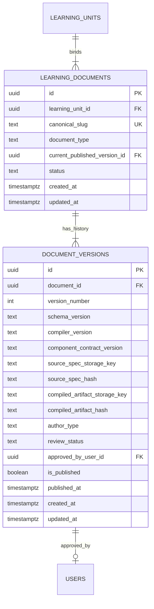
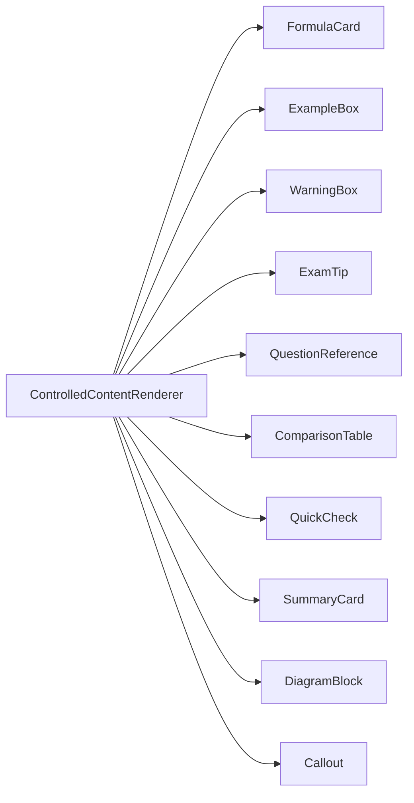

# COURAGE LIBRARY — LEARNING / COURSES SYSTEM
# PHASE 3C: CONTROLLED CONTENT COMPILATION & RENDERING PIPELINE
**Document Type**: Technical Implementation Specification & Forensic Audit Record  
**Operating Mode**: Production Implementation & System Certification  
**Status**: Authoritative Technical Foundation (Certified & Frozen)  

---

## 1. Executive Summary

Phase 3C establishes the **Controlled Content Compilation & Rendering Pipeline** for Courage Library.

Educational content on the platform is authored as strongly-typed JSON documents (`LessonDocumentSpec`), compiled through an AST-level security and component validation pipeline, and rendered exclusively using 10 approved Courage Library React components.

```
STRUCTURED CONTENT (LessonDocumentSpec JSON)
        ↓
SCHEMA & STRUCTURAL VALIDATION (ContentSpecValidator)
        ↓
REFERENTIAL INTEGRITY (Question Bank & Asset Catalog)
        ↓
DETERMINISTIC MDX COMPILATION (ControlledContentCompiler)
        ↓
AST SECURITY & ALLOWLIST SCANNING (MdxSecurityScanner)
        ↓
DETERMINISTIC HASHING (SHA-256)
        ↓
OBJECT STORAGE & IMMUTABLE VERSIONING (LearningDocumentService)
        ↓
CONTROLLED SERVER-SIDE RENDERING (ControlledContentRenderer)
```

### Core Invariants:
1. **MDX is Content, NOT Application Code**: Authors and AI models can never execute arbitrary JavaScript, import external modules, access the filesystem/environment, or make arbitrary network requests.
2. **Strict Component Allowlist**: Exactly 10 approved learning components are supported (`FormulaCard`, `ExampleBox`, `WarningBox`, `ExamTip`, `QuestionReference`, `ComparisonTable`, `QuickCheck`, `SummaryCard`, `DiagramBlock`, `Callout`).
3. **Question Bank Authoritative Lineage**: `QuestionReference` strictly embeds canonical `question_version_id`. AI or authors cannot fabricate, spoof, or duplicate question bodies.
4. **Structural Validity $
eq$ Academic Verification**: Schema validation proves syntactic and structural compliance only. Human review is required for academic correctness.
5. **Published Immutability**: Once `status = 'PUBLISHED'`, content versions are permanently immutable. Any update creates version $N+1$.

---

## 2. Database Foundation (Migration 55)

**Migration File**: `supabase/migrations/20260915000055_phase3c_content_compilation_and_versions.sql`

### 2.1 Entity Relationship Diagram


### 2.2 Relational Invariants
- `learning_documents.canonical_slug`: Unique slug per canonical document.
- `document_versions.uq_learning_document_version`: Unique constraint on `(document_id, version_number)`.
- `source_spec_hash` & `compiled_artifact_hash`: Check constraints enforcing 64-character lowercase hexadecimal regex (`^[a-f0-9]{64}$`).
- Zero content text columns (`content_body TEXT`) or binary media (`BYTEA`) in database tables.

---

## 3. Structured Content Specification (`LessonDocumentSpec`)

`LessonDocumentSpec` is the authoritative JSON authoring contract for all self-paced lessons.

```typescript
export interface LessonDocumentSpec {
  schemaVersion: "1.0.0";
  documentId: string;
  unitSlug: string;
  language: "en" | "hi" | "bn" | "te" | "ta";
  metadata: {
    title: string;
    topicId: string;
    subjectId: string;
    targetExamCategories: string[];
    estimatedReadingMinutes: number;
    difficultyTier: "BEGINNER" | "INTERMEDIATE" | "ADVANCED";
    authoritativeKeywords: string[];
  };
  learningObjectives: string[];
  prerequisites: Array<{
    topicId?: string;
    unitId?: string;
    conceptSummary: string;
  }>;
  sections: Array<{
    id: string;
    title: string;
    sectionType: "THEORY" | "VISUAL_EXPLANATION" | "DERIVATION" | "APPLICATION";
    contentMarkdown: string;
    diagramAssetId?: string;
    calloutNotes?: Array<{
      variant: "TIP" | "WARNING" | "INFO" | "MEMORY_HOOK";
      title: string;
      body: string;
    }>;
  }>;
  formulaBlocks: Array<{
    id: string;
    name: string;
    latexFormula: string;
    variableDefinitions: Array<{ symbol: string; meaning: string }>;
    applicableConditions: string[];
    speedShortcutTrick?: string;
  }>;
  workedExamples: Array<{
    id: string;
    difficulty: "EASY" | "MEDIUM" | "HARD";
    problemText: string;
    stepByStepSolution: Array<{ stepNumber: number; explanation: string; mathSnippet?: string }>;
    shortcutMethod?: string;
    commonMistakeToAvoid?: string;
  }>;
  cognitiveTraps: Array<{
    trapType: "CALCULATION_SLIP" | "MISREAD_KEYWORD" | "FORMULA_CONFUSION" | "DISTRACTOR_TRAP";
    misconception: string;
    correctApproach: string;
  }>;
  authenticPyqReferences: Array<{
    questionVersionId: string;
    relevanceRationale: string;
  }>;
  quickChecks: Array<{
    id: string;
    prompt: string;
    options: Array<{ id: string; text: string; isCorrect: boolean; feedbackExplanation: string }>;
  }>;
  revisionSummary: {
    keyTakeaways: string[];
    coreFormulas: string[];
    speedRules: string[];
  };
  seo: {
    metaTitle: string;
    metaDescription: string;
    focusKeywords: string[];
  };
}
```

---

## 4. AST-Level Security & Threat Model

The `MdxSecurityScanner` executes an exhaustive security inspection over generated or parsed content:

| Threat Vector | Defense Mechanism | Severity |
| :--- | :--- | :--- |
| **Arbitrary Code Execution** | Rejection of `import`, `export`, dynamic `import()`, and CommonJS `require()` | **FATAL** |
| **Process / Environment Snooping** | Detection and blocking of `process.env`, `process.exit`, `process.cwd` | **FATAL** |
| **Dynamic Execution** | Detection of `eval()`, `new Function()`, and JSX bracket expressions | **FATAL** |
| **Malicious HTML Injection** | Forbidden tag regex (`<script>`, `<iframe>`, `<style>`, `<embed>`, `<object>`, `<form>`) | **FATAL** |
| **Cross-Site Scripting (XSS)** | Detection of inline event handlers (`onload=`, `onclick=`, `onerror=`) | **FATAL** |
| **Malicious URL Schemes** | Scheme whitelist (`https:`, `http:`, `mailto:`); rejection of `javascript:`, `data:`, `file:`, `blob:` | **FATAL** |
| **Unapproved Components** | Allowlist enforcement (only 10 approved Phase 2 components permitted) | **ERROR** |

---

## 5. Approved Component Contracts & Architecture



### Component Semantics:
1. **`FormulaCard`**: LaTeX equation presentation with variable symbol definitions and speed shortcut tips.
2. **`ExampleBox`**: Tiered difficulty worked example with numbered explanation steps and alternative shortcuts.
3. **`WarningBox`**: Cognitive trap warning with misconception analysis and correct approach guidance.
4. **`ExamTip`**: High-yield exam advice categorized by Speed, Memory, Trap, or High-Yield tags.
5. **`QuestionReference`**: Authoritative question embed resolved from `question_version_id` with exam metadata and interactive answer reveal.
6. **`ComparisonTable`**: High-contrast tabular comparisons for distinguishing confusing concepts.
7. **`QuickCheck`**: Instant in-lesson multiple-choice concept check with immediate rationale feedback.
8. **`SummaryCard`**: High-yield pre-exam checklist containing key takeaways and core formulas.
9. **`DiagramBlock`**: Authorized media asset rendering via Phase 3B `learning_assets` catalog.
10. **`Callout`**: Highlighted pedagogical notes with Tip, Warning, Info, and Memory Hook variants.

---

## 6. Question Reference & Asset Reference Lineage

### 6.1 QuestionReference Lineage
```
LessonDocumentSpec.authenticPyqReferences[i].questionVersionId
                       │
                       ▼
         QuestionReferenceService.resolve()
                       │
                       ▼
       Question Bank: public.question_versions
        ├── question_text (Canonical)
        ├── question_options (Canonical)
        ├── question_answers (Canonical)
        └── exam_question_mappings (Exam, Year, Shift)
```
- **Integrity Rule**: Content authors and AI cannot supply their own question text or options. The Question Bank is the sole canonical source of truth.

### 6.2 DiagramBlock Asset Lineage
```
LessonDocumentSpec.sections[i].diagramAssetId
                       │
                       ▼
         AssetReferenceService.resolve()
                       │
                       ▼
    Phase 3B Asset Catalog: public.learning_assets
        ├── status == 'ACTIVE' (Verified)
        ├── access_class (Verified)
        ├── storage_key -> Signed CDN Reference
        └── width, height, aspect_ratio (Preserved)
```

---

## 7. Deterministic Hashing & Immutability

### 7.1 Determinism Invariant
Given the same `LessonDocumentSpec`, schema version, and compiler version:
- The compiled MDX artifact output is **100% byte-for-byte identical**.
- The resulting SHA-256 cryptographic digest is **100% identical**.
- Zero machine-dependent paths, environment variables, or runtime timestamps exist in compiled output.

### 7.2 Immutability Guard
```typescript
if (version.is_published === true || version.review_status === 'PUBLISHED') {
  throw new Error("Published version is immutable. Create version N+1.");
}
```

---

## 8. Verification & Forensic Audit Results

### 8.1 Phase 3C Dedicated Test Suite (`scripts/test_phase3c_content_compilation.cjs`)
- **Total Assertions**: 85
- **Passed**: 85 (100.0%)
- **Failed**: 0

```
--- Track 1: Migration 55 SQL Schema & Invariants (T01 - T10) ---      ✓ PASS (10/10)
--- Track 2: LessonDocumentSpec Runtime Validation (T11 - T20) ---     ✓ PASS (10/10)
--- Track 3: AST-Level Security & Malicious Payload Defense (T21 - T35) ✓ PASS (15/15)
--- Track 4: URL Security & Dangerous Scheme Defense (T36 - T41) ---   ✓ PASS (6/6)
--- Track 5: Question Reference Authority & Canonical Integrity (T42 - T47) ✓ PASS (6/6)
--- Track 6: Asset Reference Authority & Access Control (T48 - T53) --- ✓ PASS (6/6)
--- Track 7: Deterministic Compilation & Cryptographic Integrity (T54 - T60) ✓ PASS (7/7)
--- Track 8: Versioning & Published Immutability Invariants (T61 - T66) ✓ PASS (6/6)
--- Track 9: Approved Component Contracts & Rendering Pipeline (T67 - T70) ✓ PASS (4/4)
--- Track 10: Database Baseline Invariants & 14 Protected Tables (T71 - T85) ✓ PASS (15/15)
```

### 8.2 Full Platform Regression (`scripts/run_full_regression.cjs`)
- **Total Suites**: 36
- **Passed Suites**: 36 (100.0%)
- **Failed Suites**: 0
- **Total Time**: 110.6s

### 8.3 TypeScript & Production Build
- `npx tsc --noEmit`: **0 errors**
- `npm run build`: **PASS** (Compiled in 45s, 59/59 static/dynamic routes generated cleanly)

---

## 9. Protected Database Baseline Verification

All 14 baseline tables remain exactly preserved:

| Table Name | Baseline Rows | Post-Phase 3C Rows | Status |
| :--- | :---: | :---: | :---: |
| `mock_tests` | 8 | 8 | **100% Intact** |
| `mock_sections` | 14 | 14 | **100% Intact** |
| `mock_questions` | 350 | 350 | **100% Intact** |
| `mock_templates` | 8 | 8 | **100% Intact** |
| `test_attempts` | 31 | 31 | **100% Intact** |
| `test_results` | 10 | 10 | **100% Intact** |
| `attempt_answers` | 200 | 200 | **100% Intact** |
| `questions` | 103 | 103 | **100% Intact** |
| `question_versions` | 103 | 103 | **100% Intact** |
| `question_options` | 412 | 412 | **100% Intact** |
| `question_answers` | 103 | 103 | **100% Intact** |
| `subscription_plans` | 1 | 1 | **100% Intact** |
| `coin_wallets` | 5 | 5 | **100% Intact** |
| `coin_ledger` | 8 | 8 | **100% Intact** |

---

## 10. Future Contracts (Phase 3D, 3E, 3F, 3G)

1. **Phase 3D (Admin Content Studio)** *(FUTURE)*: Interactive UI for human editors to author `LessonDocumentSpec` and review draft versions.
2. **Phase 3E (AI Generation Pipeline)** *(FUTURE)*: LLM-driven structured JSON generator emitting `LessonDocumentSpec` behind the `ContentSpecValidator` and human review gate.
3. **Phase 3F (Candidate Learning Reader)** *(FUTURE)*: Candidate-facing course viewer integrating `ControlledContentRenderer`, progress tracking, and Mistake Vault personal revision links.
4. **Phase 3G (Translation & Localization)** *(FUTURE)*: English Master $
ightarrow$ Regional Language translation tree with automated stale state invalidation.

---

## 11. Certification Verdict

- [x] **Migration 55 Implemented & Verified**
- [x] **Zero Content Body in PostgreSQL Relational Database**
- [x] **Strict LessonDocumentSpec Runtime Validation Gate**
- [x] **AST-Level Security Scanner & Allowlist Active**
- [x] **Question Reference & Asset Reference Resolvers Active**
- [x] **Deterministic Compilation & Cryptographic SHA-256 Hashing Certified**
- [x] **Immutability Enforcement on Published Versions Certified**
- [x] **10 Approved React Learning Components Implemented**
- [x] **Controlled Content Server Renderer Implemented**
- [x] **85/85 Phase 3C Assertions Passed (100%)**
- [x] **36/36 Platform Regression Suites Passed (100%)**
- [x] **TypeScript 0 Errors & Clean Next.js Production Build**
- [x] **14/14 Protected Database Baseline Tables 100% Intact**

**PHASE 3C IS FULLY CERTIFIED AND FROZEN.**
