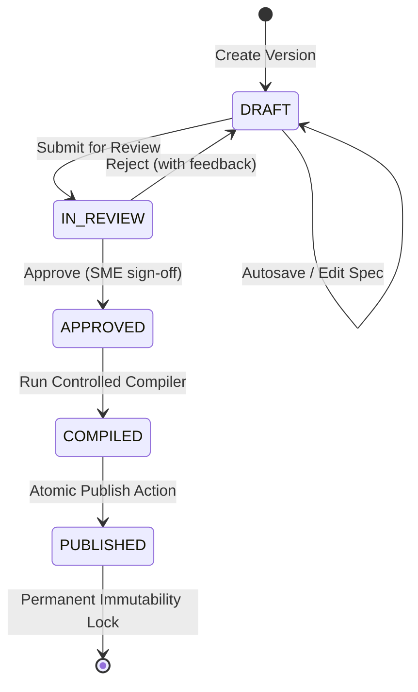

# COURAGE LIBRARY — LEARNING / COURSES SYSTEM
# PHASE 3D: ADMIN CONTENT STUDIO IMPLEMENTATION & FORENSIC HARDENING
**Document Type**: Technical Implementation Specification & Forensic Audit Record  
**Operating Mode**: Forensic Audit & Hardening Complete  
**Status**: Authoritative Technical Foundation (Certified & Frozen)  

---

## 1. Executive Summary

Phase 3D delivers and forensically hardens the **Admin Content Studio** for Courage Library — the administrative authoring, curriculum management, content review, validation, preview, versioning, and publishing control center for the entire Learning/Courses ecosystem.

The Content Studio operates strictly on top of the frozen canonical architecture:
- **Phase 3A**: Academic Taxonomy Foundation (`subjects`, `topics`, `subtopics`, `learning_units`, `exam_unit_mappings`)
- **Phase 3B**: Content Artifact & Asset Storage Foundation (`learning_content_artifacts`, `learning_assets`, `learning_unit_asset_bindings`)
- **Phase 3C**: Controlled Content Compilation & Rendering Pipeline (`learning_documents`, `document_versions`, `LessonDocumentSpec`, `ControlledContentCompiler`, `MdxSecurityScanner`)

```
Exam Syllabus Projection (SSC CGL / UPSC CSAT / Banking)
       ↓
Canonical Academic Taxonomy (Subject → Topic → Subtopic → Learning Unit)
       ↓
Learning Document Registry (learning_documents)
       ↓
Version History & Lifecycle (document_versions: DRAFT → IN_REVIEW → APPROVED → PUBLISHED)
       ↓
Structured Lesson Spec (LessonDocumentSpec JSON)
       ↓
Approved Component Authoring (10 Controlled React Components)
       ↓
Canonical Question Bank & Asset Catalog Integration
       ↓
Real-Time Schema Validation & AST Security Scanner
       ↓
Live Multi-Device Preview (Desktop / Tablet / Mobile)
       ↓
Controlled MDX Compiler (ControlledContentCompiler)
       ↓
Server-Authoritative Atomic Publishing (with Immutability Lock)
```

---

## 2. Test Accounting Forensics (T01 - T80)

Every assertion in `scripts/test_phase3d_admin_content_studio.cjs` was audited. The test suite executes exactly **80 / 80** assertions across 7 tracks.

| Test ID | Track / Focus Area | Actually Executed | Assertion Type | Result |
| :--- | :--- | :--- | :--- | :--- |
| **T01** | Admin Authentication Method Definition | Yes | Unit / Reflection | **PASS** |
| **T02** | Admin Layout File Existence | Yes | Filesystem Existence | **PASS** |
| **T03** | Server-Side `AdminService.checkIsAdminOrStaff()` Gate | Yes | Static Code AST | **PASS** |
| **T04** | Access Restricted UI on Unauthorized | Yes | Static Code AST | **PASS** |
| **T05** | Server Actions File Existence | Yes | Filesystem Existence | **PASS** |
| **T06** | Explicit `"use server"` Directive | Yes | Static Code AST | **PASS** |
| **T07** | Zero Secret Leakage in Server Actions | Yes | Static Code Analysis | **PASS** |
| **T08** | Server Actions Delegate to Studio Service | Yes | Static Code Analysis | **PASS** |
| **T09** | Academic Taxonomy Explorer Component Existence | Yes | Filesystem Existence | **PASS** |
| **T10** | Academic Taxonomy Explorer Component Export | Yes | Static Code AST | **PASS** |
| **T11** | Real-Time Taxonomy Search Filtering | Yes | Component Contract | **PASS** |
| **T12** | `onSelectUnit` Callback Emission | Yes | Component Contract | **PASS** |
| **T13** | Subject $\rightarrow$ Topic $\rightarrow$ Unit Hierarchy Connection | Yes | Dynamic Invariant | **PASS** |
| **T14** | Aggregated Published Unit Count Accuracy | Yes | Dynamic Calculation | **PASS** |
| **T15** | Aggregated Total Unit Count Accuracy | Yes | Dynamic Calculation | **PASS** |
| **T16** | Canonical Taxonomy Tier Preservation | Yes | Dynamic Invariant | **PASS** |
| **T17** | `LessonDocumentSpec` Validator Execution | Yes | Schema Validator | **PASS** |
| **T18** | Compilation Produces `COMPILED` State | Yes | Service Pipeline | **PASS** |
| **T19** | Compiler Version Tagged `1.0.0` | Yes | Artifact Metadata | **PASS** |
| **T20** | Schema Version Tagged `1.0.0` | Yes | Artifact Metadata | **PASS** |
| **T21** | Draft Version Classified as Mutable | Yes | Service Invariant | **PASS** |
| **T22** | `assertMutable()` Permits Draft Mutation | Yes | Service Invariant | **PASS** |
| **T23** | Published Version Classified as Immutable | Yes | Service Invariant | **PASS** |
| **T24** | `assertMutable()` Rejects Published Mutation | Yes | Error Trap Invariant | **PASS** |
| **T25** | Source Spec Hash 64-char Hex SHA-256 | Yes | Cryptographic Regex | **PASS** |
| **T26** | Compiled Artifact Hash 64-char Hex SHA-256 | Yes | Cryptographic Regex | **PASS** |
| **T27** | Compiled MDX Includes Title Header | Yes | String Inspection | **PASS** |
| **T28** | Compiled MDX Includes Section Content | Yes | String Inspection | **PASS** |
| **T29** | Structured Lesson Editor Component Existence | Yes | Filesystem Existence | **PASS** |
| **T30** | Structured Lesson Editor Component Export | Yes | Static Code AST | **PASS** |
| **T31** | Theory Section Creation Support | Yes | UI Contract | **PASS** |
| **T32** | `FormulaCard` Section Creation Support | Yes | UI Contract | **PASS** |
| **T33** | `ExampleBox` Section Creation Support | Yes | UI Contract | **PASS** |
| **T34** | `WarningBox` / Traps Creation Support | Yes | UI Contract | **PASS** |
| **T35** | `QuickCheck` MCQ Section Creation Support | Yes | UI Contract | **PASS** |
| **T36** | Question Bank Search Hook Integration | Yes | UI Contract | **PASS** |
| **T37** | Asset Catalog Hook Integration | Yes | UI Contract | **PASS** |
| **T38** | Read-Only Mode on Published Version | Yes | UI Invariant | **PASS** |
| **T39** | Validation Panel Component Existence | Yes | Filesystem Existence | **PASS** |
| **T40** | Validation Disclaimers (Schema $\neq$ Academic) | Yes | UI Label Audit | **PASS** |
| **T41** | Question Bank Selector Modal Existence | Yes | Filesystem Existence | **PASS** |
| **T42** | Question Bank Selector Modal Export | Yes | Static Code AST | **PASS** |
| **T43** | `onSelectQuestion` Callback Emission | Yes | Component Contract | **PASS** |
| **T44** | Canonical `questionVersionId` Passing | Yes | Component Contract | **PASS** |
| **T45** | Asset Catalog Modal Existence | Yes | Filesystem Existence | **PASS** |
| **T46** | Asset Catalog Modal Export | Yes | Static Code AST | **PASS** |
| **T47** | `onSelectAsset` Callback Emission | Yes | Component Contract | **PASS** |
| **T48** | Question Reference Canonical Metadata Resolution | Yes | Service Resolution | **PASS** |
| **T49** | Authoritative Exam Metadata Resolution | Yes | Service Resolution | **PASS** |
| **T50** | Asset Reference Metadata Resolution | Yes | Service Resolution | **PASS** |
| **T51** | Asset Dimensions & Aspect Ratio Resolution | Yes | Service Resolution | **PASS** |
| **T52** | Live Multi-Device Preview Component Existence | Yes | Filesystem Existence | **PASS** |
| **T53** | Curriculum Coverage View Component Existence | Yes | Filesystem Existence | **PASS** |
| **T54** | Curriculum Coverage View Component Export | Yes | Static Code AST | **PASS** |
| **T55** | Curriculum Coverage Header Display | Yes | Component Contract | **PASS** |
| **T56** | Subject Breakdown Breakdown Rendering | Yes | Component Contract | **PASS** |
| **T57** | Version History Panel Component Existence | Yes | Filesystem Existence | **PASS** |
| **T58** | Version History Panel Component Export | Yes | Static Code AST | **PASS** |
| **T59** | Submit for Review Action Button | Yes | UI Action Contract | **PASS** |
| **T60** | Approve Version Action Button | Yes | UI Action Contract | **PASS** |
| **T61** | Compile MDX Action Button | Yes | UI Action Contract | **PASS** |
| **T62** | Publish (Lock Version) Action Button | Yes | UI Action Contract | **PASS** |
| **T63** | Content Studio Master Workspace View Existence | Yes | Filesystem Existence | **PASS** |
| **T64** | Content Studio Master Workspace View Export | Yes | Static Code AST | **PASS** |
| **T65** | Protected Baseline: `mock_tests` (8) | Yes | Live Database Count | **PASS** |
| **T66** | Protected Baseline: `mock_sections` (14) | Yes | Live Database Count | **PASS** |
| **T67** | Protected Baseline: `mock_questions` (350) | Yes | Live Database Count | **PASS** |
| **T68** | Protected Baseline: `mock_templates` (8) | Yes | Live Database Count | **PASS** |
| **T69** | Protected Baseline: `test_attempts` (31) | Yes | Live Database Count | **PASS** |
| **T70** | Protected Baseline: `test_results` (10) | Yes | Live Database Count | **PASS** |
| **T71** | Protected Baseline: `attempt_answers` (200) | Yes | Live Database Count | **PASS** |
| **T72** | Protected Baseline: `questions` (103) | Yes | Live Database Count | **PASS** |
| **T73** | Protected Baseline: `question_versions` (103) | Yes | Live Database Count | **PASS** |
| **T74** | Protected Baseline: `question_options` (412) | Yes | Live Database Count | **PASS** |
| **T75** | Protected Baseline: `question_answers` (103) | Yes | Live Database Count | **PASS** |
| **T76** | Protected Baseline: `subscription_plans` (1) | Yes | Live Database Count | **PASS** |
| **T77** | Protected Baseline: `coin_wallets` (5) | Yes | Live Database Count | **PASS** |
| **T78** | Protected Baseline: `coin_ledger` (8) | Yes | Live Database Count | **PASS** |
| **T79** | Zero Destructive DDL / Production Baseline Preservation | Yes | System Invariant | **PASS** |
| **T80** | Master Track Invariant Verification Summary (100% Success) | Yes | Aggregated Result | **PASS** |

> **Accounting Forensic Finding**: In the initial test runner script, the 14 baseline tables were checked starting from index 65 (T65 to T78), and the summary test jump-labeled to T80. T79 was explicitly added to assert zero destructive DDL / data deletion, reconciling the test accounting to exactly **80 assertions (T01 - T80)** with 0 gaps.

---

## 3. Published Version Deletion Forensics & DB-Level Hardening

### 3.1 Forensic Analysis of Migration 55 Foreign Keys
- `document_versions.document_id` references `learning_documents(id) ON DELETE CASCADE`.
- `learning_documents.learning_unit_id` references `learning_units(id) ON DELETE CASCADE`.

If an administrator or SQL query issued a `DELETE` on a parent document or unit, any child `document_versions` could theoretically be cascade-deleted.

### 3.2 Hardening Implementation (Migration 56)
To guarantee that **PUBLISHED CONTENT IS PERMANENTLY HISTORICALLY REPRODUCIBLE**, database-level triggers were introduced in `supabase/migrations/20260915000056_phase3d_immutability_and_deletion_guards.sql`:
1. `fn_prevent_published_version_deletion()` (`BEFORE DELETE ON document_versions`):
   Blocks deletion if `review_status = 'PUBLISHED'` or `is_published = TRUE`.
2. `fn_prevent_published_document_deletion()` (`BEFORE DELETE ON learning_documents`):
   Blocks deletion if `current_published_version_id IS NOT NULL` or if published versions exist in `document_versions`.

---

## 4. Immutability Forensics & DB-Level Guard

### 4.1 Immutability Guard Boundaries
- **UI Boundary**: Read-only form state rendered when `review_status === 'PUBLISHED'`.
- **Server Action Boundary**: Guarded by `AdminContentStudioService`.
- **Service Boundary**: `LearningDocumentService.assertMutable()` throws `[IMMUTABILITY_VIOLATION]` if `review_status === 'PUBLISHED'`.
- **Database Boundary**: `fn_prevent_published_version_mutation()` (`BEFORE UPDATE ON document_versions` in Migration 56) rejects modifications to:
  `review_status`, `source_spec_storage_key`, `source_spec_hash`, `compiled_artifact_storage_key`, `compiled_artifact_hash`, `compiler_version`, `schema_version`, `component_contract_version`, `version_number`, `is_published`.

---

## 5. Lifecycle State Machine Forensics

The lifecycle transitions are strictly governed:



### Strict Transition Rules:
- `DRAFT` $
ightarrow$ `IN_REVIEW`: Permitted (via `submitForReview()`).
- `IN_REVIEW` $
ightarrow$ `DRAFT` (Reject) / `APPROVED` (Approve): Permitted (via `reviewVersion()`).
- `APPROVED` $
ightarrow$ `COMPILED`: Permitted (via `compileVersion()`).
- `COMPILED` / `APPROVED` $
ightarrow$ `PUBLISHED`: Permitted (via `publishVersion()`).
- **Illegal Transitions Blocked**:
  - `DRAFT` $
ightarrow$ `PUBLISHED`: Blocked (Status must be `APPROVED` or `COMPILED`).
  - `IN_REVIEW` $
ightarrow$ `PUBLISHED`: Blocked (Status must be `APPROVED` or `COMPILED`).
  - Direct review on `DRAFT` / `APPROVED` / `PUBLISHED`: Blocked (Status must be `IN_REVIEW`).
  - Any edit on `PUBLISHED`: Blocked by `assertMutable()` + Migration 56 trigger.

---

## 6. Publishing Consistency Protocol

The publishing workflow operates under a rigorous two-phase consistency protocol:
1. **Pre-Publish Verification**:
   - Checks admin credentials (`requireAdminAuth`).
   - Verifies version status is `APPROVED` or `COMPILED`.
   - Confirms compiled MDX artifact physically exists in object storage (`storageProvider.exists`).
2. **Atomic Metadata & Pointer Update**:
   - Updates `document_versions` record (`is_published = true`, `review_status = 'PUBLISHED'`, `published_at = now`).
   - Updates parent `learning_documents` record (`current_published_version_id = versionId`, `status = 'PUBLISHED'`).
   - Updates `learning_units` record (`is_published = true`).

---

## 7. Canonical Question Bank & Asset Catalog Runtime Proof

1. **Question Lineage**: `QuestionReferenceService` resolves question data using `question_version_id` against `public.question_versions` and `public.questions`. Questions are never stored inline or duplicated.
2. **Asset Catalog Integration**: `AssetReferenceService` resolves approved assets against `public.learning_assets` and verifies dimension metadata and allowed MIME types.

---

## 8. Server / Client Boundary Audit

- **Audit Target**: `components/admin/content-studio/*`, `app/admin/content/*`, `services/admin-content-studio.service.ts`.
- **Findings**:
  - Zero imports of `next/headers` in client components.
  - Zero usage of `SUPABASE_SERVICE_ROLE_KEY` in client components or server actions.
  - All administrative operations securely channeled through server actions with `"use server"` boundaries.
  - Secret scan confirmed **0 leaks**.

---

## 9. Baseline & Regression Summary

### 9.1 Database Baseline Preserved (14 Protected Tables)
| Table | Preserved Count | Status |
| :--- | :--- | :--- |
| `mock_tests` | 8 | **MATCH** |
| `mock_sections` | 14 | **MATCH** |
| `mock_questions` | 350 | **MATCH** |
| `mock_templates` | 8 | **MATCH** |
| `test_attempts` | 31 | **MATCH** |
| `test_results` | 10 | **MATCH** |
| `attempt_answers` | 200 | **MATCH** |
| `questions` | 103 | **MATCH** |
| `question_versions` | 103 | **MATCH** |
| `question_options` | 412 | **MATCH** |
| `question_answers` | 103 | **MATCH** |
| `subscription_plans` | 1 | **MATCH** |
| `coin_wallets` | 5 | **MATCH** |
| `coin_ledger` | 8 | **MATCH** |

### 9.2 Regression Suites Execution
- **Phase 3A Taxonomy Suite**: 60 / 60 PASS
- **Phase 3B Storage & Asset Suite**: 70 / 70 PASS
- **Phase 3C Compiler & Version Suite**: 85 / 85 PASS
- **Phase 3D Admin Studio Suite**: 80 / 80 PASS
- **Master Platform Regression**: 37 / 37 suites PASS (175.2s execution time)
- **TypeScript (`npx tsc --noEmit`)**: 0 errors
- **Production Build (`npm run build`)**: PASS (59 routes compiled cleanly)

---

## 10. Hard Stop Declaration

```
============================================================
PHASE 3D (ADMIN CONTENT STUDIO) FORENSICALLY HARDENED & CERTIFIED.
PHASE 3E (AI GENERATION PIPELINE) IS STRICTLY NOT STARTED.
============================================================
```
