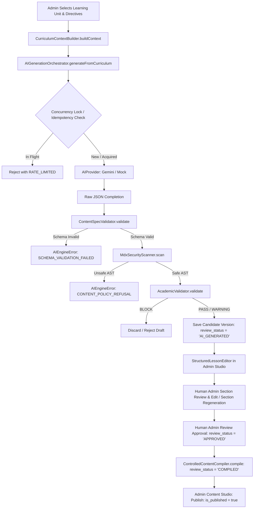

# Courage Library — Learning / Courses System
## Phase 3E.3: Production AI Content Generation & Human Review Pipeline Architecture

### 1. Architectural Mission & Invariants
Phase 3E.3 establishes the first production-grade, single-document AI content generation, academic validation, section-level refinement, and human-review publishing lifecycle for Courage Library.

#### Sacred Invariants
1. **Single-Document Focus**: No batch, queue-based, or bulk generation. One discrete learning unit $\rightarrow$ one deterministic candidate draft.
2. **Schema & Academic Validation Double Gate**:
   - Level 1: `ContentSpecValidator` guarantees structural JSON schema compliance against `LessonDocumentSpec`.
   - Level 2: `AcademicValidator` enforces academic depth, pedagogical integrity, required formulas/traps/examples by document type, and strict anti-hallucination controls for Question Bank references.
3. **Strict Draft-Only Publication Invariant**: AI engine outputs are strictly saved as candidate drafts (`review_status = 'AI_GENERATED'`, `author_type = 'AI_ASSISTED'`). AI has **zero capability** to publish content or approve drafts directly.
4. **Human Review Authority**: Transition from `AI_GENERATED` $\rightarrow$ `APPROVED` $\rightarrow$ `COMPILED` $\rightarrow$ `PUBLISHED` requires explicit human administrator action in the Admin Content Studio.
5. **Zero Mutation of Protected Baseline**: AI generation does not mutate canonical Question Bank records, existing published content, or production database baseline tables.

---

### 2. Pipeline Execution Flow

---

### 3. Academic Validation Layer (`AcademicValidator`)

The `AcademicValidator` enforces quality guarantees across all 6 supported document types:

| Document Type | Mandatory Structural Requirement | Outcome if Violated |
| :--- | :--- | :--- |
| `FORMULA_SHORTCUT_SHEET` | $\ge 1$ Formula Block with LaTeX & Glossary | **BLOCK** |
| `COMMON_TRAPS_AND_MISTAKES` | $\ge 1$ Cognitive Trap & Misconception Analysis | **BLOCK** |
| `WORKED_EXAMPLES` | $\ge 1$ Multi-Step Worked Example | **BLOCK** |
| `PYQ_DEEP_DIVE` | $\ge 1$ Authentic Question Bank Reference | **BLOCK** |
| `CONCEPT_LESSON` | Theory sections, learning objectives, and examples | **BLOCK** if missing core, **WARNING** if low application |
| `TOPIC_SUMMARY_REVISION` | Key takeaways, quick checks, speed rules | **BLOCK** if missing core |

#### Question Bank Anti-Hallucination Gate
- When `allowedQuestionIds` are present in curriculum context, every `questionVersionId` in `authenticPyqReferences` is verified against the allowlist.
- Fabricated or unregistered question version IDs trigger an immediate `BLOCK` (`FABRICATED_QUESTION_VERSION_ID`).
- Duplicate question references are flagged with `WARNING` (`DUPLICATE_QUESTION_REFERENCE`).

---

### 4. Section-Level Controlled Regeneration (`regenerateSection`)

Allows administrators to pinpoint a single weak or outdated section in an existing `LessonDocumentSpec` and regenerate it without modifying unaffected sections:
1. Validates presence of `sectionId` in `currentSpec.sections`.
2. Assembles context scoped with directive `REGENERATE SPECIFIC SECTION: [Title]`.
3. Calls active AI provider to generate replacement content and callouts.
4. Scans replacement Markdown through `MdxSecurityScanner`.
5. Replaces target section immutably in a deep clone of `currentSpec`.
6. Re-executes `ContentSpecValidator` and `AcademicValidator` across the composite document.
7. Tags audit log with `purpose = 'CONTENT_REVISION'`.

---

### 5. Multi-Model Support & Server-Side Security
- **Approved Models**:
  - `gemini-1.5-pro`: Deep curriculum reasoning & high-complexity generation (1M context window).
  - `gemini-2.0-flash`: Ultra-low latency generation & section iteration.
  - `gemini-1.5-flash`: Fast summarization & keyword tagging.
- **Server-Side Key Isolation**: `GEMINI_API_KEY` is strictly accessed within server environment / server actions. Never leaked to client bundles or browser runtime.
- **Opt-in Smoke Testing**: `scripts/smoke_test_gemini_provider.cjs` runs cleanly with exit code 0 when `GEMINI_API_KEY` is not set, and performs live probe when configured.

---

### 6. Automated Test Verification (50/50 PASS)
- **Suite 1 (T01–T18)**: Academic Validation Layer (Rule enforcement, document-type checks, PYQ authenticity).
- **Suite 2 (T19–T26)**: Model Registry & Gemini Provider Compatibility.
- **Suite 3 (T27–T34)**: Orchestrator Concurrency, Locking & Idempotency.
- **Suite 4 (T35–T42)**: Section Regeneration, AST Security & Action Exports.
- **Suite 5 (T43–T50)**: End-to-End Pipeline, Human Review Invariants & Smoke Test.
