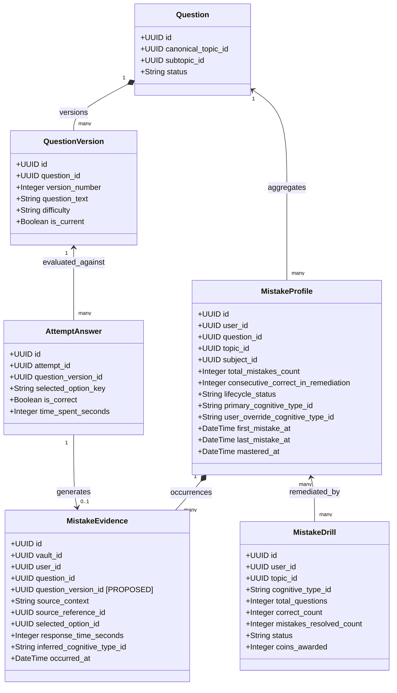
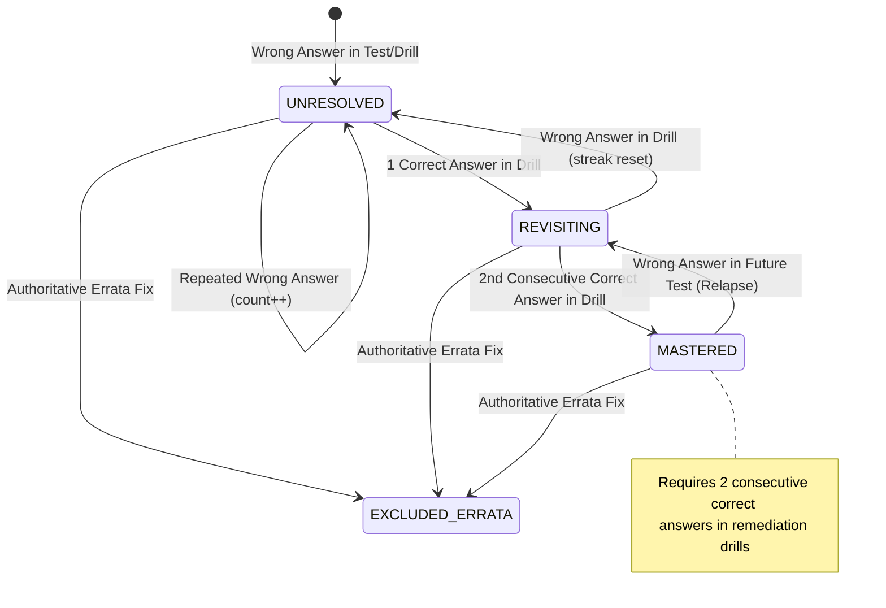
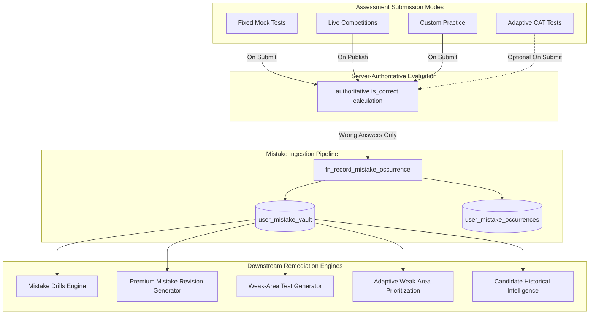

# COURAGE LIBRARY — MISTAKE VAULT SUBSYSTEM
## Production Architecture, Existing System Audit & Personal Revision Engine Specification

> **DOCUMENT CLASSIFICATION:** Candidate Personal Revision Engine & Pedagogical Intelligence  
> **CURRENT LIFECYCLE STATE:** Phase 1 Architecture & Audit Gate (Documentation Only — Zero Code Mutations)  
> **TARGET SUBSYSTEM:** Mistake Vault (`public.user_mistake_vault`, `public.user_mistake_occurrences`, `public.user_mistake_drills`, `public.mistake_cognitive_types`)  
> **ECOSYSTEM INTEGRATIONS:** Assessment Engine, Live Competitions, Question Versioning, Question Errata, Premium Test Generator, Adaptive IRT/CAT Engine, Candidate Historical Intelligence, CL Coin Gamification.

---

## 1. Executive Summary

The **Mistake Vault** is Courage Library’s personal revision engine and pedagogical remediation subsystem. Its primary mission is to transform candidate errors across all assessment modes (Fixed Mocks, Live Competitions, Custom Practice, Diagnostic Tests, Adaptive Sessions) into structured, actionable learning opportunities.

In high-stakes competitive examinations, the number-one reason candidates fail to improve their percentile is **repeated errors**: mistakes made during test sessions are reviewed once in a brief solution window, forgotten within 7 days, and repeated in subsequent tests. The Mistake Vault solves this by:

1. **Capturing every authoritative mistake** at the exact moment of test/drill submission.
2. **Classifying the cognitive error mode** (Conceptual Gap, Calculation Slip, Keyword Slip, Time Panic, Formula Confusion, Distractor Trap, Unclassified).
3. **Maintaining an immutable ledger of mistake occurrences** linked to exact question versions and test attempt contexts.
4. **Providing active remediation workflows** through intelligent, bite-sized **Mistake Drills**, weak-topic revision queues, and personalized tests.
5. **Enforcing progressive mastery**: A mistake is never silently deleted; it transitions from `UNRESOLVED` → `REVISITING` → `MASTERED` only after demonstrated, repeated corrective performance.
6. **Preserving strict historical reproducibility and errata awareness**: When question keys are authoritatively updated or attempts voided, candidate learning records reflect version lineage without corrupting past attempt snapshots.

---

## 2. Existing System Audit

A thorough audit of the Courage Library repository and database schema revealed that significant Phase 3O and Phase 3G mistake infrastructure already exists in production:

### 2.1 Discovered Database Tables & Migrations

| Table Name | Migration File | Primary Key & Core Constraints | Current Status & Purpose |
| :--- | :--- | :--- | :--- |
| `public.mistake_cognitive_types` | `20260825000030_phase3o_mistake_vault.sql` | `id TEXT PRIMARY KEY` | **Active**: 7 seeded cognitive error categories (`CONCEPTUAL_GAP`, `CALCULATION_SLIP`, `MISREAD_QUESTION`, `TIME_PANIC`, `FORMULA_CONFUSION`, `DISTRACTOR_TRAP`, `UNCLASSIFIED`) with remediation guidance. |
| `public.user_mistake_vault` | `20260825000030_phase3o_mistake_vault.sql` | `id UUID PRIMARY KEY`, `UNIQUE(user_id, question_id)` | **Active**: Aggregated per-candidate, per-question mistake profile tracking `total_mistakes_count`, `consecutive_correct_in_remediation`, `lifecycle_status`, cognitive types, notes, and mastery timestamps. |
| `public.user_mistake_occurrences` | `20260825000030_phase3o_mistake_vault.sql` | `id UUID PRIMARY KEY`, `vault_id REFERENCES user_mistake_vault(id)` | **Active**: Immutable ledger of individual wrong answer events with `source_context`, `source_reference_id`, `selected_option_id`, `response_time_seconds`, and confidence. |
| `public.user_mistake_drills` | `20260825000030_phase3o_mistake_vault.sql` | `id UUID PRIMARY KEY`, `user_id REFERENCES auth.users(id)` | **Active**: Drill practice sessions capturing `questions_data (JSONB)`, `status` (`IN_PROGRESS`, `COMPLETED`, `ABANDONED`), `mistakes_resolved_count`, and gamification coins awarded. |
| `public.user_question_bookmarks` | `20260824000011_phase3g_revision_vault.sql` | `id UUID PRIMARY KEY`, `UNIQUE(user_id, question_id)` | **Active**: Manual candidate bookmarks storing dual keys (`question_id` + `question_version_id`). |
| `public.question_errata_reports` | `20260824000011_phase3g_revision_vault.sql` | `id UUID PRIMARY KEY`, `reporter_user_id` | **Active**: Errata reporting and bounty ticketing system linking candidate feedback to `question_version_id`. |
| `public.custom_practice_sessions` | `20260824000011_phase3g_revision_vault.sql` | `id UUID PRIMARY KEY` | **Active**: Practice mode supporting session modes (`BOOKMARKED`, `WRONG_QUESTIONS`, `WEAK_TOPICS`, `PYQ`). |

### 2.2 Discovered Services & Runtime Functions

| Service / RPC | File Location | Responsibilities |
| :--- | :--- | :--- |
| `MistakeService` | `services/mistake.service.ts` | Complete TypeScript service providing `getMistakeVaultSummary`, `getMistakesList`, `getMistakeDetail`, `updateMistakeOverride`, `generateMistakeDrill`, `submitMistakeDrill`, `recordExamMistakes`. |
| `fn_record_mistake_occurrence` | `20260825000030_phase3o_mistake_vault.sql` | `SECURITY DEFINER` RPC executing atomic upsert into `user_mistake_vault` and appending to `user_mistake_occurrences`. |
| `fn_generate_mistake_drill` | `20260825000030_phase3o_mistake_vault.sql` | `SECURITY DEFINER` RPC selecting unmastered vault questions by topic/cognitive type and compiling sanitized question payloads without revealing answer keys. |
| `fn_submit_mistake_drill` | `20260825000030_phase3o_mistake_vault.sql` | `SECURITY DEFINER` RPC evaluating drill answers, updating consecutive correct streaks, graduating to `MASTERED`, awarding CL Coins (5 coins, max 3/day), and logging learning activity. |
| `fn_override_mistake_cognitive_type` | `20260825000030_phase3o_mistake_vault.sql` | `SECURITY DEFINER` RPC allowing candidate self-override of mistake cognitive classification. |

### 2.3 Discovered UI Routes

| Route | File Location | Capabilities |
| :--- | :--- | :--- |
| `/mistakes` | `app/mistakes/page.tsx` | Main candidate notebook dashboard displaying metrics (Total, Unresolved, Revisiting, Mastered), cognitive error distribution, weak topics list, status filters, and mistake cards with drill launch action. |
| `/mistakes/[id]` | `app/mistakes/[id]/page.tsx` | Detailed individual mistake inspection page showing question text, options, candidate chosen option, correct option, detailed markdown explanation, remediation guidance, notes editor, and occurrence history. |
| `/mistakes/drill` | `app/mistakes/drill/page.tsx`, `drill-client.tsx` | Interactive drill player with question navigation, timer, option selection, instantaneous server-side submission, score summary, and coin rewards. |

---

## 3. Current Source-of-Truth & Behavioral Answers

| Audit Dimension | Current Implementation Behavior |
| :--- | :--- |
| **1. When is a mistake created?** | At test completion / submission (`AssessmentService.submitTestAttempt`, `LiveTestResultService.syncMistakesAndRewards`, or `fn_submit_mistake_drill`). |
| **2. Which event creates it?** | Authoritative scoring evaluation of candidate responses where `selected_option_key IS NOT NULL` AND `is_correct = false`. |
| **3. Which table stores it?** | `public.user_mistake_vault` (aggregate question profile) and `public.user_mistake_occurrences` (immutable occurrence ledger). |
| **4. Which question identifier is stored?** | `question_id UUID REFERENCES public.questions(id)`. |
| **5. Is `question_version_id` stored?** | **CURRENT GAP**: In `user_mistake_vault` and `user_mistake_occurrences`, only `question_id` is stored. `question_version_id` is currently NOT stored in the mistake occurrences ledger. |
| **6. Is attempt ID stored?** | Yes, in `user_mistake_occurrences.source_reference_id`. |
| **7. Is attempt_answer ID stored?** | No, `selected_option_id` is stored, but the individual `attempt_answers.id` is not directly referenced. |
| **8. Is source/test type stored?** | Yes, in `user_mistake_occurrences.source_context` (`'MOCK_TEST'`, `'MISTAKE_DRILL'`, `'CUSTOM_PRACTICE'`, etc.). |
| **9. Are topic and subject stored?** | Yes, `topic_id` and `subject_id` in `user_mistake_vault`. |
| **10. Is exam stored?** | Inferred dynamically via `questions.canonical_topic_id` → `exam_topics` or `source_reference_id` → `test_attempts` → `mock_tests.exam_id`. |
| **11. Is mistake history preserved?** | Yes, every wrong attempt appends an immutable row to `user_mistake_occurrences`. |
| **12. Are duplicate mistakes possible?** | Duplicate aggregate rows are prevented by `uq_user_question_mistake UNIQUE (user_id, question_id)`. Multiple wrong attempts increment `total_mistakes_count` and insert new occurrence evidence. |
| **13. Do repeated wrong answers update or add evidence?** | Both: Updates vault aggregate (`total_mistakes_count + 1`, `consecutive_correct = 0`, `last_mistake_at = now()`) and inserts a new row in `user_mistake_occurrences`. |
| **14. Do corrected answers delete mistakes?** | No. Correct answers increment `consecutive_correct_in_remediation`. When streak reaches 2, status transitions to `MASTERED`. History is preserved forever. |
| **15. Can errata affect a mistake?** | **CURRENT GAP**: No automated hook currently updates or excludes mistake records when an errata report results in an answer key fix. |
| **16. Do voided attempts affect mistakes?** | **CURRENT GAP**: Voiding an attempt does not currently mark associated mistake occurrences as revoked. |
| **17. Do adaptive responses enter the vault?** | Adaptive engine queries the vault to boost weak items, but does not currently call `MistakeService.recordExamMistakes` during step-by-step CAT progression. |
| **18. Do live competition responses enter?** | Yes, `LiveTestResultService.syncMistakesAndRewards` passes all wrong answers to `MistakeService.recordExamMistakes`. |
| **19. Do practice questions enter?** | Schema supports `'CUSTOM_PRACTICE'` in `source_context`. |
| **20. Are unanswered questions considered mistakes?** | **No**. Unanswered items (`selected_option_key IS NULL`) are explicitly excluded from mistake recording. |

---

## 4. Critical Domain Model & Concept Hierarchy



---

## 5. Mistake Semantics & Candidate States

### 5.1 What Counts as a Mistake?

| Candidate Action / Question State | Evaluated Result | Creates Mistake Evidence? | Rationale |
| :--- | :--- | :--- | :--- |
| **Incorrect Answer Selected** | `is_answered = true`, `is_correct = false` | **YES** | Demonstrates candidate misunderstanding, calculation error, or trap susceptibility. |
| **Unanswered / Skipped** | `is_answered = false` | **NO** | Pacing or omission; not an authoritative incorrect belief. Handled by pacing & coverage analytics, not Mistake Vault. |
| **Marked for Review & Answered Incorrectly** | `is_answered = true`, `is_correct = false` | **YES** | The evaluated response was incorrect. |
| **Marked for Review & Unanswered** | `is_answered = false` | **NO** | No incorrect selection was committed. |
| **Question Reported with Errata** | Status: `VERIFIED` / Answer Key Fixed | **EXCLUDED / REVOKED** | Candidate was penalized due to author error, not candidate knowledge deficit. |
| **Voided / Cancelled Question** | Status: `VOIDED` | **EXCLUDED** | Question excluded from authoritative scoring. |

---

## 6. Question Version Lineage & Immutability

### 6.1 The Versioning Problem
Suppose Question $Q_{101}$ Version 1 has correct answer `B`. A candidate chooses `C`, resulting in a recorded mistake. Later, an admin review reveals that `C` was actually correct, and publishes Version 2 with correct answer `C`.

If the Mistake Vault only references `question_id`, the system would falsely present Version 2 to the candidate with the message "You chose C, correct is C" — confusing the candidate and corrupting pedagogical integrity.

### 6.2 Architectural Solution
1. **Occurrences Ledger MUST Store `question_version_id`**: Every row in `user_mistake_occurrences` must reference the exact `question_version_id` active at the moment of the attempt.
2. **Current Content Projection**: When displaying a mistake in `/mistakes/[id]`, the UI displays the question version where the mistake occurred, alongside a badge if a newer version exists (`"Version 1 (Archived)"` vs `"Current Version 2"`).
3. **Drill Generation Uses Current Version**: When a candidate launches a Mistake Drill, the generator fetches `question_versions WHERE is_current = true` for the unmastered `question_id`.

---

## 7. Errata, Void & Disqualification Handling

```
+----------------------------------------------------------------------------------------------------+
|                                    ERRATA RESOLUTION WORKFLOW                                      |
+----------------------------------------------------------------------------------------------------+
                                                  |
                                                  v
[ CANDIDATE / STAFF ERRATA REPORT ]
Student submits report on Question Qv1: "Key is incorrect, should be B instead of A."
                                                  |
                                                  v
[ ADMIN VERIFICATION & FIX ]
Admin verifies error -> Publishes Qv2 with correct key B -> Marks errata report 'VERIFIED'.
                                                  |
                                                  v
[ AUTOMATED MISTAKE VAULT AUDIT TRIGGER (PROPOSED) ]
System identifies all mistake occurrences for Qv1 where candidate chose B:
* Transitions occurrence status to 'REVOKED_AUTHOR_ERRATA'.
* Recalculates user_mistake_vault:
  - If no other valid wrong occurrences remain: Transitions lifecycle to 'EXCLUDED_ERRATA'.
  - Decrements total_mistakes_count.
                                                  |
                                                  v
[ CANDIDATE NOTIFICATION ]
Candidate receives notification: "Question in your Mistake Vault was corrected via Errata review."
```

### Mistake Evidence Lifecycle Flags (Proposed Extension)

- `ACTIVE`: Valid candidate mistake evidence.
- `REVOKED_ERRATA`: Mistake revoked because question answer key was authoritatively corrected.
- `REVOKED_VOID`: Mistake revoked because test attempt or question was voided.
- `SUPERSEDED_VERSION`: Mistake occurred on an older question version that has been updated.

---

## 8. Repeated Mistakes & Recurrence Modeling

When a candidate fails the same question multiple times across different tests:

$$\text{Mistake Profile} = \langle Q_i, \text{user}, \text{count} = k, \text{streak} = 0, \text{status} = \text{UNRESOLVED}, \text{history} = [e_1, e_2, \dots, e_k] \rangle$$

### Recurrence Signals:
1. **`total_mistakes_count`**: Increments on every failure across Mocks, Drills, and Live tests.
2. **`last_mistake_at`**: Timestamp of the most recent error.
3. **`first_mistake_at`**: Timestamp of the original error.
4. **`consecutive_correct_in_remediation`**: Streak counter reset to 0 on every wrong attempt; incremented on correct drill answers.
5. **Cognitive Drift Tracking**: If a candidate originally made a `CONCEPTUAL_GAP` error and later makes a `CALCULATION_SLIP`, both occurrences are preserved in `user_mistake_occurrences`.

---

## 9. Mistake Lifecycle State Machine



---

## 10. Mistake Drills Architecture

### 10.1 Separation of Concerns

$$\underbrace{\text{Mistake Vault}}_{\text{Long-Term Learning Knowledge Base}} \quad \longleftrightarrow \quad \underbrace{\text{Mistake Drill}}_{\text{Ephemeral Interactive Remediation Session}}$$

### 10.2 Drill Generation Logic (`fn_generate_mistake_drill`)
1. **Target Selection**: Fetches up to $N$ unmastered questions (`UNRESOLVED` or `REVISITING`) matching optional topic or cognitive type filters, sorted by `last_mistake_at DESC`.
2. **Sanitized Question Payloads**: Extracts question text and options for current question versions (`qv.is_current = true`), strictly **scrubbing** correct answer keys and explanations from the returned payload.
3. **Session Creation**: Inserts a row into `public.user_mistake_drills` with status `IN_PROGRESS`.

### 10.3 Drill Submission Logic (`fn_submit_mistake_drill`)
1. **Server-Authoritative Evaluation**: Compares each submitted `selected_option_id` against `question_answers.correct_option_key` for current versions.
2. **Atomic Vault Updates**:
   - Correct → increments `consecutive_correct_in_remediation`; if $\ge 2$, transitions to `MASTERED` and sets `mastered_at = now()`.
   - Incorrect → resets streak to 0, sets status `UNRESOLVED`, and logs a new `user_mistake_occurrences` row with `source_context = 'MISTAKE_DRILL'`.
3. **CL Coin Gamification Award**:
   - Awards **5 CL Coins** if drill contains $\ge 5$ questions and daily drill limit ($< 3$ awards/day) is not exceeded.
4. **Learning Activity Event**: Appends event to `public.learning_activity_events` for topic activity tracking.

---

## 11. Intelligent Mistake Priority & Ordering

To ensure candidates revise their highest-risk mistakes first, the system uses a deterministic, explainable **Mistake Priority Index (MPI)**:

$$\text{MPI}(m) = w_{\text{rec}} \cdot S_{\text{rec}}(m) + w_{\text{freq}} \cdot S_{\text{freq}}(m) + w_{\text{cog}} \cdot C_{\text{cog}}(m) + w_{\text{status}} \cdot P_{\text{status}}(m)$$

Where:
- $S_{\text{rec}}(m) = \exp\left(-\frac{\Delta t}{7}\right)$: Recency score where $\Delta t$ is days since `last_mistake_at` (half-life of 7 days).
- $S_{\text{freq}}(m) = \min\left(1.0, \frac{\text{total\_mistakes\_count}}{4}\right)$: Frequency factor saturating at 4 mistakes.
- $C_{\text{cog}}(m)$: Cognitive weight (`CONCEPTUAL_GAP`: 1.0, `FORMULA_CONFUSION`: 0.85, `DISTRACTOR_TRAP`: 0.75, `CALCULATION_SLIP`: 0.60, `MISREAD_QUESTION`: 0.50, `TIME_PANIC`: 0.40, `UNCLASSIFIED`: 0.50).
- $P_{\text{status}}(m)$: Lifecycle priority (`UNRESOLVED`: 1.0, `REVISITING`: 0.70, `MASTERED`: 0.10).
- Default weights: $w_{\text{rec}} = 0.35, w_{\text{freq}} = 0.30, w_{\text{cog}} = 0.20, w_{\text{status}} = 0.15$.

---

## 12. Knowledge Taxonomy & Topic Mapping

The Mistake Vault strictly adheres to the canonical Phase 3A Knowledge Taxonomy:

$$\text{Conducting Org} \longrightarrow \text{Exam} \longrightarrow \text{Subject} \longrightarrow \text{Topic} \longrightarrow \text{Subtopic} \longrightarrow \text{Question} \longrightarrow \text{Question Version}$$

---

## 13. Learning Content Linking & Course Integration

```
+----------------------------------------------------------------------------------------------------+
|                                    PEDAGOGICAL REMEDIATION LOOP                                    |
+----------------------------------------------------------------------------------------------------+
                                                  |
                                                  v
[ CANDIDATE MISTAKE IN VAULT ]
Candidate inspects mistake on "Thermodynamics - Carnot Cycle" (Topic: `topics.id = UUID_THERMO`)
                                                  |
                                                  v
[ REVISION EXPLANATION ]
UI renders `question_answers.explanation_md` with step-by-step resolution & distractor analysis.
                                                  |
                                                  v
[ "LEARN MORE" CANONICAL LINKING ]
Topic mapping links to Phase 3C foundational resources:
* Article: `/articles?topic=thermodynamics` (via `articles.topic_id = UUID_THERMO`)
* Course Lesson: `/courses/physics/lessons/carnot-cycle`
                                                  |
                                                  v
[ REMEDIATION DRILL & MASTERY ]
Candidate completes 5-question targeted drill → 2 consecutive correct → Topic Mastery increases.
```

---

## 14. Assessment Ecosystem Integrations



---

## 15. Security, Ownership & Row Level Security (RLS)

### 15.1 Core Security Mandates
1. **Candidate Isolation**: Candidate $A$ can **never** view, query, or mutate Candidate $B$’s Mistake Vault records.
2. **Server-Enforced Auth**: `auth.uid()` is strictly checked in both RLS policies and `SECURITY DEFINER` RPCs. The client can never forge `user_id`.
3. **No Solution Leaks During Active Exams**: `fn_generate_mistake_drill` uses SQL subqueries that omit `is_correct` flags and `solution_explanation_md` from drill payloads.

### 15.2 RLS Policy Matrix

| Table | Policy Name | Permitted Roles | Expression / Condition |
| :--- | :--- | :--- | :--- |
| `user_mistake_vault` | `p_umv_select` | `authenticated` | `user_id = auth.uid() OR is_staff()` |
| `user_mistake_vault` | `p_umv_update_user` | `authenticated` | `user_id = auth.uid()` (notes/override only) |
| `user_mistake_vault` | `p_umv_manage_staff` | `admin, staff, service_role` | `ALL` permissions |
| `user_mistake_occurrences` | `p_umo_select` | `authenticated` | `user_id = auth.uid() OR is_staff()` |
| `user_mistake_occurrences` | `p_umo_manage_staff` | `admin, staff, service_role` | `ALL` permissions |
| `user_mistake_drills` | `p_umd_select` | `authenticated` | `user_id = auth.uid() OR is_staff()` |
| `user_mistake_drills` | `p_umd_manage_staff` | `admin, staff, service_role` | `ALL` permissions |
| `mistake_cognitive_types` | `p_mct_select` | `public, authenticated` | `true` (Read-only taxonomy) |

---

## 16. Concurrency, Idempotency & Transactional Integrity

| Scenario | Risk | Implemented / Proposed Mitigation |
| :--- | :--- | :--- |
| **Double Test Submission / Network Retry** | Attempting to insert duplicate mistake records twice. | `fn_record_mistake_occurrence` uses `SELECT ... FOR UPDATE` on `(user_id, question_id)` with `uq_user_question_mistake` constraint. |
| **Simultaneous Drill Submissions** | Multiple tabs submitting the same drill session. | `fn_submit_mistake_drill` checks `status = 'IN_PROGRESS'` under `FOR UPDATE` row lock; rejects replay with `"Drill session is already completed"`. |
| **Result Recalculation / Errata Replay** | Re-evaluating an exam attempt adding redundant occurrences. | Occurrence ingestion checks `(source_reference_id, question_id, occurred_at)` to prevent duplicate occurrence ledger entries. |

---

## 17. Identified Gaps in Current Implementation

1. **Missing `question_version_id` on `user_mistake_occurrences`**:
   - *Current*: References only `question_id`.
   - *Requirement*: Add `question_version_id UUID REFERENCES question_versions(id)` to preserve exact version lineage.
2. **Missing `source_attempt_answer_id` on `user_mistake_occurrences`**:
   - *Current*: Stores `source_reference_id` (attempt ID) and `selected_option_id`, but not the exact `attempt_answers.id`.
   - *Requirement*: Add optional `source_attempt_answer_id UUID` for full audit lineage.
3. **No Automated Errata Revocation Hook**:
   - *Current*: Errata reports can be approved in `question_errata_reports`, but Mistake Vault records are not automatically updated or marked `EXCLUDED_ERRATA`.
   - *Requirement*: Implement trigger/procedure to revoke invalid mistake records when an errata fix is published.
4. **Adaptive CAT Step Ingestion**:
   - *Current*: CAT uses mistake vault for reading, but does not write incorrect adaptive steps back into `user_mistake_vault`.
   - *Requirement*: Add optional CAT step mistake ingestion with source context `'ADAPTIVE_CAT'`.
5. **UI Enhancements Needed in Future Phases**:
   - Multi-dimensional filtering (by Subject, Topic, Exam, Cognitive Type, Date Range).
   - Direct linking from mistake cards to foundational revision articles and course lessons.
   - Batch drill generation directly from selected mistake checkboxes.

---

## 18. Proposed Schema Enhancements (Future Phase Target)

> [!NOTE]
> These enhancements are specified for future phases. **Zero database migrations are applied in Phase 1.**

```sql
-- PROPOSED ENHANCEMENT (DO NOT APPLY IN PHASE 1)
ALTER TABLE public.user_mistake_occurrences 
    ADD COLUMN IF NOT EXISTS question_version_id UUID REFERENCES public.question_versions(id) ON DELETE RESTRICT,
    ADD COLUMN IF NOT EXISTS attempt_answer_id UUID,
    ADD COLUMN IF NOT EXISTS occurrence_status TEXT NOT NULL DEFAULT 'ACTIVE' 
        CHECK (occurrence_status IN ('ACTIVE', 'REVOKED_ERRATA', 'REVOKED_VOID', 'SUPERSEDED'));

CREATE INDEX IF NOT EXISTS idx_umo_qv ON public.user_mistake_occurrences(question_version_id);
```

---

## 19. Implementation Phase Plan

```
┌─────────────────────────────────────────────────────────────────────────────┐
│                       MISTAKE VAULT IMPLEMENTATION ROADMAP                  │
├─────────────────────────┬───────────────────────────────────────────────────┤
│ Phase 1 (CURRENT)       │ Architecture & Existing-System Audit (COMPLETED)   │
├─────────────────────────┼───────────────────────────────────────────────────┤
│ Phase 2 (Foundation)    │ Question-Version Lineage & Errata Hook Migration  │
├─────────────────────────┼───────────────────────────────────────────────────┤
│ Phase 3 (Candidate UX)  │ Enhanced Notebook Dashboard & Topic/Subject Tree  │
├─────────────────────────┼───────────────────────────────────────────────────┤
│ Phase 4 (Revision Engine)│ Advanced Drill Customizer & Multi-Mistake Batching│
├─────────────────────────┼───────────────────────────────────────────────────┤
│ Phase 5 (Learning Loop) │ Direct Article / Lesson / Flashcard Linking       │
├─────────────────────────┼───────────────────────────────────────────────────┤
│ Phase 6 (Intelligence)  │ Adaptive CAT & Longitudinal Mistake Analytics     │
└─────────────────────────┴───────────────────────────────────────────────────┘
```

---

## 20. Testing & Verification Strategy (Future Phases)

1. **Idempotency & Concurrency Tests**: Verify that submitting identical test/drill attempts in parallel produces exactly one vault profile and deterministic occurrence records.
2. **Version Lineage Tests**: Verify that when Question $Q$ updates from Version 1 to Version 2, past Version 1 mistake occurrences retain Version 1 option keys and texts.
3. **Errata Revocation Tests**: Verify that approving an errata report revokes the associated mistake ticket without deleting historical audit rows.
4. **Drill Security Tests**: Verify that unauthenticated requests or requests with forged `user_id` are rejected by RPCs and RLS.
5. **Gamification Integration Tests**: Verify that completing a $ge 5$ question drill awards 5 CL Coins up to the daily cap of 3.

---

## 21. Explicit Non-Goals

- **Non-Goal 1**: Replacing or duplicating the Assessment Engine (`AssessmentService`) or Premium Test Generator (`PremiumGeneratorService`).
- **Non-Goal 2**: Deleting historical mistake records when questions are resolved or errata is filed.
- **Non-Goal 3**: Using uncalibrated psychometric models to determine correctness.
- **Non-Goal 4**: Exposing individual candidate mistake notebooks to other candidates or public leaderboards.

---

## 22. Implementation Readiness Gate

### Checklist

- [x] Existing system fully audited across DB, RPCs, services, and UI.
- [x] No duplicate authority identified (reuses `user_mistake_vault`, `user_mistake_occurrences`, `user_mistake_drills`).
- [x] Question-version lineage and immutability defined.
- [x] Mistake semantics (incorrect vs. unanswered vs. skipped) strictly defined.
- [x] Errata and void handling behavior defined.
- [x] Candidate ownership and RLS security model defined.
- [x] Concurrency and idempotency safeguards documented.
- [x] Learning content and course linking mapped.
- [x] Premium generator and Adaptive CAT integrations verified.
- [x] Migration safety and phased roadmap established.

---

### GATE VERDICT: **GO**

The architecture for the **Courage Library Mistake Vault Subsystem** is complete, sound, and fully aligned with all existing assessment, gamification, and taxonomy contracts. Implementation may proceed upon authorization of Phase 2.
