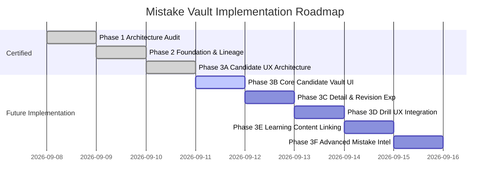

# COURAGE LIBRARY — MISTAKE VAULT
# PHASE 3B: CORE CANDIDATE VAULT UI IMPLEMENTATION REPORT

**Status:** IMPLEMENTED & CERTIFIED
**Phase:** 3B — Core Candidate Mistake Vault UI
**Route:** /mistakes
**Date:** September 2026

# COURAGE LIBRARY — MISTAKE VAULT PHASE 3A
## CANDIDATE UX ARCHITECTURE & PRODUCT DESIGN SPECIFICATION
**Subsystem**: Candidate Experience / Personal Revision Engine  
**Status**: Architecture Gate Complete & Certified  
**Date**: September 2026  
**Document Version**: 1.0.0  

---

## 1. Executive Summary & Existing UI Audit

### 1.1 Product Objective
The **Mistake Vault** is not a passive flat list of incorrect responses; it is Courage Library's candidate-facing **Personal Revision Engine**. The core learning loop is:

$$\text{Mistake} \longrightarrow \text{Understand} \longrightarrow \text{Learn} \longrightarrow \text{Revise} \longrightarrow \text{Drill} \longrightarrow \text{Retest} \longrightarrow \text{Improve}$$

The candidate experience transforms errors into mastery by identifying root cognitive failure modes (e.g., calculation slips vs. conceptual gaps), offering targeted drill remediation, and providing reassuring, non-punitive feedback.

### 1.2 Existing UI Audit & Codebase Inventory
A thorough audit of the current application reveals the existing mistake implementation across routes, services, and navigation:

| Surface / Route | Source File | Existing Implementation & Capabilities | Gaps / Identified UX Problems |
| :--- | :--- | :--- | :--- |
| `/mistakes` | `app/mistakes/page.tsx` | Server Component rendering a dark gradient hero, 4 KPI cards (Total, Unresolved, Revisiting, Mastered), 4 filter tabs, flat list of cards, Cognitive Breakdown sidebar, and Weak Topics sidebar. | 1. Dark red/rose hero banner conflicts with the clean light-mode standard.<br>2. Lacks subject/topic/difficulty search & filters.<br>3. No pagination (dumps all records).<br>4. No distinction for repeated mistakes.<br>5. Does not show question version context. |
| `/mistakes/[id]` | `app/mistakes/[id]/page.tsx` | Detailed inspection view showing question prompt, options (highlighting correct key), solution explanation, cognitive diagnosis card, remediation guidance, and historical occurrence list. | 1. Does not expose question-version lineage or errata status.<br>2. Does not show the candidate's actual selected wrong option for that attempt.<br>3. No inline custom note editor.<br>4. Lacks direct link to learning content/topic study guide. |
| `/mistakes/drill` | `app/mistakes/drill/page.tsx` & `drill-client.tsx` | Full interactive remediation drill player that fetches unmastered questions via `fn_generate_mistake_drill`, tracks choices, and submits via `/api/mistakes/submit-drill` (`fn_submit_mistake_drill`). | 1. Only launches global drill (no topic or status filtering from the card level).<br>2. Fixed 30s response time submitted instead of real stopwatch.<br>3. Abrupt exit to main vault without deep review of drill answers. |
| Navigation Linkages | `main-nav.tsx`, `mobile-nav.tsx`, `header-controls.tsx`, `dashboard/page.tsx`, `question-review-card.tsx` | Global navigation bar, mobile sidebar, user menu, dashboard widget, and exam test-result review cards link directly to `/mistakes`. | Strong navigation foundation exists; seamless entry points from mock reviews already present. |

---

## 2. User Journeys & Learning Loops

### 2.1 Current vs. Proposed Candidate Journey

```mermaid
flowchart TD
    subgraph Current_Journey ["Current Journey (Phase 3O)"]
        A1[Mock / Live Test Attempt] --> B1[Wrong Answer Logged]
        B1 --> C1[Candidate Visits /mistakes]
        C1 --> D1[Sees 4 KPI Numbers + Unsorted List]
        D1 --> E1[Click Generic Drill or View Detail]
        E1 --> F1[Take Drill & Earn Coins]
    end

    subgraph Proposed_Journey ["Proposed Personal Revision Engine (Phase 3)"]
        A2[Mock / Live Test / Adaptive Attempt] --> B2[Authoritative Lineage Captured Version & Answer ID]
        B2 --> C2[Dashboard / Result Card: One-Click Revision Entry]
        C2 --> D2[Personal Revision Overview: Focused Weakness Insights & Repeat Slips]
        D2 --> E2[Filter by Subject / Topic / Recurrence]
        E2 --> F2[Mistake Card: Quick Diagnosis & Prescribed Action]
        F2 --> G2{Candidate Action}
        G2 -->|1. Deep Understand| H2[Detail View: Options Analysis, Version Provenance, Errata Transparency]
        G2 -->|2. Learn Content| I2[Topic Study Material / Video Lesson / Flashcards]
        G2 -->|3. Targeted Drill| J2[Topic / Recurrence Focused Remediation Drill]
        H2 --> J2
        I2 --> J2
        J2 --> K2[Instant Mastery Re-evaluation & Lifecycle Progression: Unresolved -> Improving -> Mastered]
    end
```



---

## 3. Information Architecture & Navigation

The Mistake Vault is structured around a unified responsive cockpit rather than fragmenting into multiple disconnected pages:

```
MISTAKE VAULT (/mistakes)
│
├── 1. Overview & Action Banner (Light-mode hero, Primary Action: "Start Targeted Drill", Active Slips Summary)
│
├── 2. Core Metrics Strip (Active Mistakes, Needs Revision, Repeated Mistakes, Improving, Mastered)
│
├── 3. Segmented Navigation & State Views
│   ├── All Mistakes (Full filterable notebook)
│   ├── Needs Revision (Active, unpracticed mistakes)
│   ├── Repeated Mistakes (Recurrence count ≥ 2, high urgency)
│   ├── Improving (Consecutive correct = 1, on the verge of mastery)
│   ├── Mastered (Successfully resolved mistakes, archive)
│   ├── By Subject / Topic (Hierarchical breakdown & weakness ranking)
│   └── Mistake Drills (Drill launcher hub & past drill history)
│
├── 4. Composable Filter & Search Bar
│   ├── Search input (Keyword in question prompt or explanation)
│   ├── Exam / Category selector (e.g., SSC CGL, CHSL)
│   ├── Subject & Topic selector (Dynamic cascading dropdowns)
│   ├── Cognitive Failure Mode filter (Careless, Time Pressure, Concept, etc.)
│   └── Sort dropdown (Most Recent, Most Repeated, Oldest Unresolved, Topic)
│
└── 5. Responsive Mistakes Feed & Detail Drawer / Route (/mistakes/[id])
```

---

## 4. Overview Design & Metric Definitions

The Overview cockpit provides immediate, actionable answers to 5 fundamental questions:
1. *How many active mistakes do I have right now?*
2. *Which subjects and topics are causing the most lost marks?*
3. *Which mistakes keep repeating across mock attempts?*
4. *What should I revise first today?*
5. *Which targeted drills are ready for me?*

### Standardized Metric Definitions:
- **Active Mistakes**: Total distinct vault records where `lifecycle_status != 'MASTERED'` and active occurrences $> 0$.
- **Needs Revision**: Unmastered records with 0 consecutive correct answers in remediation (`lifecycle_status = 'UNRESOLVED'`).
- **Repeated Mistakes**: Mistakes where `total_mistakes_count ≥ 2` across separate test attempts.
- **Improving**: Mistakes where the candidate has answered correctly in a recent drill (`consecutive_correct_in_remediation = 1`, `lifecycle_status = 'REVISITING'`).
- **Mastered / Resolved**: Mistakes that have achieved mastery (`consecutive_correct_in_remediation ≥ 2` or all active occurrences revoked via errata, `lifecycle_status = 'MASTERED'`).
- **Weak Topics**: Topics aggregated by total active mistake occurrences, sorted in descending order of error volume.

---

## 5. Mistake Card Anatomy & Hierarchy

Each mistake card in the feed is designed with visual clarity, preventing cognitive overload while keeping the primary learning action immediately accessible:

```
┌─────────────────────────────────────────────────────────────────────────────┐
│ [STATUS BADGE]  [COGNITIVE TYPE]  Subject • Topic           [REPEAT BADGE]  │
│ [NEEDS REVISION] [Concept Slip]   Quantitative • Percentage  [Wrong 3 times]│
├─────────────────────────────────────────────────────────────────────────────┤
│ Question Prompt:                                                            │
│ "A shopkeeper marks an article at 20% above cost price and allows a discount│
│ of 10%. If the cost price is ₹500, what is the selling price?"              │
├─────────────────────────────────────────────────────────────────────────────┤
│ ✕ Your Choice: (C) ₹560 (Time spent: 45s)                                   │
│ ✓ Correct:     (B) ₹540                                                     │
├─────────────────────────────────────────────────────────────────────────────┤
│ 💡 Quick Remediation Note:                                                  │
│ Check consecutive percentage multipliers before multiplying by base cost.   │
├─────────────────────────────────────────────────────────────────────────────┤
│ [Last error: 2 days ago in SSC CGL Mock #3]      [Consecutive Correct: 0/2] │
│                                                                             │
│ [Learn Topic]              [Review Full Solution]     [PRACTICE THIS (Primary)]│
└─────────────────────────────────────────────────────────────────────────────┘
```

### Action Hierarchy:
1. **Primary Action**: `Practice This` / `Start Drill` (Launches a targeted 1-question or topic drill).
2. **Secondary Action**: `Review Solution` (Opens full detail drawer/page with step-by-step mathematical reasoning).
3. **Tertiary Action**: `Learn Topic` (Navigates to concept notes or chapter practice).

---

## 6. Question Versioning, Lineage & Errata UX

### 6.1 Human-Friendly Version Display
Under Phase 2 lineage hardening, every occurrence stores `question_version_id` and `attempt_answer_id`.
- **Candidate Presentation**: Never expose raw UUIDs. Present human-friendly context such as:
  - *Source Exam*: SSC CGL Tier-1 2025 Mock Test 4
  - *Question Code*: Q-1042 (Algebra • Linear Equations)
  - If the question was edited by admins after the attempt: *"You practiced Version 1 of this question on Aug 24; the explanation was enhanced on Sep 1."*

### 6.2 Errata Revocation UX (Neutral & Non-Punitive)
When an admin issues an authoritative errata key correction, affected occurrences transition to `occurrence_status = 'REVOKED_ERRATA'`.
- **UI Treatment**:
  - The occurrence is removed from the "Active Mistakes" tally.
  - In the history timeline of `/mistakes/[id]`, it displays a reassuring blue notice:
    > ℹ️ **Official Key Amended**: *This question was updated after your attempt following post-exam verification. This slip has been cleared from your active revision queue.*
  - The historical attempt is preserved for candidate transparency without penalizing revision metrics.

---

## 7. Status Model & Lifecycle Mapping

The UI maps directly to the authoritative database schema:

| Database State (`lifecycle_status`) | UI Presentation Badge | Color Token | Definition & Meaning |
| :--- | :--- | :--- | :--- |
| `UNRESOLVED` | **Needs Revision** | `bg-rose-50 text-rose-700 border-rose-200` | Candidate made an error and has not yet answered correctly in remediation drills. |
| `REVISITING` | **Improving** | `bg-amber-50 text-amber-700 border-amber-200` | Candidate answered correctly 1 time in remediation drill. 1 more correct answer required for mastery. |
| `MASTERED` | **Mastered / Resolved** | `bg-emerald-50 text-emerald-700 border-emerald-200` | Candidate answered correctly 2 consecutive times in remediation, or all occurrences were errata-cleared. |

---

## 8. Composable Filter & Search System

### 8.1 Primary Filters (Visible by Default)
1. **Search Bar**: Instant text search over question prompts and topic titles.
2. **Status Segmented Control**: All Mistakes | Needs Revision | Repeated | Improving | Mastered.
3. **Subject Dropdown**: All Subjects | Quantitative | Reasoning | English | General Awareness.

### 8.2 "More Filters" Expandable Drawer / Panel
- **Specific Topic**: Dependent cascading dropdown populated based on selected subject.
- **Cognitive Failure Mode**: Conceptual Misunderstanding, Calculation Slip, Time Pressure, Careless Reading, Guesswork Slip, Unclassified.
- **Source Test Type**: Mock Exam, Sectional Test, Live National Test, Daily Quiz.
- **Recurrence Filter**: All Mistakes vs. Repeated Only (Count ≥ 2).

---

## 9. Detail Experience Anatomy (/mistakes/[id])

The detail view provides deep learning immersion:
1. **Header Breadcrumb & Status**: Clear link back to Notebook, Lifecycle badge, Cognitive category badge, Repeat frequency.
2. **Question Card**: Full LaTeX/Markdown formatted question prompt.
3. **Candidate Attempt Comparison**: Side-by-side comparison of candidate chosen option vs. official correct option with highlighted keys.
4. **Comprehensive Explanation**: Formatted step-by-step solution, conceptual shortcuts, and diagrams.
5. **Cognitive Diagnosis & Prescribed Action**:
   - *Error Archetype*: E.g., "Time Pressure Misread".
   - *Why it happened*: Heuristic rationale.
   - *Action Plan*: Concrete tips to avoid this specific error under exam pressure.
6. **Candidate Custom Revision Notes**: Auto-saving rich textarea allowing candidate to write personal mnemonic tips or formula reminders.
7. **Lineage & Occurrence Timeline**: Chronological log of past test errors, timestamps, response times, and errata notices.
8. **Next Steps Bar**: Sticky bottom actions: `[Learn Concept]`, `[Practice Drill Now]`.

---

## 10. Mobile-First & Responsive Architecture

### Mobile Optimization:
- **Card Stacking**: Multi-column desktop grids gracefully collapse to single-column full-width cards on mobile ($\le 640\text{px}$).
- **Bottom Sheet Filters**: The "More Filters" panel opens as a native-feeling smooth bottom sheet on touch devices.
- **Sticky Drill CTA**: An unobtrusive floating bottom bar allows immediate drill launch without scrolling.
- **Touch-Friendly Hit Targets**: All buttons, option selectors, and tabs maintain $\ge 44\times 44\text{px}$ minimum touch bounding boxes.

### Light-Mode Visual Polish:
- Light slate background (`bg-slate-50/50`), pure white card surfaces (`bg-white`), subtle borders (`border-slate-200`), and rich slate typography (`text-slate-900`).
- Eliminates harsh dark-red hero gradients in favor of refined Courage Library brand styling with indigo/slate accents and warm neutral card treatments.

---

## 11. Security, Performance & Next.js Server Boundaries

### 11.1 Security & Candidate Isolation
- Candidate identity is derived strictly from the authenticated Supabase session on the server (`supabase.auth.getUser()`).
- Zero reliance on client-supplied `user_id` in URL params or payload bodies.
- Strict PostgreSQL RLS policies enforce isolation: candidate $A$ cannot view or drill candidate $B$'s mistakes.

### 11.2 Next.js Server/Client Boundary Architecture
```
Browser (Client Component: Tabs, Filter state, Drill Player)
   │
   ▼ (Server Action / Server Component)
app/mistakes/page.tsx (Server Component)
   │
   ▼ (Internal Server-Side Execution)
MistakeService (services/mistake.service.ts)
   │
   ▼ (Supabase Server Client with RLS)
PostgreSQL Database (user_mistake_vault, user_mistake_occurrences, user_mistake_drills)
```

### 11.3 Performance & Pagination
- **Server-Side Pagination**: Queries utilize `limit` (default: 20) and `offset` / cursor-based pagination.
- **Indexed Lookups**: Relies on migration 52 indexes (`idx_user_mistake_vault_user`, `idx_umo_qv`, `idx_umo_attempt_answer`, `idx_umo_status`).
- **Zero Heavy Payloads**: Only requested page rows and aggregate counts are transmitted over the wire.

---

## 12. Phased Implementation Roadmap



- **Phase 3B — Core Candidate Vault UI**: Light-mode overview, KPI strip, segmented tabs (All, Needs Revision, Repeated, Improving, Mastered), composable filter bar, responsive mistake cards, and server-side pagination.
- **Phase 3C — Detail + Revision Experience**: Individual mistake deep dive (`/mistakes/[id]`), side-by-side answer comparison, lineage timeline, errata notice banner, and custom notes persistence.
- **Phase 3D — Drill UX Integration**: Topic-filtered and recurrence-filtered remediation drills, real-time stopwatch timing, drill submission summary modal, and instant mastery status update.
- **Phase 3E — Learning Content Integration**: Linking mistake topics directly to study guides, concept articles, and video lectures.
- **Phase 3F — Advanced Mistake Intelligence**: Longitudinal error reduction trends, weak topic clustering, and predictive spaced repetition reminders.

---

## 13. Implementation Readiness Gate

| Verification Dimension | Status | Notes |
| :--- | :---: | :--- |
| Existing UI Audited | **CERTIFIED** | `/mistakes`, `/mistakes/[id]`, `/mistakes/drill` audited in detail. |
| Existing Data Model Mapped | **CERTIFIED** | Authoritative tables `user_mistake_vault`, `user_mistake_occurrences`, `user_mistake_drills` reused 100%. |
| Lineage & Errata Behaviors Defined | **CERTIFIED** | Non-punitive UI presentation & human-friendly version projection established. |
| Filter & Search System Defined | **CERTIFIED** | Composable primary + drawer filters specified with deterministic sorting. |
| Mobile & Light-Mode Styling Defined | **CERTIFIED** | Light theme tokens, mobile touch targets, and card stacking specified. |
| Security & Next.js Boundaries Defined | **CERTIFIED** | Server Component / Action architecture preventing boundary leaks. |
| Zero Duplicate Systems Introduced | **CERTIFIED** | 0 new database tables, 0 parallel APIs, 0 duplicate scoring engines. |

### GATE RESULT: **GO** (Ready for Phase 3B implementation authorization).
