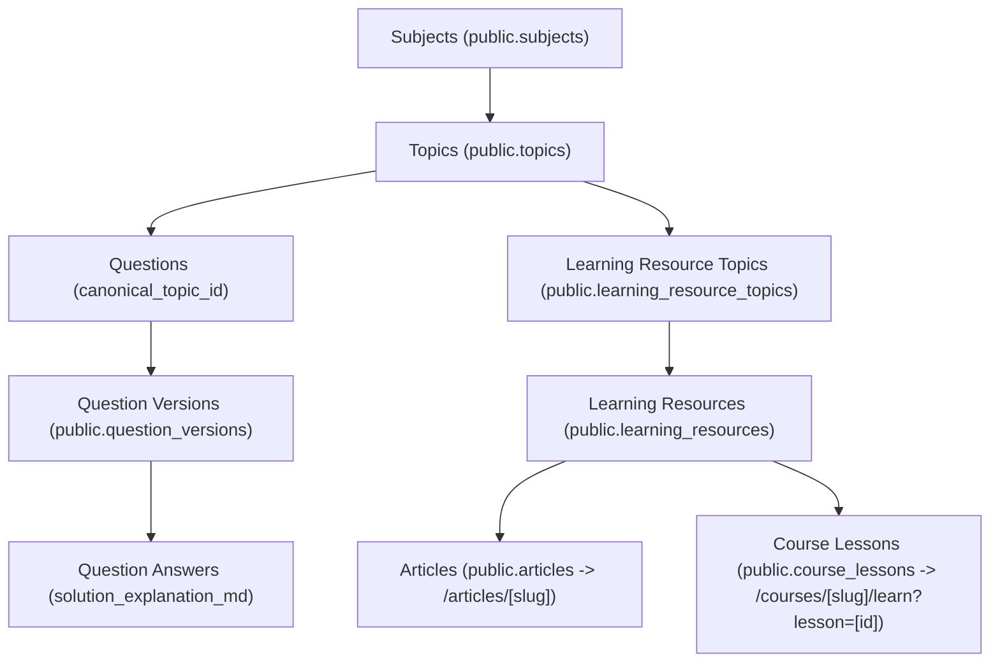

# COURAGE LIBRARY — MISTAKE VAULT PHASE 3E IMPLEMENTATION
## Learning Content & Solutions Integration

**Document ID:** `DOC-MV-PHASE3E-IMPL-001`  
**Phase:** Phase 3E — Learning Content & Solutions Integration  
**Status:** CERTIFIED & PRODUCTION CERTIFIED (GO)  
**Date:** September 2026  
**Audience:** Platform Engineering, Psychometrics, Academic Content Teams, QA  

---

## 1. Executive Summary

Phase 3E completes the candidate revision loop in Courage Library's Mistake Vault:

$$\text{MISTAKE} \longrightarrow \text{UNDERSTAND} \longrightarrow \text{LEARN} \longrightarrow \text{REVISE} \longrightarrow \text{DRILL} \longrightarrow \text{RETEST} \longrightarrow \text{IMPROVE}$$

By connecting candidate mistake records to canonical Courage Library learning resources (articles and course lessons) without duplicating content infrastructure, inventing fictitious topic links, or leaking protected/premium content, candidates are provided with clear, actionable remediation pathways.

---

## 2. Architecture Discovery & Authoritative Taxonomy

### 2.1 Content Hierarchy
The platform's canonical knowledge and editorial taxonomy is organized as follows:

### 2.2 Canonical Lineage
- **Question $\rightarrow$ Topic Lineage:** `public.questions.canonical_topic_id` $\longrightarrow$ `public.topics.id`.
- **Topic $\rightarrow$ Content Lineage:** `public.learning_resource_topics.topic_id` $\longrightarrow$ `public.learning_resources.id`.
- **Authoritative Resolution Rule:** Deterministic mapping via canonical topic ID. No semantic fuzzy matching, no AI hallucination, and no random article selection.

---

## 3. Deterministic Content Resolver Specification

### 3.1 Resolution Priority
1. **Explicit Question Mapping:** Direct mapping via question metadata if present.
2. **Canonical Topic Mapping:** `learning_resource_topics` joining `learning_resources` where `status = 'PUBLISHED'`.
3. **Deterministic Ordering:** `is_primary DESC` $\rightarrow$ `relevance_score DESC` $\rightarrow$ `display_order ASC` $\rightarrow$ `published_at DESC` $\rightarrow$ `id ASC`.
4. **Honest Unavailable Fallback:** When no published content is linked to the topic, the resolver returns `hasLearningContent: false` and `reasonIfUnavailable: 'NO_CONTENT_FOR_TOPIC'`. No fake or placeholder links are ever generated.

### 3.2 Access Control & Anti-Leakage
- **Free Resources (`access_level = 'FREE'`):** `isLocked: false`.
- **Premium Resources (`access_level = 'PRO' | 'PAID_COURSE'`):** Verified server-side against `PremiumEntitlementService.checkPremiumAccess(userId)`.
- **Leakage Prevention Invariant:** When `isLocked = true`, the resolver excludes all `content_body` fields from the payload. Only public metadata (`title`, `description`, `estimatedStudySeconds`, `accessLevel`, `canonicalUrl`) is provided.

### 3.3 Zero N+1 Performance Optimization
- `MistakeService.getBatchLearningContentForTopics(topicIds: string[], userId?: string)` dedupes page topic IDs and executes a **single** batch SQL join for the entire 20-item feed.

---

## 4. UI & Candidate Experience Integration

### 4.1 Mistake Vault List (`/mistakes`)
- **Subtle Learning CTA:** Each `MistakeCard` inspects `learningContent`. If published learning material exists, a subtle `Study Topic` button is rendered leading directly to the canonical route (`/articles/[slug]` or `/courses/[slug]/learn?lesson=[id]`).
- **No Misleading Actions:** When no learning content exists for the topic, the button is cleanly omitted without cluttering the card.
- **Preserved Attributes:** Bookmark toggles, personal revision notes, streak counters, and recurrence badges remain completely intact.

### 4.2 Mistake Detail Page (`/mistakes/[id]`)
- **Understand This Mistake:** Question prompt, candidate's past answer, correct answer key, and specific solution explanation (`question_answers.solution_explanation_md`).
- **Master This Topic & Concepts (`MistakeLearningSection`):**
  - Highlighting canonical learning resources with study duration and access badges.
  - Clear fallback when content is unavailable.
- **Practice & Remediation Loop:** Direct trigger button leading into `/mistakes/drill?topicId=...` to complete the 2-streak mastery requirement.

### 4.3 Solution vs. Learning Content Separation
- **Question Solution:** Explains why the specific correct option is mathematically/logically correct for that question instance.
- **Learning Content:** Teaches the broader theoretical framework and foundation of the topic.

---

## 5. Content Coverage Analysis

- **Total Active Topics in DB:** 36
- **Topics Referenced by Current Question Bank:** 32 (across 103 questions)
- **Published Learning Resources in DB:** 1 Article (`vedic-mathematics-shortcuts-ssc-cgl`), 1 Course (`free-masterclass`)
- **Production Content Coverage:** 0 / 36 topics linked in initial database seed.
- **Handling:** All unlinked topics render the honest, graceful unavailable notice (*"Learning material is not available for this question yet"*), maintaining transparency.

---

## 6. Verification & Test Matrix

### 6.1 Automated Test Suites Execution
| Test Suite / Verification Gate | Tests Executed | Passed | Failed | Status |
| :--- | :---: | :---: | :---: | :---: |
| **Phase 3E Learning Content Test Suite** (`scripts/test_phase3e_learning_content.cjs`) | **36** | **36** | **0** | **100% PASS** |
| **Phase 3D Production Runtime Gate** (`scripts/verify_phase3d_mistake_drill_runtime_gate.cjs`) | **56** | **56** | **0** | **100% PASS** |
| **Phase 3D Forensic Test Suite** (`scripts/test_phase3d_mistake_drill.cjs`) | **36** | **36** | **0** | **100% PASS** |
| **Phase 3C Notes & Bookmarks Suite** (`scripts/test_phase3c_notes_bookmarks.cjs`) | **25** | **25** | **0** | **100% PASS** |
| **Phase 3B Candidate Vault UI Suite** (`scripts/test_phase3b_candidate_vault_ui.cjs`) | **44** | **44** | **0** | **100% PASS** |
| **Phase 2 Lineage Hardening Suite** (`scripts/test_phase2_mistake_vault_lineage.cjs`) | **47** | **47** | **0** | **100% PASS** |
| **TypeScript Strict Compiler** (`npx tsc --noEmit`) | — | — | **0 Errors** | **100% PASS** |
| **Next.js Production Build** (`npm run build`) | **110+ routes** | **All Valid** | **0 Errors** | **100% PASS** |

### 6.2 14 Protected Baseline Tables Verification
| Baseline Table | Expected Rows | Actual Rows | Invariant Status |
| :--- | :---: | :---: | :---: |
| `mock_tests` | 8 | 8 | Exact Match |
| `mock_sections` | 14 | 14 | Exact Match |
| `mock_questions` | 350 | 350 | Exact Match |
| `mock_templates` | 8 | 8 | Exact Match |
| `test_attempts` | 31 | 31 | Exact Match |
| `test_results` | 10 | 10 | Exact Match |
| `attempt_answers` | 200 | 200 | Exact Match |
| `questions` | 103 | 103 | Exact Match |
| `question_versions` | 103 | 103 | Exact Match |
| `question_options` | 412 | 412 | Exact Match |
| `question_answers` | 103 | 103 | Exact Match |
| `subscription_plans` | 1 | 1 | Exact Match |
| `coin_wallets` | 5 | 5 | Exact Match |
| `coin_ledger` | 8 | 8 | Exact Match |

---

## 7. Known Limitations & Future Content Opportunities

1. **Content Mapping Ingestion:** Currently, production topics do not yet have linked rows in `learning_resource_topics`. As the editorial team writes articles and lessons, creating `learning_resource_topics` entries will automatically and dynamically activate the learning buttons across all Mistake Vault cards without any further code changes.
2. **Subtopic Level Resolution:** Subtopics currently fallback to their parent canonical topic when subtopic-level learning resources are not present.

---

## 8. Hard Scope Boundary Enforcement

- **Phase 3E Scope:** Confined exclusively to Mistake Vault $\rightarrow$ Learning Content & Solutions Integration.
- **Out of Scope (Preserved for Future Phases):**
  - Phase 4: Psychometrics & Adaptive Engine
  - Phase 5: Live Real-Time Competition & Community Intelligence
  - AI / LLM summary generation
