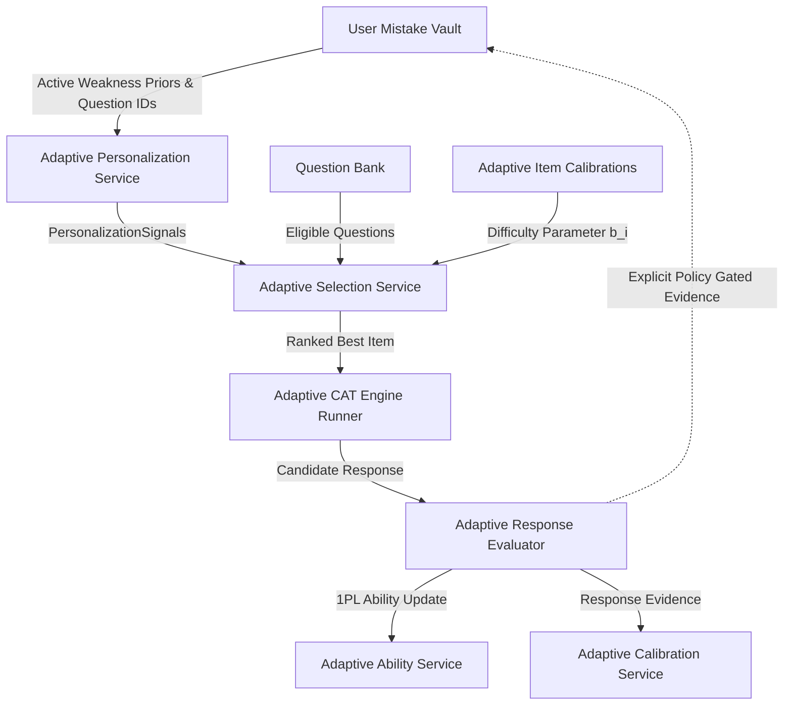
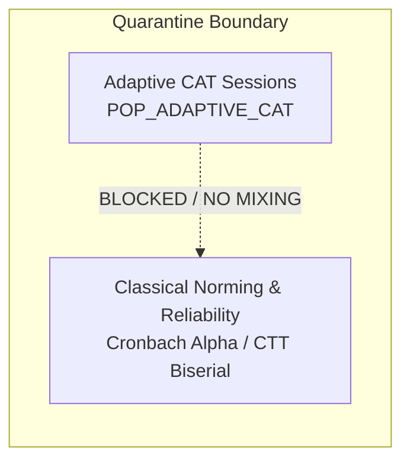

# Courage Library — Mistake Vault Phase 6 Architecture & Integration Specification
## Adaptive CAT & Longitudinal Mistake Analytics / Deep Error Decay Modeling

---

## 1. Executive Summary & Mission

Mistake Vault Phase 6 (Intelligence) connects candidate mistake history and cognitive failure modeling with the Computerized Adaptive Testing (CAT) Engine and Longitudinal Analytics.

The objective of Task 1 is to establish the **Forensic Architecture Audit & Integration Gate** between:
1. **Mistake Vault Foundation** (Certified Phases 1 through 4):
   - Deterministic Mistake Priority Index (MPI)
   - Spaced Revision Due-State Engine (`DUE_NOW`, `NEEDS_ATTENTION`, `IMPROVING`, `MASTERED`, `DUE_REFRESH`)
   - Multi-Factor Revision Priority Extender (MPI + Urgency + Content Bonus - Fatigue Penalty)
   - Revision Health Dashboard, Cognitive Failure Mode Pattern Recognition (>= 3 threshold)
   - 8 Deterministic Drill Focus Modes and Candidate Isolation via `auth.uid()`
   - Authoritative historical occurrence ledger in `public.user_mistake_occurrences`
2. **Adaptive Testing Engine** (Certified Phases 4D.1 through 4D.7):
   - 1PL / Rasch Model Fisher Information Item Selection ($I_i(\theta)$)
   - Latent Trait Estimation ($\theta$) via Newton-Raphson & Expected A Posteriori (EAP)
   - 1PL Rasch JMLE Item Difficulty Parameter ($b$) Calibration Bank (`public.adaptive_item_calibrations`)
   - Stopping Rules (Target $\text{SE}(\theta) \le 0.30$, Min/Max questions, Diminishing Information)
   - Multi-Objective Selection Balancing (Fisher Info 40%, Topic Coverage 25%, Exploration 15%, Mistake Reinforcement 10%, Exposure Control 10%)
   - Strict Population Quarantine between CAT (`POP_ADAPTIVE_CAT`) and Linear/Norm-Referenced Psychometrics

---

## 2. Invariants, Security Gates & Baseline Verification

| Invariant / Property | Task 1 Status | Specification & Evidence |
| :--- | :--- | :--- |
| **Zero Database Migrations in Task 1** | PASS | 52 baseline migrations preserved. Exactly 0 schema migrations added. |
| **14 Protected Baseline Tables** | PASS (Row-Count Preservation Verified) | Row-count preservation verified pre- and post-test across all 14 baseline tables. (No claim of row-level content immutability is made from row counts alone). |
| **Strict Population Quarantine** | PASS | CAT responses (`POP_ADAPTIVE_CAT`) are quarantined from Classical Test Theory (CTT) metrics (Cronbachs alpha, classical point-biserial discrimination). |
| **Authoritative Mistake Ledger Reuse** | PASS | Historical mistake slips map exclusively to `public.user_mistake_occurrences`. Zero duplicate history tables created. |
| **Strict Multi-Tenant Candidate Isolation** | PASS | All vault records, drill sessions, and personalization signals are partitioned strictly by `auth.uid()`. |
| **Deterministic Math & Heuristic Transparency** | PASS | All scoring models use bounded IEEE-754 arithmetic with exact clamp ranges and rounding to 4 decimal places. No false scientific precision claims. |
| **Zero Answer / Explanation Leakage** | PASS | Client runtimes (drills, adaptive CAT) receive questions strictly scrubbed of correct option flags, rationales, and internal calibration metrics. |

---

## 3. Existing System Audits & Interface Contracts

### 3.1 Mistake Vault System (`services/mistake.service.ts`)

#### Core Mathematical Contracts:
1. **Mistake Priority Index (MPI)**:
   $$\text{MPI} = (0.35 \times \text{Recurrence}) + (0.30 \times \text{Unresolved}) + (0.20 \times \text{Recency}) + (0.15 \times \text{Mastery Gap})$$
   - $\text{Recurrence} = \min\left(\frac{\text{mistake\_count}}{5.0}, 1.0\right)$
   - $\text{Unresolved} = 1.0 \text{ (UNRESOLVED)}, 0.5 \text{ (REVISITING)}, 0.0 \text{ (MASTERED)}$
   - $\text{Recency} = \max\left(0.0, 1.0 - \frac{\text{days\_since\_slip}}{30.0}\right)$
   - $\text{Mastery Gap} = \max\left(0.0, \frac{2 - \text{consecutive\_correct}}{2.0}\right)$
   - Result: Continuous float in $[0.0000, 1.0000]$ rounded to 4 decimals.

2. **Spaced Revision Due-State Engine**:
   - `DUE_NOW`: $\text{count} \ge 2$ OR $\text{age} \ge 1\text{d}$ (Unresolved); OR $\text{age} \ge 3\text{d}$ (Revisiting streak 1). Urgency $0.60 - 1.00$.
   - `NEEDS_ATTENTION`: $\text{count} = 1$ AND $\text{age} < 1\text{d}$ (Unresolved). Urgency $0.65$.
   - `IMPROVING`: $\text{age} < 3\text{d}$ (Revisiting streak 1). Urgency $0.40$.
   - `DUE_REFRESH`: $\text{age} \ge 14\text{d}$ since Mastered. Urgency $0.30$.
   - `MASTERED`: $\text{age} < 14\text{d}$ since Mastered. Urgency $0.05$.

3. **Multi-Factor Revision Priority**:
   $$\text{RevisionPriority} = \text{clamp}\Big((0.70 \times \text{MPI}) + (0.15 \times \text{DueUrgency}) + \text{Bonus}_{\text{Content}} - \text{Penalty}_{\text{Fatigue}}, 0.0, 1.0\Big)$$
   - $\text{Bonus}_{\text{Content}} = +0.10$ if published learning content exists for the topic.
   - $\text{Penalty}_{\text{Fatigue}} = -0.15$ if practiced within recent candidate drill sessions.

4. **Revision Health Intelligence (`getRevisionHealthIntelligence`)**:
   - Computes candidate Revision Health Score ($0-100\%$), Retention Rate ($0-100\%$), Next Best Revisions (top 3-5), Subject Distribution, Weakest Topic, and Cognitive Failure Modes ($\ge 3$ occurrence threshold).

5. **Occurrence Ledger Data Store**:
   - Historical individual slips are persisted in `public.user_mistake_occurrences` (referencing `vault_id`, `user_id`, `question_id`, `question_version_id`, `attempt_answer_id`, `selected_option_id`, `occurrence_status`, `occurred_at`).

---

### 3.2 Certified Adaptive Testing Engine Stack (`services/adaptive/`)

The Phase 6 integration boundary was verified against all certified Adaptive components:

- **4D.1 Advanced Foundation (`services/admin-adaptive.service.ts`)**: Verified via `test_phase4d1_advanced_adaptive_foundation.cjs` (72/72 PASS). Manages algorithm versions, calibration bank, and emergency kill-switches.
- **4D.2 Calibration & Evidence (`services/adaptive/adaptive-calibration.service.ts`)**: 1PL Rasch JMLE item calibration tracking in `public.adaptive_item_calibrations`. Rasch item parameters are intended to provide population-invariant measurement under model assumptions and adequate calibration conditions. Calibration still requires empirical response evidence.
- **4D.3 Ability Estimation (`services/adaptive/adaptive-ability.service.ts`)**: Latent trait estimation ($\theta$) via Newton-Raphson update with bounded numerical derivatives:
  $$\theta_{k+1} = \theta_k + \frac{\sum (u_i - P_i(\theta_k))}{\sum P_i(\theta_k)(1 - P_i(\theta_k)) + \frac{1}{\sigma_{\text{prior}}^2}}$$
- **4D.4 CAT Item Selection (`services/adaptive/adaptive-selection.service.ts`)**: 1PL Fisher Information item selection ($I_i(\theta) = P_i(1-P_i)$) with multi-objective composite weighting (Fisher Info 40%, Topic Balance 25%, Exploration 15%, Mistake Reinforcement 10%, Exposure Control 10%).
- **4D.5 Stopping & Personalization (`services/adaptive/adaptive-stopping.service.ts`, `services/adaptive/adaptive-personalization.service.ts`)**: 10-level stopping hierarchy and bounded personalization signals ($W_T = \max(0, 1 - \text{Mastery}_T)$, maximum personalization influence capped at $\le 0.40$).
- **4D.6 Analytics & Intelligence (`services/adaptive/adaptive-analytics.service.ts`)**: Verified via `test_phase4d6_adaptive_analytics.cjs` (107/107 PASS). Server-authoritative KPI aggregation and zero data leakage.
- **4D.7 Production Runtime Gate (`services/adaptive/adaptive-engine.service.ts`)**: Verified via `test_phase4d7_adaptive_production_hardening.cjs` (48/48 PASS). End-to-end attempt isolation, wall-clock timer authority, and step submission validation.

---

## 4. Cross-System Data Flow & Semantic Integration Boundaries

### 4.1 Inbound Integration (Mistake Vault -> CAT Engine)
- Mistake Vault provides active candidate weakness vectors (`weak_area_priorities`, `mistake_question_ids`, cognitive failure modes) to `AdaptivePersonalizationService`.
- `AdaptiveSelectionService` applies the bounded $+0.10$ Mistake Bonus to candidate items that reinforce identified weaknesses without compromising CAT Fisher Information measurement precision.

### 4.2 Outbound Integration: Diagnostic vs. Remediation Evidence Boundary
A strict semantic distinction is maintained between:
- **Diagnostic / Assessment Evidence**: Responses in CAT sessions primarily estimate candidate latent ability $\theta$ under 1PL Rasch assumptions across mixed topics.
- **Remediation Evidence**: Dedicated deliberate practice in Mistake Drills specifically targeted at error comprehension and mastery.

**Authoritative Mastery Rule**:
A CAT response does **not** automatically equal remediation mastery. The certified Mistake Drill mastery contract (2 consecutive correct drills in deliberate remediation) remains authoritative. Any contribution of CAT assessment responses to Mistake Vault lifecycle progression must be governed by an explicitly defined, separate policy approved in a future phase.

---

## 5. Population Quarantine Invariants

1. **Quarantine Rule 1 (Zero CTT Contamination)**: Adaptive CAT attempts (`POP_ADAPTIVE_CAT`) are tailored to individual candidate ability ($\theta \approx b_i$) and violate random sampling assumptions. CAT responses are tagged with `response_source = 'ADAPTIVE_CAT'` and strictly quarantined from Classical Test Theory (CTT) metrics (Cronbachs alpha, section-level variance, CTT point-biserial discrimination).
2. **Quarantine Rule 2 (Fixed Linear Mock Isolation)**: CTT item facility and classical discrimination are derived exclusively from fixed linear mock examinations (`POP_LINEAR_MOCK`).
3. **Quarantine Rule 3 (IRT Calibration Assumptions)**: Item calibration in CAT uses Item Response Theory (1PL Rasch JMLE) stored in `public.adaptive_item_calibrations`. Rasch item parameters are intended to provide population-invariant measurement under model assumptions and adequate calibration conditions. Calibration still requires empirical response evidence.

---

## 6. Mathematical Specification & Terminology for Future Error Decay (Phase 6 Task 2)

For planned future implementation in Task 2, the error decay model is defined as:

$$\text{Retrievability Heuristic: } R(t) = \exp\left(-\frac{t}{S \cdot (1 + \mu \cdot C)}\right)$$

Where:
- $t$: Elapsed time since last practice (days).
- $S$: Initial memory stability constant (days).
- $C$: Number of consecutive successful drills.
- $\mu$: Spacing bonus multiplier.

**Terminology & Explainability Standard**:
- $R(t)$ is designated strictly as a **Deterministic revision-retention / error-decay heuristic**.
- $R(t)$ MUST NOT be documented or presented as a scientifically validated memory probability, guaranteed Ebbinghaus prediction, or exact psychological certainty.
- Any future user-facing scores must be fully explainable (showing elapsed days, stability tier, and practice streak) without false scientific precision.

---

## 7. Data Model Reuse & Zero Migration Invariant

Phase 6 Task 1 introduces:
- **0 new migrations** (baseline 52 migrations preserved).
- **0 new tables**.
- **0 new columns**.
- **0 duplicate history systems** (reuses `public.user_mistake_occurrences`).

Phase 6 integrates entirely with certified existing infrastructure:
- `public.user_mistake_vault`
- `public.user_mistake_occurrences`
- `public.user_mistake_drills`
- `public.adaptive_item_calibrations`
- `public.adaptive_test_configs`
- `public.user_adaptive_profiles`
- `public.question_versions` and question lineage

---

## 8. Verification Matrix & Smoke Results

| Test Suite / Verification Step | Executed Tests | Result | Status |
| :--- | :--- | :--- | :--- |
| **Phase 4 Mistake Intelligence Suite** (`scripts/test_phase4_mistake_intelligence.cjs`) | 42 | 42 / 42 PASS | PASS |
| **Adaptive 4D.1 Foundation Suite** (`scripts/test_phase4d1_advanced_adaptive_foundation.cjs`) | 72 | 72 / 72 PASS | PASS |
| **Adaptive 4D.6 Analytics Suite** (`scripts/test_phase4d6_adaptive_analytics.cjs`) | 107 | 107 / 107 PASS | PASS |
| **Adaptive 4D.7 Hardening Suite** (`scripts/test_phase4d7_adaptive_production_hardening.cjs`) | 48 | 48 / 48 PASS | PASS |
| **TypeScript Strict Compilation** (`npx tsc --noEmit`) | Full codebase | 0 errors | PASS |
| **14 Protected Baseline Tables Row Count** | 14 tables | Row counts preserved | PASS |

---

## 9. Conclusion & Gate Recommendation

Task 1 Architecture Audit & Integration Gate is **HARDENED & CERTIFIED PASS**. All terminology corrections, ledger alignments, and adaptive stack smoke audits are complete.

**HARD STOP**: Awaiting user authorization prior to starting Phase 6 Task 2.\n