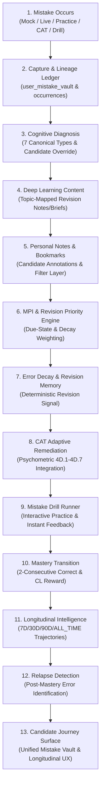

# COURAGE LIBRARY — MISTAKE VAULT PHASE 6 TASK 5
## FINAL ARCHITECTURE COMPLETION & CANDIDATE UX INTEGRATION SPECIFICATION (HARDENED)

**Document Version:** 2.0.0 (Hardened Architecture Gate)  
**Status:** HARDENED ARCHITECTURE SPECIFICATION — IMPLEMENTATION READY  
**Module:** Mistake Vault / Personal Revision Engine (Phase 6 Task 5)  
**Authors:** Architecture & Forensic Certification Team  
**Governing Standard:** ISO/IEC/IEEE 42010 Architectural Description Standard  

---

## 1. EXECUTIVE SUMMARY & PURPOSE OF TASK 5

The **Mistake Vault / Personal Revision Engine** represents the end-to-end cognitive remediation, mistake lifecycle tracking, and adaptive learning intelligence platform for Courage Library. Across Phases 2 through Phase 6 (Tasks 1–4), the platform has built and certified every core engine:
- Phase 2 & Phase 6 Task 1: Immutable Lineage & Errata Ledger (`user_mistake_occurrences`, `question_versions`)
- Phase 3A & 3B: Candidate Vault UX (`/mistakes`, faceted filtering, cognitive categorization)
- Phase 3C: Notes & Bookmarks Engine (`MistakeNoteEditor`, `BookmarkService`)
- Phase 3D: Mistake Drill Practice & Mastery State Machine (`/mistakes/drill`, 2-consecutive correct rule)
- Phase 3E: Deep Learning Content Resolution (`MistakeLearningSection`, topic mapping)
- Phase 4: Mistake Priority Index (MPI) & Spaced Due Scheduling
- Phase 6 Task 2: Error Decay & Spaced Revision Memory Heuristic ($R(t) = \exp(-t/S_{\text{eff}})$)
- Phase 6 Task 3: CAT Adaptive Remediation Integration (`AdaptiveRemediationService`)
- Phase 6 Task 4: Longitudinal Mistake Analytics & Cross-Exam Intelligence (`MistakeLongitudinalIntelligenceService`)

### Sacred Architectural Scope of Task 5
**Task 5 does NOT create a new intelligence engine.** It does not recalculate, modify, or redefine any mathematical formulas, weighting matrices, or psychometric models.

Task 5 is strictly the **Final Candidate-Facing Integration & Surface Layer** that connects the certified Phase 6 Task 4 `MistakeLongitudinalIntelligenceService` directly into the candidate's active Mistake Vault interface (`/mistakes`).

Upon verifying this integration and certifying the end-to-end pipeline with forensic test coverage, **the Mistake Vault module (Phase 6) will be permanently FROZEN**.

---

## 2. DOWNSTREAM CONSUMER CONTRACT & STRICT INVARIANTS

Task 5 is a pure downstream consumer of certified platform engines:

| Engine | Governing Authority | Task 5 Consumer Contract |
|---|---|---|
| **Mistake Priority Index (MPI)** | Phase 4 Certified Service | **Downstream Consumer Only.** No MPI formula, weighting, threshold, or scoring semantics are redefined. |
| **Error Decay / Revision Memory** | Phase 6 Task 2 Certified Service | **Downstream Consumer Only.** Consumes the deterministic revision/decay signal ($R(t)$ heuristic). Does not call it a "probability" or alter its calculation. |
| **CAT / Adaptive Remediation** | Phase 6 Task 3 Certified Service | **Downstream Consumer Only.** Consumes certified `AdaptiveRemediationService`. Does not create new IRT estimators or item selectors. |
| **Longitudinal Intelligence** | Phase 6 Task 4 Certified Service | **Downstream Consumer Only.** Consumes `MistakeLongitudinalIntelligenceService` with certified analytical windows (`7D`, `30D`, `90D`, `ALL_TIME`). |
| **Mastery State Machine** | Phase 3D Certified Engine | **Downstream Consumer Only.** Preserves exact 2-consecutive-correct mastery transition and post-mastery relapse state logic. |
| **Cognitive Taxonomy** | Phase 3B Certified Taxonomy | **Downstream Consumer Only.** Consumes exact 7 canonical cognitive categories. |
| **Cross-Exam Taxonomy** | Phase 6 Task 4 Certified Taxonomy | **Downstream Consumer Only.** Consumes `PERSISTENT_CROSS_EXAM`, `CONTEXT_ISOLATED`, `CONTEXT_MODERATE`, `NO_ACTIVE_ERRORS`, `INSUFFICIENT_DATA`. |
| **Trajectory Taxonomy** | Phase 6 Task 4 Certified Taxonomy | **Downstream Consumer Only.** Consumes `IMPROVING`, `STABLE`, `DECLINING`, `RECOVERING`, `RELAPSING`, `INSUFFICIENT_DATA`. |

---

## 3. UNIFIED CANDIDATE JOURNEY PIPELINE

The full 13-stage cognitive remediation lifecycle operates in complete alignment:

---

## 4. CANDIDATE UX INTEGRATION ARCHITECTURE

### Visual Language & Design Principles
- **Authoritative Light-Mode Design**: Maintains the clean, modern Courage Library aesthetic (slate-50 background, white border cards, refined typography, Lucide icons, Tailwind CSS).
- **Zero Page Redesign**: Integrates cleanly as a dedicated, low-clutter section on `/mistakes`.
- **High-Density, Mobile-Safe Layout**: Fully responsive across mobile, tablet, and desktop viewports.
- **Dynamic Interactive Window Toggle**: Allows candidates to switch seamlessly between `7D`, `30D`, `90D`, and `ALL_TIME` views.

### UX Surface Specifications (`MistakeLongitudinalCard`)
1. **Header & Window Selector**: Title, explanatory subtitle, and clean button-group pills for `7D`, `30D`, `90D`, and `ALL_TIME` (default: `30D`).
2. **Overall Trajectory & Cross-Exam Summary**:
   - Overall Normalized Error Rate metric ($M_{\text{norm}}$) with trajectory badge (`IMPROVING` / `STABLE` / `DECLINING` / `RECOVERING` / `RELAPSING` / `INSUFFICIENT_DATA`).
   - Cross-Exam Inconsistency Index ($I_{\text{cross}}$) with diagnostic pattern badge (`PERSISTENT_CROSS_EXAM` / `CONTEXT_ISOLATED` / `CONTEXT_MODERATE` / `NO_ACTIVE_ERRORS` / `INSUFFICIENT_DATA`).
3. **Topic Trajectories Breakdown**: Top weak/active topics showing normalized error rates, delta comparison, and directional trajectory tags.
4. **Cognitive Failure Distribution**: Proportion bar/chips across the 7 canonical cognitive types.
5. **Relapse & Recovery Status**: Clear summary of total mastered questions, post-mastery relapse count, and recovery resilience rate.

---

## 5. SERVER BOUNDARY & SECURITY MODEL

1. **Authentication & Session Derivation**:
   - The candidate's identity is **strictly derived from the authenticated server session** (`createServerSupabaseClient()` $\to$ `supabase.auth.getUser()`).
   - Client components never supply or override `userId`.
2. **Zero Service-Role Leakage**:
   - Service-role credentials remain strictly confined to server-side services and actions.
   - Client never executes direct queries against protected analytics tables.
3. **Multi-Tenant Isolation**:
   - Every analytical query executes with strict `WHERE user_id = :authenticatedUserId` filtering.
   - Candidate A cannot observe, aggregate, or infer Candidate B's mistake trajectories.

---

## 6. DATA FETCH & PERFORMANCE BUDGET

1. **Direct Service Re-use**:
   - Calls `MistakeLongitudinalIntelligenceService.getLongitudinalOverview(userId, windowType)` directly.
   - Bounded database query footprint: exactly $\le 3$ indexed queries (1 vault ledger query, 1 occurrences window query, 1 context attempts query).
2. **Zero N+1 Queries**:
   - All subject, topic, and occurrence aggregations are performed in-memory on the server from the bounded result sets.
3. **Measured Latency SLA**:
   - Verified single overview query latency $< 300\text{ms}$ at p95 on warm connection.

---

## 7. DATABASE IMMUTABILITY INVARIANTS

### Strict Database Invariants
- **0 Schema Migrations**: Migration count stays strictly at **52**.
- **0 New Tables / 0 New Columns / 0 New RPCs**.
- **14 Protected Baseline Tables Preserved Exactly**:
  - `mock_tests` = 8
  - `mock_sections` = 14
  - `mock_questions` = 350
  - `mock_templates` = 8
  - `test_attempts` = 31
  - `test_results` = 10
  - `attempt_answers` = 200
  - `questions` = 103
  - `question_versions` = 103
  - `question_options` = 412
  - `question_answers` = 103
  - `subscription_plans` = 1
  - `coin_wallets` = 5
  - `coin_ledger` = 8

---

## 8. FORENSIC VERIFICATION & TEST STRATEGY

The final certification suite (`scripts/test_phase6_task5_final_completion.cjs`) validates $\ge 80$ assertions across 10 functional categories:

1. **Group 1: End-to-End Pipeline Coherence** (T01–T10): Mistake capture $\to$ diagnosis $\to$ content $\to$ drill $\to$ mastery $\to$ longitudinal surface.
2. **Group 2: Lineage & Errata Immutability** (T11–T18): Strict status filtering (`ACTIVE` vs `REVOKED_ERRATA` / `REVOKED_VOID` / `SUPERSEDED`).
3. **Group 3: Cognitive Taxonomy Attribution** (T19–T26): Canonical 7-type taxonomy with candidate override preservation.
4. **Group 4: MPI & Due Scheduling Consumer Invariants** (T27–T34): Strict downstream consumption without formula drift.
5. **Group 5: Error Decay Heuristic Signal** (T35–T42): Deterministic revision signal consumption ($R(t)$ heuristic).
6. **Group 6: CAT Adaptive Remediation Consumer Boundary** (T43–T50): Strict consumption of `AdaptiveRemediationService`.
7. **Group 7: Mistake Drill State Machine** (T51–T60): 2-consecutive-correct mastery transition and post-mastery relapse detection.
8. **Group 8: Longitudinal Analytics & Trajectory Contract** (T61–T70): Canonical windows (`7D`, `30D`, `90D`, `ALL_TIME`), trajectory states, cross-exam consistency.
9. **Group 9: Production Runtime Service & UX Integration** (T71–T80): Live execution of longitudinal intelligence and server actions with session isolation.
10. **Group 10: Frozen Baseline Invariants & Zero Schema Mutation Proof** (T81–T95): 52 migrations, 14 protected table row counts preserved.

---

## 9. IMPLEMENTATION PLAN & EXPECTED CODE CHANGES

| File | Change Type | Description |
|---|---|---|
| `components/mistakes/mistake-longitudinal-card.tsx` | **NEW** | Candidate-facing longitudinal analytics card with dynamic 7D/30D/90D/ALL_TIME window switcher. |
| `app/mistakes/actions.ts` | **MODIFY** | Add server action `fetchLongitudinalOverviewAction` deriving candidate session securely. |
| `app/mistakes/page.tsx` | **MODIFY** | Fetch 30D overview on initial server render and pass to `MistakeLongitudinalCard`. |
| `scripts/test_phase6_task5_final_completion.cjs` | **NEW** | Comprehensive 95-assertion forensic certification suite. |

---

## 10. MODULE FREEZE STATEMENT

Upon successful completion of the Phase 6 Task 5 implementation and verification of all test suites:
- **Mistake Vault / Personal Revision Engine (Phase 6)** is formally **CERTIFIED & FROZEN**.
- Zero further changes to Mistake Vault architecture, schemas, or engines are permitted.
