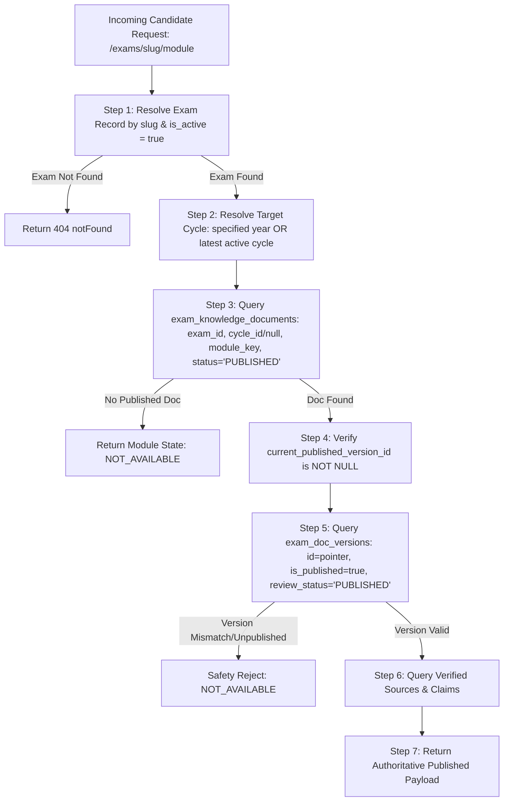

# PHASE 3H.5 — CANDIDATE EXAM KNOWLEDGE HUB ARCHITECTURE & READ-MODE CONSUMPTION LAYER

**Project**: Courage Library  
**Phase**: 3H.5 (Candidate Exam Knowledge Hub — Architecture Pass)  
**Status**: **ARCHITECTURE READY**  
**Governance Invariant**:  
$$\text{ACADEMIC CURRICULUM AUTHORITY} > \text{HUMAN ACADEMIC REVIEW} > \text{AI AUTHORING} > \text{AI-GENERATED CONTENT}$$

---

## 1. Executive Summary & Purpose

Phase 3H.5 establishes the authoritative server-side **Candidate Read/Consumption Layer** for the Courage Library Exam Knowledge System.

The candidate interface provides a unified, single-destination **Exam Knowledge Hub** where students can understand the entire recruitment and pedagogical ecosystem for any government competitive examination (e.g., SSC CGL, RRB NTPC, UP Police Constable).

### Core Architectural Principles:
1. **Pure Read-Mode Consumption**: Zero content creation or mutation happens in the candidate layer.
2. **Strict Published-Only Isolation**: Candidate queries resolve ONLY documents and versions where `document.status = 'PUBLISHED'`, `version.is_published = true`, and `version.review_status = 'PUBLISHED'`.
3. **No Entity Duplication**: Leverages existing tables (`exams`, `exam_cycles`, `exam_posts`, `exam_sources`, `exam_claims`, `exam_syllabi`, `subjects`, `topics`, `learning_units`, `questions`).
4. **Structured Facts + Authored Prose Fusion**: Combines typed relational facts (dates, pay levels, marks, negative marking) with compiled MDX guides and curated FAQs.
5. **Clear Cycle Boundaries**: Explicitly separates timeless exam intelligence from cycle-specific notifications.

---

## 2. Forensic Schema & Systems Inventory

A full forensic inspection of the 20 required entities and subsystems confirms the following schema and lifecycle characteristics:

| # | Entity / Subsystem | Authoritative Fields | Lifecycle / Published Pointer | Candidate Readability | Volatility & Cycle Scope |
| :--- | :--- | :--- | :--- | :--- | :--- |
| **1** | `exams` | `id`, `title`, `slug`, `category`, `conducting_org_id`, `official_website`, `description`, `is_active` | Active/Inactive flag (`is_active = true`) | Fully Public | Timeless; foundational entity |
| **2** | `exam_cycles` | `id`, `exam_id`, `cycle_year`, `cycle_label`, `notification_date`, `application_start_date`, `application_end_date`, `exam_start_date`, `exam_end_date`, `total_vacancies`, `status` | Status: `UPCOMING`, `ACTIVE`, `COMPLETED`, `ARCHIVED` | Public when attached to active exam | Highly volatile; cycle-specific |
| **3** | `conducting_orgs` | `id`, `name`, `short_name`, `website_url` | Active | Fully Public | Permanent authority record |
| **4** | `exam_posts` | `id`, `exam_id`, `post_name`, `post_code`, `department`, `ministry`, `classification_group`, `is_gazetted`, `pay_level`, `grade_pay`, `cpc_basic_pay_min`, `cpc_basic_pay_max` | `is_active = true` | Fully Public | Timeless post cadres |
| **5** | `exam_sources` | `id`, `exam_id`, `exam_cycle_id`, `source_type`, `title`, `issuing_authority`, `source_url`, `published_date`, `verification_status`, `verified_at` | `verification_status = 'SOURCE_VERIFIED'` | Only `SOURCE_VERIFIED` public | Per-cycle or timeless official citations |
| **6** | `exam_claims` | `id`, `exam_id`, `exam_cycle_id`, `claim_key`, `stated_value`, `value_data_type`, `verification_status` | `verification_status = 'VERIFIED'` | Only `VERIFIED` claims public | Volatile factual parameters |
| **7** | `exam_claim_sources` | `claim_id`, `source_id`, `page_or_clause` | Junction | Public via verified claim query | Provenance linkage |
| **8** | `exam_knowledge_documents` | `id`, `exam_id`, `exam_cycle_id`, `module_key`, `canonical_slug`, `current_published_version_id`, `status`, `language` | `status = 'PUBLISHED'` + `current_published_version_id` | Only `PUBLISHED` documents | Modular document container |
| **9** | `exam_doc_versions` | `id`, `document_id`, `version_number`, `schema_version`, `review_status`, `structured_payload`, `compiled_mdx`, `is_published`, `published_at` | `is_published = true` + `review_status = 'PUBLISHED'` | Only matching active published version | Immutable compiled content payload |
| **10** | `exam_syllabi` | `id`, `exam_id`, `subject_id`, `display_order`, `total_weightage_percent`, `is_active` | `is_active = true` | Fully Public | Exam-specific subject syllabus |
| **11** | `exam_topics` | `id`, `exam_id`, `subject_id`, `topic_id`, `importance_tier`, `required_depth`, `expected_questions_min`, `expected_questions_max` | `is_active = true` | Fully Public | Exam-topic weighting & importance |
| **12** | `subjects` | `id`, `name`, `slug`, `code`, `description`, `display_order` | Active | Fully Public | Canonical academic taxonomy |
| **13** | `topics` | `id`, `subject_id`, `name`, `slug`, `display_order` | Active | Fully Public | Canonical topic taxonomy |
| **14** | `subtopics` | `id`, `topic_id`, `name`, `slug` | Active | Fully Public | Canonical granular subtopics |
| **15** | `questions` / `question_versions` | `id`, `topic_id`, `year`, `tier`, `exam_id`, `status` | `status = 'PUBLISHED'` | Fully Public in Question Bank / Drills | PYQ & Question Bank entities |
| **16** | `learning_units` | `id`, `topic_id`, `unit_code`, `title`, `pedagogical_tier`, `estimated_minutes` | Active | Fully Public | Canonical curriculum unit |
| **17** | `learning_documents` | `id`, `learning_unit_id`, `canonical_slug`, `status` | `status = 'PUBLISHED'` | Fully Public via `/articles/[slug]` | Published lesson/concept articles |
| **18** | Existing Candidate Routes | `/exams`, `/exams/[slug]`, `/courses`, `/articles`, `/mock-tests`, `/practice` | Next.js Server Components | Production Active | Dynamic routing structure |
| **19** | SEO Infrastructure | `lib/seo/metadata.ts`, `app/sitemap.ts`, `app/robots.ts` | Dynamic metadata constructor | Active | Metadata & canonical URL management |
| **20** | Layout & Navigation | `components/layout/main-nav.tsx`, `components/layout/mobile-nav.tsx` | Active | Active | Unified header and navigation |

---

## 3. The Unified Candidate Read Model (`ExamKnowledgeCandidateView`)

The candidate read model is a **virtual server-side aggregation** designed to feed the Candidate Hub in a single, efficient query pass. It is NOT a separate database table.

```typescript
export interface ExamKnowledgeCandidateView {
  // 1. Foundational Exam Identity
  exam: {
    id: string;
    slug: string;
    title: string;
    category: string;
    conductingOrg: {
      id: string;
      name: string;
      shortName: string;
      websiteUrl: string;
    };
    description: string | null;
    officialWebsite: string | null;
  };

  // 2. Active / Latest Cycle Scope
  activeCycle: {
    id: string;
    cycleYear: number;
    cycleLabel: string;
    status: 'UPCOMING' | 'ACTIVE' | 'COMPLETED' | 'ARCHIVED';
    notificationDate: string | null;
    applicationStartDate: string | null;
    applicationEndDate: string | null;
    examStartDate: string | null;
    examEndDate: string | null;
    totalVacancies: number | null;
    isTentative: boolean;
  } | null;

  // 3. Historical Cycles Available
  availableCycles: Array<{
    id: string;
    cycleYear: number;
    cycleLabel: string;
    status: string;
  }>;

  // 4. Structured Facts (Relational Source of Truth)
  structuredFacts: {
    posts: Array<{
      id: string;
      postName: string;
      postCode: string | null;
      department: string | null;
      ministry: string | null;
      classificationGroup: string | null;
      isGazetted: boolean;
      payLevel: number;
      gradePay: number | null;
      payBand: string;
      vacanciesCount?: number | null;
    }>;
    patterns: Array<{
      id: string;
      name: string;
      tierName: string | null;
      durationMinutes: number;
      totalQuestions: number;
      totalMarks: number;
      negativeMarkValue: number;
      sections: Array<{
        name: string;
        questionCount: number;
        marksPerQuestion: number;
      }>;
    }>;
    eligibilityParameters: {
      minAge?: number | null;
      maxAge?: number | null;
      educationMin?: string | null;
      nationality?: string | null;
      ageRelaxations?: Array<{ category: string; relaxationYears: number }>;
    };
    verifiedClaims: Array<{
      claimKey: string;
      statedValue: string;
      dataType: string;
      citations: Array<{ sourceTitle: string; pageOrClause?: string }>;
    }>;
  };

  // 5. Canonical Curriculum & Learning Hierarchy
  curriculum: {
    subjects: Array<{
      id: string;
      name: string;
      slug: string;
      code: string;
      totalWeightagePercent: number | null;
      topics: Array<{
        id: string;
        name: string;
        slug: string;
        importanceTier: 'HIGH_YIELD' | 'CORE' | 'OPTIONAL';
        requiredDepth: 'CONCEPTUAL' | 'APPLICATION' | 'ADVANCED';
        expectedQuestions: { min: number; max: number };
        learningDocumentSlug?: string | null;
        pyqCount: number;
      }>;
    }>;
  };

  // 6. Published Knowledge Modules (Authored Prose & Guides)
  publishedModules: Record<
    ExamModuleKey,
    {
      documentId: string;
      versionId: string;
      moduleKey: ExamModuleKey;
      displayName: string;
      title: string;
      description: string;
      compiledMdx: string;
      faqs: Array<{ question: string; answer: string }>;
      officialSources: Array<{
        title: string;
        issuingAuthority: string;
        sourceUrl: string;
        publishedDate: string | null;
        sourceType: string;
      }>;
      lastVerifiedDate: string | null;
      publishedAt: string;
    } | null
  >;

  // 7. Verified Official Sources
  officialSources: Array<{
    id: string;
    title: string;
    sourceType: string;
    issuingAuthority: string;
    sourceUrl: string;
    publishedDate: string | null;
  }>;

  // 8. Dynamic Navigation & Module Availability
  availableModuleKeys: ExamModuleKey[];

  // 9. Freshness Metadata
  metadata: {
    generatedAt: string;
    hasActiveCycle: boolean;
    activeCycleYear: number | null;
    totalPublishedModulesCount: number;
    overallFreshnessStatus: 'VERIFIED_CURRENT' | 'HISTORICAL_ONLY' | 'CYCLE_PENDING';
  };
}
```

---

## 4. Published Content Resolution Algorithm

Candidate queries must strictly execute the 7-step resolution pipeline:



### Strict Safety Invariants in Resolution:
1. **Zero Draft Leakage**: A document with `status = 'DRAFT'`, `'IN_REVIEW'`, or `'APPROVED'` immediately resolves to `NOT_AVAILABLE`.
2. **Pointer Consistency**: The referenced version must have `document_id == document.id`, `is_published == true`, and `review_status == 'PUBLISHED'`.
3. **No Silent Substitution**: If 2026 cycle syllabus is unavailable, the system displays the timeless or historical version with an explicit banner, never silently relabeling historical facts as current.

---

## 5. Exam Scope vs Exam Cycle Semantics

The architecture separates timeless exam facts from cycle-specific facts:

| Dimension | Timeless Exam Scope (`exam_cycle_id = NULL`) | Cycle-Specific Scope (`exam_cycle_id = UUID`) |
| :--- | :--- | :--- |
| **Identity** | Exam Name, Conducting Body, History, Purpose | Cycle Year (e.g. 2026), Notification No. |
| **Posts & Cadres** | Permanent Cadres, Pay Levels 4–8, Ministry Classifications | Annual Vacancies per Post & Category |
| **Eligibility** | Statutory Age Brackets (18–30), Degree Rules | Crucial Cutoff Dates (e.g., as on 01-08-2026) |
| **Exam Pattern** | Tier 1 & Tier 2 Structure, Duration, Marks, Negative Marking | Specific Session Shifts, Scribe Rules for the Year |
| **Syllabus** | Canonical Subject & Topic Taxonomy | Corrigenda or Special Sections for the Year |
| **Dates** | N/A (Timeless) | Notification, Application Window, Exam Dates |

---

## 6. Syllabus & Question Bank Integration Map

Courage Library connects Exam Knowledge to pedagogical learning and question practice without duplicating data:

```
+-------------------------------------------------------------+
| Exam Knowledge Syllabus Module (/exams/ssc-cgl/syllabus)   |
+-------------------------------------------------------------+
                              |
                              v
+-------------------------------------------------------------+
| exam_syllabi & exam_topics (Importance, Weightage, Depth)   |
+-------------------------------------------------------------+
               |                               |
               v                               v
+-------------------------------+  +--------------------------+
| Canonical Learning System     |  | Question Bank System     |
| [LEARN TOPIC ACTION]          |  | [PRACTICE TOPIC ACTION]  |
|                               |  |                          |
| exam_unit_mappings            |  | questions table          |
| -> learning_units             |  | -> filtered by topic_id  |
| -> learning_documents         |  | -> difficulty & PYQ year |
| -> /articles/[slug]           |  | -> /practice?topic=[id]  |
+-------------------------------+  +--------------------------+
```

---

## 7. Candidate URL Architecture

The URL scheme is clean, hierarchical, and SEO-friendly:

| Route Path | Description | Data Served |
| :--- | :--- | :--- |
| `/exams` | National Exam Directory | Directory cards, category filters, quick links |
| `/exams/[examSlug]` | Main Exam Knowledge Hub | Executive overview, cycle tracker, quick stats, module tabs |
| `/exams/[examSlug]/[moduleSlug]` | Deep-Dive Module Route | Detailed compiled guide for specific module (e.g., `eligibility`, `exam-pattern`, `syllabus`) |
| `/exams/[examSlug]/cycle/[cycleYear]` | Specific Cycle Knowledge Hub | Targeted view for a specific exam cycle (e.g., 2025, 2026) |
| `/exams/[examSlug]/cycle/[cycleYear]/[moduleSlug]` | Cycle-Specific Deep-Dive | Module guide under specific cycle (e.g., 2026 `important-dates`) |

### Permitted Module Slug Mappings (Derived from Registry):
- `overview` $implies$ `EXAM_OVERVIEW`
- `important-dates` $implies$ `IMPORTANT_DATES`
- `eligibility` $implies$ `ELIGIBILITY`
- `age-limit` $implies$ `AGE_LIMIT`
- `qualification` $implies$ `QUALIFICATION`
- `posts` $implies$ `POSTS`
- `salary` $implies$ `SALARY_STRUCTURE` / `SALARY`
- `selection-process` $implies$ `SELECTION_PROCESS`
- `exam-pattern` $implies$ `EXAM_PATTERN`
- `syllabus` $implies$ `SYLLABUS`
- `vacancies` $implies$ `VACANCIES`
- `cutoff` $implies$ `CUTOFF_TRENDS` / `CUTOFF`
- `preparation` $implies$ `PREPARATION_STRATEGY`
- `faqs` $implies$ `FAQ`

---

## 8. SEO Architecture & Meta Integration

All candidate exam routes generate dynamic SEO metadata using `lib/seo/metadata.ts`:

1. **Deterministic Canonical URLs**:
   - Timeless Module: `https://couragelibrary.com/exams/ssc-cgl/syllabus`
   - Cycle Module: `https://couragelibrary.com/exams/ssc-cgl/cycle/2026/important-dates`
2. **Schema.org Structured Data**:
   - `Course` / `EducationalOccupationalCredential` schema on Main Exam Hub.
   - `FAQPage` schema on modules containing FAQs.
   - `BreadcrumbList` on all deep routes.
3. **Robots Indexing Rules**:
   - `index: true, follow: true` for all published pages.
   - `noIndex: true` if a module is in `NOT_AVAILABLE` or partial state.

---

## 9. Security, RLS & IDOR Defense

1. **Zero Client-Side Service Keys**: All queries run in Next.js Server Components / Server Actions using anonymous or authenticated candidate clients.
2. **RLS Policy Enforcement**: Database RLS on `exam_knowledge_documents` and `exam_doc_versions` allows candidate `SELECT` only where `status = 'PUBLISHED'` and `is_published = true`.
3. **IDOR Immunity**: Candidate routes query by natural keys (`examSlug`, `moduleKey`, `cycleYear`). Direct version IDs or draft IDs cannot be passed in URL parameters.
4. **Sanitized MDX Output**: All compiled MDX content has been scanned by `MdxSecurityScanner` during import and compile steps, preventing script injection.

---

## 10. Performance & Caching Strategy

1. **Server-Side Aggregation**: `ExamKnowledgeCandidateService.getExamCandidateHub(slug)` fetches all required entities in a single, parallelized `Promise.all()` call.
2. **Incremental Static Regeneration (ISR)**: Candidate pages use `revalidate = 300` (5 minutes) for optimal cache hit rates while reflecting new publications within minutes.
3. **Zero Heavy Client Bundles**: MDX rendering and AST parsing happen on the server; candidates receive light, pre-rendered semantic HTML.

---

## 11. Empty, Partial & Freshness UX States

The candidate layer gracefully handles incomplete or pending data without fabricating content:

| State | Condition | UI Treatment |
| :--- | :--- | :--- |
| **AVAILABLE** | Published document + verified sources exist | Full guide, structured tables, and FAQs displayed |
| **PARTIAL** | Structured facts verified, but authored MDX pending | Structured data tables displayed with "Comprehensive guide under academic review" notice |
| **NOT_AVAILABLE** | Neither published document nor active cycle exists | Clean empty state with "Notification pending from conducting commission" and CTA to explore syllabus |
| **HISTORICAL_NOTICE** | Viewing previous cycle data | Amber banner: "Displaying verified historical data from Cycle [Year]. Official [Current Year] notification awaited." |

---

## 12. Verification & Test Plan for Implementation Phase

The implementation phase will be validated by a dedicated test suite verifying:

1. **Candidate Visibility Isolation**: Unapproved versions (`DRAFT`, `AI_GENERATED`, `IN_REVIEW`, `APPROVED`, `COMPILED`) strictly return `NOT_AVAILABLE`.
2. **Cycle Isolation**: 2025 cycle facts (e.g. 17,727 vacancies) are never presented as 2026 cycle facts.
3. **Syllabus & Learning Navigation**: Syllabus links resolve to valid `/articles/[slug]` and `/practice?topic=[id]` routes.
4. **SEO & Metadata**: Valid canonical URLs and schema metadata emitted.
5. **Database Baseline Safety**: All 20 protected tables preserved with $Delta = 0$.
