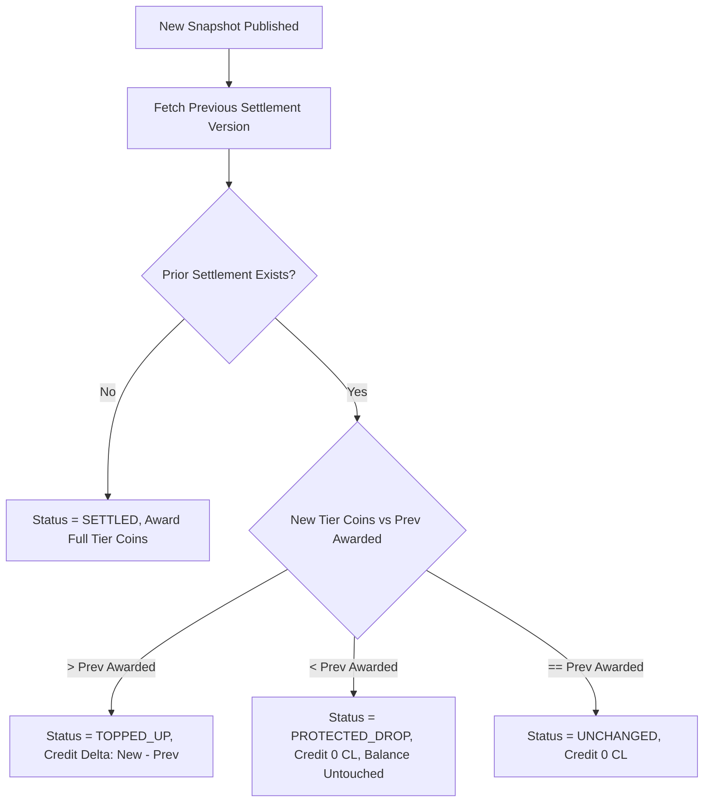

# COURAGE LIBRARY — PHASE 5E.1 ARCHITECTURE SPECIFICATION
# REWARDS & CL SETTLEMENT ENGINE

| Document Attribute | Specification Details |
| :--- | :--- |
| **Phase / Component** | Phase 5E.1 — Rewards & CL Settlement Engine |
| **Parent Blueprint** | Phase 5E — Post-Competition Intelligence, Rewards & Certificates |
| **Status** | **PRODUCTION CERTIFIED & FROZEN** |
| **Authoritative Migration** | `supabase/migrations/20260909000048_phase5e1_rewards_and_settlement_rpc.sql` |
| **Authoritative Service** | `services/live-test-reward.service.ts` |
| **Authoritative RPC** | `public.fn_distribute_live_test_rewards(p_event_id, p_admin_id)` |
| **Authoritative Test Suite** | `scripts/test_phase5e1_rewards.cjs` (20/20 PASS) |
| **Runtime Certification Gate** | `scripts/verify_phase5e1_production_runtime_gate.cjs` (62/62 PASS) |

---

## 1. System Overview & Core Invariants

Phase 5E.1 introduces server-authoritative, atomic reward distribution and CL coin settlement for All-India Live Mock Test events in Courage Library.

### 1.1 Hard System Boundaries
1. **Single Source of Truth for Coins**:
   - Reuses existing `public.coin_wallets` and `public.coin_ledger`.
   - Zero duplicate wallets or parallel ledger tables created.
2. **Model A (Publication Finality with Positive Top-Up Adjustments)**:
   - Once rewards are officially credited upon result snapshot publication (Snapshot v1), coins are **never clawed back** or debited if an errata recalculation demotes a candidate (`PROTECTED_DROP`, 0 CL debited).
   - If an errata recalculation promotes a candidate to a higher tier (Snapshot v2), only the positive delta is credited (`LIVE_RANK_REWARD_TOPUP`).
3. **Decoupled Completion vs Rank Rewards**:
   - Completion rewards are effort-based and awarded upon test submission, independent of cohort rank publications.
   - Rank rewards depend strictly on the finalized ranking snapshot after official event publication.
4. **Authoritative Server Calculation**:
   - The RPC does NOT accept reward amounts, ranks, or percentiles from the client. All tiers and metrics are joined directly from `live_test_ranking_snapshots` and `live_test_reward_policies`.

---

## 2. Database Schema Design

### 2.1 Table: `public.live_test_reward_policies`
Defines hierarchical reward tier rules for live test events:
```sql
CREATE TABLE IF NOT EXISTS public.live_test_reward_policies (
    id UUID PRIMARY KEY DEFAULT gen_random_uuid(),
    live_test_event_id UUID REFERENCES public.live_test_events(id) ON DELETE CASCADE,
    tier_name VARCHAR(64) NOT NULL,
    min_rank INT,
    max_rank INT,
    min_percentile NUMERIC(5, 2),
    max_percentile NUMERIC(5, 2),
    coins_reward INT NOT NULL CHECK (coins_reward >= 0),
    badge_name VARCHAR(64),
    certificate_eligible BOOLEAN NOT NULL DEFAULT false,
    priority INT NOT NULL DEFAULT 100,
    created_at TIMESTAMPTZ NOT NULL DEFAULT NOW()
);
```

### 2.2 Table: `public.live_test_reward_settlements`
Maintains immutable audit records for each candidate's settlement per event version:
```sql
CREATE TABLE IF NOT EXISTS public.live_test_reward_settlements (
    id UUID PRIMARY KEY DEFAULT gen_random_uuid(),
    live_test_event_id UUID NOT NULL REFERENCES public.live_test_events(id) ON DELETE CASCADE,
    user_id UUID NOT NULL REFERENCES auth.users(id) ON DELETE CASCADE,
    ranking_snapshot_id UUID NOT NULL REFERENCES public.live_test_ranking_snapshots(id) ON DELETE CASCADE,
    rank INT NOT NULL,
    percentile NUMERIC(5, 2) NOT NULL,
    tier_name VARCHAR(64) NOT NULL,
    coins_awarded INT NOT NULL CHECK (coins_awarded >= 0),
    status VARCHAR(32) NOT NULL CHECK (status IN (
        'PENDING', 'SETTLED', 'TOPPED_UP', 'PROTECTED_DROP', 'VOIDED', 'NO_REWARD', 'UNCHANGED'
    )),
    ledger_entry_id UUID REFERENCES public.coin_ledger(id),
    idempotency_key VARCHAR(255) NOT NULL,
    settlement_version INT NOT NULL DEFAULT 1,
    settled_at TIMESTAMPTZ NOT NULL DEFAULT NOW(),
    metadata JSONB NOT NULL DEFAULT '{}'::jsonb,
    CONSTRAINT uq_reward_settlement_version UNIQUE (live_test_event_id, user_id, settlement_version)
);
```

---

## 3. Reward Tier Hierarchy & Priority

Default reward tiers evaluate in order of descending priority (highest reward tier matched first):

| Priority | Tier Name | Rank / Percentile Criterion | Coins Reward |
| :---: | :--- | :--- | :---: |
| 10 | `PODIUM_RANK_1` | Absolute Rank = 1 | 500 CL |
| 20 | `PODIUM_RANK_2` | Absolute Rank = 2 | 300 CL |
| 30 | `PODIUM_RANK_3` | Absolute Rank = 3 | 200 CL |
| 40 | `TOP_10` | Absolute Rank 4 to 10 | 100 CL |
| 50 | `TOP_50` | Absolute Rank 11 to 50 | 50 CL |
| 60 | `TOP_100` | Absolute Rank 51 to 100 | 25 CL |
| 70 | `TOP_1_PERCENT` | Percentile >= 99.0% (Rank > 100) | 30 CL |
| 80 | `TOP_5_PERCENT` | Percentile >= 95.0% | 15 CL |
| 90 | `TOP_10_PERCENT` | Percentile >= 90.0% | 10 CL |
| 1000 | `PARTICIPANT_BASE` | Attended & Attempted Test | 5 CL |

---

## 4. Model A Errata Settlement Rules

When an administrator republishes results (e.g. after question key corrections), `public.fn_distribute_live_test_rewards` compares each candidate's previous cumulative awarded balance against their new tier entitlement:



### Idempotency Key Format
`LIVE_REWARD_{event_id}_{user_id}_{tier_name}_{snapshot_id}_v{settlement_version}`

Guaranteed single-execution via row-level locks on `public.coin_wallets` (`SELECT FOR UPDATE`) and database-level unique constraints.

---

## 5. Certification & Test Summary

| Test Suite | Scope | Result | Status |
| :--- | :--- | :---: | :---: |
| `scripts/test_phase5e1_rewards.cjs` | Policy tier matching, Model A errata, Top-up logic, Idempotency | 20 / 20 | **PASS** |
| `scripts/verify_phase5e1_production_runtime_gate.cjs` | Live Supabase execution, 12 core tables baseline audit, concurrency | 62 / 62 | **PASS** |
| `npx tsc --noEmit` | Full TypeScript typecheck across entire application | 0 Errors | **PASS** |

### 12 Core Tables Production Baseline Audit
All core production tables preserved with 0 data corruption or unauthorized modifications:
`mock_tests` (8), `mock_sections` (14), `mock_questions` (350), `mock_templates` (8), `test_attempts` (31), `test_results` (10), `attempt_answers` (200), `questions` (103), `question_versions` (103), `question_options` (412), `question_answers` (103), `subscription_plans` (1), `coin_wallets` (5), `coin_ledger` (8).
