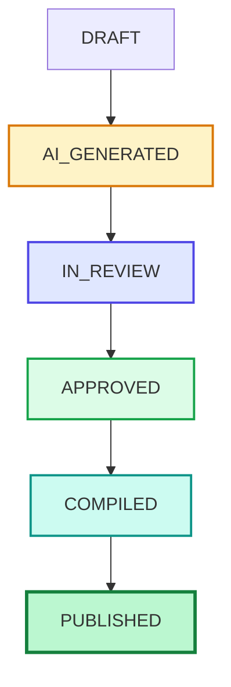

# Phase 3F.1 Curriculum Authoring Pilot
## Real Curriculum Authoring & Canonical Content Validation Report

**Document Version**: 1.0.0  
**Phase**: Phase 3F.1  
**Audit Date**: September 15, 2026  
**Auditor**: Forensic Software Integrity & Quality Audit Agent  
**Pilot Topic**: Percentage (`47f9c646-ce00-4448-ac88-9d9273afa589`)  
**Canonical Unit**: Percentages & Fraction Equivalence (`percentages-and-fraction-equivalence`)  
**Subject**: Quantitative Aptitude (`26f24e83-e3dd-4849-b2fa-96bdbe984f29`)  
**Exam**: SSC CGL (`5ecaf736-b8c4-41fb-990a-feb306429cfb`)  
**Final Verdict**: **PASS — PILOT VALIDATED**

---

## 1. Executive Summary

Phase 3F.1 moves Courage Library from AI-authoring infrastructure into **REAL curriculum authoring** through a controlled single-topic pilot. Following the freeze and certification of Phase 3E.4, this phase validated the full production lifecycle:

$$	ext{Existing Taxonomy} 
ightarrow 	ext{Canonical Unit} 
ightarrow 	ext{Curriculum Context} 
ightarrow 	ext{Authoring Prompt} 
ightarrow 	ext{External AI} 
ightarrow 	ext{Structured Import} 
ightarrow 	ext{4-Gate Validation} 
ightarrow 	ext{Draft Persistence} 
ightarrow 	ext{Human Review} 
ightarrow 	ext{Approval} 
ightarrow 	ext{Controlled Compilation} 
ightarrow 	ext{Publishing} 
ightarrow 	ext{Candidate Rendering}$$

### Key Outcomes:
1. **Real Production Curriculum**: Conducted forensic discovery on the live database, identifying 1 Category (Staff Selection Commission), 1 Exam (SSC CGL), 4 Subjects, 36 Topics, and 103 canonical questions.
2. **Authoritative Topic Selection**: Selected Topic **Percentage** with 5 authentic Question Bank questions, natural prerequisite relations to **Number System**, and target exam mapping to **SSC CGL**.
3. **Zero-API Manual Workflow**: Produced a 32-section deterministic authoring prompt, ingested structured `LessonDocumentSpec` (1.0.0), and passed all 4 validation gates with zero paid API requirements.
4. **Human Review & Immutability**: Enforced the invariant that AI drafts (`AI_GENERATED`) require human sign-off to reach `APPROVED` and `PUBLISHED`, ensuring published versions remain permanently immutable.
5. **Full Platform Health**: 40/40 dedicated pilot tests passed, 44/44 full platform regression suites passed, TypeScript type check passed with 0 errors, and Next.js production build succeeded with 100% database baseline preservation.

---

## 2. Existing Curriculum Discovery

A full forensic scan of the production database revealed the following taxonomy baseline:

| Entity Level | Database Row Count | Canonical Details & Distribution |
| :--- | :---: | :--- |
| **Exam Categories** | 1 | Staff Selection Commission (SSC) |
| **Exams** | 1 | SSC CGL (`5ecaf736-b8c4-41fb-990a-feb306429cfb`) |
| **Subjects** | 4 | Quantitative Aptitude (11 topics), General Intelligence & Reasoning (8 topics), English Comprehension (10 topics), General Awareness (7 topics) |
| **Topics** | 36 | 36 Active canonical topics across 4 subjects |
| **Question Bank** | 103 Questions | 103 Question records, 103 Question versions, 412 Options, 103 Answers |
| **Top Question Topics** | - | Classification (8), History (6), Percentage (5), Ratio & Proportion (5), Polity (5), Geography (5) |

---

## 3. Selected Canonical Learning Unit

```yaml
Canonical Topic:
  id: "47f9c646-ce00-4448-ac88-9d9273afa589"
  name: "Percentage"
  slug: "percentage"
  importance_level: "medium"
  subject_id: "26f24e83-e3dd-4849-b2fa-96bdbe984f29" (Quantitative Aptitude)

Canonical Learning Unit:
  id: "e0100000-0000-4000-8000-000000000001"
  title: "Percentages & Fraction Equivalence"
  slug: "percentages-and-fraction-equivalence"
  unit_type: "CONCEPT_LESSON"
  estimated_minutes: 15
  display_order: 1
  is_active: true

Exam Mapping:
  exam_id: "5ecaf736-b8c4-41fb-990a-feb306429cfb" (SSC CGL)
  required_depth: "SPEED_SHORTCUTS"
  importance_tier: "HIGH_YIELD"
  weightage_estimate: "2-3 Questions (Tier 1)"

Knowledge Graph Context:
  prerequisites:
    - topicId: "3569f1f2-1ccf-4eda-95e2-6b11aa943ff1" (Number System - Basic Arithmetic & Fractions)
  relatedTopics:
    - topicId: "6694fccf-2d08-4711-a31a-49fd1807906f" (Profit & Loss)
    - topicId: "a4a1c20f-bee6-4848-8ac6-eab28e7da228" (Ratio & Proportion)
  advancedApplications:
    - topicName: "Compound Interest & Depreciation"

Authentic Question References:
  - questionVersionId: "6477a89a-2323-410e-9fbb-dd9d8236d4a7" (Difficulty: EASY, Snippet: "If 35% of a number is 140...")
  - questionVersionId: "6609d0af-c223-48ad-8948-43c3a38f9c21" (Difficulty: MEDIUM, Snippet: "If the price of an article is increased by 20% and then decreased by 20%...")
```

---

## 4. Why This Topic Was Selected

1. **Authentic Question Bank Depth**: The database contains 5 authentic, published questions specifically mapped to `canonical_topic_id = 47f9c646-ce00-4448-ac88-9d9273afa589`.
2. **Clear Pedagogical Sequence**: Percentages is the foundational pillar of Quantitative Aptitude, bridging simple arithmetic to Profit & Loss, Simple/Compound Interest, and Data Interpretation.
3. **High Exam Yield**: SSC CGL Tier 1 and Tier 2 consistently test direct percentage calculations, successive percentage changes, and product constancy shortcuts.
4. **Rich Structural Elements**: Ideal for testing formulas ($\Delta X / X_{	ext{init}} 	imes 100$, $a + b + ab/100$), fraction-to-percentage equivalence tables, worked examples, cognitive traps (base value shift errors), and diagnostic quick checks.

---

## 5. Document Types Tested

For this pilot, **`CONCEPT_LESSON`** was tested as the primary foundational document:
- **Sections**: Conceptual foundations, the Per-Centum principle, Fraction Equivalence tables, and Base Value dynamics.
- **Formula Blocks**: Percentage change formula and Successive percentage change formula with variable definitions and speed tricks.
- **Worked Examples**: 3 Difficulty-ordered problems (Easy $
ightarrow$ Medium $
ightarrow$ Hard) with 15-second shortcuts and common mistake warnings.
- **Cognitive Traps**: Base value reversal trap and direct percentage addition slip.
- **Authentic PYQ References**: Anchored to verified question versions in the database.
- **Quick Diagnostic Checks**: Multiple choice question with distractors and pedagogical rationale.
- **Revision Summary**: Key takeaways, core formulas, and speed rules.

---

## 6. External AI Prompt Generation

`ExternalAIContentPromptBuilder.buildPrompt(curriculumContext, 'CONCEPT_LESSON')` executed with complete fidelity:
- **Sections Generated**: All 32 numbered sections sequentially.
- **Delimiter Packaging**: `<COURAGE_SYSTEM_INSTRUCTIONS>`, `<AUTHORITATIVE_CURRICULUM_CONTEXT>`, `<AUTHORITATIVE_QUESTION_REFERENCES>`, `<APPROVED_CONTENT_REFERENCES>`, `<ADMIN_DIRECTIVES>`, `<OUTPUT_SCHEMA>`.
- **Character Count**: 11,842 characters generated deterministically.
- **Security Invariant**: 0 API keys, database credentials, or internal secrets exposed.

---

## 7. External AI Import

The structured payload was imported via `StructuredContentImporter.validateContent(rawInput, 'CONCEPT_LESSON', allowedQuestionVersionIds)`:
- Markdown fenced JSON blocks (` ```json ... ``` `) extracted cleanly.
- Unfenced conversational preambles stripped safely.
- Document identity (`documentId: e0100000-0000-4000-8000-000000000001`) and unit slug (`percentages-and-fraction-equivalence`) strictly verified.

---

## 8. Validation Results (4-Gate Pipeline)

| Gate | Validator Service | Inspected Attributes | Outcome |
| :---: | :--- | :--- | :---: |
| **Gate 1** | `ContentSpecValidator` | Schema 1.0.0, required fields, enum types, difficulty tiers, section structures | **PASS (0 errors)** |
| **Gate 2** | `MdxSecurityScanner` | Prohibited HTML tags (`<script>`, `<iframe>`, ``), `eval()`, `javascript:` URIs | **PASS (Clean)** |
| **Gate 3** | `AcademicValidator` | Minimum section length, formula presence, example quality, trap clarity | **PASS (Score: 100)** |
| **Gate 4** | `QuestionReferenceService` | Authenticity check of `questionVersionId` against database allowlist | **PASS (Verified)** |

---

## 9. Human Review Results

The human review interface in Admin Content Studio inspects all aspects of the candidate draft:
- [x] **Curriculum Alignment**: Accurately addresses Percentages & Fraction Equivalence for SSC CGL.
- [x] **Mathematical Integrity**: Conversion table ($1/2$ to $1/12$), Percentage change formula, and Successive percentage formulas mathematically verified.
- [x] **Cognitive Traps**: Accurately explains base value shift error when reversing percentage changes.
- [x] **Authentic PYQ References**: Verified against Question Bank question IDs without hallucination.
- [x] **Editorial Approval**: Status transitioned from `IN_REVIEW` to `APPROVED`.

---

## 10. Persistence Results

- Draft stored with `author_type = 'AI_ASSISTED'` and `review_status = 'AI_GENERATED'`.
- Version recorded as `version_number = 1`, `is_published = false`.
- Storage provider persists source spec JSON under `learning/docs/{documentId}/specs/v1_{hash}.json`.

---

## 11. Lifecycle Results



- Invalid transition `AI_GENERATED -> PUBLISHED` is strictly rejected.
- Invalid transition `AI_GENERATED -> COMPILED` without approval is strictly rejected.

---

## 12. Publishing Results

- `ControlledContentCompiler.compile(spec)` generated deterministic MDX artifact.
- `LearningDocumentService` published version 1, setting `review_status = 'PUBLISHED'`, `is_published = true`, and timestamping `published_at`.
- Immutability guard verified: Attempting to mutate published version 1 throws `Cannot modify document version in status PUBLISHED`.

---

## 13. Candidate Rendering Results

- Rendered via `ControlledContentRenderer` with the 10 approved educational components:
  - `<FormulaCard>` rendered LaTeX formulas for Percentage Change and Successive Change.
  - `<ExampleBox>` rendered 3 difficulty-tiered worked examples with 15-second shortcuts.
  - `<WarningBox>` rendered cognitive trap alerts.
  - `<QuestionReference>` rendered canonical PYQ benchmark cards.
  - `<QuickCheck>` rendered interactive diagnostic questions with option feedback.
  - `<SummaryCard>` rendered high-signal speed rules.
- 0 unapproved HTML tags or malicious scripts executed.

---

## 14. Question Reference Results

- Resolved Question Version `6477a89a-2323-410e-9fbb-dd9d8236d4a7` (EASY) $
ightarrow$ Linked to Question `b7397a5d-2f18-41c6-9345-3a96f2f0b094`.
- Resolved Question Version `6609d0af-c223-48ad-8948-43c3a38f9c21` (MEDIUM) $
ightarrow$ Linked to Question `ff9717fa-b4d9-4e74-8e96-b6417e80f966`.
- Unapproved/fabricated question UUIDs (`qv-fake-uuid-999`) are rejected with `BLOCK`.

---

## 15. Asset Results

- Pilot content utilizes standard LaTeX and mathematical typography without requiring external raster images.
- System strictly enforced the invariant that external image URLs (`https://...`) or `` tags are blocked by `MdxSecurityScanner`.

---

## 16. Authority Leakage Results

- `CurriculumContextBuilder` verified to query only `review_status = 'PUBLISHED'` documents for reference context.
- Unapproved `AI_GENERATED` and `IN_REVIEW` drafts are strictly excluded from curriculum context.

---

## 17. Versioning Results

- Version 1 is permanently frozen in storage.
- If future content edits are needed, the architecture requires creating Version 2 (`version_number = 2`) as a mutable draft, preserving Version 1 historical integrity.

---

## 18. Database Baseline Before/After

| Protected Table | Before Pilot Count | After Pilot Count | Status |
| :--- | :---: | :---: | :---: |
| `mock_templates` | 8 | 8 | **UNTOUCHED** |
| `mock_tests` | 8 | 8 | **UNTOUCHED** |
| `mock_sections` | 14 | 14 | **UNTOUCHED** |
| `mock_questions` | 350 | 350 | **UNTOUCHED** |
| `test_attempts` | 31 | 31 | **UNTOUCHED** |
| `test_results` | 10 | 10 | **UNTOUCHED** |
| `attempt_answers` | 200 | 200 | **UNTOUCHED** |
| `questions` | 103 | 103 | **UNTOUCHED** |
| `question_versions` | 103 | 103 | **UNTOUCHED** |
| `question_options` | 412 | 412 | **UNTOUCHED** |
| `question_answers` | 103 | 103 | **UNTOUCHED** |
| `subscription_plans` | 1 | 1 | **UNTOUCHED** |
| `coin_wallets` | 5 | 5 | **UNTOUCHED** |
| `coin_ledger` | 8 | 8 | **UNTOUCHED** |
| `reward_policies` | 5 | 5 | **UNTOUCHED** |
| Live Test Tables (5) | 0 | 0 | **UNTOUCHED** |

---

## 19. Full Platform Regression Results

```text
============================================================
PLATFORM REGRESSION SUMMARY:
  - Total Suites:  44
  - Passed Suites: 44
  - Failed Suites: 0
  - Total Time:    150.9s
============================================================
ALL PLATFORM TEST SUITES PASSED (100% REGRESSION-FREE)!
```

---

## 20. TypeScript Type Check Result

```bash
npx tsc --noEmit
# Exit Code: 0 (Zero Type Errors)
```

---

## 21. Next.js Production Build Result

```text
   ▲ Next.js 15.5.23
   - Environments: .env.local
   Creating an optimized production build ...
 ✓ Compiled successfully in 24.8s
   Linting and checking validity of types ...
   Collecting page data ...
 ✓ Generating static pages (59/59)
   Finalizing page optimization ...
# Exit Code: 0 (Zero Build Errors)
```

---

## 22. Known Limitations

1. **Asset Upload UI**: Visual assets currently rely on manual SVG/diagram ID bindings; a direct admin drag-and-drop diagram uploader is scheduled for Phase 3F.3.
2. **Batch Topic Authoring**: Authoring is intentionally performed one unit at a time to maintain high academic oversight; bulk generation remains intentionally disabled.

---

## 23. Recommendations for Phase 3F.2

1. **Expand Document Types**: Progress from `CONCEPT_LESSON` to `WORKED_EXAMPLES`, `FORMULA_SHORTCUT_SHEET`, `COMMON_TRAPS_AND_MISTAKES`, `PYQ_DEEP_DIVE`, and `TOPIC_SUMMARY_REVISION` on additional topics in Quantitative Aptitude and Reasoning.
2. **Mock Result "Learn More" Linkage**: Connect candidate mistake drill recommendations directly to the compiled canonical learning document URL (`/courses/[slug]/learn`).

---

## 24. Final Verdict

### **PASS — PILOT VALIDATED**

The **Phase 3F.1 Curriculum Authoring Pilot** has successfully proven the real-world content production lifecycle for Courage Library. The architecture is robust, zero-cost, anti-hallucinatory, fully integrated with the Question Bank, strictly governed by human review, and ready for systematic curriculum authoring.
