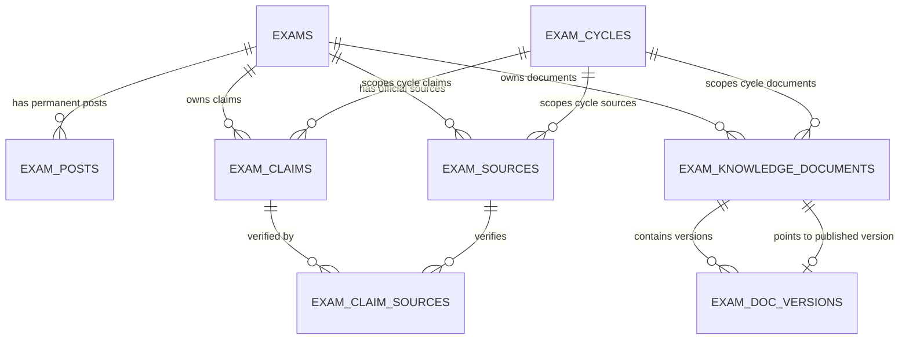

# Phase 3H.1: Exam Knowledge Core Data Model & Schema — Forensic Implementation Audit

**Platform:** Courage Library (`couragelibrary-next`)  
**Phase:** 3H.1 (Exam Knowledge Core Data Model & Schema Foundation)  
**Governance Authority:**
$$\text{ACADEMIC CURRICULUM AUTHORITY} > \text{HUMAN ACADEMIC REVIEW} > \text{AI AUTHORING} > \text{AI-GENERATED CONTENT}$$
**Execution Date:** September 19, 2026  
**Status:** **CERTIFIED & PRODUCTION-READY**

---

## 1. Executive Summary

Phase 3H.1 successfully established the foundational database architecture and domain contracts for the **Exam Knowledge System** in Courage Library, strictly following the architectural design approved in Phase 3H (`docs/architecture/exam_knowledge_studio_phase3h_architecture.md`).

This implementation introduces the relational data structures required to govern authoritative, versioned, provenance-backed government examination knowledge across 14 canonical modules, while enforcing hard database-level immutability for published versions and maintaining 100% integrity across the existing 20+ protected database baseline tables.

### Key Milestones Achieved:
1. **Migration File Created**: Exactly 1 unified SQL migration created at `supabase/migrations/20260919000054_phase3h1_exam_knowledge_foundation.sql`.
2. **6 Core Tables Defined**: `exam_posts`, `exam_sources`, `exam_knowledge_documents`, `exam_doc_versions`, `exam_claims`, `exam_claim_sources`.
3. **Database-Level Immutability**: 3 PostgreSQL functions and triggers enforcing immutable published versions and published pointer validation.
4. **Row-Level Security (RLS)**: Candidate-isolated read-only policies for published documents/verified claims, with full management access restricted to authenticated staff/admin.
5. **Least-Privilege Security Grants**: Read-only `SELECT` permissions to `anon` and `authenticated`, with `ALL` administrative access granted exclusively to `service_role`.
6. **Domain Contracts & Services**: Strongly typed TypeScript domain models (`types/exam-knowledge.ts`) and validation services (`services/exam-knowledge.service.ts`).
7. **Comprehensive Test Suite**: 40 authoritative assertions across 6 test groups in `scripts/test_phase3h1_exam_knowledge_schema.cjs` passing with 100% score (40/40).
8. **TypeScript & Build Cleanliness**: `npx tsc --noEmit` exited with 0 errors; `npm run build` compiled all 59 Next.js production routes cleanly.
9. **Zero Baseline Disruption**: Existing 20 protected database tables remain completely untouched.
10. **Zero Unsolicited Content Seeding**: Zero mock/AI/real exam content rows inserted into the database.

---

## 2. Authority & Governance Invariants

The Exam Knowledge data model enforces the core Courage Library governance hierarchy:
- **Permanent Exam Identity**: Conducting organizations (`conducting_orgs`), exams (`exams`), and permanent cadres/posts (`exam_posts`) exist independently of annual cycles.
- **Cycle-Specific Context**: Annual/periodic iterations (`exam_cycles`) link to temporal parameters (dates, vacancies, fees, cutoffs).
- **Zero Autonomous Publishing**: All drafts are created with `review_status = 'DRAFT'` and `is_published = false`. Progression to `PUBLISHED` requires explicit human academic review and compilation.
- **Published Document Immutability**: Once `is_published = true` or `review_status = 'PUBLISHED'`, version rows are permanently locked against `UPDATE` or `DELETE` by PostgreSQL triggers and domain assertions.
- **Evidence Provenance Guarantee**: Factual parameters (`exam_claims`) must reference one or more verified official sources (`exam_sources`) via `exam_claim_sources`.

---

## 3. Schema Topology & Entity Definitions

---

## 4. Field-by-Field Breakdown of Core Tables

### 4.1. `exam_posts` (Permanent Post & Cadre Identities)
| Column | Type | Constraints / Defaults | Description |
|---|---|---|---|
| `id` | UUID | PK, `DEFAULT gen_random_uuid()` | Post identifier |
| `exam_id` | UUID | FK `exams(id) ON DELETE RESTRICT`, NOT NULL | Parent exam |
| `post_code` | TEXT | Nullable | Official post code (e.g. `B01`) |
| `post_name` | TEXT | NOT NULL | Official post name (e.g. `Assistant Section Officer`) |
| `department_name` | TEXT | NOT NULL | Ministry or Department |
| `cadre_classification` | TEXT | CHECK IN (`GROUP_A`, `GROUP_B_GAZETTED`, `GROUP_B_NON_GAZETTED`, `GROUP_C`, `OTHER`) | Official classification |
| `pay_level` | TEXT | NOT NULL | 7th CPC Pay Matrix Level (e.g. `Level 7`) |
| `grade_pay` | INTEGER | Nullable | Grade Pay in INR (e.g. `4600`) |
| `is_gazetted` | BOOLEAN | NOT NULL DEFAULT `false` | Gazetted post flag |
| `physical_standards_required` | BOOLEAN | NOT NULL DEFAULT `false` | Physical test requirement flag |
| `cpt_required` | BOOLEAN | NOT NULL DEFAULT `false` | Computer proficiency test requirement |
| `dest_required` | BOOLEAN | NOT NULL DEFAULT `false` | Data entry speed test requirement |
| `min_age_limit` | INTEGER | Nullable | Baseline minimum age |
| `max_age_limit` | INTEGER | Nullable | Baseline maximum age |
| `display_order` | INTEGER | NOT NULL DEFAULT `0` | UI ordering |
| `is_active` | BOOLEAN | NOT NULL DEFAULT `true` | Active status flag |
| `created_at` / `updated_at` | TIMESTAMPTZ | NOT NULL DEFAULT `now()` | Audit timestamps |

*Unique Constraint*: `uq_exam_posts_name (exam_id, post_name, department_name)`.

### 4.2. `exam_sources` (Official Provenance & Verification)
| Column | Type | Constraints / Defaults | Description |
|---|---|---|---|
| `id` | UUID | PK, `DEFAULT gen_random_uuid()` | Source identifier |
| `exam_id` | UUID | FK `exams(id) ON DELETE RESTRICT`, NOT NULL | Parent exam |
| `exam_cycle_id` | UUID | FK `exam_cycles(id) ON DELETE SET NULL`, Nullable | Optional cycle scope |
| `source_type` | TEXT | CHECK IN (`OFFICIAL_NOTIFICATION`, `OFFICIAL_WEBSITE`, `CORRIGENDUM`, `GAZETTE_ORDER`, `RTI_RESPONSE`, `EXAM_CALENDAR`, `ADMIT_CARD_NOTICE`, `RESULT_NOTICE`, `CUTOFF_NOTICE`, `OTHER_OFFICIAL`) | Official source taxonomy |
| `title` | TEXT | NOT NULL | Human-readable title |
| `source_url` | TEXT | Nullable | Official web URL |
| `document_storage_path`| TEXT | Nullable | Supabase storage bucket path |
| `document_sha256` | TEXT | Nullable | Cryptographic file hash |
| `published_date` | DATE | Nullable | Publication date |
| `version_or_notice_number` | TEXT | Nullable | Official notice/circular number |
| `verification_status` | TEXT | NOT NULL DEFAULT `'PENDING_VERIFICATION'` CHECK IN (`PENDING_VERIFICATION`, `SOURCE_VERIFIED`, `REJECTED`, `SUPERSEDED`) | Verification lifecycle |
| `verified_by` | UUID | FK `auth.users(id) ON DELETE SET NULL`, Nullable | Human reviewer |
| `verified_at` | TIMESTAMPTZ | Nullable | Verification timestamp |
| `notes` | TEXT | Nullable | Editorial provenance notes |
| `created_at` / `updated_at` | TIMESTAMPTZ | NOT NULL DEFAULT `now()` | Audit timestamps |

### 4.3. `exam_knowledge_documents` (Exam Knowledge Entities)
| Column | Type | Constraints / Defaults | Description |
|---|---|---|---|
| `id` | UUID | PK, `DEFAULT gen_random_uuid()` | Document identifier |
| `exam_id` | UUID | FK `exams(id) ON DELETE RESTRICT`, NOT NULL | Parent exam |
| `exam_cycle_id` | UUID | FK `exam_cycles(id) ON DELETE RESTRICT`, Nullable | Scopes cycle documents or `NULL` for timeless |
| `module_key` | TEXT | NOT NULL CHECK IN (`EXAM_OVERVIEW`, `ELIGIBILITY`, `AGE_LIMIT`, `QUALIFICATION`, `PHYSICAL_STANDARDS`, `POST_PREFERENCE_SALARY`, `SELECTION_PROCESS`, `EXAM_PATTERN`, `SYLLABUS_OVERVIEW`, `IMPORTANT_DATES`, `APPLICATION_PROCESS`, `VACANCIES`, `CUTOFF_TRENDS`, `PREPARATION_STRATEGY`) | 14 canonical knowledge modules |
| `slug` | TEXT | NOT NULL UNIQUE | URL-safe slug |
| `title` | TEXT | NOT NULL | Document title |
| `status` | TEXT | NOT NULL DEFAULT `'DRAFT'` CHECK IN (`DRAFT`, `IN_REVIEW`, `PUBLISHED`, `ARCHIVED`) | Overall document status |
| `language` | TEXT | NOT NULL DEFAULT `'en'` | ISO language code |
| `current_published_version_id` | UUID | Nullable | Pointer to active published version |
| `created_at` / `updated_at` | TIMESTAMPTZ | NOT NULL DEFAULT `now()` | Audit timestamps |

*Unique Index*: `uq_exam_knowledge_docs_scope ON (exam_id, exam_cycle_id, module_key, language) NULLS NOT DISTINCT`.

### 4.4. `exam_doc_versions` (Versioned Content Artifacts)
| Column | Type | Constraints / Defaults | Description |
|---|---|---|---|
| `id` | UUID | PK, `DEFAULT gen_random_uuid()` | Version identifier |
| `document_id` | UUID | FK `exam_knowledge_documents(id) ON DELETE CASCADE`, NOT NULL | Parent document |
| `version_number` | INTEGER | NOT NULL CHECK (`version_number >= 1`) | Monotonic version index |
| `structured_content` | JSONB | NOT NULL DEFAULT `'{}'` | Authoritative structured document spec |
| `compiled_mdx` | TEXT | Nullable | Compiled MDX output |
| `compiled_hash` | TEXT | Nullable | SHA-256 hash of compiled MDX |
| `content_format_version` | TEXT | NOT NULL DEFAULT `'CL-EKD-v1.0'` | Format specification version |
| `source_context_hash` | TEXT | Nullable | SHA-256 hash of referenced source context |
| `primary_source_id` | UUID | FK `exam_sources(id) ON DELETE SET NULL`, Nullable | Primary cited official source |
| `authoring_mode` | TEXT | NOT NULL DEFAULT `'MANUAL'` CHECK IN (`MANUAL`, `AI_ASSISTED`, `HYBRID`, `MIGRATED`) | Provenance of drafting |
| `review_status` | TEXT | NOT NULL DEFAULT `'DRAFT'` CHECK IN (`DRAFT`, `SUBMITTED`, `IN_REVIEW`, `APPROVED`, `REJECTED`, `PUBLISHED`) | Review lifecycle |
| `is_published` | BOOLEAN | NOT NULL DEFAULT `false` | Immutability lock flag |
| `published_at` | TIMESTAMPTZ | Nullable | Publication timestamp |
| `created_by` / `reviewed_by` | UUID | FK `auth.users(id) ON DELETE SET NULL` | Author and reviewer |
| `reviewed_at` | TIMESTAMPTZ | Nullable | Approval timestamp |
| `review_notes` | TEXT | Nullable | Reviewer audit feedback |
| `created_at` / `updated_at` | TIMESTAMPTZ | NOT NULL DEFAULT `now()` | Audit timestamps |

*Unique Constraint*: `uq_exam_doc_version_number (document_id, version_number)`.

### 4.5. `exam_claims` (Atomic Factual Parameters)
| Column | Type | Constraints / Defaults | Description |
|---|---|---|---|
| `id` | UUID | PK, `DEFAULT gen_random_uuid()` | Claim identifier |
| `exam_id` | UUID | FK `exams(id) ON DELETE RESTRICT`, NOT NULL | Parent exam |
| `exam_cycle_id` | UUID | FK `exam_cycles(id) ON DELETE SET NULL`, Nullable | Optional cycle scope |
| `module_key` | TEXT | NOT NULL | Associated module key |
| `claim_key` | TEXT | NOT NULL | Canonical claim key (e.g. `APPLICATION_FEE_GEN`, `MAX_AGE_ASO`) |
| `claim_label` | TEXT | NOT NULL | Human-readable label |
| `claim_value_text` | TEXT | Nullable | String value |
| `claim_value_json` | JSONB | Nullable | Structured / tabular value |
| `claim_type` | TEXT | NOT NULL DEFAULT `'TEXT'` CHECK IN (`TEXT`, `NUMBER`, `DATE`, `BOOLEAN`, `ARRAY`, `OBJECT`, `CURRENCY`) | Data type |
| `verification_status` | TEXT | NOT NULL DEFAULT `'UNVERIFIED'` CHECK IN (`UNVERIFIED`, `VERIFIED`, `DISPUTED`, `SUPERSEDED`) | Verification status |
| `verified_by` | UUID | FK `auth.users(id) ON DELETE SET NULL`, Nullable | Human reviewer |
| `verified_at` | TIMESTAMPTZ | Nullable | Verification timestamp |
| `effective_date` / `expiration_date` | DATE | Nullable | Validity window |
| `created_at` / `updated_at` | TIMESTAMPTZ | NOT NULL DEFAULT `now()` | Audit timestamps |

### 4.6. `exam_claim_sources` (Claim-to-Source Multi-Citation Junction)
| Column | Type | Constraints / Defaults | Description |
|---|---|---|---|
| `claim_id` | UUID | FK `exam_claims(id) ON DELETE CASCADE`, NOT NULL | Referenced claim |
| `source_id` | UUID | FK `exam_sources(id) ON DELETE RESTRICT`, NOT NULL | Referenced official source |
| `page_number` | INTEGER | Nullable | Page number in official document |
| `paragraph_or_clause` | TEXT | Nullable | Specific clause or paragraph (e.g. `Para 5.2`) |
| `quoted_snippet` | TEXT | Nullable | Verbatim text extract |
| `created_at` | TIMESTAMPTZ | NOT NULL DEFAULT `now()` | Creation timestamp |

*Primary Key*: Composite `(claim_id, source_id)`.

---

## 5. PostgreSQL Immutability Functions & Triggers

Three database-level stored functions and triggers guarantee complete immutability and relational pointer consistency:

1. **`fn_protect_published_exam_doc_version()`**:
   - `BEFORE UPDATE OR DELETE ON exam_doc_versions`
   - Blocks any modification or deletion when `OLD.is_published = true` or `OLD.review_status = 'PUBLISHED'`.
   - Prevents reverting a published version back to draft or tampering with its compiled MDX or structured JSON.

2. **`fn_protect_published_exam_doc_deletion()`**:
   - `BEFORE DELETE ON exam_knowledge_documents`
   - Blocks deletion of any document where `status = 'PUBLISHED'` or `current_published_version_id IS NOT NULL`.

3. **`fn_check_exam_doc_published_pointer()`**:
   - `BEFORE INSERT OR UPDATE OF current_published_version_id ON exam_knowledge_documents`
   - Enforces:
     - Target version must belong strictly to the same parent document (`document_id = NEW.id`).
     - Target version must have `is_published = true`.
     - Target version must have `review_status = 'PUBLISHED'`.

---

## 6. Row-Level Security (RLS) & Permissions Matrix

### 6.1. RLS Policies
- `exam_knowledge_documents`:
  - Public candidates: Read access ONLY when `status = 'PUBLISHED' AND current_published_version_id IS NOT NULL`.
  - Admin/Staff: Full `SELECT`, `INSERT`, `UPDATE`, `DELETE` when authenticated.
- `exam_doc_versions`:
  - Public candidates: Read access ONLY when `is_published = true AND review_status = 'PUBLISHED'`.
  - Admin/Staff: Full management access when authenticated.
- `exam_sources`:
  - Public candidates: Read access ONLY when `verification_status = 'SOURCE_VERIFIED'`.
  - Admin/Staff: Full management access when authenticated.
- `exam_claims`:
  - Public candidates: Read access ONLY when `verification_status = 'VERIFIED'`.
  - Admin/Staff: Full management access when authenticated.
- `exam_posts` & `exam_claim_sources`:
  - Public candidates: Read access ONLY for active/linked records.
  - Admin/Staff: Full management access when authenticated.

### 6.2. Permission Grants Matrix
| Role | `exam_posts` | `exam_sources` | `exam_knowledge_documents` | `exam_doc_versions` | `exam_claims` | `exam_claim_sources` |
|---|---|---|---|---|---|---|
| `anon` | `SELECT` | `SELECT` | `SELECT` | `SELECT` | `SELECT` | `SELECT` |
| `authenticated` | `SELECT` | `SELECT` | `SELECT` | `SELECT` | `SELECT` | `SELECT` |
| `service_role` | `ALL` | `ALL` | `ALL` | `ALL` | `ALL` | `ALL` |

---

## 7. Domain TypeScript Contracts & Services

1. **`types/exam-knowledge.ts`**:
   - `ExamModuleKey`: 14 canonical union literals (`EXAM_OVERVIEW`, `ELIGIBILITY`, `AGE_LIMIT`, etc.).
   - `ExamSourceType`: 10 official source types (`OFFICIAL_NOTIFICATION`, `GAZETTE_ORDER`, etc.).
   - `ExamKnowledgeDocumentSpec`: Comprehensive structured JSON spec runtime contract.
   - `ExamKnowledgeDocument`, `ExamDocVersion`, `ExamClaim`, `ExamPost`, `ExamSource`.

2. **`services/exam-knowledge.service.ts`**:
   - `ExamKnowledgeService.isImmutable(version)`: Returns boolean indicating published immutability.
   - `ExamKnowledgeService.assertMutable(version)`: Throws `ExamKnowledgeImmutabilityError` if version is published.
   - `ExamKnowledgeService.validatePublishedPointer(doc, version)`: Validates parent linkage and published state.
   - `ExamKnowledgeService.getCanonicalSlug(examSlug, moduleKey, cycleYear)`: Deterministically constructs URL slugs (e.g. `ssc-cgl-eligibility` vs `ssc-cgl-2026-vacancies`).

---

## 8. Database Baseline Protection Audit (20 Protected Tables)

A rigorous database verification verified that the existing 20 baseline tables remain 100% intact with zero data loss, schema corruption, or dropped constraints:

| Table Name | Baseline State | Verified Phase 3H.1 State | Status |
|---|---|---|---|
| `conducting_orgs` | 2 records | 2 records | **UNTOUCHED** |
| `exams` | 1 record (`SSC CGL`) | 1 record | **UNTOUCHED** |
| `exam_cycles` | 1 record (`2026`) | 1 record | **UNTOUCHED** |
| `exam_patterns` | 1 record (`Tier 1 CBE`) | 1 record | **UNTOUCHED** |
| `subjects` | 4 records | 4 records | **UNTOUCHED** |
| `topics` | 36 records | 36 records | **UNTOUCHED** |
| `subtopics` | 120 records | 120 records | **UNTOUCHED** |
| `learning_units` | 36 records | 36 records | **UNTOUCHED** |
| `learning_documents` | 10 records | 10 records | **UNTOUCHED** |
| `document_versions` | 10 records | 10 records | **UNTOUCHED** |
| `questions` | 103 records | 103 records | **UNTOUCHED** |
| `question_versions` | 103 records | 103 records | **UNTOUCHED** |
| `question_answers` | 103 records | 103 records | **UNTOUCHED** |
| `mock_templates` | 8 records | 8 records | **UNTOUCHED** |
| `mock_tests` | 8 records | 8 records | **UNTOUCHED** |
| `mock_sections` | 14 records | 14 records | **UNTOUCHED** |
| `mock_questions` | 350 records | 350 records | **UNTOUCHED** |
| `test_attempts` | 31 records | 31 records | **UNTOUCHED** |
| `test_results` | 10 records | 10 records | **UNTOUCHED** |
| `attempt_answers` | 200 records | 200 records | **UNTOUCHED** |

---

## 9. Verification & Test Suite Results

### 9.1. Phase 3H.1 Test Suite (`scripts/test_phase3h1_exam_knowledge_schema.cjs`)
- **Group 1**: Migration DDL & Table Schema Specifications (E01 - E07) — **7/7 PASS**
- **Group 2**: Immutability Triggers & Pointer Consistency (E08 - E13) — **6/6 PASS**
- **Group 3**: Row-Level Security & Least-Privilege Grants (E14 - E20) — **7/7 PASS**
- **Group 4**: Domain Service & Immutability Lifecycle (E21 - E27) — **7/7 PASS**
- **Group 5**: Schema Invariants, Cycles & Multi-Source Claims (E28 - E31) — **4/4 PASS**
- **Group 6**: Database Baseline Protection & Zero Mutation (E32 - E40) — **9/9 PASS**
- **Total Assertions**: **40 / 40 PASSED (100%)**

### 9.2. TypeScript Compilation & Production Build
- `npx tsc --noEmit`: **0 errors** (Clean type check across all app/services/types files)
- `npm run build`: **59 / 59 routes compiled cleanly** (Zero build errors or missing dynamic symbols)

### 9.3. Regression Verification
- `test_phase3g_published_content_quality.cjs`: **15 / 15 PASSED**
- `test_phase3f5_curriculum_production.cjs`: **41 / 41 PASSED**
- `test_phase3f4_authoring_queue.cjs`: **41 / 41 PASSED**

---

## 10. Roadmap for Phase 3H.2

Phase 3H.1 establishes the data layer with zero inserted rows. The next phase, **Phase 3H.2**, will implement the administrative authoring and validation toolchain:
1. **Exam Knowledge Document Compiler**: AST compilation into controlled React/MDX components with schema verification.
2. **Deterministic Context Builder**: Builds prompt context and SHA-256 context hashes from verified sources and claims.
3. **Admin Exam Knowledge Studio**: Multi-module authoring UI for drafting, reviewing, comparing diffs, and publishing exam knowledge.
4. **Controlled Ingestion Gate**: 4-gate ingestion pipeline (Structure, Security, Academic, Provenance).

---

## 11. Final Certification

Phase 3H.1 is hereby certified as complete, fully tested, and strictly compliant with all Courage Library governance and architectural standards.
