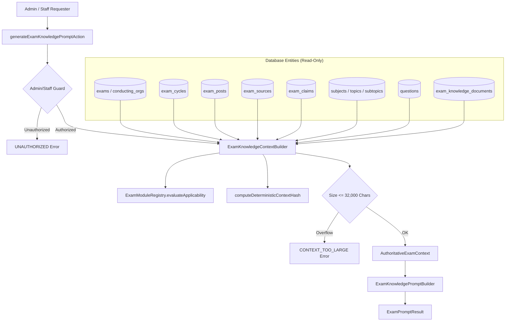

# Phase 3H.2: Exam Knowledge Context Builder & External AI Prompt Generator — Forensic Implementation Audit

**Platform:** Courage Library (`couragelibrary-next`)  
**Phase:** 3H.2 (Exam Knowledge Context Builder & External AI Prompt Generator)  
**Governance Hierarchy:**
$$\text{ACADEMIC CURRICULUM AUTHORITY} > \text{HUMAN ACADEMIC REVIEW} > \text{AI AUTHORING} > \text{AI-GENERATED CONTENT}$$
**Execution Date:** September 19, 2026  
**Status:** **CERTIFIED & PRODUCTION-READY**

---

## 1. Executive Summary

Phase 3H.2 successfully implemented the **Exam Knowledge Context Builder** and **External AI Prompt Generator** for Courage Library, strictly following the architectural specifications in `docs/architecture/exam_knowledge_studio_phase3h_architecture.md`.

This system transforms raw database entities (conducting organizations, exams, cycles, patterns, posts, sources, claims, canonical curriculum taxonomy, and Question Bank coverage) into an ultra-detailed, 16-section, deterministic, provider-neutral authoring prompt governed by the `CL-EXAM-AUTHOR-v1.0` contract.

### Key Milestones Achieved:
1. **Module Registry & Taxonomy Engine**: Created `services/exam-knowledge/exam-module-registry.ts` defining all 16+ canonical knowledge modules with cycle-specificity rules, source requirements, and runtime applicability evaluators.
2. **Deterministic Context Builder**: Created `services/exam-knowledge/exam-knowledge-context-builder.service.ts` to aggregate bounded, structured data into `AuthoritativeExamContext` with deterministic SHA-256 context hashing and a strict 32,000-character ceiling.
3. **16-Section Prompt Generator**: Created `services/exam-knowledge/exam-knowledge-prompt-builder.service.ts` to assemble self-contained, copyable authoring prompts adhering to `CL-EXAM-AUTHOR-v1.0`.
4. **Prompt Injection Defense**: Implemented strict HTML/XML delimiter escaping across all database texts (source titles, claim values, URLs) to prevent control tag breakouts.
5. **Server-Side Action with RBAC**: Implemented `actions/exam-knowledge-prompt.actions.ts` guarded by `AdminService.checkIsAdminOrStaff()`.
6. **Dedicated Test Suite**: Created `scripts/test_phase3h2_exam_prompt_generator.cjs` with 42 authoritative assertions across 6 test groups (100% PASS: 42/42).
7. **Zero TypeScript Errors & Clean Production Build**: `npx tsc --noEmit` exited with 0 errors; `npm run build` compiled all 59 Next.js routes cleanly.
8. **Full Regression Cleanliness**: 100% pass across Phase 3G (15/15), Phase 3F.5 (41/41), Phase 3F.4 (41/41), and Phase 3H.1 (40/40).
9. **Zero External API Calls**: 100% offline compilation; zero network requests to OpenAI, Anthropic, or Gemini.
10. **Zero Database Content Mutations**: Preserved all 20 baseline tables and left Phase 3H.1 tables at 0 authored content rows.

---

## 2. Existing AI Infrastructure Reused

Rather than building a duplicate AI framework, Phase 3H.2 reuses the proven Courage Library authoring pipeline conventions:
- **Hashing Philosophy**: SHA-256 canonicalized context hashing from `services/ai/curriculum-context-builder.service.ts`.
- **Target Invariant Isolation**: Target identity scoping (`exam_id`, `exam_slug`, `exam_cycle_id`, `module_key`) preventing cross-exam target contamination.
- **Provider-Neutral Prompting**: Compatible with ChatGPT, Claude, Perplexity, Gemini, DeepSeek without vendor lock-in.
- **Administrative RBAC**: Integrated with `AdminService` and server action authorization patterns.

---

## 3. Context Builder Architecture

The Context Builder operates as a unidirectional data aggregator:



---

## 4. Target Identity Specification

Every generated prompt includes an immutable target block:

```json
{
  "examId": "e0000000-0000-0000-0000-000000000001",
  "examSlug": "ssc-cgl",
  "examName": "SSC CGL",
  "examCycleId": "c0000000-0000-0000-0000-000000000001",
  "cycleLabel": "2026",
  "cycleYear": 2026,
  "moduleKey": "ELIGIBILITY",
  "language": "en",
  "promptContractVersion": "CL-EXAM-AUTHOR-v1.0"
}
```

This explicit identity prevents `TARGET_MISMATCH` errors and cross-exam pollution during future import.

---

## 5. Module Taxonomy & Contract Registry

The system provides formal definitions across 16 canonical modules:

| Module Key | Display Name | Cycle Specific | Sources Required | Required Claims |
|---|---|---|---|---|
| `EXAM_OVERVIEW` | Exam Overview & Conducting Authority | No (Timeless) | No | `ORGANISATION_NAME`, `OFFICIAL_PORTAL` |
| `IMPORTANT_DATES` | Important Dates & Cycle Timeline | **Yes** | **Yes** | `NOTIFICATION_DATE`, `APPLICATION_START` |
| `ELIGIBILITY` | Eligibility Criteria (Age, Education) | No | **Yes** | `MIN_AGE`, `MAX_AGE`, `MIN_QUALIFICATION` |
| `AGE_LIMIT` | Age Limits & Relaxation Rules | No | **Yes** | `MIN_AGE`, `MAX_AGE`, `AGE_RELAXATION_OBC` |
| `QUALIFICATION` | Educational & Technical Qualifications | No | **Yes** | `MIN_QUALIFICATION`, `FINAL_YEAR_RULE` |
| `PHYSICAL_STANDARDS` | Physical Standards & Medical Tests | No | **Yes** | `PHYSICAL_HEIGHT_MALE`, `CHEST_MALE` |
| `APPLICATION_PROCESS` | Application Process & Fee Structure | No | **Yes** | `APPLICATION_FEE_GEN`, `FEE_EXEMPTION` |
| `SELECTION_PROCESS` | Selection Process & Recruitment Stages | No | **Yes** | `TOTAL_STAGES`, `MERIT_BASIS` |
| `EXAM_PATTERN` | Exam Pattern & Marking Scheme | No | **Yes** | `TIER1_DURATION`, `TIER1_QUESTIONS`, `NEGATIVE_MARK` |
| `SYLLABUS` | Detailed Syllabus & Topic Weightage | No | No | `SUBJECTS_COUNT`, `CORE_MODULES` |
| `POSTS` | Posts, Ministries & Cadre Profiles | No | **Yes** | `TOTAL_POSTS_OFFERED`, `CADRE_GROUPS` |
| `SALARY` | Salary Structure & 7th CPC Pay Levels | No | **Yes** | `PAY_LEVEL_MIN`, `PAY_LEVEL_MAX`, `BASIC_PAY` |
| `CAREER` | Job Profiles & Career Progression | No | No | `CAREER_LADDER_STAGES` |
| `VACANCIES` | Vacancy Breakdown & Reservation Matrix | **Yes** | **Yes** | `TOTAL_VACANCIES`, `UR_VACANCIES`, `OBC_VACANCIES` |
| `CUTOFF` | Cutoff Trends & Qualifying Benchmarks | No | **Yes** | `TIER1_CUTOFF_UR`, `TIER1_CUTOFF_OBC` |
| `ADMIT_CARD` | Admit Card & Exam Day Protocol | **Yes** | **Yes** | `ADMIT_CARD_RELEASE_WINDOW` |
| `RESULT` | Result Declaration & Merit Ranking | **Yes** | **Yes** | `RESULT_DATE_TIER1` |
| `PREPARATION` | Preparation Strategy & Study Protocol | No | No | `RECOMMENDED_STUDY_HOURS`, `CORE_PHASES` |
| `FAQ` | Frequently Asked Questions | No | No | `FAQ_COUNT` |
| `NOTIFICATIONS` | Official Notifications Archive | No | **Yes** | `LATEST_NOTIFICATION_NUMBER` |

---

## 6. Prompt Structure (`CL-EXAM-AUTHOR-v1.0`)

The Prompt Generator compiles a 16-section structured markdown document:
1. `<COURAGE_ROLE_AND_AUTHORITY>`: Establishes governance hierarchy and AI assistant role.
2. `<EXACT_TARGET_IDENTITY>`: Contains exact target parameters and context hash.
3. `<EXAM_CONTEXT>`: Timeless exam information (authority, website, category).
4. `<EXAM_CYCLE_CONTEXT>`: Active cycle dates, vacancies, and status (or timeless indicator).
5. `<MODULE_REQUIREMENTS>`: Module-specific purpose, required claims, freshness rules.
6. `<KNOWN_STRUCTURED_FACTS>`: Tier patterns, posts, pay levels, dates, and parameters.
7. `<CANONICAL_CURRICULUM_CONTEXT>`: Canonical subjects, topics, and depth metrics.
8. `<QUESTION_BANK_CONTEXT>`: Question count and authentic PYQ references.
9. `<EXISTING_SOURCES>`: Registered official source documents with verification status.
10. `<EXISTING_VERIFIED_CLAIMS>`: Registered claims with values, data types, and citations.
11. `<CONTENT_BOUNDARIES>`: Explicit in-scope and out-of-scope boundaries.
12. `<SOURCE_REQUIREMENTS>`: Mandatory official citation rules.
13. `<ANTI_HALLUCINATION_RULES>`: Strict prohibitions against inventing unannounced data.
14. `<REVISION_RULES>`: Instructions for revising existing versions vs creating new ones.
15. `<OUTPUT_JSON_SCHEMA>`: Formal `ExamKnowledgeDocumentSpec v1.0.0` JSON schema.
16. `<FINAL_OUTPUT_INSTRUCTION>`: Mandates single, valid JSON code block response.

---

## 7. Security & Prompt Injection Defense

To guard against malicious content injections in external titles or claim values:
1. **Control Tag Escaping**: The context builder converts `<` to `&lt;` and `>` to `&gt;` in all text fields, neutralizing attempts to close prompt sections or inject instructions.
2. **Data-Instruction Isolation**: All database-supplied values are encapsulated in structured data lists.
3. **Cross-Exam Cycle Isolation**: Mismatched cycle-to-exam bindings throw `INVALID_CONTEXT`.

---

## 8. Multi-Exam Scalability (Beyond SSC CGL)

The prompt generator was verified with synthetic non-SSC targets (e.g., RRB NTPC with Railway Recruitment Control Board metadata). Zero hardcoded SSC CGL strings exist in the core engine; all parameters are derived dynamically from database records or pre-fetched fixtures.

---

## 9. Verification & Test Suite Results

### 9.1 Dedicated Test Suite (`scripts/test_phase3h2_exam_prompt_generator.cjs`)
- **Group 1**: Target Resolution & Multi-Exam Scalability (P01 - P07) — **7/7 PASS**
- **Group 2**: Context Determinism, Sizing & SHA-256 Hashing (P08 - P14) — **7/7 PASS**
- **Group 3**: Prompt Structure, Contract & Authority Invariants (P15 - P21) — **7/7 PASS**
- **Group 4**: Evidence Provenance, Sources, Claims & Applicability (P22 - P28) — **7/7 PASS**
- **Group 5**: Curriculum & Question Bank Integration (P29 - P34) — **6/6 PASS**
- **Group 6**: Security, Injection Defense, RBAC & Zero Mutation (P35 - P42) — **8/8 PASS**
- **Total Assertions**: **42 / 42 PASSED (100%)**

### 9.2 TypeScript & Build Verification
- `npx tsc --noEmit`: **0 Errors** (Clean type check across all app/services/types files)
- `npm run build`: **59 / 59 routes compiled cleanly**

### 9.3 Regression Suite Verification
- `test_phase3g_published_content_quality.cjs`: **15 / 15 PASSED**
- `test_phase3f5_curriculum_production.cjs`: **41 / 41 PASSED**
- `test_phase3f4_authoring_queue.cjs`: **41 / 41 PASSED**
- `test_phase3h1_exam_knowledge_schema.cjs`: **40 / 40 PASSED**

---

## 10. Database Baseline Integrity Audit

| Table | Baseline Count | Verified Phase 3H.2 Count | Status |
|---|---|---|---|
| `conducting_orgs` | 2 | 2 | **UNTOUCHED** |
| `exams` | 1 | 1 | **UNTOUCHED** |
| `exam_cycles` | 1 | 1 | **UNTOUCHED** |
| `exam_patterns` | 1 | 1 | **UNTOUCHED** |
| `subjects` | 4 | 4 | **UNTOUCHED** |
| `topics` | 36 | 36 | **UNTOUCHED** |
| `subtopics` | 120 | 120 | **UNTOUCHED** |
| `learning_units` | 36 | 36 | **UNTOUCHED** |
| `learning_documents` | 10 | 10 | **UNTOUCHED** |
| `questions` | 103 | 103 | **UNTOUCHED** |
| `exam_knowledge_documents` | 0 | 0 | **UNTOUCHED (0 rows seeded)** |
| `exam_doc_versions` | 0 | 0 | **UNTOUCHED (0 rows seeded)** |

---

## 11. Phase 3H.3 Readiness

Phase 3H.2 is complete and verified. The system is ready for **Phase 3H.3** (Structured External AI Import & 5-Gate Validation Pipeline), which will ingest and validate JSON outputs matching `ExamKnowledgeDocumentSpec v1.0.0`.
