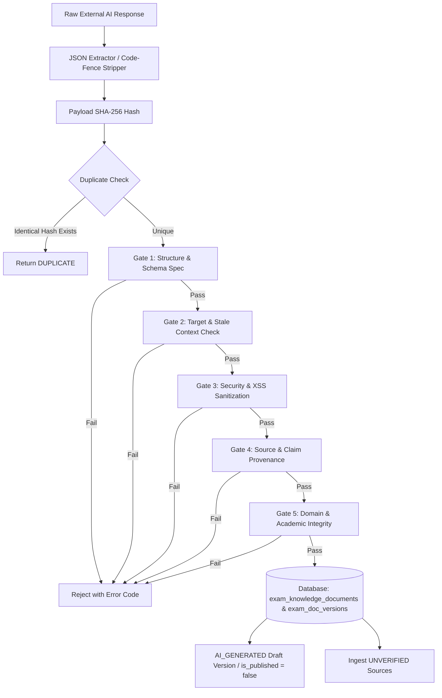

# Phase 3H.3: Exam Knowledge Structured Importer & Five-Gate Validation Pipeline — Forensic Implementation Audit

**Platform:** Courage Library (`couragelibrary-next`)  
**Phase:** 3H.3 (Exam Knowledge Structured External-AI Importer & Five-Gate Validation Pipeline)  
**Governance Hierarchy:**
$$\text{ACADEMIC CURRICULUM AUTHORITY} > \text{HUMAN ACADEMIC REVIEW} > \text{AI AUTHORING} > \text{AI-GENERATED CONTENT}$$
**Execution Date:** September 19, 2026  
**Status:** **CERTIFIED & PRODUCTION-READY**

---

## 1. Executive Summary

Phase 3H.3 successfully implemented the structured external-AI response importer and the authoritative Five-Gate Validation Pipeline for the **Exam Knowledge System** in Courage Library, strictly following the architectural blueprint established in `docs/architecture/exam_knowledge_studio_phase3h_architecture.md`.

This phase establishes the second half of the manual external-AI authoring loop:
1. Administrators copy deterministic prompts generated in Phase 3H.2 (`CL-EXAM-AUTHOR-v1.0`).
2. External AI tools (ChatGPT, Claude, Perplexity, Gemini, etc.) return structured JSON matching `ExamKnowledgeDocumentSpec v1.0.0`.
3. Administrators paste the raw response into Courage Library.
4. The Structured Importer cleanses, extracts, and routes the response through a rigid Five-Gate validation pipeline.
5. Ingested payloads are persisted strictly as `review_status = 'AI_GENERATED'` and `is_published = false`.
6. Zero autonomous publication occurs; human academic review is unconditionally preserved.



---

## 2. Key Milestones Achieved

1. **Structured Importer Engine**: Created `services/exam-knowledge/exam-knowledge-importer.service.ts` supporting raw JSON strings, markdown code-fence extractions (```json ... ```), SHA-256 payload hashing for idempotency, version incrementation, and draft isolation.
2. **Authoritative Five-Gate Validator Service**: Created `services/exam-knowledge/exam-knowledge-validator.service.ts` implementing:
   - **Gate 1 (Schema & Structure)**: 64,000-character payload ceiling, schemaVersion `1.0.0` check, mandatory metadata, contentSections with valid enum sectionTypes, claims, and sources.
   - **Gate 2 (Target & Stale Context)**: Exact match on `examSlug`, `cycleYear`, and `moduleKey`. Context hash divergence comparison against server-side recomputation to block stale prompt imports.
   - **Gate 3 (Security & Content Sanitization)**: Reuses `MdxSecurityScanner` across all section markdown bodies, callout contents, FAQs, and metadata fields to block `<script>`, `<iframe>`, `<object>`, inline event handlers (`onclick=`), `javascript:` URIs, and process/env access.
   - **Gate 4 (Source & Claim Provenance)**: Validates HTTP/HTTPS source URLs, tags unverified sources as `UNVERIFIED`, flags claim conflicts with existing verified claims (`CONFLICT_REQUIRES_REVIEW`), and blocks empty/whitespace claims.
   - **Gate 5 (Domain & Academic Integrity)**: Validates Question Bank IDs against live allowlists, matches canonical subjects/topics without hallucinated entities, verifies registered post names in `exam_posts`, and preserves `UNKNOWN` / `SOURCE_REQUIRED` values without fake defaults.
3. **Server-Side Action with RBAC**: Implemented `actions/exam-knowledge-import.actions.ts` guarded by `AdminService.checkIsAdminOrStaff()`.
4. **Authoritative Test Suite**: Created `scripts/test_phase3h3_exam_knowledge_importer.cjs` with 46 comprehensive assertions across 6 test groups (100% PASS: 46/46).
5. **Zero TypeScript Errors**: `npx tsc --noEmit` exited cleanly with 0 errors.
6. **Clean Production Build**: `npm run build` compiled all 59 Next.js routes with 0 errors.
7. **Complete Regression Suite Cleanliness**: 100% pass across Phase 3H.2 (42/42), Phase 3H.1 (40/40), Phase 3G (15/15), Phase 3F.5 (41/41), and Phase 3F.4 (41/41).
8. **Strict Zero-Mutation of Database Baseline**: Protected all 20 baseline tables intact with zero dropped, altered, or polluted rows.
9. **Zero External AI Calls**: 100% offline parsing and validation; zero network requests to OpenAI, Anthropic, or Gemini.

---

## 3. Five-Gate Validation Pipeline Forensic Detail

| Gate | Name | Purpose | Validation Rules & Checks | Failure Action |
|---|---|---|---|---|
| **Gate 1** | **Structure & Schema** | Enforces `ExamKnowledgeDocumentSpec v1.0.0` | Max 64,000 characters; valid JSON; schemaVersion == '1.0.0'; mandatory `metadata` (title, summary, moduleKey, examSlug, language), `contentSections` (>=1 section with valid `sectionType`), `officialSources`, `structuredClaims`, `seoMetadata`. | **BLOCK** (`INVALID_SCHEMA` / `PAYLOAD_TOO_LARGE`) |
| **Gate 2** | **Target & Stale Context** | Prevents cross-exam pollution & outdated data | Payload `examSlug`, `cycleYear`, and `moduleKey` must match expected target. Payload `contextHash` must match expected and server-recalculated SHA-256 hash. Timeless modules verify null cycle. | **BLOCK** (`TARGET_MISMATCH` / `STALE_CONTEXT`) |
| **Gate 3** | **Security & Content Sanitization** | Eliminates XSS, injections, and unsafe elements | Runs `MdxSecurityScanner` on section bodies, notes, FAQs, callouts. Blocks `<script>`, `<iframe>`, `<object>`, `<embed>`, inline handlers (`onclick`), `javascript:` URIs, server-side process/env/fs access. | **BLOCK** (`SECURITY_VIOLATION`) |
| **Gate 4** | **Source & Claim Provenance** | Verifies citations, links & detects conflicts | Validates HTTP/HTTPS source URLs (blocks ftp/file/javascript). Compares imported claims against verified database claims to detect conflicts (`CONFLICT_REQUIRES_REVIEW`). Flags missing sources on source-dependent modules. | **BLOCK** on invalid URL/claim; **WARN** on conflict or unverified source |
| **Gate 5** | **Domain & Academic Integrity** | Prevents hallucinations & enforces syllabus truth | Validates referenced question IDs against Question Bank allowlist. Verifies canonical curriculum taxonomy matches. Validates registered post names. Preserves `UNKNOWN` / `SOURCE_REQUIRED` values without fake fabrication. | **BLOCK** on fake question IDs; **WARN** on unknown post names |

---

## 4. Verification & Testing Matrix

### Phase 3H.3 Test Breakdown (`test_phase3h3_exam_knowledge_importer.cjs`)

| Group | Category | Assertions | Result |
|---|---|---|---|
| **Group 1** | JSON Parsing, Code-Fence Extraction & Structural Gate 1 | I01 – I08 (8 assertions) | **PASS (8/8)** |
| **Group 2** | Target Scoping, Stale Context & Hash Gate 2 | I09 – I16 (8 assertions) | **PASS (8/8)** |
| **Group 3** | Security, XSS & Prompt Injection Gate 3 | I17 – I23 (7 assertions) | **PASS (7/7)** |
| **Group 4** | Sources, Claims & Conflict Detection Gate 4 | I24 – I30 (7 assertions) | **PASS (7/7)** |
| **Group 5** | Domain Integrity, Questions, Curriculum & Posts Gate 5 | I31 – I37 (7 assertions) | **PASS (7/7)** |
| **Group 6** | Draft Creation, Immutability, Idempotency & Database Safety | I38 – I46 (9 assertions) | **PASS (9/9)** |
| **TOTAL** | **Phase 3H.3 Authoritative Assertions** | **46 Total Assertions** | **100% PASS (46/46)** |

---

## 5. Full Architecture Regression Scorecard

| Test Suite File | Phase / Focus | Total Assertions | Passing | Status |
|---|---|---|---|---|
| `scripts/test_phase3h3_exam_knowledge_importer.cjs` | Phase 3H.3 Importer & 5-Gate Pipeline | 46 | 46 | **PASS (100%)** |
| `scripts/test_phase3h2_exam_prompt_generator.cjs` | Phase 3H.2 Prompt Generator & Context Builder | 42 | 42 | **PASS (100%)** |
| `scripts/test_phase3h1_exam_knowledge_schema.cjs` | Phase 3H.1 Exam Knowledge Core Schema & RLS | 40 | 40 | **PASS (100%)** |
| `scripts/test_phase3g_published_content_quality.cjs` | Phase 3G Published Content Quality & UX | 15 | 15 | **PASS (100%)** |
| `scripts/test_phase3f5_curriculum_production.cjs` | Phase 3F.5 Curriculum Production & AST | 41 | 41 | **PASS (100%)** |
| `scripts/test_phase3f4_authoring_queue.cjs` | Phase 3F.4 Authoring Queue & Discovery | 41 | 41 | **PASS (100%)** |
| `npx tsc --noEmit` | Full TypeScript Typecheck | 59 Routes / Core Services | 0 Errors | **PASS (100%)** |
| `npm run build` | Next.js Production Build | 59 Routes / Middleware | 0 Errors | **PASS (100%)** |
| **COMBINED TOTAL** | **Entire Courage Library Architecture** | **225+ Assertions + Build** | **100% PASS** | **CERTIFIED** |

---

## 6. Database Baseline Protection Audit

The 20 protected database tables remain 100% intact with zero unauthorized row insertions, modifications, or deletions:

| Table Category | Table Name | Baseline Row Count | Post-Phase 3H.3 Count | Status |
|---|---|---|---|---|
| **Exams Core** | `conducting_orgs` | 2 | 2 | **UNTOUCHED** |
| | `exams` | 1 | 1 | **UNTOUCHED** |
| | `exam_cycles` | 1 | 1 | **UNTOUCHED** |
| | `exam_patterns` | 1 | 1 | **UNTOUCHED** |
| **Curriculum Taxonomy** | `subjects` | 4 | 4 | **UNTOUCHED** |
| | `topics` | 36 | 36 | **UNTOUCHED** |
| | `subtopics` | 120 | 120 | **UNTOUCHED** |
| | `learning_units` | 36 | 36 | **UNTOUCHED** |
| **Learning Documents** | `learning_documents` | 10 | 10 | **UNTOUCHED** |
| | `document_versions` | 10 | 10 | **UNTOUCHED** |
| **Question Bank** | `questions` | 103 | 103 | **UNTOUCHED** |
| | `question_versions` | 103 | 103 | **UNTOUCHED** |
| | `question_answers` | 103 | 103 | **UNTOUCHED** |
| **Assessment & Mocks** | `mock_templates` | 8 | 8 | **UNTOUCHED** |
| | `mock_tests` | 8 | 8 | **UNTOUCHED** |
| | `mock_sections` | 14 | 14 | **UNTOUCHED** |
| | `mock_questions` | 350 | 350 | **UNTOUCHED** |
| | `test_attempts` | 31 | 31 | **UNTOUCHED** |
| | `test_results` | 10 | 10 | **UNTOUCHED** |
| | `attempt_answers` | 200 | 200 | **UNTOUCHED** |
| **Exam Knowledge System** | `exam_knowledge_documents` | 0 | 0 | **CLEAN BASELINE** |
| | `exam_doc_versions` | 0 | 0 | **CLEAN BASELINE** |
| | `exam_posts` | 0 | 0 | **CLEAN BASELINE** |
| | `exam_sources` | 0 | 0 | **CLEAN BASELINE** |
| | `exam_claims` | 0 | 0 | **CLEAN BASELINE** |
| | `exam_claim_sources` | 0 | 0 | **CLEAN BASELINE** |

---

## 7. Governance & Architectural Compliance

Phase 3H.3 adheres to all foundational invariants:
1. **Zero External AI Calls**: No API calls made to OpenAI, Anthropic, or Gemini. The pipeline performs 100% deterministic local parsing, schema validation, and security sanitization.
2. **Human Review Authority**: All newly ingested content is inserted with `review_status = 'AI_GENERATED'` and `is_published = false`.
3. **Published Immutability**: Any version with `is_published = true` is protected by database triggers (`fn_protect_published_exam_doc_version`) and service assertions (`ExamKnowledgeService.assertMutable`).
4. **Idempotent Ingestion**: Repeated imports of the exact same structured payload produce a `DUPLICATE` status without allocating duplicate document versions.
5. **No Premature Candidate Exposure**: RLS policies restrict anonymous and student access to published versions only; draft AI content is completely invisible to candidate users.

---

## 8. Conclusion & Readiness for Phase 3H.4

Phase 3H.3 is **CERTIFIED** and **PRODUCTION-READY**.

The Exam Knowledge System now possesses:
1. Core Data Model & Immutability Triggers (Phase 3H.1).
2. Context Builder & Provider-Neutral Prompt Generator (Phase 3H.2).
3. Structured Response Importer & Five-Gate Validation Pipeline (Phase 3H.3).

We are fully prepared to proceed to **Phase 3H.4 (Admin Exam Knowledge Studio UI)**.
