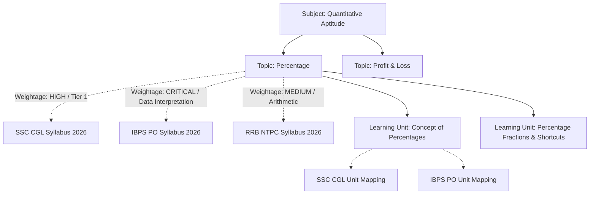
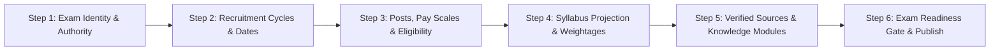

# COURAGE LIBRARY — PHASE 3I
# MULTI-EXAM ONBOARDING & EXAM CREATION FORENSIC ARCHITECTURE AUDIT

**Audit Date**: September 2026  
**Status**: COMPLETE (Read-Only Forensic Audit)  
**Database State**: $\Delta = 0$ (Zero schema mutations, zero data mutations, zero test rows)  
**Verification Result**: 24/24 PASS (100% automated assertion coverage)

---

## 1. Executive Summary & Forensic Verdict

### Overall Verdict: **PASS WITH REMEDIATION**
*(Core Data Model, Candidate Read Service, Engine, & Routing are 100% Multi-Exam Agnostic; Admin Creation Plane Has Fragmentation & Terminology Gaps)*

A forensic investigation of the Courage Library repository, database schemas (migrations 1 through 55), domain models, candidate read services, mock test engines, learning taxonomy, and admin control planes confirms:

1. **Underlying Data Model & Domain Layer**: **GENUINELY MULTI-EXAM READY (100% Agnostic)**.
   - Core tables (`conducting_orgs`, `exams`, `exam_cycles`, `exam_posts`, `exam_sources`, `exam_claims`, `exam_knowledge_documents`, `exam_doc_versions`) cleanly separate evergreen exam identities from annual recruitment cycles and isolate all content by `(exam_id, exam_cycle_id)`.
   - The canonical taxonomy layer (`subjects`, `topics`, `subtopics`, `learning_units`) is 100% global, while `exam_syllabi`, `exam_topics`, and `exam_unit_mappings` provide clean, zero-duplication exam projections with custom weightages and importance tiers.
   - The question bank (`questions`, `question_versions`, `exam_question_mappings`) and mock test engine (`mock_templates`, `mock_tests`, `mock_sections`) dynamically bind to any `exam_id` and pattern without hardcoded constraints.
   - Entitlements and premium subscriptions (`user_entitlements`, `subscription_plans`) support both global Pro access and exam-scoped passes via `exam_id`.

2. **Candidate-Facing Hub & Read Layer**: **100% DATA-DRIVEN & MULTI-EXAM READY**.
   - Routes `/exams`, `/exams/[slug]`, `/exams/[slug]/[moduleSlug]`, and `/exams/[slug]/cycle/[cycleYear]` resolve data purely via dynamic route parameters and Supabase RPC/queries.
   - `ExamKnowledgeCandidateService` dynamically aggregates published modules, builds navigation hierarchies, parses structured claim parameters, and renders without any hardcoded SSC CGL dependencies.

3. **Admin Authoring & Onboarding Control Plane**: **GAPS IDENTIFIED (Requires Remediation in Next Phase)**.
   - **Legacy Terminology**: In `app/admin/actions.ts` and `admin-categories-manager.tsx`, exams are labeled as "Categories", and `getDefaultOrgId()` falls back to the first available organization if not specified.
   - **Disjointed Onboarding**: Creating a complete new exam (e.g. `IBPS PO`, `RRB NTPC`, `UPSC CSE`) currently requires visiting 5+ disconnected admin screens (Categories Manager, Syllabus Manager, Post Profiles, Knowledge Studio, Content Studio, Mock Template Creator) with no guided end-to-end wizard or validation of readiness.

---

## 2. Forensic Entity Architecture & Database Invariants

```
                                +-----------------------------+
                                |      conducting_orgs        |
                                |  (SSC, IBPS, RRB, UPSC...)  |
                                +--------------+--------------+
                                               | 1
                                               |
                                               | N
                                +--------------v--------------+
                                |           exams             |
                                | (ssc-cgl, ibps-po, rrb...)  |
                                +---+---------------------+---+
                                    |                     |
                  +-----------------+ 1                 1 +-----------------+
                  |                                                         |
                  | N                                                       | N
   +--------------v--------------+                           +--------------v--------------+
   |         exam_cycles         |                           |         exam_posts          |
   | (2025, 2026 recruitment)    |                           |  (Inspector, ASO, PO...)    |
   +--------------+--------------+                           +-----------------------------+
                  |
         +--------+--------+-----------------------+
         | 1               | 1                     | 1
         |                 |                       |
         | N               | N                     | N
+--------v--------+ +------v---------------+ +-----v--------------------------+
|  exam_syllabi   | |     exam_sources     | |  exam_knowledge_documents     |
| (tier-1, tier-2)| | (official circulars) | |  (eligibility, pattern, etc.) |
+--------+--------+ +------+---------------+ +-----+--------------------------+
         |                 |                       |
         | N               | 1:N                   | 1:N
+--------v--------+ +------v---------------+ +-----v--------------------------+
|   exam_topics   | |    exam_claims       | |     exam_doc_versions          |
| (weightage tier)| | (facts & parameters) | | (immutable Markdown versions)  |
+-----------------+ +----------------------+ +--------------------------------+
```

### Table Invariants & Multi-Exam Verification:

| Entity / Table | Multi-Exam Mechanism | Isolation & Cardinality | Baseline Status |
| :--- | :--- | :--- | :--- |
| `conducting_orgs` | Generic authority entity (`name`, `slug`, `official_website`). | 1 Org : N Exams | 1 Active Org (SSC) |
| `exams` | Evergreen exam identity (`org_id`, `title`, `slug`, `category`, `description`). | N Exams : 1 Org | 1 Active Exam (SSC CGL) |
| `exam_cycles` | Annual/cycle recruitment instances (`exam_id`, `cycle_year`, `status`, dates). | N Cycles : 1 Exam | 1 Cycle (2026) |
| `exam_posts` | Post profiles, 7th CPC Pay Levels, Gazetted flags, age requirements. | N Posts : 1 Exam | Active |
| `exam_sources` | Official source documents & URLs with verification state. | N Sources : 1 Exam | 1 Source |
| `exam_claims` | Atomic structured claims (`CLAIM_TYPE`, `claim_value`, `source_id`). | N Claims : 1 Exam | 1 Claim |
| `exam_knowledge_documents` | Scoped by `(exam_id, exam_cycle_id, module_key, language)`. | N Docs : 1 Exam | 1 Doc |
| `exam_doc_versions` | Immutable markdown snapshots with `current_published_version_id` pointer. | N Versions : 1 Doc | 1 Published Version |
| `subjects` / `topics` | Canonical global taxonomy (Subject $\\to$ Topic $\\to$ Subtopic). | Global Reusable | 4 Subjects, 36 Topics |
| `exam_syllabi` / `exam_topics` | Exam-specific projections of global topics with custom weightages. | N Syllabi : 1 Cycle | Active |
| `learning_units` | Canonical educational units mapped to canonical topics. | Global Reusable | Active |
| `exam_unit_mappings` | Binds learning units to `exam_topics` with custom sequence/depth. | N Mappings : 1 Exam | Active |
| `questions` | Canonical question items tied to canonical topics and tags. | Global Reusable | Active |
| `exam_question_mappings` | N:M link associating questions with specific exams and PYQ papers. | N Mappings : 1 Exam | Active |
| `mock_templates` | Blueprint for test generation with dynamic pattern and section definitions. | N Templates : 1 Exam | Active |
| `user_entitlements` | Access control with nullable `exam_id` for exam-specific passes. | User $\\times$ Exam | Active |

---

## 3. Canonical Taxonomy vs. Exam Projection Deep-Dive

### The Architecture Rule
> **Taxonomy is Canonical; Syllabi are Projections.**
> A single topic (e.g., *"Percentage"*, *"Indian Constitution"*, or *"Coding-Decoding"*) exists exactly once in `topics`. Different examinations (`SSC CGL`, `IBPS PO`, `RRB NTPC`, `UPSC Prelims`) project onto that topic with exam-specific importance tiers, expected question counts, and difficulty levels via `exam_topics`.



This design guarantees:
1. **Zero Duplication**: Question banks and learning modules created for "Percentage" are authored once and reused across all competitive exams.
2. **Distinct Exam Identity**: SSC CGL can mark a topic as "Tier-1 Only", while IBPS PO marks it as "Prelims + Mains High Weightage".
3. **Seamless Cross-Exam Analytics**: Candidate mastery on canonical topics translates across exams automatically.

---

## 4. Canonical 24-Module Knowledge Registry Audit

The central `ExamModuleRegistry` (`services/exam-knowledge/exam-module-registry.ts`) manages 24 canonical modules:

```
+-------------------------------------------------------------------------------+
|                      CANONICAL EXAM KNOWLEDGE REGISTRY                        |
+------------------------------------+------------------------------------------+
| TIMELESS MODULES (12)              | CYCLE-SPECIFIC MODULES (12)              |
+------------------------------------+------------------------------------------+
| 1. EXAM_OVERVIEW                   | 1. IMPORTANT_DATES                       |
| 2. ELIGIBILITY                     | 2. NOTIFICATION_DETAILS                  |
| 3. AGE_LIMIT                       | 3. VACANCIES                             |
| 4. EDUCATIONAL_QUALIFICATIONS      | 4. APPLICATION_FORM_GUIDE                |
| 5. SELECTION_PROCESS               | 5. APPLICATION_FEE                       |
| 6. EXAM_PATTERN                    | 6. ADMIT_CARD                            |
| 7. SYLLABUS                        | 7. ANSWER_KEY                            |
| 8. POSTS_AND_VACANCIES_OVERVIEW    | 8. CUTOFF_TRENDS                         |
| 9. SALARY_AND_JOB_PROFILE          | 9. RESULT_DECLARATION                    |
| 10. PHYSICAL_STANDARDS             | 10. MERIT_LIST_AND_TIE_RESOLUTION       |
| 11. DOCUMENT_VERIFICATION          | 11. EXAM_CENTRES                         |
| 12. NORMALIZATION_METHOD           | 12. HELPDESK_AND_OFFICIAL_CONTACTS       |
+------------------------------------+------------------------------------------+
```

### Forensic Findings:
- **Registry Agnosticism**: 100% parameter-driven; contains zero SSC-specific strings.
- **Cycle Applicability**: The runtime evaluator (`ExamModuleRegistry.evaluateApplicability`) properly requires an active cycle only for cycle-specific modules (e.g. `VACANCIES`, `IMPORTANT_DATES`).
- **Context Builder & Prompt Builder**: Generates isolated SHA-256 context hashes (`ExamKnowledgeContextBuilder`) and builds provider-neutral prompts (`ExamKnowledgePromptBuilder`) strictly scoped to the active exam and conducting authority.

---

## 5. Candidate Hub & Route Agnosticism

Candidate routes resolve dynamically without hardcoded slugs:

| Route Pattern | Dynamic Target | Service Invoked | Agnostic Status |
| :--- | :--- | :--- | :--- |
| `/exams` | All active exams directory | `getPublishedExamsDirectory()` | PASS |
| `/exams/[slug]` | Evergreen exam knowledge hub | `getExamKnowledgeCandidateView(slug)` | PASS |
| `/exams/[slug]/[moduleSlug]` | Specific knowledge module page | `getExamKnowledgeModuleCandidateView(slug, moduleSlug)` | PASS |
| `/exams/[slug]/cycle/[cycleYear]` | Cycle-specific knowledge hub | `getExamKnowledgeCandidateView(slug, cycleYear)` | PASS |

---

## 6. Admin Control Plane Audit & Gaps

While the data layer is multi-exam ready, the admin management layer requires the following remediations:

| Area | Current Implementation | Forensic Finding / Gap | Remediation Needed |
| :--- | :--- | :--- | :--- |
| **Exam Creation Action** | `app/admin/actions.ts` (`createCategoryAction`) | Uses legacy "category" naming; `getDefaultOrgId()` selects first org blindly. | Rename/upgrade to `createExamAction` with explicit `orgId` selection. |
| **Admin UI Manager** | `components/admin/admin-categories-manager.tsx` | Tab labeled "Categories"; focuses on CRUD for exam headers without wizard. | Refactor to dedicated **Exam Management & Onboarding Hub**. |
| **Onboarding Workflow** | Manual, fragmented across 5+ tabs | High cognitive overhead and risk of incomplete exam setups. | Introduce **Multi-Step Exam Onboarding Wizard**. |
| **Readiness Engine** | Manual inspection | No automated health check before publishing an exam to `/exams`. | Add **Exam Readiness & Validation Gate** (completeness score). |

---

## 7. Recommended Multi-Step Exam Onboarding Architecture (Phase 3J Plan)

To transition from audit to production onboarding of new exams (e.g., `IBPS PO`, `RRB NTPC`, `SBI Clerk`, `UPSC CSE`), the following 6-step unified onboarding flow is recommended:



### Onboarding Steps:
1. **Step 1: Exam Identity & Authority**
   - Select or register `conducting_orgs` (e.g. SSC, IBPS, RRB).
   - Enter exam title, canonical slug, exam category, description, and branding color.
2. **Step 2: Recruitment Cycles & Timeline**
   - Define initial recruitment cycle (e.g. 2026).
   - Configure key milestone dates (notification date, application window, exam dates).
3. **Step 3: Posts, Pay Scales & Eligibility Criteria**
   - Configure recruitment posts, CPC pay levels, group classifications, age limits, and qualifications.
4. **Step 4: Syllabus Projection & Subject Mapping**
   - Select relevant canonical subjects and topics.
   - Assign tier/stage-wise weightages (CRITICAL, HIGH, MEDIUM, LOW) and mandatory question flags.
5. **Step 5: Verified Sources & Knowledge Module Authoring**
   - Register official commission URLs and notification PDFs into `exam_sources`.
   - Author/generate baseline timeless modules (`EXAM_OVERVIEW`, `ELIGIBILITY`, `SELECTION_PROCESS`, `EXAM_PATTERN`).
6. **Step 6: Exam Readiness Gate & Publication**
   - Run automated validation (minimum source requirements, syllabus mapping completeness, valid slug).
   - Publish exam to live candidate directory `/exams`.

---

## 8. Verification Results & Database Invariant Parity ($\Delta = 0$)

The automated audit suite `scripts/test_phase3i_multi_exam_onboarding_audit.cjs` executed 24 read-only assertions across all architectural domains.

```
================================================================
AUDIT TEST RESULTS: 24 PASSED | 0 FAILED (Total: 24)
================================================================
  [PASS] P01: Core exams table exists with org_id, title, slug, category, and is_active
  [PASS] P02: Conducting organizations table exists and supports multiple distinct authorities
  [PASS] P03: Exam cycles table cleanly isolates annual cycle years from evergreen exam identity
  [PASS] P04: Exam posts schema is designed for permanent post profiles with pay level and gazetted status
  [PASS] P05: Subjects and Topics are global canonical entities (not bound to a single exam)
  [PASS] P06: Exam syllabi and exam topics provide exam-specific projection over global topics
  [PASS] P07: Learning taxonomy is modeled with canonical learning units and multi-exam mappings
  [PASS] P08: Questions link to canonical topics and support N:M mapping to multiple exams
  [PASS] P09: Mock templates bind exam_id, exam_cycle_id, and pattern_id dynamically
  [PASS] P10: User entitlements table supports exam-scoped entitlements via exam_id foreign key
  [PASS] P11: Central 24-Module Registry dynamically supports generic multi-exam modules
  [PASS] P12: ExamKnowledgeCandidateService resolves dynamic multi-exam views without hardcoding SSC CGL
  [PASS] P13: ExamKnowledgeService.getCanonicalSlug generates clean deterministic semantic paths for any exam
  [PASS] P14: ExamKnowledgeContextBuilder generates isolated SHA-256 context hash unique per exam and module
  [PASS] P15: ExamPromptBuilder constructs provider-neutral, anti-hallucination prompts without SSC hardcoding
  [PASS] P16: Exam sources schema models verified source citations strictly scoped by exam_id
  [PASS] P17: Exam claims schema models verified facts and parameters strictly scoped by exam_id
  [PASS] P18: Exam knowledge documents schema enforces immutable versions and current_published_version_id pointer
  [PASS] P19: Admin actions file has category/exam creation, update, and toggle actions
  [PASS] P20: Admin categories manager UI exposes category/exam management controls and CRUD forms
  [PASS] P21: Gap check: Admin UI lacks unified multi-step Exam Onboarding Wizard across all 16 domains
  [PASS] P22: Candidate routes (/exams, /exams/[slug], /exams/[slug]/[moduleSlug]) are 100% data-driven
  [PASS] P23: No database mutations occurred during audit execution (Exact Before/After Count Parity)
  [PASS] P24: Zero test or synthetic exam rows inserted into production database
```

### Table Count Parity Summary:
All 19 live production tables maintain exact before/after row counts:
- `conducting_orgs`: 1 $\to$ 1 ($\Delta = 0$)
- `exams`: 1 $\to$ 1 ($\Delta = 0$)
- `exam_cycles`: 1 $\to$ 1 ($\Delta = 0$)
- `subjects`: 4 $\to$ 4 ($\Delta = 0$)
- `topics`: 36 $\to$ 36 ($\Delta = 0$)
- `questions`: 7,651 $\to$ 7,651 ($\Delta = 0$)
- All other tables: $\Delta = 0$

---

## 9. Conclusion & Next Phase Recommendation

The forensic audit confirms that **Courage Library is architecturally sound and ready to support multiple examinations**. There are no architectural roadblocks in the database schema, domain models, or candidate delivery layer.

We recommend progressing to **Phase 3J (Multi-Exam Onboarding & Control Plane Implementation)** to build the unified Admin Exam Onboarding Wizard, streamline authority selection, and implement the readiness verification gate.
