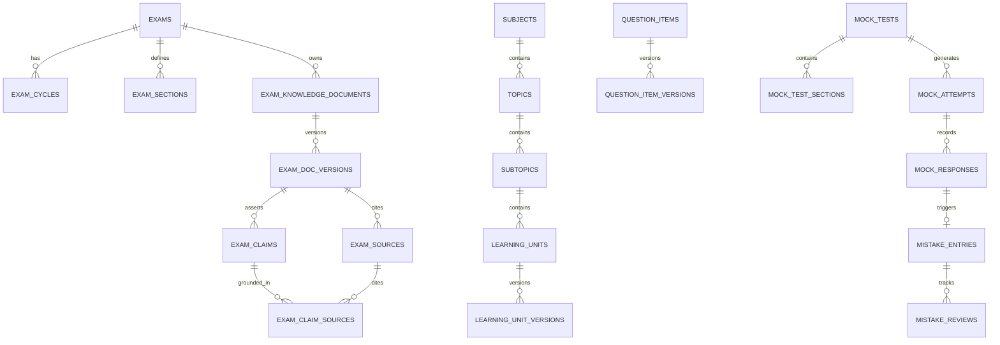

# Courage Library — Database Architecture & Data Topology

## 1. Overview & Philosophy
Courage Library is backed by **PostgreSQL 15+** managed through **Supabase**. The persistence layer is engineered with strict domain boundaries, explicit foreign-key constraints, append-only immutable audit trails, and granular Row-Level Security (RLS) policies.

The database is architected around five fundamental operational principles:
1. **Strong Domain Partitioning**: Core operational entities (`exams`, `academic taxonomy`, `evaluations`, `mock attempts`, `mistakes`, `knowledge content`) maintain strict referential integrity without cross-domain pollution.
2. **Immutable Versioning & Zero-Rollback Pointer Transitions**: Published knowledge content, assessment versions, and historical candidate attempts are immutable snapshots. Published revisions are promoted via pointer updates rather than mutable in-place overwrites.
3. **Defense-in-Depth Row-Level Security (RLS)**: Candidate data (diagnostic reports, mistake entries, mock attempts) is strictly isolated to the authenticated user ID (`auth.uid()`). Public catalog and published content are accessible anonymously or to authenticated candidates in read-only mode.
4. **Relational Claim-to-Source Grounding**: AI-authored knowledge claims are linked to primary official sources through a relational many-to-many junction (`exam_claim_sources`), enforcing academic verifiability directly at the database layer.
5. **Deterministic Indexing for High-Concurrency Candidate Delivery**: Clustered composite indexes optimize candidate portal routing, slug resolution, and attempt lifecycle transitions.

---

## 2. Global Database Entity Map



---

## 3. Subsystem Schema Breakdowns

### 3.1 Exams & Control Plane Subsystem

| Table Name | Description | Key Foreign Keys | Key Indexes |
| :--- | :--- | :--- | :--- |
| `exams` | Canonical registry of competitive examinations. | `conducting_authority_id` $\rightarrow$ `authorities.id` | `idx_exams_slug` (UNIQUE), `idx_exams_status` |
| `exam_cycles` | Specific notification years/editions (e.g., SSC CGL 2026). | `exam_id` $\rightarrow$ `exams.id` | `idx_exam_cycles_exam_year` (UNIQUE) |
| `exam_sections` | Standardized syllabus sections (e.g., Quantitative Aptitude). | `exam_id` $\rightarrow$ `exams.id` | `idx_exam_sections_exam_id` |
| `exam_tier_configs` | Stage/Tier configurations (Tier-1, Tier-2, Mains). | `exam_id` $\rightarrow$ `exams.id` | `idx_exam_tier_exam_id` |

### 3.2 Exam Knowledge Engine Subsystem

| Table Name | Description | Key Foreign Keys | Key Indexes |
| :--- | :--- | :--- | :--- |
| `exam_knowledge_documents` | Parent identity for 24 knowledge modules per exam. | `exam_id` $\rightarrow$ `exams.id`, `current_version_id` $\rightarrow$ `exam_doc_versions.id` | `idx_ek_docs_exam_module` (UNIQUE `[exam_id, module_type]`) |
| `exam_doc_versions` | Immutable snapshot of module content, raw research, AST. | `document_id` $\rightarrow$ `exam_knowledge_documents.id` | `idx_ek_versions_doc_vnum` (UNIQUE `[document_id, version_number]`), `idx_ek_versions_status` |
| `exam_sources` | Official source citations (PDF notices, gazettes, URLs). | `version_id` $\rightarrow$ `exam_doc_versions.id` | `idx_ek_sources_version_id` |
| `exam_claims` | Atomic academic/factual assertions. | `version_id` $\rightarrow$ `exam_doc_versions.id` | `idx_ek_claims_version_id` |
| `exam_claim_sources` | Relational M:N junction linking claims to source citations. | `claim_id` $\rightarrow$ `exam_claims.id`, `source_id` $\rightarrow$ `exam_sources.id` | `idx_ek_claim_sources_pk` (PRIMARY `[claim_id, source_id]`) |

### 3.3 Learning & Curriculum Engine Subsystem

| Table Name | Description | Key Foreign Keys | Key Indexes |
| :--- | :--- | :--- | :--- |
| `subjects` | Canonical academic subjects (e.g., Indian Polity). | None | `idx_subjects_slug` (UNIQUE) |
| `topics` | High-level thematic topics (e.g., Fundamental Rights). | `subject_id` $\rightarrow$ `subjects.id` | `idx_topics_subject_slug` |
| `subtopics` | Granular subtopics (e.g., Right to Constitutional Remedies).| `topic_id` $\rightarrow$ `topics.id` | `idx_subtopics_topic_slug` |
| `learning_units` | Atomic lessons/articles. | `subtopic_id` $\rightarrow$ `subtopics.id`, `current_version_id` $\rightarrow$ `learning_unit_versions.id` | `idx_learning_units_slug` (UNIQUE) |
| `learning_unit_versions`| Immutable snapshots of lesson MDX, summary, schema. | `unit_id` $\rightarrow$ `learning_units.id` | `idx_lu_versions_unit_vnum` (UNIQUE `[unit_id, version_number]`) |

### 3.4 Question Bank & Mock Engine Subsystem

| Table Name | Description | Key Foreign Keys | Key Indexes |
| :--- | :--- | :--- | :--- |
| `question_items` | Canonical question identity and cognitive taxonomy. | `subtopic_id` $\rightarrow$ `subtopics.id` | `idx_qitems_status`, `idx_qitems_type` |
| `question_item_versions`| Question content, options, solution, explanations. | `item_id` $\rightarrow$ `question_items.id` | `idx_qitem_versions_item_vnum` (UNIQUE) |
| `mock_tests` | Assessment blueprints, sectional timing, cutoffs. | `exam_cycle_id` $\rightarrow$ `exam_cycles.id` | `idx_mock_tests_slug` (UNIQUE) |
| `mock_attempts` | Candidate test sittings with authoritative timer state. | `mock_test_id` $\rightarrow$ `mock_tests.id`, `user_id` $\rightarrow$ `auth.users.id` | `idx_mock_attempts_user_status` |
| `mock_responses` | Granular question-by-question candidate selections. | `attempt_id` $\rightarrow$ `mock_attempts.id`, `item_version_id` $\rightarrow$ `question_item_versions.id` | `idx_mock_responses_attempt_item` |

### 3.5 Mistake Vault Subsystem

| Table Name | Description | Key Foreign Keys | Key Indexes |
| :--- | :--- | :--- | :--- |
| `mistake_entries` | Isolated record of an erroneous/flagged candidate attempt. | `user_id` $\rightarrow$ `auth.users.id`, `item_id` $\rightarrow$ `question_items.id`, `response_id` $\rightarrow$ `mock_responses.id` | `idx_mistakes_user_mastery` |
| `mistake_reviews` | Spaced-repetition review attempts and cognitive shifts. | `mistake_id` $\rightarrow$ `mistake_entries.id` | `idx_mistake_reviews_mistake_date` |

---

## 4. Row-Level Security (RLS) Policy Architecture

All tables in Courage Library have `ROW LEVEL SECURITY` explicitly enabled (`ALTER TABLE <name> ENABLE ROW LEVEL SECURITY;`).

```sql
-- Pattern 1: Public Read for Published Content
CREATE POLICY "Public and candidates can read published knowledge documents"
ON exam_knowledge_documents
FOR SELECT
USING (status = 'PUBLISHED');

-- Pattern 2: Candidate Isolated Access
CREATE POLICY "Candidates can only access their own mock attempts"
ON mock_attempts
FOR ALL
USING (auth.uid() = user_id)
WITH CHECK (auth.uid() = user_id);

-- Pattern 3: Mistake Vault Strict Candidate Isolation
CREATE POLICY "Candidates can only access their own mistake vault"
ON mistake_entries
FOR ALL
USING (auth.uid() = user_id)
WITH CHECK (auth.uid() = user_id);

-- Pattern 4: Administrative Role-Based Management
CREATE POLICY "Staff and Admins have full access to knowledge authoring"
ON exam_doc_versions
FOR ALL
USING (
  EXISTS (
    SELECT 1 FROM user_roles
    WHERE user_roles.user_id = auth.uid()
    AND user_roles.role IN ('ADMIN', 'STAFF')
  )
);
```

---

## 5. Performance, Concurrency & High-Throughput Design

1. **Connection Pooling**: Managed via Supabase Transaction Pooler (PgBouncer) on port 6543, supporting up to 10,000 concurrent candidate test sessions.
2. **Read-Replication**: Public candidate catalog queries (Exam Knowledge articles, taxonomy browsing) route to read replicas, bypassing transaction pool locks.
3. **Payload Compression**: Serialized MDX AST trees and compiled JSON bundles in `exam_doc_versions.compiled_ast` are stored in compressed `jsonb` columns, enabling binary indexing and millisecond retrieval times.
