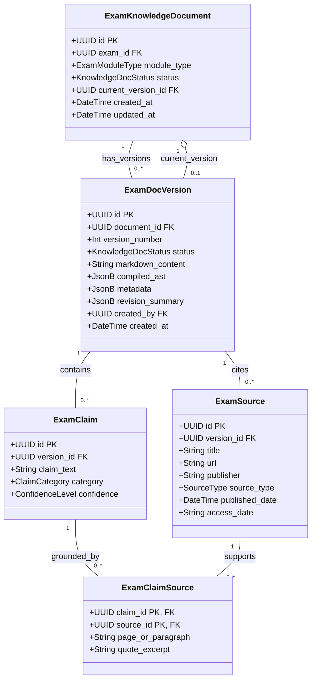

# Exam Knowledge Data Model & Relational Grounding

## 1. Relational Schema Architecture

The Exam Knowledge subsystem is designed around 5 interconnected relational tables that guarantee strict version tracking, atomic claims management, and immutable academic citations.



---

## 2. Table Specifications

### 2.1 `exam_knowledge_documents` (Identity Anchor)
Represents the persistent identity of a knowledge module for an exam (e.g., SSC CGL's `EXAM_OVERVIEW` or `SYLLABUS`).

| Column | Type | Nullable | Constraints & Description |
| :--- | :--- | :--- | :--- |
| `id` | `UUID` | No | Primary Key (`gen_random_uuid()`) |
| `exam_id` | `UUID` | No | Foreign Key $\rightarrow$ `exams.id` (`ON DELETE CASCADE`) |
| `module_type` | `VARCHAR(64)` | No | Enum matching the 24 modules (e.g. `EXAM_OVERVIEW`, `POST_PREFERENCE`) |
| `status` | `VARCHAR(32)` | No | `DRAFT`, `IN_REVIEW`, `APPROVED`, `COMPILED`, `PUBLISHED`, `ARCHIVED` |
| `current_version_id` | `UUID` | Yes | Foreign Key $\rightarrow$ `exam_doc_versions.id`. Points to active published snapshot. |
| `created_at` | `TIMESTAMPTZ` | No | Default `now()` |
| `updated_at` | `TIMESTAMPTZ` | No | Default `now()` |

*Unique Constraint*: `UNIQUE (exam_id, module_type)` — Prevents duplicate module records for any examination.

---

### 2.2 `exam_doc_versions` (Immutable Version Snapshot)
Contains the exact textual, metadata, and compiled state for a specific iteration of a document.

| Column | Type | Nullable | Constraints & Description |
| :--- | :--- | :--- | :--- |
| `id` | `UUID` | No | Primary Key (`gen_random_uuid()`) |
| `document_id` | `UUID` | No | Foreign Key $\rightarrow$ `exam_knowledge_documents.id` (`ON DELETE CASCADE`) |
| `version_number` | `INTEGER` | No | Sequential integer starting from 1 ($1, 2, 3, \dots$) |
| `status` | `VARCHAR(32)` | No | Lifecycle status of this specific version |
| `markdown_content` | `TEXT` | No | Raw authoring markdown content |
| `compiled_ast` | `JSONB` | Yes | Validated MDX Abstract Syntax Tree (populated upon AST compilation) |
| `metadata` | `JSONB` | No | Document header, target audience, difficulty, estimated reading time |
| `revision_summary` | `JSONB` | Yes | Change summary object: `{ change_type: "MAJOR", summary: "...", diff_stat: {} }` |
| `created_by` | `UUID` | No | Foreign Key $\rightarrow$ `auth.users.id` |
| `created_at` | `TIMESTAMPTZ` | No | Default `now()` |

*Unique Constraint*: `UNIQUE (document_id, version_number)` — Guarantees strict monotonicity without version collisions.

---

### 2.3 `exam_sources` (Academic & Official Citations)
Official gazettes, recruitment notices, court orders, or commission updates backing the content.

| Column | Type | Nullable | Constraints & Description |
| :--- | :--- | :--- | :--- |
| `id` | `UUID` | No | Primary Key (`gen_random_uuid()`) |
| `version_id` | `UUID` | No | Foreign Key $\rightarrow$ `exam_doc_versions.id` (`ON DELETE CASCADE`) |
| `title` | `VARCHAR(255)` | No | Title of official notice or publication |
| `url` | `TEXT` | No | Verifiable HTTP/HTTPS link to source |
| `publisher` | `VARCHAR(255)` | No | Conducting authority or publishing ministry |
| `source_type` | `VARCHAR(64)` | No | `OFFICIAL_NOTIFICATION`, `GAZETTE`, `CORRIGENDUM`, `COURT_ORDER` |
| `published_date` | `DATE` | Yes | Official publication date |
| `access_date` | `DATE` | No | Date researched/verified by author |

---

### 2.4 `exam_claims` (Atomic Factual Assertions)
Granular, verifiable facts extracted during AI research and verified by staff.

| Column | Type | Nullable | Constraints & Description |
| :--- | :--- | :--- | :--- |
| `id` | `UUID` | No | Primary Key (`gen_random_uuid()`) |
| `version_id` | `UUID` | No | Foreign Key $\rightarrow$ `exam_doc_versions.id` (`ON DELETE CASCADE`) |
| `claim_text` | `TEXT` | No | The atomic assertion (e.g., "Age limit for ASO in CSS is 20 to 30 years.") |
| `category` | `VARCHAR(64)` | No | `ELIGIBILITY`, `EXAM_PATTERN`, `SALARY`, `SELECTION_PROCESS` |
| `confidence` | `VARCHAR(32)` | No | `HIGH`, `MEDIUM`, `DISPUTED` |

---

### 2.5 `exam_claim_sources` (Claim-Source Relational Junction)
Many-to-many junction that binds atomic claims to official sources with exact page and quotation provenance.

| Column | Type | Nullable | Constraints & Description |
| :--- | :--- | :--- | :--- |
| `claim_id` | `UUID` | No | Foreign Key $\rightarrow$ `exam_claims.id` (`ON DELETE CASCADE`) |
| `source_id` | `UUID` | No | Foreign Key $\rightarrow$ `exam_sources.id` (`ON DELETE CASCADE`) |
| `page_or_paragraph` | `VARCHAR(128)` | Yes | Specific page number, section, or paragraph in the source document |
| `quote_excerpt` | `TEXT` | Yes | Verbatim supporting excerpt from the official source |

*Primary Key*: `PRIMARY KEY (claim_id, source_id)`

---

## 3. Atomic Publication Transaction Lifecycle

When an academic reviewer clicks **"Publish Version"** in the Studio workbench, the operation executes as an atomic database transaction:

```sql
BEGIN;

-- Step 1: Update the published snapshot status
UPDATE exam_doc_versions
SET status = 'PUBLISHED'
WHERE id = :target_version_id;

-- Step 2: Mark all older published versions as SUPERSEDED
UPDATE exam_doc_versions
SET status = 'SUPERSEDED'
WHERE document_id = :target_document_id
  AND id != :target_version_id
  AND status = 'PUBLISHED';

-- Step 3: Advance parent document pointer
UPDATE exam_knowledge_documents
SET current_version_id = :target_version_id,
    status = 'PUBLISHED',
    updated_at = NOW()
WHERE id = :target_document_id;

COMMIT;
```

This ensures that candidate traffic experiences **zero race conditions, zero downtime, and instant pointer propagation**.
