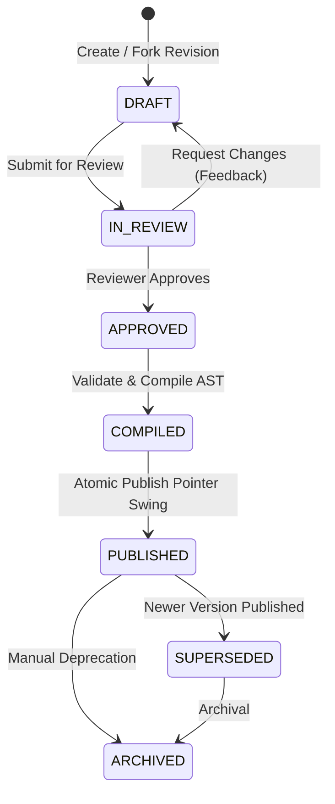

# Content Versioning, Snapshot Architecture & Immutability Guarantees

## 1. Core Versioning Philosophy

Courage Library enforces a **Strict Append-Only Immutable Versioning** model across all knowledge, curriculum, and assessment systems.

### Core Axioms
1. **Never Mutate History**: Once a version is marked `PUBLISHED`, `SUPERSEDED`, or `ARCHIVED`, its record in `exam_doc_versions` or `learning_unit_versions` is frozen. No row updates to `markdown_content` or `compiled_ast` are permitted.
2. **Sequential Version Numbers**: Every revision increments monotonically ($1, 2, 3, \dots, N$). There are no branching sub-versions or fractional version numbers ($1.1, 1.2$) in the core database schema.
3. **Pointer-Based Live State**: The "Current Published Version" displayed to candidates is determined solely by the `current_version_id` foreign key pointer on the parent document.
4. **Instant Non-Destructive Rollbacks**: Rolling back to a previous historical version does not destroy or overwrite intermediate drafts; it creates a new draft or atomically swings the pointer to the validated historical snapshot after review.
5. **Full Audit Traceability**: Every snapshot records who created it (`created_by`), when it was created (`created_at`), the structured diff (`revision_summary`), and the exact validation gate metrics at the moment of approval.

---

## 2. Version Lifecycle State Machine



### Version State Definitions

| State | Modifiable? | Visible to Candidates? | Description |
| :--- | :--- | :--- | :--- |
| `DRAFT` | **Yes** (by author) | **No** | Active working copy created via AI import or manual editing. |
| `IN_REVIEW` | **No** (frozen) | **No** | Submitted to Academic Review team for verification and claim check. |
| `APPROVED` | **No** | **No** | Reviewer has signed off on accuracy, tone, and source citations. |
| `COMPILED` | **No** | **No** | AST compilation succeeded and passed all 5 security/structural gates. |
| `PUBLISHED` | **No** (Immutable) | **YES** | Active canonical version served to candidates in the portal. |
| `SUPERSEDED`| **No** (Immutable) | **No** (Historical) | Previous published snapshot preserved for audit, diffing, and compliance. |
| `ARCHIVED` | **No** (Immutable) | **No** | Deprecated due to official syllabus elimination or exam restructuring. |

---

## 3. Database-Level Immutability Enforcement

Immutability is enforced via database triggers that reject `UPDATE` statements targeting frozen rows.

```sql
CREATE OR REPLACE FUNCTION enforce_version_immutability()
RETURNS TRIGGER AS $$
BEGIN
    -- Allow updating status from APPROVED to COMPILED, or PUBLISHED to SUPERSEDED
    IF OLD.status IN ('PUBLISHED', 'SUPERSEDED', 'ARCHIVED') THEN
        IF NEW.markdown_content != OLD.markdown_content 
           OR NEW.compiled_ast != OLD.compiled_ast 
           OR NEW.metadata != OLD.metadata THEN
            RAISE EXCEPTION 'CANNOT_MUTATE_HISTORICAL_SNAPSHOT: Frozen version % cannot be modified.', OLD.id;
        END IF;
    END IF;
    RETURN NEW;
END;
$$ LANGUAGE plpgsql;

CREATE TRIGGER trg_exam_doc_version_immutability
BEFORE UPDATE ON exam_doc_versions
FOR EACH ROW
EXECUTE FUNCTION enforce_version_immutability();
```

---

## 4. Diff Engine & Historical Comparison

Courage Library includes an integrated visual diff engine (`DiffWorkbench`) that compares any two arbitrary versions ($V_A$ vs $V_B$) or compares the active draft against the current published version.

### Diff Metrics Calculated
- **Raw Word Diff**: Additions, deletions, and inline modifications.
- **Section Diff**: Headings added, renamed, removed, or reordered.
- **Claim Diff**: New factual claims asserted, modified claims, or deleted claims.
- **Source Diff**: New citations added, URLs changed, or removed sources.
- **Visual Parity Diff**: Side-by-side split rendering showing candidate-view impact.

---

## 5. Candidate Parity Guarantees

1. **Deterministic Static Snapshotting**: When candidates open an article, the server queries `exam_knowledge_documents.current_version_id` and serves pre-compiled `compiled_ast`. 
2. **Zero In-Flight Drift**: If a document is updated while a candidate is reading, their current page session remains stable until full page revalidation.
3. **Assessment Isolation**: When a candidate takes a mock test, their attempt references the exact `item_version_id` and `exam_doc_version_id` active at the instant of test generation, ensuring subsequent syllabus revisions never invalidate past performance reports.
