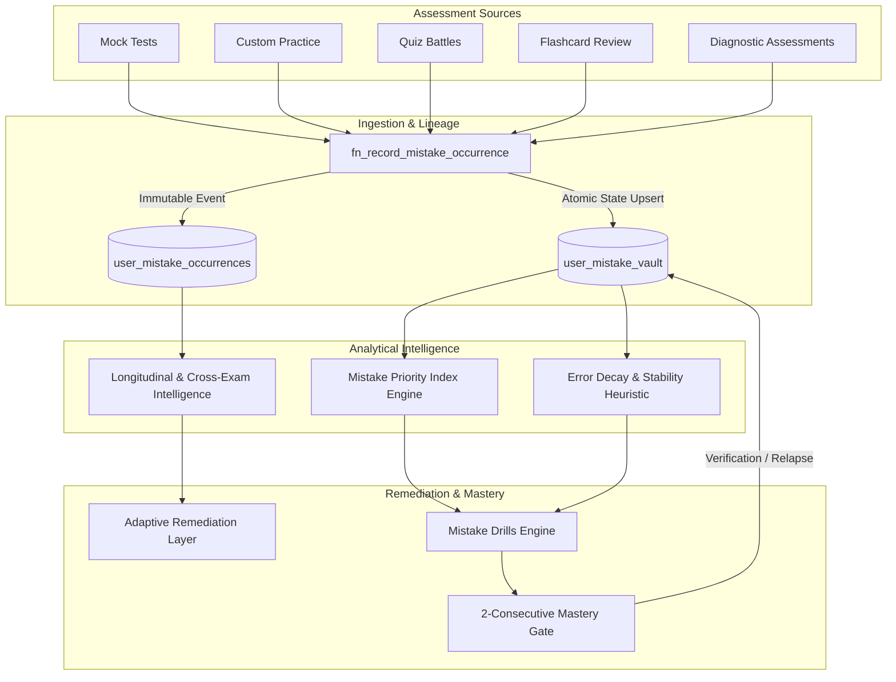

# COURAGE LIBRARY — MISTAKE VAULT SYSTEM
## CHAPTER 00: SYSTEM OVERVIEW & ARCHITECTURAL CHARTER

---

## 1. Executive Summary

The **Mistake Vault** (internally designated as the *Personal Revision Engine*) is the mission-critical, pedagogical core of Courage Library. It transforms transient candidate examination errors into permanent cognitive mastery. 

Rather than serving as a passive historical log or static "error notebook," the Mistake Vault operates as an active, deterministic learning laboratory. It systematically ingests every failed question attempt across all Courage Library assessment modalities, classifies the underlying cognitive failure mode, schedules mathematically spaced revision intervals, tracks multi-stage remediation trajectories, and dynamically generates targeted recovery drills.

---

## 2. Core Pedagogical & Technical Tenets

1. **Deterministic Accountability**: All prioritization scores (MPI, Revision Priority, Error Decay) are calculated using pure, deterministic mathematical functions without unpredictable stochastic anomalies.
2. **Immutable Forensic Lineage**: Every mistake occurrence is recorded in an immutable ledger (`user_mistake_occurrences`) linked directly to the specific attempt answer ID and question version ID.
3. **Rigorous Mastery Contract**: A candidate cannot resolve a mistake through passive acknowledgment or a single lucky guess. Mastery strictly requires **two consecutive correct remediation events** separated by space and time.
4. **Cognitive Attribution**: Errors are categorized across a 7-factor cognitive taxonomy (`CONCEPTUAL_GAP`, `CALCULATION_SLIP`, `MISREAD_QUESTION`, `TIME_PANIC`, `FORMULA_CONFUSION`, `DISTRACTOR_TRAP`, `UNCLASSIFIED`).
5. **Soft Errata Immunity**: Administrative answer key corrections trigger deterministic soft revocations (`REVOKED_ERRATA`), preserving ledger audit trails while automatically recalculating candidate profiles.

---

## 3. Module Boundaries & Interaction Matrix

| Subsystem | Primary Responsibility | Authoritative Files |
|---|---|---|
| **Occurrence Ingestion** | Atomic ledger recording & profile upsert | `supabase/migrations/*_mistake_vault_lineage_and_errata.sql` |
| **Priority & Decay Engine** | Deterministic urgency & memory stability heuristics | `services/mistake.service.ts` |
| **Longitudinal Intelligence** | Windowed trajectory analytics & cross-exam dispersion | `services/mistake-longitudinal-intelligence.service.ts` |
| **Adaptive Remediation** | CAT policy candidate selection & weakness targeting | `services/adaptive/adaptive-remediation.service.ts` |
| **Candidate UX & Actions** | Server actions, responsive UI cards, and drill modal | `app/mistakes/*`, `components/mistakes/*` |
