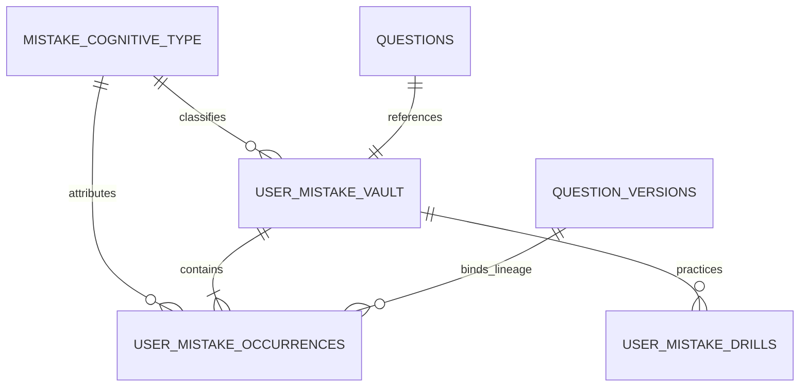

# COURAGE LIBRARY — MISTAKE VAULT SYSTEM
## CHAPTER 02: CORE DOMAIN MODEL

---

## 1. Primary Domain Entities

The Mistake Vault domain model consists of five foundational entities operating in strict harmony:

### 1.1 `UserMistakeVault` (Aggregate Profile)
Represents the candidate's consolidated lifetime state for a specific question.
- **Primary Key**: `id` (UUID)
- **Natural Key**: `(user_id, question_id)` (Unique)
- **State Fields**: `total_mistakes_count`, `consecutive_correct_in_remediation`, `lifecycle_status` (`UNRESOLVED`, `REVISITING`, `MASTERED`).
- **Cognitive Attribution**: `primary_cognitive_type_id`, `user_override_cognitive_type_id`.
- **Temporal Anchors**: `first_mistake_at`, `last_mistake_at`, `last_practiced_at`, `mastered_at`.

### 1.2 `UserMistakeOccurrence` (Immutable Event Ledger)
Represents a discrete historical error event with full forensic provenance.
- **Foreign Keys**: `vault_id`, `user_id`, `question_id`, `question_version_id`, `attempt_answer_id`.
- **Context**: `source_context` (`MOCK_TEST`, `CUSTOM_PRACTICE`, `QUIZ_BATTLE`, `FLASHCARD_REVIEW`, `MISTAKE_DRILL`, `DIAGNOSTIC_ASSESSMENT`).
- **Telemetry**: `selected_option_id`, `response_time_seconds`, `inferred_cognitive_type_id`, `heuristic_confidence_pct`.
- **Status**: `occurrence_status` (`ACTIVE`, `REVOKED_ERRATA`, `REVOKED_VOID`, `SUPERSEDED`).

### 1.3 `UserMistakeDrill` (Remediation Session)
Represents an active or completed targeted drill session.
- **Session State**: `total_questions`, `correct_count`, `mistakes_resolved_count`, `status` (`IN_PROGRESS`, `COMPLETED`, `ABANDONED`, `EXPIRED`).
- **Data Payload**: `questions_data` (JSONB snapshot).

### 1.4 `MistakeCognitiveType` (Taxonomy Dimension)
Authoritative reference table defining the 7 canonical error classifications.

### 1.5 `QuestionVersion` (Content Lineage Anchor)
Snapshot version of the question ensuring that historical mistake evaluations remain tied to the exact question text and answer keys at the time of the error.
