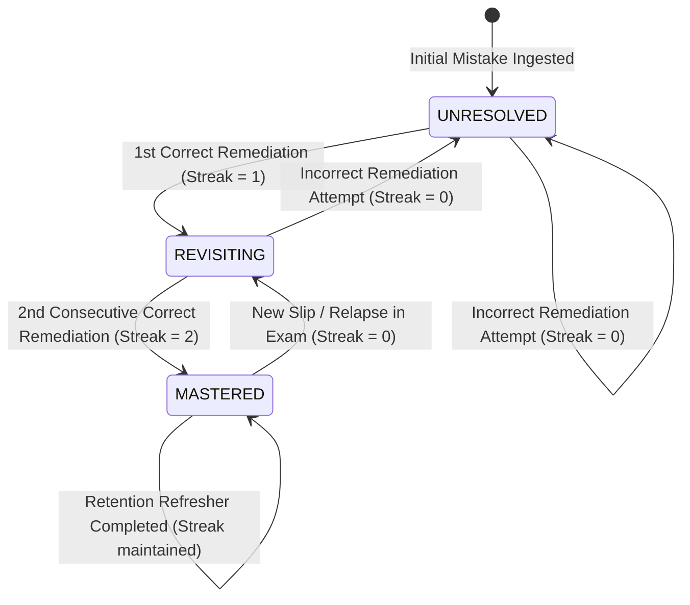

# COURAGE LIBRARY — MISTAKE VAULT SYSTEM
## CHAPTER 03: MISTAKE LIFECYCLE & STATE MACHINE

---

## 1. Lifecycle State Machine Overview

A mistake in Courage Library progresses through three formal lifecycle states:
1. **`UNRESOLVED`**: Initial state upon first or repeated failure without successful remediation.
2. **`REVISITING`**: Intermediate state reached after exactly 1 successful remediation.
3. **`MASTERED`**: Fully resolved state achieved after **2 consecutive successful remediations**.

---

## 2. State Transition Invariants

| Current State | Event | New State | Consecutive Correct | Action Taken |
|---|---|---|---|---|
| **None** | New Error in Mock/Practice | `UNRESOLVED` | 0 | Create vault record, record occurrence. |
| **`UNRESOLVED`** | Incorrect Drill Attempt | `UNRESOLVED` | 0 | Increment mistake count, record occurrence. |
| **`UNRESOLVED`** | Correct Drill Attempt | `REVISITING` | 1 | Set `last_practiced_at = now()`. |
| **`REVISITING`** | Incorrect Drill Attempt | `UNRESOLVED` | 0 | Reset streak to 0, increment mistake count. |
| **`REVISITING`** | Correct Drill Attempt | `MASTERED` | 2 | Set `mastered_at = now()`. |
| **`MASTERED`** | Correct Refresher Attempt | `MASTERED` | $ge 2$ | Update `last_practiced_at = now()`. |
| **`MASTERED`** | New Error in Mock/Practice | `REVISITING` | 0 | Relapse triggered; reset streak to 0. |

---

## 3. The Sacred 2-Consecutive Mastery Invariant
Under no circumstances may a single correct attempt transition a record from `UNRESOLVED` directly to `MASTERED`. The system strictly mandates two independent verification events separated across distinct drill sessions to eliminate false mastery from guessing.
