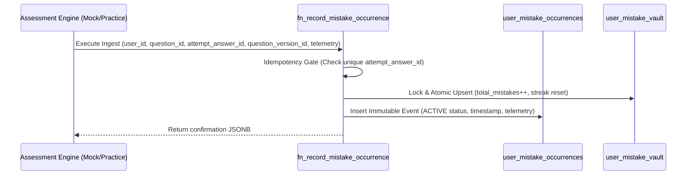

# COURAGE LIBRARY — MISTAKE VAULT SYSTEM
## CHAPTER 04: DATA LINEAGE & EVIDENCE PROVENANCE

---

## 1. Immutable Audit Ledger Architecture

Courage Library enforces strict forensic evidence provenance for every mistake event. When an error occurs, it is permanently written to `user_mistake_occurrences`.



---

## 2. Provenance Tracking Fields

- **`attempt_answer_id`**: Globally unique identifier of the exact submission row in the assessment engine. Guaranteed unique via conditional index:
  ```sql
  CREATE UNIQUE INDEX uq_umo_attempt_answer 
  ON public.user_mistake_occurrences (attempt_answer_id) 
  WHERE attempt_answer_id IS NOT NULL;
  ```
- **`question_version_id`**: Foreign key to `question_versions(id)`, ensuring that content updates do not distort historical analysis.
- **`source_context`**: Canonical origin context (`MOCK_TEST`, `CUSTOM_PRACTICE`, `QUIZ_BATTLE`, `FLASHCARD_REVIEW`, `MISTAKE_DRILL`, `DIAGNOSTIC_ASSESSMENT`).
- **`occurrence_status`**: Lifecycle status of the individual event (`ACTIVE`, `REVOKED_ERRATA`, `REVOKED_VOID`, `SUPERSEDED`).
