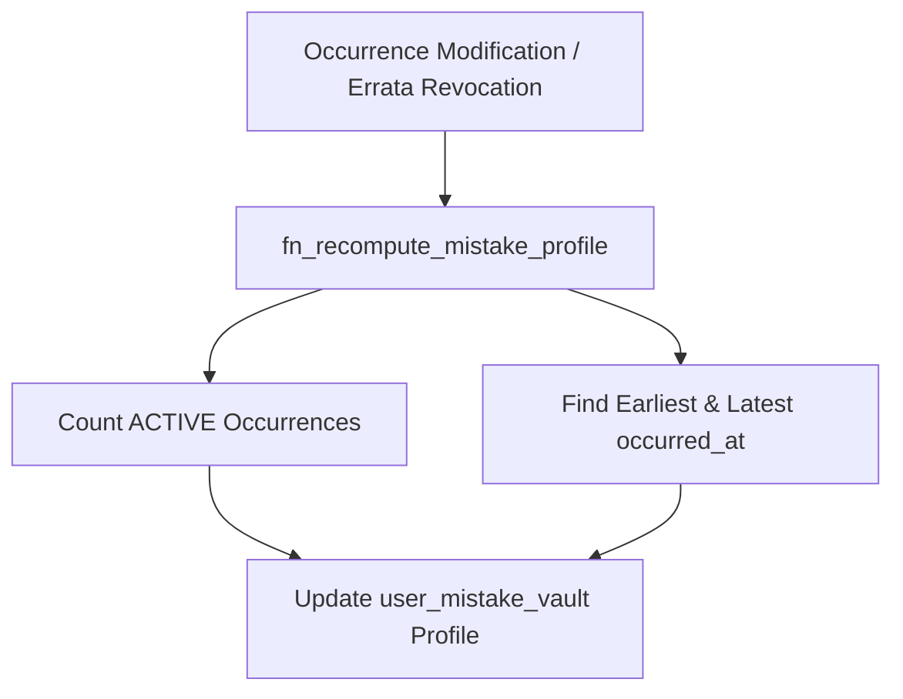

# COURAGE LIBRARY — MISTAKE VAULT SYSTEM
## CHAPTER 08: MISTAKE AGGREGATION & PROFILE RECOMPUTATION

---

## 1. Profile Synchronization Protocol

The aggregate profile in `user_mistake_vault` is derived directly from the set of **ACTIVE** occurrences in `user_mistake_occurrences`.



---

## 2. Runtime RPC: `fn_recompute_mistake_profile`

```sql
CREATE OR REPLACE FUNCTION public.fn_recompute_mistake_profile(
    p_user_id UUID,
    p_question_id UUID
)
RETURNS JSONB
LANGUAGE plpgsql
SECURITY DEFINER
SET search_path = public, pg_temp
AS $$
DECLARE
    v_active_count INTEGER;
    v_latest_mistake_at TIMESTAMPTZ;
    v_earliest_mistake_at TIMESTAMPTZ;
    v_vault_id UUID;
    v_current_status TEXT;
BEGIN
    SELECT id, lifecycle_status INTO v_vault_id, v_current_status
    FROM public.user_mistake_vault
    WHERE user_id = p_user_id AND question_id = p_question_id
    FOR UPDATE;

    IF NOT FOUND THEN
        RETURN jsonb_build_object('success', false, 'error', 'Mistake vault profile not found');
    END IF;

    -- Count strictly ACTIVE occurrences
    SELECT count(*), max(occurred_at), min(occurred_at)
    INTO v_active_count, v_latest_mistake_at, v_earliest_mistake_at
    FROM public.user_mistake_occurrences
    WHERE user_id = p_user_id 
      AND question_id = p_question_id
      AND occurrence_status = 'ACTIVE';

    IF v_active_count = 0 THEN
        -- All evidence revoked via errata/void -> Neutralize to MASTERED
        UPDATE public.user_mistake_vault
        SET total_mistakes_count = 0,
            consecutive_correct_in_remediation = 2,
            lifecycle_status = 'MASTERED',
            mastered_at = now(),
            updated_at = now()
        WHERE id = v_vault_id;
    ELSE
        UPDATE public.user_mistake_vault
        SET total_mistakes_count = v_active_count,
            first_mistake_at = COALESCE(v_earliest_mistake_at, first_mistake_at),
            last_mistake_at = COALESCE(v_latest_mistake_at, last_mistake_at),
            updated_at = now()
        WHERE id = v_vault_id;
    END IF;

    RETURN jsonb_build_object(
        'success', true,
        'vault_id', v_vault_id,
        'active_mistakes_count', v_active_count,
        'lifecycle_status', CASE WHEN v_active_count = 0 THEN 'MASTERED' ELSE v_current_status END
    );
END;
$$;
```
