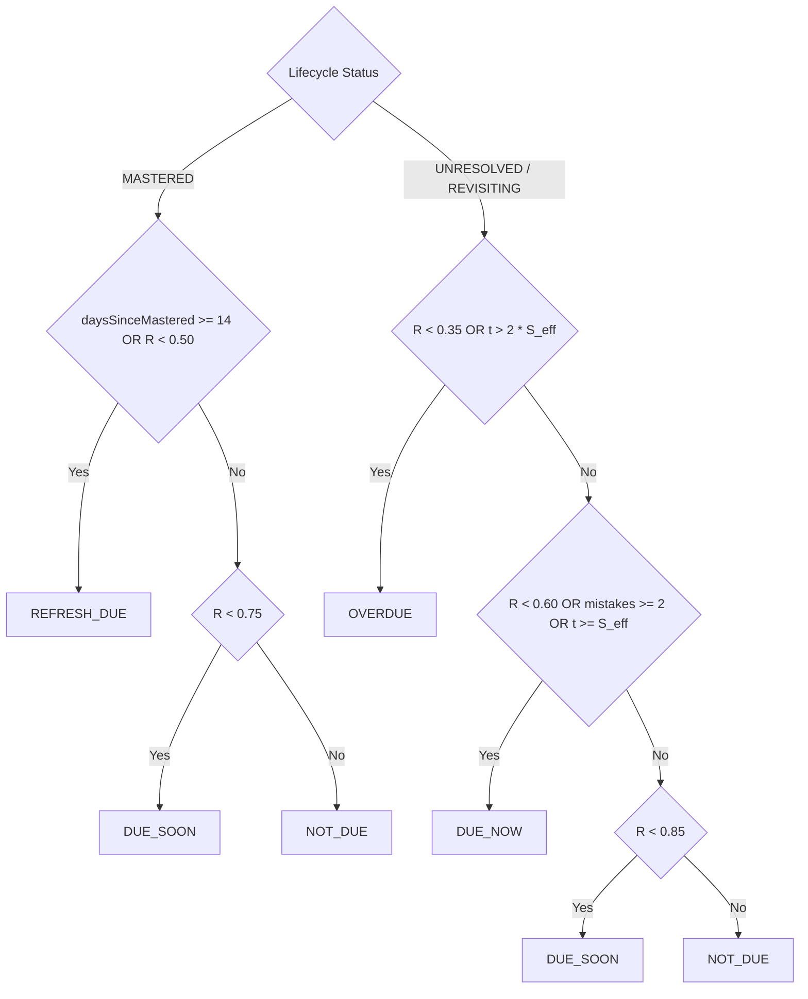

# COURAGE LIBRARY — MISTAKE VAULT SYSTEM
## CHAPTER 10: ERROR DECAY & LONGITUDINAL REVISION MEMORY

---

## 1. Spaced Revision & Retention Heuristic

Phase 6 Task 2 introduced the deep **Error Decay & Longitudinal Revision Memory Engine** (`services/mistake.service.ts:436-650`). It models memory decay using a deterministic negative exponential heuristic:

$$R(t) = \exp\left( -\frac{t}{S \cdot (1 + \mu \cdot C_{\text{effective}})} \right)$$

### Mathematical Parameter Definitions:
- **$t$ (Elapsed Time)**: Days elapsed since authoritative lifecycle anchor timestamp ($t = \max(0, \frac{\text{now} - \text{anchor}}{86400000})$).
- **$S$ (Base Stability Constant)**:
  - $\mathbf{S = 2.0\text{ days}}$ for `UNRESOLVED` items.
  - $\mathbf{S = 4.0\text{ days}}$ for `REVISITING` items.
  - $\mathbf{S = 14.0\text{ days}}$ for `MASTERED` items.
- **$\mu$ (Spacing Bonus Multiplier)**: Fixed constant $\mu = 0.50$.
- **$C_{\text{effective}}$ (Bounded Remediation Streak)**: $C_{\text{effective}} = \min(\max(0, \text{consecutive\_correct}), 5)$.
- **Effective Stability ($S_{\text{eff}}$)**: $S_{\text{eff}} = S \cdot (1 + 0.50 \cdot C_{\text{effective}})$.
- **Retention Risk**: $\text{Risk}(t) = 1.0000 - R(t)$.

---

## 2. Authoritative Timestamp Anchor Resolution

To ensure mathematical precision, the anchor timestamp is chosen strictly by lifecycle status:
- **`MASTERED`**: Anchored to `mastered_at` (or `last_drill_at` if refreshed).
- **`REVISITING`**: Anchored to `last_remediated_at` or `last_drill_at` (the most recent successful reinforcement).
- **`UNRESOLVED`**: Anchored to `last_drill_at` or `last_mistake_at`.

---

## 3. Decay Presentation State Precedence Logic

The decay state machine assigns one of 5 presentation states (`DecayPresentationState`):

### Strict Evaluation Hierarchy:

#### For `UNRESOLVED` and `REVISITING`:
1. **`OVERDUE`** *(Evaluated First)*: $R(t) < 0.35$ **OR** $t > 2 \cdot S_{\text{eff}}$
2. **`DUE_NOW`** *(Evaluated Second)*: $R(t) < 0.60$ **OR** $\text{total\_mistakes} \ge 2$ **OR** $t \ge S_{\text{eff}}$
3. **`DUE_SOON`** *(Evaluated Third)*: $R(t) < 0.85$
4. **`NOT_DUE`** *(Evaluated Last)*: $R(t) \ge 0.85$

#### For `MASTERED`:
1. **`REFRESH_DUE`** *(Evaluated First)*: $\text{daysSinceMastered} \ge 14$ **OR** $R(t) < 0.50$
2. **`DUE_SOON`** *(Evaluated Second)*: $R(t) < 0.75$
3. **`NOT_DUE`** *(Evaluated Last)*: $R(t) \ge 0.75$
