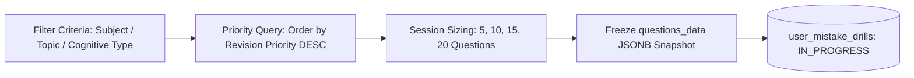

# COURAGE LIBRARY — MISTAKE VAULT SYSTEM
## CHAPTER 12: MISTAKE DRILL ENGINE

---

## 1. Drill Generation & Architecture

The **Mistake Drill Engine** (`user_mistake_drills` and `createMistakeDrillAction`) dynamically generates focused remediation sessions tailored to candidate weaknesses.

---

## 2. Dynamic Sizing & Session Flow

- **Session Modes**:
  - **Quick Fix**: 5 high-priority questions for rapid warm-up.
  - **Standard Drill**: 10 questions targeting specific topic weaknesses.
  - **Comprehensive Remediation**: 15–20 questions combining active errors and due refreshers.
- **Drill Lifecycle**:
  - `IN_PROGRESS`: Active practice session with frozen options snapshot.
  - `COMPLETED`: Successfully submitted; triggers streak evaluation and coin awards.
  - `ABANDONED` / `EXPIRED`: Inactive sessions closed after 24 hours without penalty.

---

## 3. Post-Drill Evaluation & Gamification

Upon drill submission (`submitMistakeDrillAction`):
1. **Streak Evaluation**: Correct responses increment `consecutive_correct_in_remediation` and advance lifecycle state.
2. **Mastery Conversion**: Items reaching 2 consecutive correct solutions transition to `MASTERED`.
3. **Reward Invariant**: Candidates receive **Courage Coins** (5 coins per resolved mistake) to reinforce positive recovery habits.
