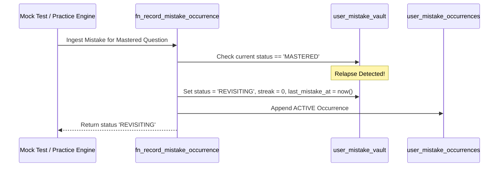

# COURAGE LIBRARY — MISTAKE VAULT SYSTEM
## CHAPTER 14: RELAPSE DETECTION & RE-INGESTION

---

## 1. Relapse Definition & Mechanics

A **Relapse** occurs when a candidate answers incorrectly on a question that had previously achieved **`MASTERED`** status.

---

## 2. Relapse Re-Ingestion Rules

1. **State Demotion**: The vault profile transitions from `MASTERED` to `REVISITING`.
2. **Streak Reset**: `consecutive_correct_in_remediation` is reset to **0**.
3. **Mastery History Preserved**: The original `mastered_at` timestamp is retained for longitudinal analytics to calculate the candidate's exact **relapse latency** ($t_{\text{relapse}} = \text{occurred\_at} - \text{mastered\_at}$).
4. **Elevated Urgency**: Relapsed items immediately receive higher priority in revision feeds.
