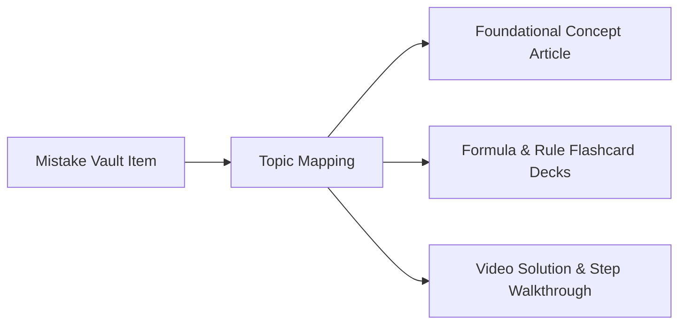

# COURAGE LIBRARY — MISTAKE VAULT SYSTEM
## CHAPTER 15: LEARNING CONTENT & CONCEPT NOTES INTEGRATION

---

## 1. Seamless Concept Remediation

Every mistake in the vault is cross-referenced with Courage Library's structured knowledge base:

---

## 2. Priority Bonus for Actionable Content

- Items linked to active learning resources receive a **$+0.10$ Revision Priority bonus** ($B_{\text{content}}$), prioritizing items that candidates can immediately study and resolve.
- The UI exposes a direct **"Review Theory"** deep link, opening the relevant concept article in an inline side-panel without losing drill context.
