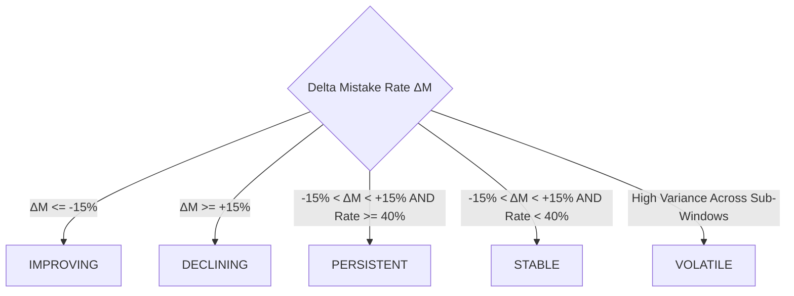

# COURAGE LIBRARY — MISTAKE VAULT SYSTEM
## CHAPTER 18: LONGITUDINAL MISTAKE INTELLIGENCE

---

## 1. Windowed Analytical Architecture

Implemented in `services/mistake-longitudinal-intelligence.service.ts`, the **Longitudinal Intelligence Engine** provides deterministic, windowed trend analysis across 4 canonical spans:

| Analytical Window | Public Duration ($W$) | Internal Fetch Span ($2W$) | Purpose |
|---|---|---|---|
| **`7D`** | 7 Days | 14 Days | Micro-trend and immediate pacing recovery. |
| **`30D`** (Default) | 30 Days | 60 Days | Standard monthly preparation cycle evaluation. |
| **`90D`** | 90 Days | 180 Days | Macro-trend and syllabus retention analysis. |
| **`ALL_TIME`** | Epoch to Now | Epoch to Now | Lifetime candidate diagnostic summary. |

---

## 2. Mathematical Trajectory State Machine

The longitudinal trajectory evaluates the shift in **Normalized Mistake Rate ($M_{\text{norm}}$)** between the active window and the prior matching window:

$$M_{\text{norm}} = \frac{\text{total\_mistakes}}{\max(\text{total\_attempts}, 1)} \times 100$$

$$\Delta M = M_{\text{current}} - M_{\text{prior}}$$

### Canonical Trajectory States (`TrajectoryState`):
1. **`IMPROVING`**: Significant reduction in mistake rate ($\Delta M \le -15\%$).
2. **`DECLINING`**: Significant increase in mistake rate ($\Delta M \ge +15\%$).
3. **`PERSISTENT`**: Mistake rate remains chronically high ($\ge 40\%$) without improvement.
4. **`STABLE`**: Low mistake rate ($< 40\%$) consistently maintained.
5. **`VOLATILE`**: Erratic performance swings across consecutive practice sessions.

> **CRITICAL TERMINOLOGY INVARIANT**: The term **`DETERIORATING`** is permanently deprecated and forbidden. The certified canonical term is **`DECLINING`**.

---

## 3. Sample-Size Safety Gates

To prevent distorted percentages from sparse data, the engine enforces strict denominator thresholds:
- **Topic Level**: Minimum $N \ge 3$ attempts.
- **Subject Level**: Minimum $N \ge 5$ attempts.
- **Context Level**: Minimum $N \ge 3$ attempts.
- **Trajectory Evaluation**: Minimum $N \ge 3$ attempts across compared periods.
