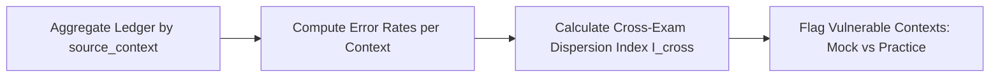

# COURAGE LIBRARY — MISTAKE VAULT SYSTEM
## CHAPTER 19: CROSS-EXAM CONTEXT INTELLIGENCE

---

## 1. Cross-Exam Vulnerability Analysis

Candidates often perform well in relaxed practice but suffer cognitive collapse under timed mock test conditions. The **Cross-Exam Intelligence Engine** detects these context-specific vulnerabilities.

---

## 2. Cross-Exam Dispersion Index ($I_{\text{cross}}$)

$$I_{\text{cross}} = \frac{\text{maxRate} - \text{minRate}}{\max(\text{avgRate}, 1.0)}$$

- **High Dispersion ($I_{\text{cross}} \ge 0.50$)**: Indicates severe vulnerability to testing environment factors (e.g., time pressure in Mock Tests vs untimed Practice).
- **Low Dispersion ($I_{\text{cross}} < 0.20$)**: Indicates consistent concept mastery across all testing modalities.
