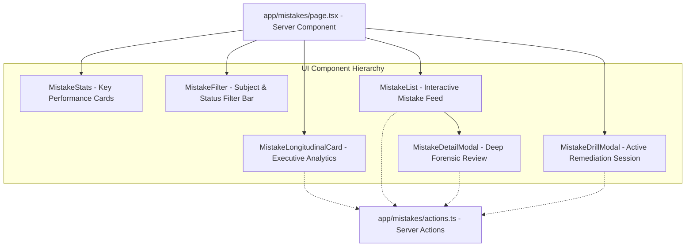

# COURAGE LIBRARY — MISTAKE VAULT SYSTEM
## CHAPTER 20: CANDIDATE UX & COMPONENT ARCHITECTURE

---

## 1. Next.js App Router Page Architecture

The Mistake Vault UI is implemented under `app/mistakes/page.tsx` using React Server Components with seamless Client Component interactions.

---

## 2. Key UI Component Responsibilities

- **`MistakeLongitudinalCard`**: Surfaces windowed longitudinal intelligence (7D, 30D, 90D, ALL_TIME), trajectory badges, weakest topics, and recovery metrics.
- **`MistakeStats`**: Displays active errors, high priority backlog, retention health score, and drill completion stats.
- **`MistakeList`**: Renders priority-ranked question cards with cognitive tags, decay status badges, and streak progress indicators.
- **`MistakeDetailModal`**: Forensic deep dive showing complete attempt history, response time telemetry, and linked concept articles.
- **`MistakeDrillModal`**: High-focus interactive drill interface with instant answer validation and streak advancement.
