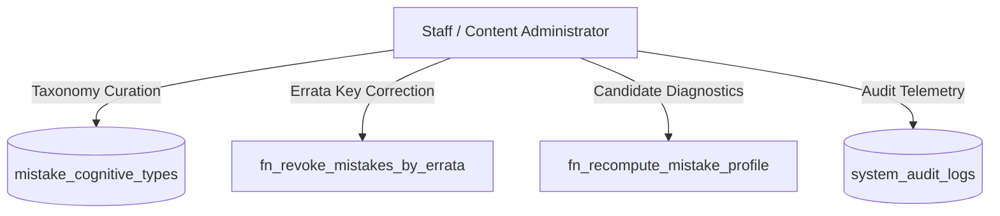

# COURAGE LIBRARY — MISTAKE VAULT SYSTEM
## CHAPTER 22: ADMINISTRATIVE TOOLS, GOVERNANCE & TAXONOMY MANAGEMENT

---

## 1. Governance Architecture

The Mistake Vault features robust administrative governance capabilities to maintain data integrity across hundreds of thousands of candidate mistake records. Administrative actions are strictly isolated from normal candidate runtime workflows and require explicit role-based access control.

---

## 2. Administrative Capabilities Catalog

### 2.1 Cognitive Taxonomy Management
- **Table**: `public.mistake_cognitive_types`
- **Privileges**: Direct `INSERT`, `UPDATE` restricted to `service_role` and administrative accounts.
- **Fields**: `id`, `name`, `description`, `remediation_guidance`, `default_remediation_action`, `display_order`, `is_active`.
- **Governance Rule**: Existing canonical cognitive IDs (`CONCEPTUAL_GAP`, `CALCULATION_SLIP`, etc.) must **never** be renamed or deleted to maintain backward compatibility with historical records.

### 2.2 Batch Errata Invalidation
- **Function**: `fn_revoke_mistakes_by_errata(p_question_version_id, p_corrected_option_id, p_reason, p_actor_id)`
- **Security**: Requires verified `admin`, `staff`, or `service_role` JWT claims.
- **Behavior**: Scans all active occurrences for the target question version where the candidate selected the now-corrected option, marks them as `REVOKED_ERRATA`, and cascades profile recomputation.

### 2.3 Individual Candidate State Recomputation
- **Function**: `fn_recompute_mistake_profile(p_user_id, p_question_id)`
- **Use Case**: Used during manual support inquiries or after bulk data corrections to force a deterministic recalculation of streak, total mistake count, and lifecycle status based exclusively on active occurrences.
