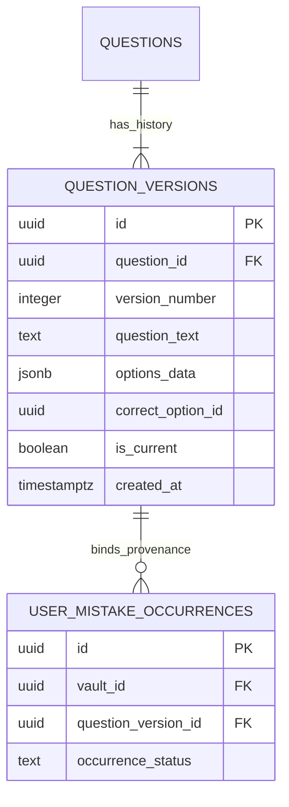

# COURAGE LIBRARY — MISTAKE VAULT SYSTEM
## CHAPTER 24: QUESTION VERSIONING & CONTENT LINEAGE

---

## 1. The Question Versioning Imperative

In competitive exam prep platforms, question content frequently undergoes minor editorial revisions (e.g., fixing typographical errors, clarifying option phrasing, or upgrading explanation diagrams). 

If a mistake record merely links to a mutable `question_id`, historical performance analytics become invalid if the question fundamentally changes later.



---

## 2. Immutability & Foreign Key Constraints

1. **Foreign Key Protection**:
   ```sql
   ALTER TABLE public.user_mistake_occurrences
   ADD CONSTRAINT fk_umo_qv
   FOREIGN KEY (question_version_id)
   REFERENCES public.question_versions(id)
   ON DELETE RESTRICT;
   ```
   The `ON DELETE RESTRICT` constraint prevents any question version that has associated candidate mistake occurrences from being accidentally dropped.

2. **Automatic Version Resolution**:
   When `fn_record_mistake_occurrence` is invoked without an explicit `p_question_version_id`, it deterministically selects the currently active version:
   ```sql
   SELECT id INTO v_target_version_id
   FROM public.question_versions
   WHERE question_id = p_question_id AND is_current = true
   ORDER BY version_number DESC
   LIMIT 1;
   ```
