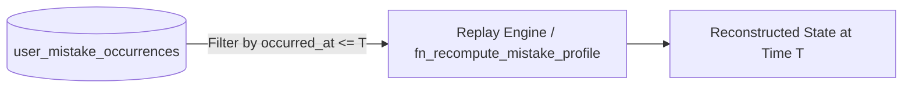

# COURAGE LIBRARY — MISTAKE VAULT SYSTEM
## CHAPTER 34: HISTORICAL REPRODUCIBILITY & EVENT REPLAY

---

## 1. Deterministic Event Sourcing Guarantees

Because every error is captured as an immutable event in `user_mistake_occurrences`, any candidate's historical state can be deterministically replayed and verified at any point in time.

---

## 2. Replay Invariant Verification

- Given an identical ordered sequence of `ACTIVE` mistake occurrences and drill completions, the state recomputation produces **exact mathematical parity** with the live `user_mistake_vault` row.
- Soft errata revocations alter future state computations without destroying the historical record of when the candidate originally slipped.
