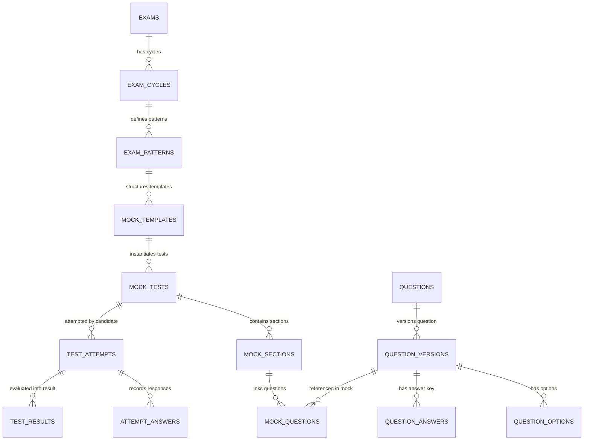

# 04 — ASSESSMENT DOMAIN MODEL

> **DOCUMENTATION CLASSIFICATION:** Relational Schema & Entity Relationship Architecture  
> **LIFECYCLE STATUS:** Production & Frozen  
> **SYSTEM LAYER:** Core Relational Domain Model  

---

## 1. What is it?
The **Assessment Domain Model** specifies the foundational database schema, table structures, foreign key topologies, cascading rules, unique indexes, and Row Level Security (RLS) definitions governing all test definitions, questions, attempts, and evaluations in Courage Library.

## 2. Entity Relationship Graph



---

## 3. Core Entities Deep Dive

### 1. `exams` (Master Exam Entity)
- **Primary Key**: `id UUID DEFAULT gen_random_uuid()`
- **Purpose**: Represents an official government recruitment exam (e.g., "SSC CGL", "IBPS PO", "RRB NTPC").
- **Key Columns**:
  - `title VARCHAR(255) NOT NULL`: Official name.
  - `code VARCHAR(50) UNIQUE NOT NULL`: Standard slug (e.g. `ssc_cgl`).
  - `category VARCHAR(50) NOT NULL`: `SSC`, `BANKING`, `RAILWAYS`, `DEFENCE`, `STATE_PSC`.
  - `is_active BOOLEAN DEFAULT true`: Administrative visibility switch.
- **RLS**: Public read-only for active exams; write restricted to `service_role` and `admin`.

### 2. `mock_templates` (Blueprint Definition)
- **Primary Key**: `id UUID DEFAULT gen_random_uuid()`
- **Foreign Keys**: `exam_id REFERENCES exams(id)`
- **Purpose**: Defines the blueprint rules, total duration, positive/negative marks, and sectional allocations required to construct tests.
- **Key Columns**:
  - `duration_mins INTEGER NOT NULL`: Total allowed examination time.
  - `total_marks DOUBLE PRECISION NOT NULL`: Aggregate maximum marks.
  - `marking_scheme JSONB NOT NULL`: `{ "correct": 2.0, "incorrect": 0.5, "unanswered": 0.0 }`.
  - `blueprint_config JSONB NOT NULL`: Section and topic distribution rules.

### 3. `mock_tests` (Standardized Test Instance)
- **Primary Key**: `id UUID DEFAULT gen_random_uuid()`
- **Foreign Keys**: `template_id REFERENCES mock_templates(id)`, `exam_id REFERENCES exams(id)`
- **Purpose**: A frozen, fully resolved test instance containing exact question linkages.
- **Key Columns**:
  - `test_type VARCHAR(50) NOT NULL`: `DAILY_MOCK`, `FULL_LENGTH`, `SECTIONAL`, `TOPIC`, `CHALLENGE`, `WEAK_AREA`, `MISTAKE_REVISION`, `LIVE_COMPETITION`.
  - `is_curated BOOLEAN DEFAULT true`: Indicates if curated by admin or dynamically generated.
  - `total_questions INTEGER NOT NULL`: Fixed item count.
  - `is_published BOOLEAN DEFAULT false`: Access visibility flag.

### 4. `mock_sections` (Sectional Partition)
- **Primary Key**: `id UUID DEFAULT gen_random_uuid()`
- **Foreign Keys**: `mock_test_id REFERENCES mock_tests(id) ON DELETE CASCADE`
- **Purpose**: Defines sections within a paper (e.g. "General Intelligence & Reasoning", "Quantitative Aptitude").
- **Key Columns**:
  - `order_index INTEGER NOT NULL`: Display sequence.
  - `duration_mins INTEGER`: Optional section-specific countdown (enforced in Banking exams).
  - `cutoff_marks DOUBLE PRECISION`: Optional minimum qualifying sectional threshold.

### 5. `mock_questions` (Section-to-Question Linkage)
- **Primary Key**: `id UUID DEFAULT gen_random_uuid()`
- **Foreign Keys**: 
  - `mock_section_id REFERENCES mock_sections(id) ON DELETE CASCADE`
  - `question_version_id REFERENCES question_versions(id)`
- **Key Columns**:
  - `order_index INTEGER NOT NULL`: Sequence index within the section palette.
  - `marks DOUBLE PRECISION NOT NULL`: Custom item positive weight.
  - `negative_marks DOUBLE PRECISION NOT NULL`: Custom item penalty weight.

### 6. `questions` & `question_versions` (Immutable Versioning)
- **Master Table**: `questions` (holds permanent UUID and topic taxonomy).
- **Version Table**: `question_versions` (holds immutable snapshot of question text, mathematical formulae, language strings, and explanation).
- **Foreign Key**: `question_versions.question_id REFERENCES questions(id) ON DELETE CASCADE`.
- **Constraint**: Once a `question_version` has been linked in a `mock_question` or `attempt_answer`, it is **strictly immutable**. Errata adjustments spawn a new row with incremented `version_number`.

### 7. `test_attempts` (Candidate Execution Record)
- **Primary Key**: `id UUID DEFAULT gen_random_uuid()`
- **Foreign Keys**: `mock_test_id REFERENCES mock_tests(id)`, `user_id REFERENCES auth.users(id)`
- **Key Columns**:
  - `status VARCHAR(50) NOT NULL`: `IN_PROGRESS`, `SUBMITTED`, `EVALUATED`, `ABANDONED`.
  - `started_at TIMESTAMPTZ NOT NULL DEFAULT now()`: Authoritative start timestamp.
  - `completed_at TIMESTAMPTZ`: Authoritative submission timestamp.
  - `time_spent_seconds INTEGER NOT NULL DEFAULT 0`: Elapsed time.
  - `final_score DOUBLE PRECISION`: Authoritative evaluated score.
  - `accuracy_percentage DOUBLE PRECISION`: Authoritative accuracy.
- **Uniqueness Constraint (Daily Mocks)**: `uq_user_daily_mock_occurrence UNIQUE (user_id, mock_test_id, scheduled_date_ist)`.

### 8. `attempt_answers` (Item Response Audit)
- **Primary Key**: `id UUID DEFAULT gen_random_uuid()`
- **Foreign Keys**: 
  - `attempt_id REFERENCES test_attempts(id) ON DELETE CASCADE`
  - `question_version_id REFERENCES question_versions(id)`
- **Key Columns**:
  - `selected_option_key VARCHAR(10)`: `A`, `B`, `C`, `D` or `null`.
  - `is_answered BOOLEAN NOT NULL DEFAULT false`: Response state.
  - `is_marked_for_review BOOLEAN NOT NULL DEFAULT false`: Palette review flag.
  - `is_correct BOOLEAN`: Evaluated correctness.
  - `score_awarded DOUBLE PRECISION`: Calculated net score ($+M$, $-M$, or $0$).
  - `time_spent_seconds INTEGER NOT NULL DEFAULT 0`: Time spent on this specific item.

---

## 4. Protected Database Baseline (14/14 Table Invariant)

```
+-------------------------+-----------------+----------------------------------------+
| TABLE NAME              | PRODUCTION ROWS | INTEGRITY STATUS                       |
+-------------------------+-----------------+----------------------------------------+
| mock_tests              | 8 rows          | Baseline protected & immutable         |
| mock_sections           | 14 rows         | Baseline protected & immutable         |
| mock_questions          | 350 rows        | Baseline protected & immutable         |
| mock_templates          | 8 rows          | Baseline protected & immutable         |
| test_attempts           | 31 rows         | Authoritative historical data          |
| test_results            | 10 rows         | Authoritative historical data          |
| attempt_answers         | 200 rows        | Authoritative historical data          |
| questions               | 103 rows        | Master question bank baseline          |
| question_versions       | 103 rows        | Versioned content baseline             |
| question_options        | 412 rows        | 4-choice option matrix baseline        |
| question_answers        | 103 rows        | Correct answer key baseline            |
| subscription_plans      | 1 row           | Active production plan baseline        |
| coin_wallets            | 5 rows          | Active candidate balances baseline     |
| coin_ledger             | 8 rows          | Audited coin transaction ledger        |
+-------------------------+-----------------+----------------------------------------+
```
