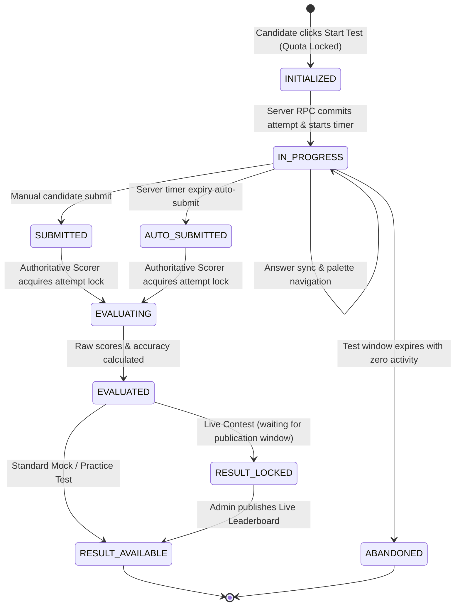

# 08 — ATTEMPT LIFECYCLE & STATE MACHINE

> **DOCUMENTATION CLASSIFICATION:** Runtime State Machine & Execution Specification  
> **LIFECYCLE STATUS:** Production & Frozen  
> **SYSTEM LAYER:** Core Assessment Runtime  

---

## 1. What is it?
The **Attempt Lifecycle & State Machine** defines the strict, unidirectional lifecycle through which every candidate test session transitions—from initialization and runtime answer staging to submission, evaluation, and result publication.

## 2. Formal State Machine Diagram



---

## 3. Detailed State Specifications & Transition Rules

```
+---------------------------------------------------------------------------------------------------------+
| STATE             | ENTRY CONDITIONS                 | ALLOWED ACTIONS         | FORBIDDEN ACTIONS      |
+-------------------+----------------------------------+-------------------------+------------------------+
| `INITIALIZED`     | Quota check passed, RPC begun    | Allocate attempt row    | Render question payload|
+-------------------+----------------------------------+-------------------------+------------------------+
| `IN_PROGRESS`     | Attempt committed, timer started | Stage answers, mark rev | Re-start, change paper |
+-------------------+----------------------------------+-------------------------+------------------------+
| `SUBMITTED`       | Candidate clicks "Submit Test"   | Trigger Scorer RPC      | Modify answers, resume |
+-------------------+----------------------------------+-------------------------+------------------------+
| `AUTO_SUBMITTED`  | Server detects timer elapsed     | Trigger Scorer RPC      | Modify answers, resume |
+-------------------+----------------------------------+-------------------------+------------------------+
| `EVALUATING`      | Authoritative scoring in process | Read answers, calc marks| Double-submit, cancel  |
+-------------------+----------------------------------+-------------------------+------------------------+
| `EVALUATED`       | Final score calculated           | Write result, Mistake V | Re-score (unless errata|
+-------------------+----------------------------------+-------------------------+------------------------+
| `RESULT_AVAILABLE`| Results open to candidate        | View scorecard, reviews | Resume test            |
+---------------------------------------------------------------------------------------------------------+
```

---

## 4. Idempotency & Concurrency Safeguards

### Double Submission Lock
- When a submission request arrives (manual or auto), the RPC executes:
  ```sql
  UPDATE public.test_attempts
  SET status = 'SUBMITTED', completed_at = NOW()
  WHERE id = p_attempt_id AND status = 'IN_PROGRESS';
  ```
- If `ROW_COUNT == 0`, the submission is rejected as an idempotent duplicate. Network retries or rapid double-clicks return the existing result cleanly without re-scoring or throwing database exceptions.

### Multi-Tab Session Mutex
- Each attempt tracks an active session token and client sequence number.
- If a candidate opens the test in a second tab, the first tab's sequence number becomes stale, preventing race-condition overwrites.

---

## 5. What Must Never Happen
- An attempt in `SUBMITTED`, `AUTO_SUBMITTED`, or `EVALUATED` state must **never** be reverted to `IN_PROGRESS`.
- An attempt must **never** be evaluated more than once under the same scoring version.
- An attempt must **never** remain in `IN_PROGRESS` indefinitely after `started_at + duration_mins` has passed.
