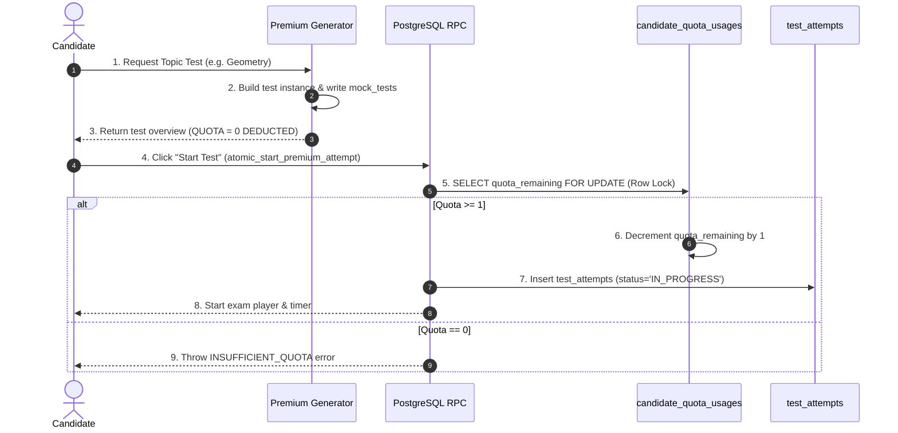

# 10 — PREMIUM MOCK SYSTEM & DYNAMIC GENERATOR PIPELINE

> **DOCUMENTATION CLASSIFICATION:** Product Architecture & Dynamic Test Generation Engine  
> **LIFECYCLE STATUS:** Production & Frozen  
> **SYSTEM LAYER:** Premium Monetization & Specialized Practice  

---

## 1. What is it?
The **Premium Mock System** is the comprehensive subscription-backed assessment suite providing access to curated full-length test series, official Previous Year Question (PYQ) papers, and 6 on-demand dynamic test generation pipelines governed by transactional quota locks.

## 2. The 8 Premium Assessment Modalities

```
+---------------------------------------------------------------------------------------------------------+
| MODALITY           | GENERATION METHOD | PEDAGOGICAL PURPOSE                 | QUOTA KEY                |
+--------------------+-------------------+-------------------------------------+--------------------------+
| 1. Full-Length     | Curated Static    | Complete simulated exam experience  | `FULL_LENGTH`            |
| 2. Official PYQ    | Curated Provenance| Authentic previous year papers      | `PYQ`                    |
| 3. Sectional Drill | Curated / Dynamic | Deep subject-level mastery          | `SECTIONAL`              |
| 4. Topic Test      | Dynamic Generator | Hyper-targeted single topic practice| `TOPIC`                  |
| 5. Challenge Test  | Dynamic Generator | High-difficulty questions only      | `CHALLENGE`              |
| 6. Weak Area Drill | Dynamic Generator | Algorithmic targeting of mistakes   | `WEAK_AREA`              |
| 7. Mistake Revision| Dynamic Generator | Direct re-attempt of failed vault Qs| `MISTAKE_REVISION`       |
| 8. Personalized    | Dynamic Generator | Multi-factor AI candidate tailoring | `PERSONALIZED`           |
+---------------------------------------------------------------------------------------------------------+
```

---

## 3. Dynamic Generator Pipelines Deep Dive

### 1. Weak Area Generator (`WEAK_AREA`)
- **Query Logic**: Analyzes candidate's last 10 attempts across `attempt_answers`. Identifies topics where accuracy $< 60\%$ or average time per question $> 90$ seconds.
- **Assembly**: Pulls 70% questions from the identified weak topics and 30% reinforcement questions from adjacent baseline topics.

### 2. Challenge Test Generator (`CHALLENGE`)
- **Query Logic**: Filters questions where empirical facility index $p < 0.30$ (items that $> 70\%$ of candidates answered incorrectly).
- **Assembly**: Constructs a 25-question high-intensity speed test with +2 / -0.5 marking to test high-difficulty mastery.

### 3. Mistake Revision Generator (`MISTAKE_REVISION`)
- **Query Logic**: Queries the candidate's active `mistake_vault` records where `status = 'UNRESOLVED'`.
- **Assembly**: Randomly selects 20 unresolved mistake questions. Upon test completion with correct answers, the corresponding Mistake Vault records transition to `RESOLVED`.

---

## 4. Quota Consumption Architecture



---

## 5. What Must Never Happen
- Dynamic test generation must **never** fail with an empty question list; if a specific topic has insufficient questions, the generator must fallback gracefully to the parent subject pool.
- A candidate must **never** be charged quota when browsing test series or clicking "Generate Test". Quota is only deducted upon the transactional start RPC.
- A candidate must **never** access Premium test routes via direct URL manipulation without an active subscription entitlement.
