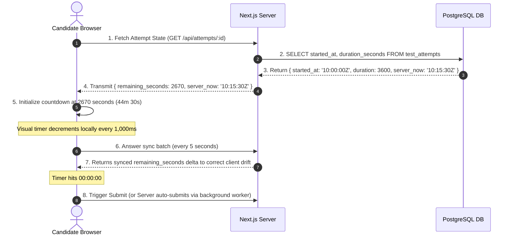

# 15 — TIMER ARCHITECTURE & TIME AUTHORITY

> **DOCUMENTATION CLASSIFICATION:** Time Authority & Synchronization Specification  
> **LIFECYCLE STATUS:** Production & Frozen  
> **SYSTEM LAYER:** Authoritative Clock Engine  

---

## 1. What is it?
The **Timer Architecture & Time Authority Engine** defines the absolute separation between the **Client Visual Display Timer** and the **Server Authoritative Timekeeper**, ensuring that candidate attempts are strictly bounded by authorized durations regardless of browser refreshes, clock tampering, device freezes, or network latency.

## 2. Why does it exist?
Client-side JavaScript timers (`setInterval`, `setTimeout`, `Date.now()`) are completely untrusted:
1. **Clock Manipulation**: A candidate can pause or rewind their operating system clock to gain extra time.
2. **Background Throttling**: Modern browsers throttle background tab timers to 1 tick per minute, causing client timers to freeze when switching tabs.
3. **Device Crash**: If a candidate's laptop restarts 20 minutes into a 60-minute test, a client-only timer forgets elapsed time upon reboot.

Courage Library treats the server as the **single source of time truth**.

---

## 3. Mathematical Time Authority Formulas

```
====================================================================================================
                        SERVER-AUTHORITATIVE TIMER FORMULATION
====================================================================================================

1. Fixed Mock / Daily / Practice Test:
   END_TIME = started_at + authorized_duration_seconds
   REMAINING_SECONDS = max(0, EXTRACT(EPOCH FROM (END_TIME - NOW())))

2. Live Synchronized Competition Test:
   EFFECTIVE_END_TIME = event_end_at + authorized_candidate_extension_seconds
   REMAINING_SECONDS = max(0, EXTRACT(EPOCH FROM (EFFECTIVE_END_TIME - NOW())))
====================================================================================================
```

---

## 4. Visual Client Timer Synchronization Protocol



---

## 5. Edge Cases & Attack Vector Mitigations

### 1. Browser Refresh / Hard Reload
- **Behavior**: Upon reload, client re-fetches attempt state from server. Server calculates `started_at + duration - server_now` and resumes visual countdown with zero loss of elapsed time.

### 2. Device Power Failure (Restart after 15 mins)
- **Behavior**: If 15 minutes have passed on the real-world clock, the remaining time correctly reflects the 15-minute loss upon candidate reboot.

### 3. Client OS Clock Alteration
- **Attack**: Candidate changes PC clock from 10:30 AM to 09:30 AM.
- **Defense**: Visual timer derives duration from server timestamp delta; OS clock changes have zero effect on server evaluation.

### 4. Overdue Attempt Submission
- **Attack**: Candidate disconnects network, spends 3 hours solving questions, reconnects, and submits.
- **Defense**: Server submission RPC checks `NOW() > started_at + duration + grace_period (30s)`. The submission is rejected or trimmed to answers saved before the authorized expiry window.

---

## 6. What Must Never Happen
- The server must **never** accept an attempt submission whose timestamp exceeds the authorized window plus grace period.
- The exam player must **never** pause the authoritative countdown when the user switches tabs or minimizes the window.
