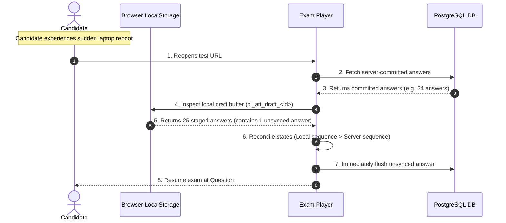

# 16 — ANSWER PERSISTENCE, STAGING & NAVIGATION ARCHITECTURE

> **DOCUMENTATION CLASSIFICATION:** Data Persistence & Network Resilience Specification  
> **LIFECYCLE STATUS:** Production & Frozen  
> **SYSTEM LAYER:** Client-to-Database Sync Pipeline  

---

## 1. What is it?
The **Answer Persistence & Staging Pipeline** is the multi-tier data synchronization architecture that ensures candidate responses are immediately preserved in low-latency client storage, transmitted via debounced server batches, validated with monotonic sequence numbers, and committed into PostgreSQL without blocking navigation or dropping answers during network disconnections.

## 2. Multi-Tier Persistence Architecture

```
+----------------------------------------------------------------------------------------------------+
|                               MULTI-TIER ANSWER PERSISTENCE PIPELINE                               |
+----------------------------------------------------------------------------------------------------+

[ TIER 1: IMMEDIATE IN-MEMORY STATE ]
Candidate clicks option -> React State updates instantly (< 1ms) -> UI reflects selection.
         │
         ▼
[ TIER 2: LOCAL STORAGE STAGING BUFFER ]
Serialized into browser `localStorage` under `cl_att_draft_<attempt_id>` (< 5ms).
Guarantees answer safety against sudden browser crashes, tab closure, or accidental reloads.
         │
         ▼
[ TIER 3: DEBOUNCED BATCH BUFFER ]
Candidate responses queued into a FIFO network buffer. Flushed every 3,000ms or immediately on section switch.
         │
         ▼
[ TIER 4: SERVER ACTION / REST BATCH RPC ]
Transmitted via HTTPS with monotonic `client_sequence_id` to `save_attempt_answers_batch`.
         │
         ▼
[ TIER 5: POSTGRESQL UPSERT BATCH COMMIT ]
PostgreSQL executes bulk `INSERT ... ON CONFLICT (attempt_id, question_version_id) DO UPDATE`.
```

---

## 3. Sequence Validation & Stale Write Protection

To prevent out-of-order network packets from overwriting newer candidate selections with older stale data:
1. Every answer action increments an integer `sequence_number`.
2. The database stores `last_sequence_number` per `attempt_answer`.
3. The SQL upsert enforces:
   ```sql
   UPDATE public.attempt_answers
   SET 
     selected_option_key = EXCLUDED.selected_option_key,
     is_answered = EXCLUDED.is_answered,
     sequence_number = EXCLUDED.sequence_number,
     updated_at = NOW()
   WHERE attempt_answers.sequence_number < EXCLUDED.sequence_number;
   ```
4. If a delayed network packet with `sequence_number = 4` arrives after `sequence_number = 5` has already been committed, the database safely ignores the stale packet.

---

## 4. Crash Recovery Protocol



---

## 5. What Must Never Happen
- Answer staging must **never** make synchronous blocking HTTP calls that freeze the question palette UI.
- Network disconnection must **never** clear the candidate's selected option in the active view.
- Final test submission must **never** proceed until all pending items in the local staging buffer have been successfully flushed and acknowledged by the server.
