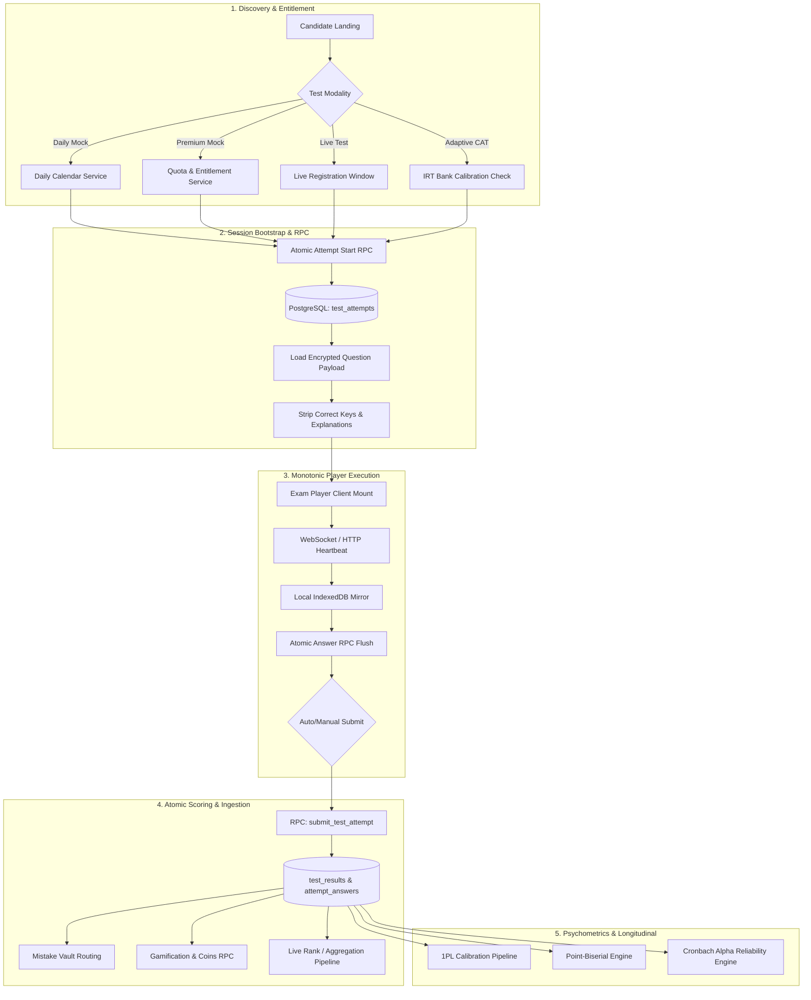
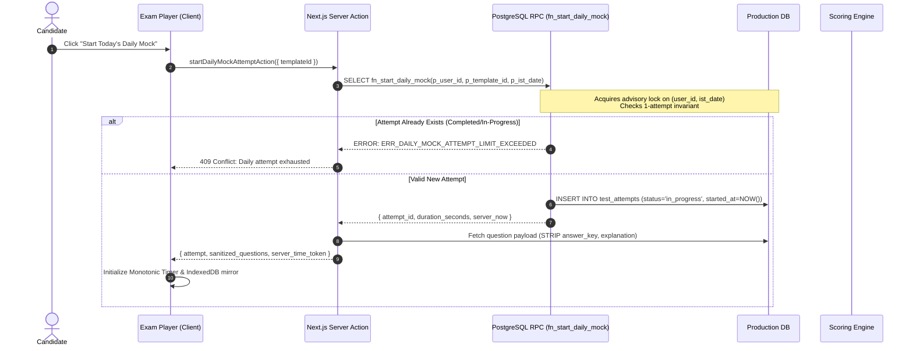
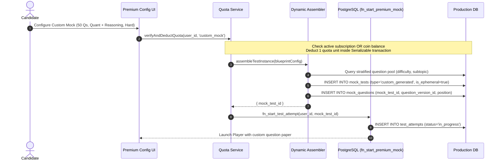
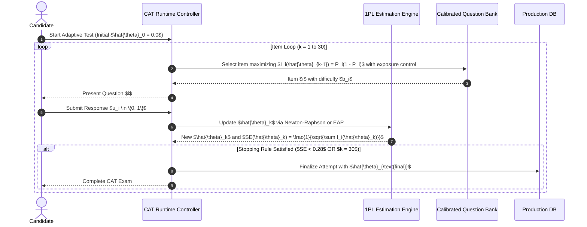
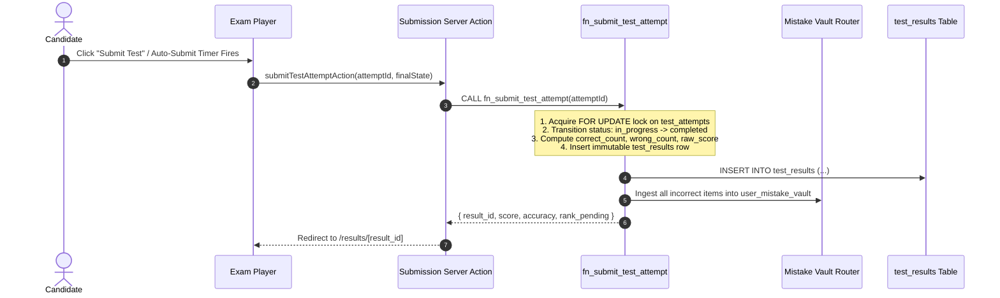

# 35 — End-to-End Workflows & Transaction Lifecycles

## 1. System Overview & Workflow Taxonomy

The Courage Library Assessment Engine orchestrates seven distinct transactional workflows across four assessment modalities (Daily Free, Premium Custom, Live All-India, and Adaptive CAT). Every workflow traverses a strict multi-tier execution lifecycle enforcing zero-trust state transitions, monotonic timers, atomic answer persistence, and isolated psychometric scoring.



---

## 2. The 7 Core Transactional Workflows

### 2.1 Workflow 1: Daily Mock Flow (Free Tier, 1 Attempt / IST Day)

#### Sequence Diagram


#### Detailed Transaction Steps
1. **Date Resolution**: Server computes `target_ist_date = (UTC_NOW + INTERVAL '5 hours 30 minutes')::DATE`.
2. **Advisory Lock**: The RPC acquires an exclusive transactional advisory lock `pg_advisory_xact_lock(hashtext('daily_mock_' || p_user_id || '_' || target_ist_date))`.
3. **Existence Check**: Queries `test_attempts` where `user_id = p_user_id`, `template_id = p_template_id`, and `created_at_ist::DATE = target_ist_date`. If any attempt exists (`in_progress`, `completed`, or `abandoned`), it raises `ERR_DAILY_MOCK_EXHAUSTED`.
4. **Attempt Allocation**: Inserts row in `test_attempts` with `status = 'in_progress'`, `started_at = NOW()`, `allocated_duration_seconds = 900`.
5. **Payload Sanitization**: Server Action fetches `question_versions` and options; strips `is_correct`, `solution_text`, `discrimination_index`, and returns purely structural UI payloads.
6. **Execution & Sync**: Player fires answer patches every 3000ms via `fn_save_attempt_answer`.
7. **Submission**: Atomic RPC `fn_submit_test_attempt` validates server deadline `started_at + INTERVAL '900 seconds' + INTERVAL '30 seconds grace'`.
8. **Coin Settlement**: Awards $C = +10$ CL Coins via `fn_credit_gamification_coins` with idempotency key `daily_mock_{attempt_id}`.

---

### 2.2 Workflow 2: Premium Mock Generation Flow (Dynamic & Fixed)

#### Sequence Diagram


#### Quota Invariants
- If user has active Pro Subscription: Quota consumption recorded against monthly allowance table `user_subscription_usage`.
- If user uses CL Coins: Atomically debits 50 coins from `coin_wallets` with ledger entry `type = 'DEBIT'`, `reference_type = 'custom_mock_generation'`.
- Rollback Safety: If `assembleTestInstance` fails or question pool is exhausted, the quota transaction aborts and coins/allowances are never debited.

---

### 2.3 Workflow 3: Live All-India Test Flow (14-Stage Lifecycle)

#### Lifecycle State Matrix
| Stage | Window | State in DB | Candidate Capabilities | Backend Operations |
|---|---|---|---|---|
| 1. Published | $T < T_{\text{reg\_start}}$ | `scheduled` | View syllabus, add to calendar | Pre-generate test instance |
| 2. Registration Open | $T_{\text{reg\_start}} \le T < T_{\text{reg}}>end$ | `registration_open` | Register, select language | Seat allocation, verify eligibility |
| 3. Registration Closed | $T_{\text{reg\_end}} \le T < T_{\text{start}}$ | `registration_closed` | View countdown timer | Pre-warm Redis cache, compile papers |
| 4. Test Live | $T_{\text{start}} \le T \le T_{\text{end}}$ | `in_progress` | Start attempt, submit answers | Real-time WebSocket telemetry, rate limiting |
| 5. Grace Submission | $T_{\text{end}} < T \le T_{\text{end}} + 120s$ | `in_progress` | Emergency auto-flush | Ingest trailing packets |
| 6. Window Closed | $T > T_{\text{end}} + 120s$ | `completed` | View "Evaluation in Progress" | Server force-closes unsubmitted attempts |
| 7. Preliminary Scoring | $T_{\text{eval\_start}}$ | `scoring` | None | Batch compute scores ($+M, -M$) |
| 8. Dispute Window | 24h post-test | `disputes_open` | Report questions, submit objections | Admin reviews reported errata |
| 9. Key Finalization | Post-disputes | `keys_frozen` | None | Re-grade affected items |
| 10. Merit List Calc | Post-key | `ranking` | None | Deterministic tie-breaker ranking |
| 11. Percentile Engine | Post-rank | `percentiles_computed` | None | Continuous percentile calculation |
| 12. Result Publication | $T_{\text{result}}$ | `published` | Access full scorecard, solutions | Send push/email notifications |
| 13. Certificate Mint | Post-publish | `certified` | Download HMAC-signed PDF | Batch mint certificates |
| 14. Archival / Psych | $+48$h post-result | `archived` | View historical record | Ingest evidence into 1PL/Item calibration |

---

### 2.4 Workflow 4: Adaptive Testing (1PL Rasch CAT) Flow

#### Sequence Diagram


---

## 3. Answer Persistence & Sync Transaction Model

### 3.1 5-Tier Write Pipeline
```
[User Action] 
     │
     ▼
[Tier 1: React State (Zustand)] ──── (Instant UI Update < 1ms)
     │
     ▼
[Tier 2: IndexedDB Local Storage] ── (Zero-Loss Offline Mirror < 5ms)
     │
     ▼
[Tier 3: In-Flight Request Queue] ── (Debounced Monotonic Batcher < 300ms)
     │
     ▼
[Tier 4: PostgreSQL RPC Sync] ────── (`fn_save_attempt_answer` < 50ms)
     │
     ▼
[Tier 5: Evaluation Ledger] ──────── (`attempt_answers` Row Lock)
```

### 3.2 Monotonic Conflict Resolution Algorithm
When late-arriving packets or multiple device tabs submit conflicting responses for question $Q_i$, the database applies **Monotonic Client Sequence Ordering**:

$$\text{ACCEPT}(P_{\text{incoming}}) \iff P_{\text{incoming}}.\text{sequence\_id} > P_{\text{stored}}.\text{sequence\_id}$$

```sql
CREATE OR REPLACE FUNCTION fn_save_attempt_answer(
    p_attempt_id UUID,
    p_question_id UUID,
    p_selected_option_id UUID,
    p_time_spent_seconds INT,
    p_sequence_id BIGINT,
    p_client_timestamp TIMESTAMPTZ
) RETURNS JSONB AS $$
DECLARE
    v_status TEXT;
    v_existing_seq BIGINT;
BEGIN
    SELECT status INTO v_status FROM test_attempts WHERE id = p_attempt_id;
    IF v_status != 'in_progress' THEN
        RETURN jsonb_build_object('success', false, 'error', 'ATTEMPT_CLOSED');
    END IF;

    SELECT client_sequence_id INTO v_existing_seq 
    FROM attempt_answers 
    WHERE attempt_id = p_attempt_id AND question_id = p_question_id;

    IF v_existing_seq IS NOT NULL AND p_sequence_id <= v_existing_seq THEN
        -- Stale out-of-order packet: ignore update, return latest ack
        RETURN jsonb_build_object('success', true, 'status', 'IGNORED_STALE_SEQUENCE');
    END IF;

    INSERT INTO attempt_answers (
        attempt_id, question_id, selected_option_id, time_spent_seconds, 
        client_sequence_id, updated_at
    ) VALUES (
        p_attempt_id, p_question_id, p_selected_option_id, p_time_spent_seconds,
        p_sequence_id, NOW()
    )
    ON CONFLICT (attempt_id, question_id) DO UPDATE SET
        selected_option_id = EXCLUDED.selected_option_id,
        time_spent_seconds = attempt_answers.time_spent_seconds + EXCLUDED.time_spent_seconds,
        client_sequence_id = EXCLUDED.client_sequence_id,
        updated_at = NOW();

    RETURN jsonb_build_object('success', true, 'sequence_id', p_sequence_id);
END;
$$ LANGUAGE plpgsql SECURITY DEFINER;
```

---

## 4. End-to-End Submission & Result Generation

### 4.1 The Atomic Submission Sequence


### 4.2 Scoring Determinism Verification
The server recalculates raw score strictly inside PostgreSQL:
$$\text{RawScore} = (N_{\text{correct}} \times M_{\text{correct}}) - (N_{\text{incorrect}} \times M_{\text{penalty}})$$
$$\text{Accuracy} = \frac{N_{\text{correct}}}{N_{\text{correct}} + N_{\text{incorrect}}} \times 100 \quad (\text{Omissions excluded from denominator})$$

---

## 5. Summary Invariants

1. **No Client Side Key Storage**: No correct answers, solutions, or discriminatory metrics exist in client DOM, JavaScript memory, or IndexedDB during active attempt.
2. **Server Absolute Time Authority**: Client local clock manipulation has 0.000% impact on allocated exam duration.
3. **Double Submission Mutex**: Attempt status transition is an atomic single-winner operation (`UPDATE ... WHERE status = 'in_progress' RETURNING id`).
4. **Instant Vault Ingestion**: Every incorrect answer is routed to Mistake Vault at submission transaction boundary before response is sent to user.
