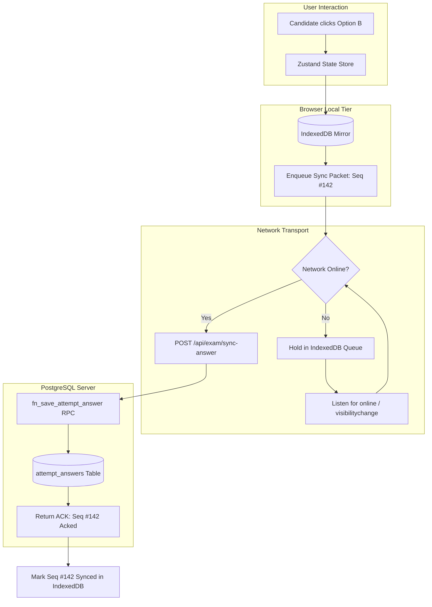
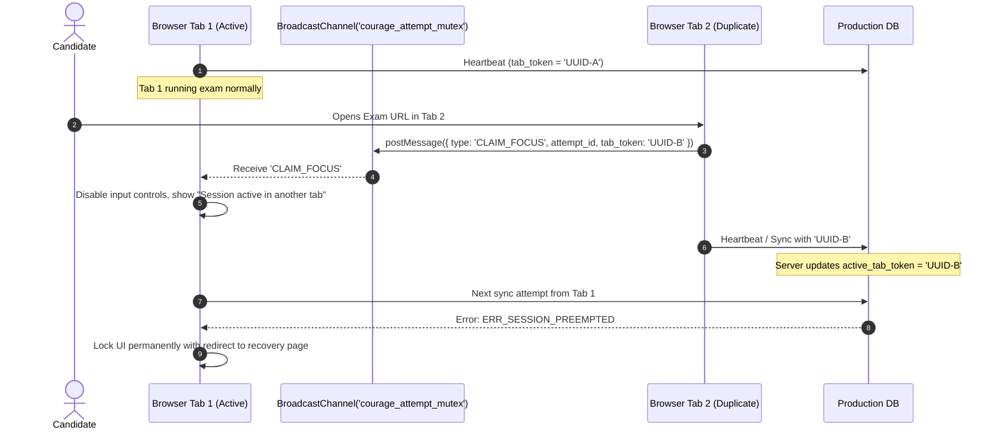
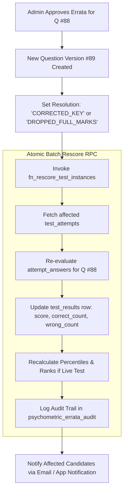

# 36 — Failure Modes, Resiliency & Disaster Recovery

## 1. System Failure Matrix

The Courage Library Assessment Engine is designed around **fault tolerance under adverse network conditions, client crashes, server restarts, and database split-brain scenarios**. Because high-stakes competitive examinations involve strict time limits, zero data loss and deterministic recovery are mandatory.

| Failure Scenario | Detection Mechanism | Primary Mitigation | Target RPO | Target RTO |
|---|---|---|---|---|
| **Client Network Drop** | Navigator offline event, heartbeat ping timeout (5s) | Offline buffer in IndexedDB, continuous background retry | 0 seconds | < 1 second on reconnect |
| **Browser Tab Crash / Reload** | Page unload / fresh mount with existing `attempt_id` | Hydrate state from IndexedDB + RPC server reconciliation | 0 seconds | < 2 seconds |
| **Multi-Tab Session Collision** | Heartbeat token mismatch, BroadcastChannel conflict ping | Evict stale tab, display warning banner, enforce single active tab | N/A | Immediate |
| **Client Local Clock Tampering** | Server-side monotonic differential check | Server maintains absolute anchor (`started_at`), ignores client clock | 0 seconds | 0 seconds |
| **Server Restart Mid-Attempt** | Health check probe failure, connection reset | Next.js stateless Server Actions, connection pooling via Supabase/PgBouncer | 0 seconds | < 3 seconds |
| **Auto-Submit Network Failure** | Submission RPC timeout on client expiry | Background auto-close worker sweeps expired attempts (`NOW() > deadline + grace`) | 0 seconds | < 60 seconds |
| **Disputed Question / Errata** | Admin errata decision workflow | Versioned immutable re-scoring RPC (`fn_rescore_test_instance`) | 0 seconds | Async batch |

---

## 2. Client-Side Resiliency & Local Persistence

### 2.1 IndexedDB Mirroring Architecture
The player maintains an offline-first transactional store inside the browser using IndexedDB:
- Database: `courage_exam_vault_v1`
- Object Stores:
  1. `attempt_meta`: `{ attempt_id, start_server_time, allocated_seconds, server_sync_offset }`
  2. `question_responses`: `[ { question_id, selected_option_id, status, time_spent, sequence_id, synced } ]`
  3. `pending_sync_queue`: Queue of unacknowledged mutations awaiting network connectivity.



### 2.2 Cold Crash Recovery Protocol
When candidate reopens the browser after a complete power outage or crash:
1. Client boots `/exam/[attempt_id]`.
2. Reads local `attempt_meta` and un-synced entries from IndexedDB.
3. Invokes `fn_reconcile_attempt_session(attempt_id)` with client's highest sequence ID.
4. Server returns:
   - Remaining time computed as: $\text{Remaining} = \text{AllocatedDuration} - (\text{ServerNOW} - \text{started\_at})$.
   - Server authoritative answer map.
5. Client merges: If IndexedDB has unsynced updates with higher timestamps before disconnection, it flushes them immediately. If server remaining time $\le 0$, client executes emergency auto-submission.

---

## 3. Concurrency Collisions & Multi-Tab Protection

To prevent candidates from opening multiple browser windows to gain unfair advantages or corrupt attempt state:



---

## 4. Unattended Attempt Sweeper (Server-Side Auto-Close)

If a candidate abruptly disconnects, loses battery, or closes the computer without clicking "Submit", the database must deterministically close the attempt to prevent score manipulation.

### 4.1 Sweeper Logic & Cron Schedule
A pg_cron / Edge worker executes every 60 seconds:
```sql
CREATE OR REPLACE FUNCTION fn_sweep_expired_test_attempts()
RETURNS TABLE (closed_count INT) AS $$
DECLARE
    v_closed INT := 0;
    v_rec RECORD;
BEGIN
    FOR v_rec IN 
        SELECT id, user_id, mock_test_id 
        FROM test_attempts
        WHERE status = 'in_progress'
          AND started_at + (allocated_duration_seconds || ' seconds')::INTERVAL + INTERVAL '120 seconds' < NOW()
        FOR UPDATE SKIP LOCKED
    LOOP
        -- Execute atomic evaluation and state transition
        PERFORM fn_submit_test_attempt(v_rec.id, 'auto_timeout_sweep');
        v_closed := v_closed + 1;
    END LOOP;

    RETURN QUERY SELECT v_closed;
END;
$$ LANGUAGE plpgsql SECURITY DEFINER;
```

---

## 5. Errata Handling & Re-Scoring Engine

When a disputed question is upheld (e.g., Option C was marked correct instead of Option B, or an item is cancelled for ambiguity):



### 5.1 Re-Scoring Mathematical Rules
1. **Key Correction (e.g., Key changed from A to B)**:
   - Candidates with A: Now marked incorrect ($-M_{\text{penalty}}$).
   - Candidates with B: Now marked correct ($+M_{\text{correct}}$).
   - Candidates omitted: Score remains $0.0$.
2. **Item Dropped (Ambiguous / Defective Item)**:
   - **Rule Option 1 (Pro-Rata Scaling)**: Total marks scaled over remaining $N-1$ items.
   - **Rule Option 2 (Full Marks to All)**: Every candidate receives $+M_{\text{correct}}$ regardless of attempt status.
   - **Courage Standard**: Rule 2 (Full Marks to All) is applied for Tier-1 live competitive exams to align with statutory Indian testing authority norms.

---

## 6. Disaster Recovery & Snapshot Verification

- **Write Ahead Log (WAL) Archiving**: Continuous point-in-time recovery (PITR) with RPO < 5 minutes.
- **Read Replica Failover**: In the event of primary database node crash, connection string pool switches to standby replica in < 30 seconds.
- **Snapshot Immutability**: `test_results` records are write-once, read-many (WORM). Rescoring produces an auditable revision trail (`test_result_revisions`) preserving original pre-errata scores for regulatory compliance.
