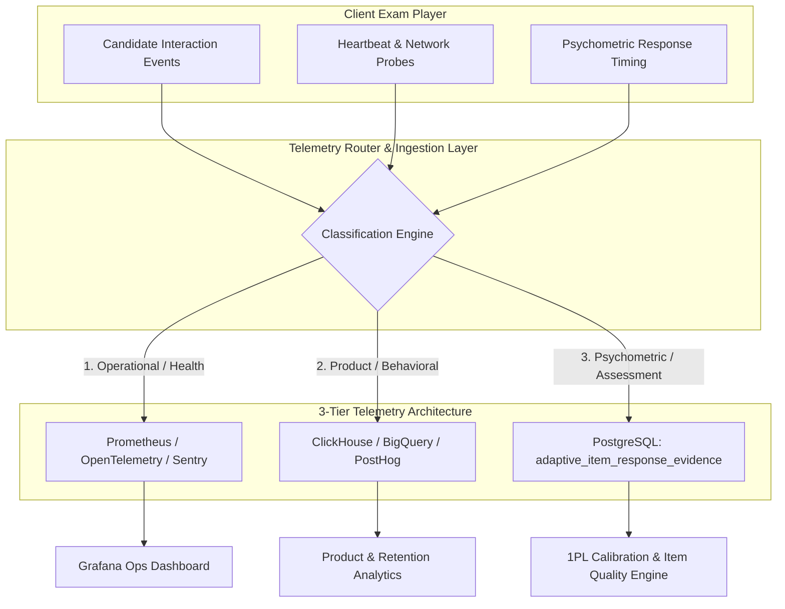

# 37 — Analytics, Telemetry & Observability Architecture

## 1. Tri-Partite Telemetry Taxonomy

The Courage Library assessment telemetry pipeline divides all runtime metrics into three strictly separated categories with differing retention policies, delivery channels, and access scopes.



---

## 2. Telemetry Tiers & Characteristics

| Dimension | Tier 1: Operational Telemetry | Tier 2: Product & Behavioral Telemetry | Tier 3: Psychometric Evidence Telemetry |
|---|---|---|---|
| **Primary Consumer** | SREs, Backend Engineers | Product Managers, Growth Leads | Psychometricians, Content Lead, ML Models |
| **Data Schema** | Metrics, traces, logs, spans | Event stream (JSON payloads) | Strongly typed relational evidence records |
| **Destination** | OpenTelemetry / Sentry / Prometheus | Analytics Data Warehouse (PostHog/ClickHouse) | PostgreSQL (`adaptive_item_response_evidence`) |
| **Durability** | Ephemeral (7 to 30 days) | Long-term (1 to 2 years) | **Permanent / Immutable (Forensic & IRT)** |
| **SLA / Latency** | Near real-time (< 2 seconds) | Batched / Asynchronous (< 60 seconds) | Synchronous / Bound to Submit Transaction |
| **Sample Events** | `db_pool_exhausted`, `rpc_latency_p99`, `500_internal_error` | `filter_applied`, `scroll_depth`, `bookmark_added` | `item_response_recorded`, `distractor_selected`, `response_time_ms` |

---

## 3. Client Interaction Event Stream

During an active assessment, the client engine records granular interaction telemetry without impeding the main UI thread. Events are queued in memory and flushed in compressed micro-batches every 5000ms.

### 3.1 Event Taxonomy
```typescript
export type AssessmentClientEvent =
  | { type: 'QUESTION_VIEWED'; questionId: string; timestamp: number; previousQuestionId?: string }
  | { type: 'OPTION_SELECTED'; questionId: string; optionId: string; timestamp: number; sequenceId: number }
  | { type: 'OPTION_CLEARED'; questionId: string; timestamp: number; sequenceId: number }
  | { type: 'FLAG_TOGGLED'; questionId: string; isFlagged: boolean; timestamp: number }
  | { type: 'SECTION_SWITCHED'; fromSectionId: string; toSectionId: string; timestamp: number }
  | { type: 'WINDOW_BLURRED'; timestamp: number; durationMs?: number }
  | { type: 'WINDOW_FOCUSED'; timestamp: number }
  | { type: 'NETWORK_STATUS_CHANGE'; isOnline: boolean; timestamp: number }
  | { type: 'CALCULATOR_OPENED'; timestamp: number }
  | { type: 'SUBMIT_CLICKED'; source: 'manual' | 'timeout'; timestamp: number };
```

### 3.2 Anti-Cheat Window Focus Telemetry
To monitor exam integrity during high-stakes Live tests:
```javascript
// Window focus listener attached to exam container
window.addEventListener('blur', () => {
  telemetryQueue.push({
    type: 'WINDOW_BLURRED',
    attemptId: activeAttemptId,
    timestamp: Date.now()
  });
});

window.addEventListener('visibilitychange', () => {
  if (document.hidden) {
    telemetryQueue.push({
      type: 'TAB_HIDDEN',
      attemptId: activeAttemptId,
      timestamp: Date.now()
    });
  }
});
```

---

## 4. Psychometric Evidence Logging (Tier 3)

Unlike ephemeral analytics, psychometric evidence is **authoritative scientific data** required to compute Facility Value ($p$), Point-Biserial ($r_{\text{pbis}}$), Distractor Distributions, and Rasch Difficulty ($b_i$).

### 4.1 Schema Definition
```sql
CREATE TABLE adaptive_item_response_evidence (
    id UUID PRIMARY KEY DEFAULT gen_random_uuid(),
    question_id UUID NOT NULL REFERENCES questions(id),
    question_version_id UUID NOT NULL REFERENCES question_versions(id),
    test_attempt_id UUID NOT NULL REFERENCES test_attempts(id),
    user_id UUID NOT NULL REFERENCES auth.users(id),
    selected_option_id UUID REFERENCES question_options(id),
    is_correct BOOLEAN NOT NULL,
    response_time_seconds NUMERIC(8,2) NOT NULL,
    candidate_ability_estimate NUMERIC(6,4), -- Theta estimate at time of response
    test_modality TEXT NOT NULL,             -- 'daily_mock', 'premium_custom', 'live_competition', 'adaptive_cat'
    population_cohort TEXT NOT NULL DEFAULT 'standard',
    created_at TIMESTAMPTZ NOT NULL DEFAULT NOW()
);

CREATE INDEX idx_evidence_question_cohort ON adaptive_item_response_evidence (question_id, population_cohort, created_at);
```

### 4.2 Evidence Ingestion Rules
1. **Isolation of CAT vs Classical Tests**: Responses from Adaptive CAT sessions (where items are deliberately matched to $\theta$) are flagged with `test_modality = 'adaptive_cat'` and excluded from standard Classical Test Theory ($p$-value, $r_{\text{pbis}}$) pipelines to prevent selection bias.
2. **Speed-Accuracy Outlier Filtering**: Any response with $\text{response\_time\_seconds} < 2.0\text{s}$ on a complex quantitative item ($>100$ characters) is tagged with `anomaly_flag = 'RAPID_GUESS'` and quarantined from item calibration.

---

## 5. Production Operational Observability

### 5.1 Key SLIs and SLOs
| Metric / Indicator | Target SLO | Measurement Method | Alert Severity |
|---|---|---|---|
| **RPC Answer Sync Latency** | $p95 < 80\text{ms}$, $p99 < 200\text{ms}$ | Prometheus histogram on `fn_save_attempt_answer` | P1 if $p95 > 250\text{ms}$ for 3m |
| **Exam Player Page Load Time** | $p95 < 1.2\text{s}$ (LCP) | Web Vitals RUM on `/exam/[id]` | P2 if $p95 > 2.5\text{s}$ |
| **Heartbeat Drop Rate** | $< 0.1\%$ dropped packets | Dropped ping counter / Total attempts | P2 if drop rate $> 1.0\%$ |
| **Scoring Submission Duration** | $p99 < 450\text{ms}$ | Transaction execution timer on `fn_submit_test_attempt` | P1 if $p99 > 1500\text{ms}$ |
| **Active DB Connection Pool Saturation**| $< 70\%$ pool capacity | Supabase / PgBouncer active client metrics | P1 if $> 85\%$ for 1m |

### 5.2 Sentry Crash Error Reporting
The exam player wraps the entire UI tree in a custom Error Boundary. In the event of a client React rendering crash:
1. Captures component stack and Redux/Zustand state dump.
2. Ensures all unsynced answers in IndexedDB are immediately dispatched via a fallback synchronous `navigator.sendBeacon` request.
3. Renders a graceful "Exam Crash Recovery" fallback allowing candidate to reload the player with zero lost time.
