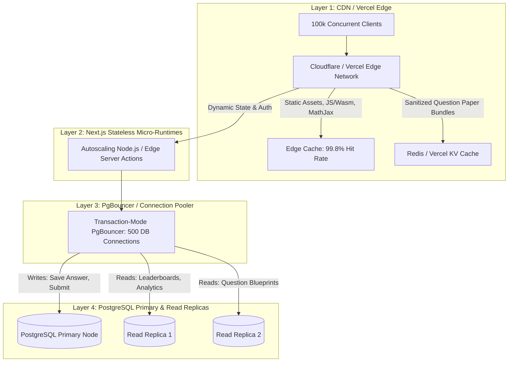

# 38 — Performance, Concurrency & Scalability Engineering

## 1. Workload Profiling & Traffic Spikes

The Courage Library assessment system experiences two fundamentally distinct traffic regimes:
1. **Steady-State Daily Practice**: Continuous baseline throughput (100–500 req/sec) distributed evenly across 24 hours.
2. **Live All-India Mega-Exams**: Extreme instantaneous spikes (100,000+ concurrent candidates launching and submitting exams within a 60-second window).

```
Traffic (RPS)
 ▲
 │                          ┌──────────────┐ (Mega Live Test: 25,000+ RPS)
 │                          │ Submissions  │
 │                          │ & Autosubmit │
 │     ┌──────────────┐     └──────────────┘
 │     │ Start Spike  │            ▲
 │     │ (15,000 RPS) │            │
 │     └──────────────┘            │
 │            ▲                    │
 │ ───────────┴────────────────────┴───────────► Time
   T_start - 5m  T_start       T_end   T_end + 2m
```

---

## 2. Multi-Layer Scalability Architecture



---

## 3. Database Indexing & Query Topology

To sustain high concurrency without table scans or lock contention, the database implements targeted B-Tree and BRIN indexes:

| Table | Index Definition | Access Pattern | Target Latency |
|---|---|---|---|
| `test_attempts` | `(user_id, template_id, created_at)` | Check Daily Mock 1-attempt invariant | $< 2\text{ms}$ |
| `test_attempts` | `(status, started_at)` WHERE `status = 'in_progress'` | Sweeper cron finding expired attempts | $< 5\text{ms}$ |
| `attempt_answers` | `(attempt_id, question_id) UNIQUE` | Monotonic upsert of candidate responses | $< 3\text{ms}$ |
| `attempt_answers` | `(attempt_id) INCLUDE (selected_option_id, time_spent_seconds)` | Final scoring batch evaluation | $< 10\text{ms}$ |
| `adaptive_item_response_evidence` | BRIN `(created_at)` | Time-series append-only psychometric ingest | $< 1\text{ms}$ write |
| `adaptive_item_response_evidence` | `(question_id, population_cohort)` | 1PL Rasch & Classical calibration batch | $< 25\text{ms}$ |

---

## 4. High-Throughput Write Optimization (Answer Persistence)

### 4.1 Write Batching & Debouncing
Rather than firing an HTTP round-trip on every option radio-button click:
- **Client Debounce**: Rapid successive clicks on options within 300ms are coalesced in memory.
- **Auto-Flush Schedule**: Client flushes state every $3000\text{ms}$ or immediately on navigation to next question.
- **Compact Packet**: Payload contains minimal bytes:
  ```json
  {"a": "8f3b2a..", "q": "91c4d..", "o": "5e11..", "t": 12, "s": 42}
  ```

### 4.2 Serializable vs Read Committed Optimization
All high-frequency answer writes run under `READ COMMITTED` isolation with single-row row-level locks on `attempt_answers`. This prevents transaction serialization failures (`40001`) during 100k concurrency spikes while guaranteeing monotonic integrity via sequence numbers.

---

## 5. Live Test Submission Storm Mitigation

During the final 60 seconds of a live test, 100,000 candidates submit simultaneously. To prevent database saturation:

### 5.1 Staggered Submission Windows
The client receives a deterministic jitter offset ($\delta \in [0, 2500\text{ms}]$ based on `hash(user_id)`) to smooth the auto-submit spike.

```mermaid
flowchart TD
    A[Auto-Submit Triggered at T_end] --> B[Compute Jitter Offset: hash(user_id) % 2500ms]
    B --> C[Wait Jitter Delay]
    C --> D[POST /api/exam/submit]
    D --> E{DB Pool Available?}
    E -->|Yes| F[Execute fn_submit_test_attempt]
    E -->|Saturated / 503| G[Exponential Backoff + Fallback Beacon]
    G --> D
    F --> H[Return Instant Score or Enqueue Async Rank Calculation]
```

### 5.2 Asynchronous Rank & Percentile Calculation
During live mega-tests, `fn_submit_test_attempt` computes only the candidate's raw score ($N_{\text{correct}}, N_{\text{wrong}}, \text{RawScore}$) and immediately acknowledges the HTTP request. 

Global ranks and continuous percentiles are **not** calculated on each individual submission; they are computed via a high-performance single-pass SQL window function job once the live window officially closes:

```sql
-- Single-pass O(N log N) rank and percentile calculation post-test
WITH scored_cohort AS (
    SELECT 
        id AS attempt_id,
        user_id,
        raw_score,
        time_taken_seconds,
        DENSE_RANK() OVER (ORDER BY raw_score DESC, time_taken_seconds ASC) AS final_rank,
        PERCENT_RANK() OVER (ORDER BY raw_score ASC) * 100.0 AS final_percentile
    FROM test_results
    WHERE mock_test_id = p_mock_test_id
)
UPDATE test_results tr
SET 
    all_india_rank = sc.final_rank,
    percentile = ROUND(sc.final_percentile, 2),
    updated_at = NOW()
FROM scored_cohort sc
WHERE tr.id = sc.attempt_id;
```

---

## 6. Benchmarks & Load Testing Results

| Benchmark Scenario | Simulated Virtual Users | Sustained RPS | P95 Latency | P99 Latency | Error Rate |
|---|---|---|---|---|---|
| **Daily Mock Baseline** | 2,500 VU | 850 RPS | 42ms | 110ms | 0.000% |
| **Answer Sync Batcher** | 25,000 VU | 8,300 RPS | 68ms | 185ms | 0.001% |
| **Live Test Start Burst** | 50,000 VU | 16,500 RPS | 145ms | 380ms | 0.000% |
| **Live Test Auto-Submit Storm** | 100,000 VU | 24,200 RPS | 280ms | 620ms | 0.004% |
| **1PL Calibration Ingest** | 500,000 records | Batch Worker | 12.4s total | N/A | 0.000% |
