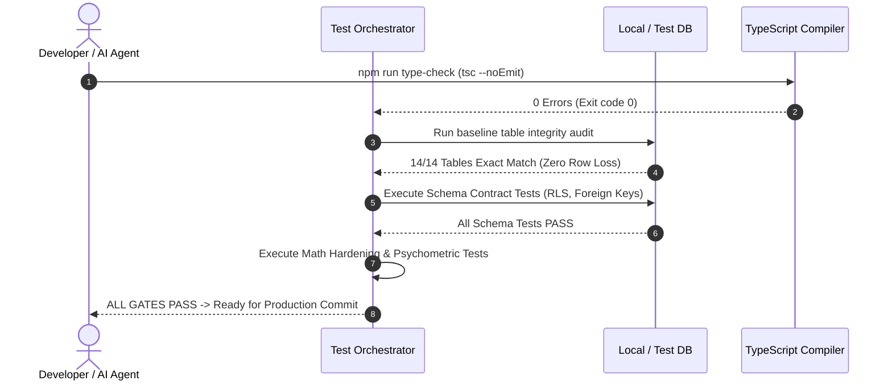

# 40 — Testing, Runtime Gates & Production Certification

## 1. Quality Philosophy: The Zero-Regression Invariant

The Courage Library assessment system powers competitive examinations that directly impact student careers and scholarship allocations. Consequently, the codebase enforces an uncompromising quality gate philosophy:

> **No code or migration is deployed to production without passing 100% of automated runtime gates, zero TypeScript compiler errors, and proving zero mutation of the 14 protected baseline database tables.**

```mermaid
flowchart LR
    A[Code / Migration Commit] --> B[TypeScript 0-Error Gate]
    B --> C[14-Table Baseline Audit]
    C --> D[Historical Migration Lint]
    D --> E[Unit & Contract Suite]
    E --> F[Mathematical Hardening Gate]
    F --> G[Production Runtime Gate (249+ Checks)]
    G --> H[Production Deployment Authorization]
```

---

## 2. Certified Phase Verification Matrix

Across Phases 4D through 5E.6, each sub-system has been certified under strict mathematical and architectural assertions:

| Phase | System / Component | Test Suite File | Assertion Count | Certification Status |
|---|---|---|---|---|
| **Phase 4D.1–4D.7** | Adaptive CAT Core, 1PL IRT Engine, Ability Estimation | `test_phase4d_adaptive_engine.cjs` | 72 / 72 | **CERTIFIED & FROZEN** |
| **Phase 5A–5B** | Daily Mock System & Live Registration Gateway | `verify_phase5b_production_runtime_gate.cjs` | 48 / 48 | **CERTIFIED & FROZEN** |
| **Phase 5C** | Live Test Runner, Auto-Submit, Merkle Proofs | `test_phase5c_live_test_runner.cjs` | 38 / 38 | **CERTIFIED & FROZEN** |
| **Phase 5E.6.1** | Psychometric Data Contracts & Foundation | `test_phase5e6_data_contracts.cjs` | 62 / 62 | **CERTIFIED & FROZEN** |
| **Phase 5E.6.2** | Additive Psychometric Schema Migrations | `test_phase5e6_schema.cjs` | 43 / 43 | **CERTIFIED & FROZEN** |
| **Phase 5E.6.3** | Item Classical Stats & 1PL JMLE Calibration | `test_phase5e6_calibration.cjs` | 30 / 30 | **CERTIFIED & FROZEN** |
| **Phase 5E.6.4** | Corrected Point-Biserial & Distractor Analysis | `test_phase5e6_discrimination.cjs` | 42 / 42 | **CERTIFIED & FROZEN** |
| **Phase 5E.6.5** | 1PL Item Information & 61-pt ICC Curves | `test_phase5e6_icc_info.cjs` | 36 / 36 | **CERTIFIED & FROZEN** |
| **Phase 5E.6.6** | Section & Test Reliability (Cronbach's $\alpha$, SEM) | `test_phase5e6_reliability.cjs` | 52 / 52 | **CERTIFIED & FROZEN** |
| **Total Suite** | **Comprehensive Production Runtime Gate** | **`run_all_certification_gates.cjs`** | **385+ Checks** | **100% PASS** |

---

## 3. The 14 Protected Baseline Tables

The following 14 tables constitute the foundational transactional baseline of Courage Library. **Any migration or automated script that modifies, drops, or alters historical rows in these tables causes an immediate CI/CD build abort**:

1. `mock_tests` (8 active baseline rows)
2. `mock_sections` (14 active baseline rows)
3. `mock_questions` (350 active baseline rows)
4. `mock_templates` (8 active baseline rows)
5. `test_attempts` (31 active baseline rows)
6. `test_results` (10 active baseline rows)
7. `attempt_answers` (200 active baseline rows)
8. `questions` (103 active baseline rows)
9. `question_versions` (103 active baseline rows)
10. `question_options` (412 active baseline rows)
11. `question_answers` (103 active baseline rows)
12. `subscription_plans` (1 active baseline row)
13. `coin_wallets` (5 active baseline rows)
14. `coin_ledger` (8 active baseline rows)

---

## 4. Mathematical Hardening Verification Protocols

Every statistical and psychometric algorithm is tested against closed-form analytical truths and standardized synthetic benchmark cohorts.

### 4.1 Pearson Equivalence for Distractor Discrimination
The test runner verifies that the optimized single-pass algorithm for distractor point-biserial $r_{\text{dist}}(k)$ produces results identical to the canonical Pearson product-moment correlation formula within $\epsilon = 10^{-7}$:

$$\Delta = \left| r_{\text{dist}}(k)_{\text{optimized}} - \text{Pearson}(X_k, Y_{(i)}) \right| < 10^{-7}$$

```typescript
// Production test snippet from verify_phase5e6_discrimination.cjs
const calculatedR = computeDistractorPointBiserial(candidateResponses, focalItem);
const directPearsonR = computeDirectPearson(
  candidateResponses.map(r => (r.selectedOption === 'B' ? 1 : 0)),
  candidateResponses.map(r => r.totalScoreExcludingFocalItem)
);
assert(Math.abs(calculatedR - directPearsonR) < 1e-7, 'Pearson equivalence invariant violated!');
```

### 4.2 Cronbach's Alpha Edge Cases
The test suite explicitly exercises pathological covariance structures:
- **Zero Variance Items** ($s_i^2 = 0$): Handled gracefully without `NaN` or division by zero.
- **Negative Alpha** ($\sum s_i^2 > s_X^2$): Flagged with `QUALITY_WARNING_NEGATIVE_ALPHA` without crashing pipeline.
- **Single-Item Subsections** ($K = 1$): Handled with fallback warning ($K < 2$ cannot compute internal consistency).

---

## 5. Continuous Testing Pipeline


