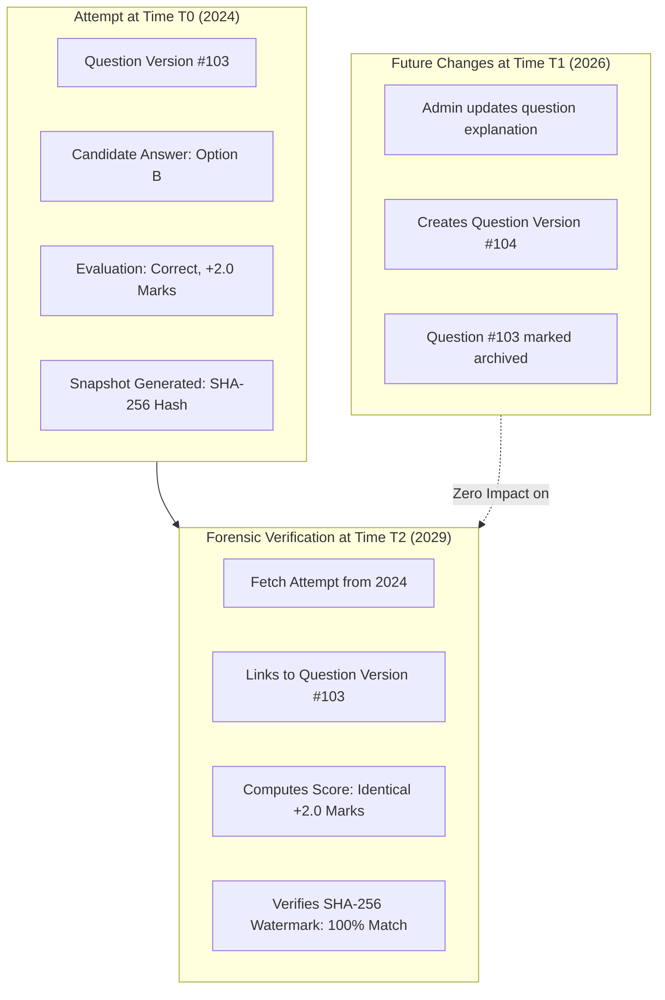

# 41 — Historical Reproducibility & Forensic Auditability

## 1. The Historical Reproducibility Invariant

In national and state-level competitive examinations, assessment results are subject to legal scrutiny, Right to Information (RTI) queries, and judicial challenges. Therefore, the Courage Library Assessment System enforces an absolute architectural guarantee:

> **Any completed examination attempt, if re-evaluated today, tomorrow, or five years in the future, MUST reproduce the exact same raw score, accuracy, question text, options presented, candidate selections, and psychometric snapshot.**



---

## 2. Immutable Entity Versioning Architecture

To preserve total historical fidelity, mutable in-place updates are prohibited across all assessment-critical database entities:

| Entity | Primary Key | Version Key | Mutability Rule |
|---|---|---|---|
| **Questions** | `questions.id` (UUID) | `question_versions.id` (UUID) | Root container is mutable (tags, metadata); question text and options are **strictly immutable** in `question_versions`. |
| **Question Options** | `question_options.id` | `question_version_id` | Bound to immutable version ID. Deletions and edits create a new version. |
| **Test Blueprints** | `mock_templates.id` | `template_version` | Updates bump version; existing test instances point to historical version. |
| **Test Attempts** | `test_attempts.id` | `started_at` | Status transitions from `in_progress` to `completed` once; never deleted. |
| **Test Results** | `test_results.id` | `attempt_id` | **Write-Once-Read-Many (WORM)**. Rescores write to `test_result_revisions`. |
| **Psychometric Calibration** | `psychometric_calibration_runs.id` | `run_timestamp` | Immutable snapshot of item parameters ($p, r_{\text{pbis}}, b_i$) at run time. |

---

## 3. Cryptographic SHA-256 Evidence Watermarking

Every psychometric calibration run, test result scorecard, and official certificate computes a deterministic SHA-256 evidence watermark over its canonical input payload.

### 3.1 Watermark Calculation Algorithm
```typescript
import { createHash } from 'crypto';

export function computeEvidenceWatermark(payload: {
  testInstanceId: string;
  questionIds: string[];
  candidateResponseIds: string[];
  scoringScheme: { correctMarks: number; penaltyMarks: number };
  computedTimestamp: string;
}): string {
  // Sort keys deterministically to guarantee reproducible hashing
  const canonicalString = JSON.stringify(payload, Object.keys(payload).sort());
  return createHash('sha256').update(canonicalString).digest('hex');
}
```

### 3.2 Verification Procedure
To verify that a calibration snapshot has not been tampered with or corrupted:
1. Re-query the raw `adaptive_item_response_evidence` rows bounded by the run's `[start_timestamp, end_timestamp]`.
2. Re-compute the SHA-256 watermark over the dataset.
3. Compare with `psychometric_calibration_runs.evidence_watermark`.
4. If identical, the statistical validity of the calibration parameters is forensically certified.

---

## 4. Errata Revisions vs Historical Snapshots

When an answer key is corrected post-exam (e.g. after candidate dispute review):

```
+-------------------------------------------------------------------------+
| test_results (Original Scorecard - WORM)                                 |
| id: res_001 | score: 68.5 | correct: 35 | wrong: 5 | created_at: 2026-09-08 |
+-------------------------------------------------------------------------+
                                    │
                       (Errata Rescore Event)
                                    ▼
+-------------------------------------------------------------------------+
| test_result_revisions (Audit Trail)                                     |
| id: rev_001 | result_id: res_001 | old_score: 68.5 | new_score: 70.5     |
| reason: "Errata approved on Q #42 (Option A -> Option C)"                |
| approved_by_admin: "admin_sec_09" | rescored_at: 2026-09-09              |
+-------------------------------------------------------------------------+
```

### 4.1 Invariants
1. **Never Overwrite Without Revision**: Direct `UPDATE test_results` without an associated `test_result_revisions` entry is blocked by a database trigger.
2. **Candidate Visibility**: The student scorecard displays both the original submitted score and the revised certified score, with a breakdown explaining the errata adjustment.
