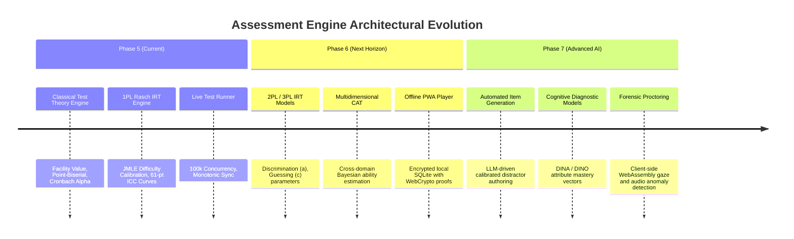

# 43 — Future Architecture Roadmap & Extensions

## 1. Vision & Evolution Trajectory

The Courage Library Assessment Engine is architected to scale from classical Indian competitive examinations into an advanced, AI-augmented, psychometrically adaptive global assessment platform. The future roadmap outlines planned major architectural milestones without compromising the 12 Sacred Laws.

---

## 2. Milestone 1: 2PL and 3PL Item Response Theory

While Phase 5 utilizes the 1PL / Rasch model ($P_i(\theta) = \frac{1}{1 + e^{-(\theta - b_i)}}$), Phase 6 will introduce Birnbaum's 2-Parameter and 3-Parameter Logistic models.

### 2.1 The 3PL Mathematical Model
$$P_i(\theta) = c_i + (1 - c_i) \frac{1}{1 + e^{-D a_i (\theta - b_i)}}$$
Where:
- $a_i \in (0, 3.0]$: Item Discrimination parameter.
- $b_i \in [-4.0, 4.0]$: Item Difficulty parameter.
- $c_i \in [0, 0.35]$: Pseudo-guessing lower asymptote.
- $D = 1.702$: Scaling constant to approximate the normal ogive.

### 2.2 Architectural Integration
- **Zero Impact on Phase 5 Scoring**: 3PL parameters will populate additive columns in `adaptive_item_calibrations` (`param_a`, `param_c`), maintaining backward compatibility with 1PL Rasch lookups.
- **Estimation Engine**: Transition from Joint Maximum Likelihood Estimation (JMLE) to Marginal Maximum Likelihood Estimation via Expectation-Maximization (MMLE-EM).

---

## 3. Milestone 2: Multidimensional Computerized Adaptive Testing (MIRT)

Current CAT estimates candidate ability along a single unidimensional trait ($\theta$). For composite examinations (e.g. UPSC, SSC CGL containing Quantitative Aptitude, Verbal Ability, and Logical Reasoning simultaneously), Multidimensional IRT models ability as a vector:

$$\boldsymbol{\theta} = \begin{bmatrix} \theta_{\text{Quant}} \\ \theta_{\text{Verbal}} \\ \theta_{\text{Reasoning}} \end{bmatrix}$$

$$P_i(\boldsymbol{\theta}) = \frac{1}{1 + \exp\left(-\left(\sum_{d=1}^D a_{id} \theta_d + d_i\right)\right)}$$

### 3.1 Item Selection Strategy
Items will be selected using the **D-Optimality Criterion**, maximizing the determinant of the Multidimensional Fisher Information Matrix:

$$\text{Item}^* = \arg\max_i \det\left( \mathbf{I}_{\text{test}}(\hat{\boldsymbol{\theta}}) + \mathbf{I}_i(\hat{\boldsymbol{\theta}}) \right)$$

---

## 4. Milestone 3: Offline Progressive Web App (PWA) with WebCrypto

To support rural candidates with unreliable internet connections:
1. **Pre-Cached Encrypted Paper**: The complete question paper is downloaded and encrypted in IndexedDB using AES-GCM-256 with a key derived from candidate password + test start token.
2. **Offline Runtime Engine**: Complete timer, state machine, and IndexedDB persistence run inside a Service Worker.
3. **Cryptographic Proof of Completion**: Upon finishing, the client generates a Merkle tree of answer sequence timestamps, signed with a local WebCrypto ECDSA private key.
4. **Deferred Ingestion**: When candidate regains internet access, the signed payload is uploaded, verified against the cryptographic proof, and ingested into `test_results`.

---

## 5. Milestone 4: Cognitive Diagnostic Modeling (CDM)

Transitioning from raw percentile rankings to fine-grained **Attribute Mastery Profiles** using the DINA (Deterministic Inputs, Noisy "And") model:

$$\boldsymbol{\alpha} = (\alpha_1, \alpha_2, \dots, \alpha_K), \quad \alpha_k \in \{0, 1\}$$

Where each attribute $\alpha_k$ represents a specific micro-competency (e.g., *Number Theory: Quadratic Modulo*, *Reading Comprehension: Tone Inference*).

$$P(X_{ij} = 1 \mid \boldsymbol{\alpha}_i) = g_j^{1 - \eta_{ij}} (1 - s_j)^{\eta_{ij}}$$

Where $s_j$ is the slip parameter, $g_j$ is the guess parameter, and $\eta_{ij} = \prod_{k=1}^K \alpha_{ik}^{q_{jk}}$ denotes whether candidate $i$ possesses all required attributes for item $j$ according to the Q-Matrix.
